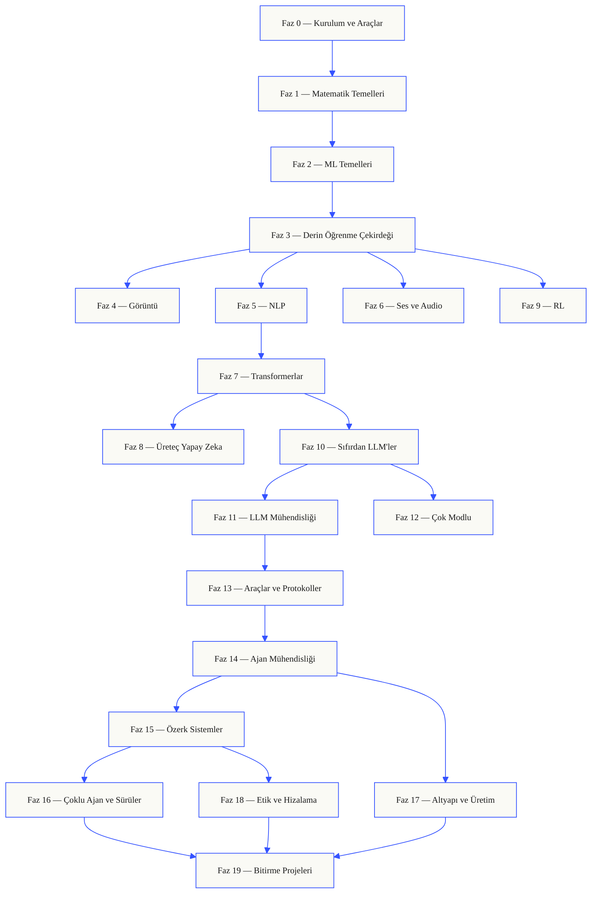
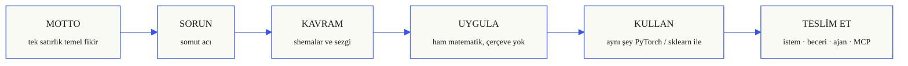

<p align="center">
  
</p>

<p align="center">
  <a href="LICENSE"></a>
  <a href="ROADMAP.md"></a>
  <a href="#contents"></a>
  <a href="https://github.com/rohitg00/ai-engineering-from-scratch/stargazers"></a>
  <a href="https://aiengineeringfromscratch.com"></a>
</p>

```
░░░▒▒▒░░░▒▒▒░░░▒▒▒░░░▒▒▒░░░▒▒▒░░░▒▒▒░░░▒▒▒░░░▒▒▒░░░▒▒▒░░░▒▒▒░░░▒▒▒░░░▒▒▒░░░▒▒▒░░░▒▒▒░░░▒▒▒
```

> **Öğrencilerin %84'ü zaten yapay zeka araçları kullanıyor. Sadece %18'i bunları
> profesyonelce kullanmaya hazır hissediyor.** Bu müfrezeat bu açığı kapatıyor.
>
> 473 ders. 20 faz. ~320 saat. Python, TypeScript, Rust, Julia. Her ders yeniden kullanılabilir
> bir ürün üretir: bir istem, bir beceri, bir ajan, bir MCP sunucusu. Ücretsiz, açık kaynak, MIT.
>
> Sadece yapay zeka öğrenmiyorsunuz. Onu sıfırdan, elle, uçtan uca oluşturuyorsunuz.

## Bu nasıl çalışır

Çoğu yapay zeka materyali dağınık parçalar halinde öğretir. Bir makale burada, bir ince ayar yazısı orada, bir yerde parlak bir ajan demosu. Parçalar nadiren uyumlu olur. Bir sohbet botu çıkarsınız ama kayıp eğrisini açıklayamazsınız. Bir fonksiyonu bir ajana bağlarsınız ama çağıran modelin içinde dikkatin ne yaptığını söyleyemezsiniz.

Bu müfrezeat omurgadır. 20 faz, 473 ders, dört dil: Python, TypeScript, Rust, Julia. Bir ucunda doğrusal cebir, diğerinde özerk sürüler. Her algoritma önce ham matematikten oluşturulur. Geri yayılım. Tokenize edici. Dikkat. Ajan döngüsü. PyTorch ortaya çıktığında, zaten ne yaptığını biliyor olursunuz.

Her ders aynı döngüyü çalıştırır: sorunu oku, matematiği türet, kodu yaz, testi çalıştır, ürünü sakla. Beş dakikalık videolar, kopyala-yapıştır dağıtımlar, elinden tutma yok. Ücretsiz, açık kaynak ve kendi dizüstü bilgisayarınızda çalışacak şekilde oluşturulmuş.

```
░░░▒▒▒░░░▒▒▒░░░▒▒▒░░░▒▒▒░░░▒▒▒░░░▒▒▒░░░▒▒▒░░░▒▒▒░░░▒▒▒░░░▒▒▒░░░▒▒▒░░░▒▒▒░░░▒▒▒░░░▒▒▒░░░▒▒▒
```

## Müfrezeatın yapısı

Yirmi faz üst üste istiflenir. Matematik zemindir. Ajanlar ve üretim çatıdır. Alt katmanları zaten biliyorsanız ileri atlayın, ama atlayıp sonra üstteki bir şeyin neden bozulduğuna şaşırmayın.



```
░░░▒▒▒░░░▒▒▒░░░▒▒▒░░░▒▒▒░░░▒▒▒░░░▒▒▒░░░▒▒▒░░░▒▒▒░░░▒▒▒░░░▒▒▒░░░▒▒▒░░░▒▒▒░░░▒▒▒░░░▒▒▒░░░▒▒▒
```

## Bir dersin yapısı

Her ders kendi klasöründe yaşar ve tüm müfrezeat boyunca aynı yapıya sahiptir:

```
phases/<NN>-<faz-adı>/<NN>-<ders-adı>/
├── code/      çalıştırılabilir uygulamalar (Python, TypeScript, Rust, Julia)
├── docs/
│   └── en.md  ders anlatımı
└── outputs/   bu dersin ürettiği istemler, beceriler, ajanlar veya MCP sunucuları
```

Her ders altı vuruşu takip eder. *Uygula / Kullan* bölünmesi omurgadır — algoritmayı önce sıfırdan uygularsınız, sonra aynı şeyi üretim kütüphanesinden çalıştırırsınız. Çerçevenin ne yaptığını anlarsınız çünkü daha küçük versiyonunu kendiniz yazdınız.



## Başlangıç

Üç yol var. Birini seçin.

**Seçenek A — oku.** [aiengineeringfromscratch.com](https://aiengineeringfromscratch.com) adresinde herhangi bir tamamlanmış dersi açın veya [İçindekiler](#contents) altında bir fazı genişletin. Kurulum yok, klonlama yok.

**Seçenek B — klonla ve çalıştır.**

```bash
git clone https://github.com/rohitg00/ai-engineering-from-scratch.git
cd ai-engineering-from-scratch
python phases/01-math-foundations/01-linear-algebra-intuition/code/vectors.py
```

**Seçenek C — seviyenizi bulun *(önerilen)*.** Akıllıca ileri atlayın. Claude, Cursor, Codex, OpenClaw, Hermes veya müfrezeat becerileri kurulu herhangi bir ajan içinde:

```bash
/find-your-level
```

On soru. Bilginizi bir başlangıç fazına eşler, saat tahminleriyle kişiselleştirilmiş bir yol oluşturur. Her fazdan sonra:

```bash
/check-understanding 3        # 3. faz için sınav olun
ls phases/03-deep-learning-core/05-loss-functions/outputs/
# ├── prompt-loss-function-selector.md
# └── prompt-loss-debugger.md
```

### Ön Koşullar

- Kod yazabiliyor olmanız (herhangi bir dil; Python yardımcı olur).
- Yapay zekanın **gerçekte nasıl çalıştığını**, sadece API'leri çağırmak istediğinizi anlamak.

### Yerleşik ajan becerileri (Claude, Cursor, Codex, OpenClaw, Hermes)

| Beceri | Ne yapar |
|--------|----------|
| [`/find-your-level`](.claude/skills/find-your-level/SKILL.md) | On soruluk yerleştirme sınavı. Bilginizi bir başlangıç fazına eşler ve saat tahminleriyle kişiselleştirilmiş bir yol üretir. |
| [`/check-understanding <faz>`](.claude/skills/check-understanding/SKILL.md) | Faz başına sınav, sekiz soru, geri bildirim ve incelenecek belirli derslerle. |

```
░░░▒▒▒░░░▒▒▒░░░▒▒▒░░░▒▒▒░░░▒▒▒░░░▒▒▒░░░▒▒▒░░░▒▒▒░░░▒▒▒░░░▒▒▒░░░▒▒▒░░░▒▒▒░░░▒▒▒░░░▒▒▒░░░▒▒▒
```

## Her ders bir şey teslim eder

Diğer müfrezeatlar *"tebrikler, X'i öğrendiniz"* ile biter. Burada her ders, günlük iş akışınıza yapıştırabileceğiniz veya kurabileceğiniz **yeniden kullanılabilir bir araçla** biter.

<table>
<tr>
<th align="left" width="25%"><br/><sub>FIG_001 · A</sub><br/><b>İSTEMLER</b></th>
<th align="left" width="25%"><br/><sub>FIG_001 · B</sub><br/><b>BECERİLER</b></th>
<th align="left" width="25%"><br/><sub>FIG_001 · C</sub><br/><b>AJANLAR</b></th>
<th align="left" width="25%"><br/><sub>FIG_001 · D</sub><br/><b>MCP SUNUCULARI</b></th>
</tr>
<tr>
<td valign="top">Herhangi bir yapay zeka asistanına yapıştırın, dar bir görevde uzman düzeyinde yardım alın.</td>
<td valign="top">Claude, Cursor, Codex, OpenClaw, Hermes veya <code>SKILL.md</code> okuyan herhangi bir ajana bırakın.</td>
<td valign="top">Özerk işçi olarak dağıtın — döngüyü Faz 14'te kendiniz yazdınız.</td>
<td valign="top">Herhangi bir MCP uyumlu istemciye takın. Faz 13'te uçtan uca oluşturuldu.</td>
</tr>
</table>

> Tümünü `python3 scripts/install_skills.py` ile kurun. Gerçek araçlar, ödev değil.
> Müfrezeatın sonunda, anladığınız 473 üründen oluşan bir portföyünüz olur çünkü bunları siz oluşturdunuz.

### Her ders bir şey üretir

```
outputs/
├── prompts/      her yapay zeka görevi için istem şablonları
└── skills/       yapay zeka kodlama ajanları için SKILL.md dosyaları
```

`npx skills add` ile kurun. Claude, Cursor, Codex, OpenClaw, Hermes veya SKILL.md / AGENTS.md dizini okuyan herhangi bir ajana takın. Gerçek araçlar, ödev değil.

### Kursta her beceriyi ajanınıza kurun

Depo `phases/**/outputs/` altında 382 beceri ve 99 istem sunuyor.

**Önerilen: [skills.sh](https://skills.sh) ile kurun.** Klonlama yok, Python yok, ajanınızın beceri dizinini otomatik olarak algılar:

```bash
npx skills add rohitg00/ai-engineering-from-scratch                       # her beceri
npx skills add rohitg00/ai-engineering-from-scratch --skill agent-loop    # tek beceri
npx skills add rohitg00/ai-engineering-from-scratch --phase 14            # tek faz
```

`skills`, ajanınızın seçtiği dizine yazar: `.claude/skills/`, `.cursor/skills/`, `.codex/skills/`, OpenClaw'ın beceri klasörü, Hermes'in paket yolu veya herhangi bir SKILL.md bilincinde araç. Tek komut, her ajan.

**Gelişmiş: `scripts/install_skills.py` ile çevrimdışı / özel düzen.** Depoyu klonlamanız gerekir. Etiket filtreleri, deneme çalıştırmaları veya varsayılan olmayan bir düzen gerektiğinde kullanışlıdır:

```bash
python3 scripts/install_skills.py <hedef>                                 # her beceri, varsayılan --layout skills (iç içe)
python3 scripts/install_skills.py <hedef> --layout skills                 # yukarıdaki ile aynı, açık
python3 scripts/install_skills.py <hedef> --type all                      # beceriler + istemler + ajanlar
python3 scripts/install_skills.py <hedef> --phase 14                      # sadece bir faz
python3 scripts/install_skills.py <hedef> --tag rag                       # etikete göre filtrele
python3 scripts/install_skills.py <hedef> --layout flat                   # düz dosyalar
python3 scripts/install_skills.py <hedef> --dry-run                       # yazmadan önizleme
python3 scripts/install_skills.py <hedef> --force                         # mevcut dosyaların üzerine yaz
```

`<hedef>`, ajanınız için beceri dizinidir (örnekler: `~/.claude/skills/`, `~/.cursor/skills/`, `~/.config/openclaw/skills/`, `.skills/` veya ajanınızın okuduğu herhangi bir yol).

Varsayılan olarak betik, mevcut bir hedefin üzerine yazmayı redder ve her çakışan yolu listeledikten sonra 1 çıkış koduyla çıkar. Çakışmaları önizlemek için `--dry-run` veya üzerine yazmak için `--force` kullanın. Her dry-run olmayan çalışma, hedefe tür ve faza göre gruplandırılmış tam envanteri içeren bir `manifest.json` yazar. Ajanınızın okuduğu düzeni seçin:

| `--layout`  | Yazılan yol |
|---|---|
| `skills`    | `<hedef>/<ad>/SKILL.md` (iç içe kural, Claude / Cursor / Codex / OpenClaw / Hermes tarafından desteklenir) |
| `by-phase`  | `<hedef>/faz-NN/<ad>.md` |
| `flat`      | `<hedef>/<ad>.md` |

### Ajan çalışma tezgahını kendi deponuza bırakın

Faz 14 bitirme projesi yeniden kullanılabilir bir Ajan Çalışma Tezgahı paketi sunar (AGENTS.md, şemalar, başlatma / doğrulama / devretme betikleri). Herhangi bir depoya bununla iskelet oluşturun:

```bash
python3 scripts/scaffold_workbench.py yol/sizin-deponuza            # tam paket + tohumlar
python3 scripts/scaffold_workbench.py yol/sizin-deponuza --minimal  # dokümanları atla
python3 scripts/scaffold_workbench.py yol/sizin-deponuza --dry-run  # sadece önizleme
python3 scripts/scaffold_workbench.py yol/sizin-deponuza --force    # üzerine yaz
```

Yedi çalışma tezgahı yüzeyini bağlı, başlangıç `task_board.json`'ı ve `schema_version: 1` ile yeni bir `agent_state.json` alırsınız. Oradan: görevi düzenleyin, `AGENTS.md`'yi düzenleyin, `scripts/init_agent.py`'yi çalıştırın, sözleşmeyi ajanınıza verin. Paket kaynağı `phases/14-agent-engineering/42-agent-workbench-capstone/outputs/agent-workbench-pack/`adresindedir.

### Tüm kursu JSON olarak gözden geçirin

`scripts/build_catalog.py`, diskteki her fazı, her dersi, her ürünü gezer ve deponun kökünde `catalog.json` yazar. Tek dosya, kursun tüm gerçeği.

```bash
python3 scripts/build_catalog.py               # <depo>/catalog.json yazar
python3 scripts/build_catalog.py --stdout      # stdout'a, depoya dokunma
python3 scripts/build_catalog.py --out yol/dosya.json
```

Katalog dosya sisteminden türetilmiştir, README'den değil, bu yüzden sayılar her zaman diskteki ile eşleşir. Site_derlemeleri, aşağı akış araçları veya README sayılarının sapmadığını doğrulamak için kullanın. Şema betiğin üstünde belgelenmiştir.

Bir GitHub Eylemi (`.github/workflows/curriculum.yml`), her PR'da `catalog.json`'ı yeniden oluşturur ve commit edilen dosya eskiyse derlemeyi başarısız kılar. Herhangi bir dersi düzenledikten sonra `python3 scripts/build_catalog.py` çalıştırın ve sonucu commit edin, aksi halde CI PR'ı reddeder. Aynı iş akışı `audit_lessons.py`'yi sadece uyarı modunda çalıştırır (mevcut sapma katkıda bulunanları engellemez).

### Her dersin Python kodunu duman kontrolü yapın

`scripts/lesson_run.py`, her dersin `code/` dizinindeki her `.py` dosyasını bayt derler. Varsayılan mod sadece sözdizimi kontrolüdür — çalıştırma, API anahtarı veya ağır ML bağımlılıkları gerekmez. Katkıda bulunanların en sık getirdiği gerilemeleri yakalar (yanlış girinti, bozuk f-stringler, yanlış düzenlemeler).

```bash
python3 scripts/lesson_run.py                  # tüm müfrezeatı sözdizimi kontrolü
python3 scripts/lesson_run.py --phase 14       # sadece bir faz
python3 scripts/lesson_run.py --json           # stdout'ta JSON raporu
python3 scripts/lesson_run.py --strict         # herhangi bir ders başarısız olursa 1 ile çık
python3 scripts/lesson_run.py --execute        # gerçekten çalıştır, ders başına 10sn zaman aşımı
```

`--execute`, her dersin `code/main.py`'sini (veya ilk `.py` dosyasını) 10 saniyelik zaman aşımıyla çalıştırır. Giriş dosyası `# requires: pkg1, pkg2` yorumuyla stdlib dışı bağımlılıkları listeleyen dersler `needs <bağımlılıklar>` nedeniyle atlanır. Betik isteğe bağlıdır ve CI'ya bağlı değildir.

Sadece stdlib, Python 3.10+. Varsayılan atlama listesini (`twitter.com`, `x.com`, `linkedin.com`, `instagram.com`, `medium.com` — agresif otomatik HEAD/GET engelleyen alan adları) geçersiz kılmak için `LINK_CHECK_SKIP=alanadı1,alanadı2` ayarlayın.

## Nereden başlanır

| Geçmiş | Nereden başla | Tahmini süre |
|--------|---------------|--------------|
| Programlama ve yapay zekaya yeni | Faz 0 — Kurulum | ~306 saat |
| Python biliyor, ML'ye yeni | Faz 1 — Matematik Temelleri | ~270 saat |
| ML biliyor, derin öğrenmeye yeni | Faz 3 — Derin Öğrenme Çekirdeği | ~200 saat |
| Derin öğrenme biliyor, LLM'ler ve ajanlar istiyor | Faz 10 — Sıfırdan LLM'ler | ~100 saat |
| Kıdemli mühendis, sadece ajan mühendisliği istiyor | Faz 14 — Ajan Mühendisliği | ~60 saat |

```
░░░▒▒▒░░░▒▒▒░░░▒▒▒░░░▒▒▒░░░▒▒▒░░░▒▒▒░░░▒▒▒░░░▒▒▒░░░▒▒▒░░░▒▒▒░░░▒▒▒░░░▒▒▒░░░▒▒▒░░░▒▒▒░░░▒▒▒
```

## Neden şimdi önemli

<table>
<tr>
<th align="left" width="50%"><sub>FIG_003 · A</sub><br/><b>SEKTÖR SİNYALİ</b></th>
<th align="left" width="50%"><sub>FIG_003 · B</sub><br/><b>KAPSANAN TEMEL MAKALELER</b></th>
</tr>
<tr>
<td valign="top">

> *"En sıcak yeni programlama dili İngilizce."*<br/>
> — **Andrej Karpathy** ([tweet](https://x.com/karpathy/status/1617979122625712128))

> *"Yazılım mühendisliği gözlerimizin önünde yeniden şekilleniyor."*<br/>
> — **Boris Cherny**, Claude Code'un yaratıcısı

> *"Modeller daha iyi olmaya devam edecek. Birikimli beceri **ne inşa edeceğini bilmek**."*<br/>
> — Sektör uzlaşı, 2026

</td>
<td valign="top">

- *Attention Is All You Need* — Vaswani vd., 2017 → [Faz 7](#phase-7)
- *Language Models are Few-Shot Learners* (GPT-3) → [Faz 10](#phase-10)
- *Denoising Diffusion Probabilistic Models* → [Faz 8](#phase-8)
- *InstructGPT / RLHF* → [Faz 10](#phase-10)
- *Direct Preference Optimization* → [Faz 10](#phase-10)
- *Chain-of-Thought Prompting* → [Faz 11](#phase-11)
- *ReAct: Reasoning + Acting in LLMs* → [Faz 14](#phase-14)
- *Model Context Protocol* — Anthropic → [Faz 13](#phase-13)

</td>
</tr>
</table>

```
░░░▒▒▒░░░▒▒▒░░░▒▒▒░░░▒▒▒░░░▒▒▒░░░▒▒▒░░░▒▒▒░░░▒▒▒░░░▒▒▒░░░▒▒▒░░░▒▒▒░░░▒▒▒░░░▒▒▒░░░▒▒▒░░░▒▒▒
```

## Katkıda bulunma

| Hedef | Oku |
|-------|-----|
| Bir ders ekleyin veya düzeltin | [CONTRIBUTING.md](CONTRIBUTING.md) |
| Takımınız veya okulunuz için çatallayın | [FORKING.md](FORKING.md) |
| Ders şablonu | [LESSON_TEMPLATE.md](LESSON_TEMPLATE.md) |
| İlerlemeyi takip edin | [ROADMAP.md](ROADMAP.md) |
| Sözlük | [glossary/terms.md](glossary/terms.md) |
| Davranış kuralları | [CODE_OF_CONDUCT.md](CODE_OF_CONDUCT.md) |

Bir ders göndermeden önce sabitleri kontrol edin:

```bash
python3 scripts/audit_lessons.py           # tam müfrezeat
python3 scripts/audit_lessons.py --phase 14  # tek faz
python3 scripts/audit_lessons.py --json    # CI dostu çıktı
```

Herhangi bir kural başarısız olduğunda çıkış kodu sıfırdan büyüktür. Kurallar (L001–L010) dizin yapısını, `docs/en.md` varlığını + H1'i, `code/` doluluğunu, `quiz.json` şemasını (sorun #102'ye neden olan eski `q/choices/answer` anahtarlarını reddeder) ve ders belgelerindeki göreli bağlantıları doğrular.

```
░░░▒▒▒░░░▒▒▒░░░▒▒▒░░░▒▒▒░░░▒▒▒░░░▒▒▒░░░▒▒▒░░░▒▒▒░░░▒▒▒░░░▒▒▒░░░▒▒▒░░░▒▒▒░░░▒▒▒░░░▒▒▒░░░▒▒▒
```

## Çalışmayı destekleyin

Ücretsiz, MIT lisanslı, 473 ders. Müfrezeat sadece sponsorlukla sürdürülmektedir. Sadece nakit.

**Erişim (2026-05-14'te doğrulanmış):** 55.593 aylık ziyaretçi · 90.709 sayfa görüntüleme · 7.5K yıldız · Twitter/X #1 edinme kanalıdır.

**Mevcut sponsorlar:** [CodeRabbit](https://coderabbit.link/rohit-ghumare) · [iii](https://iii.dev?utm_source=ai-engineering-from-scratch&utm_medium=readme&utm_campaign=sponsor)

| Kademe | $/ay | Aldığınız şey |
|--------|------|---------------|
| Destekçi | $25 | DESTEKÇİLER.md'de isim |
| Bronz | $250 | README sponsor bloğunda yalnızca metin satırı + lansman gününde tweet |
| Gümüş | $750 | README'de küçük logo + API derslerinde desteklenen sağlayıcı olarak listeleme |
| Altın | $2.000 | README'de orta boy logo + sponsor sayfası + üç aylık X / LinkedIn ortak tanıtımı |
| Platin | $5.000 | Kıvrım üstünde ana logo + özel entegrasyon dersi, maks 1 ortak |

Tam fiyat listesi, kurallar, fiyat çapaları ve erişim verileri: [SPONSORS.md](SPONSORS.md).
[GitHub Sponsors](https://github.com/sponsors/rohitg00) üzerinden kayıt olun.

```
░░░▒▒▒░░░▒▒▒░░░▒▒▒░░░▒▒▒░░░▒▒▒░░░▒▒▒░░░▒▒▒░░░▒▒▒░░░▒▒▒░░░▒▒▒░░░▒▒▒░░░▒▒▒░░░▒▒▒░░░▒▒▒░░░▒▒▒
```

## Yıldız geçmişi

<a href="https://star-history.com/#rohitg00/ai-engineering-from-scratch&Date">
  <picture>
    <source media="(prefers-color-scheme: dark)" srcset="https://api.star-history.com/svg?repos=rohitg00/ai-engineering-from-scratch&type=Date&theme=dark">
    
  </picture>
</a>

Bu kılavuz size yardımcı olduysa depoya yıldız verin. Projeyi hayatta tutar.

## Lisans

MIT. İstediğiniz gibi kullanın — çatallayın, öğretin, satın, yayın. Atıf takdir edilir, gerekli değildir.

[Rohit Ghumare](https://github.com/rohitg00) ve topluluk tarafından sürdürülmektedir.
