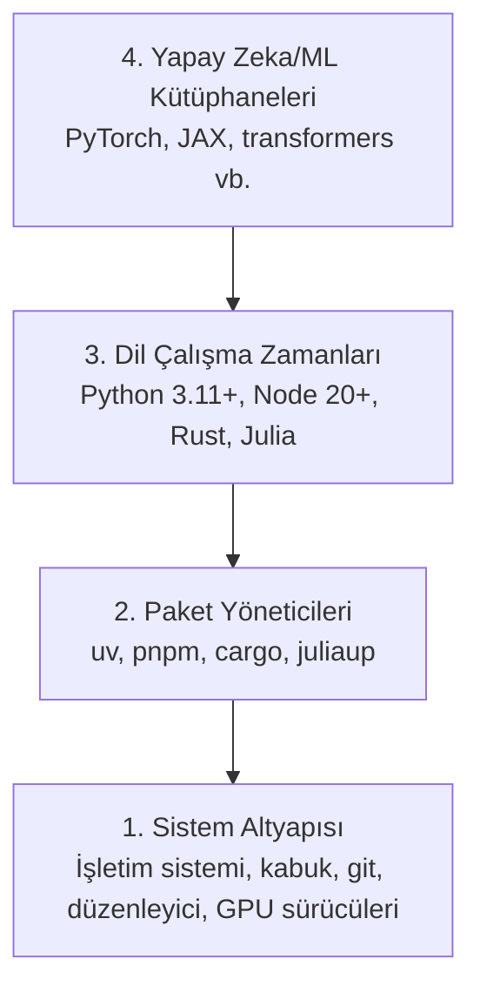

> **Orijinal İçerik:** [docs/en.md](https://github.com/rohitg00/ai-engineering-from-scratch/blob/main/phases/00-setup-and-tooling/01-dev-environment/docs/en.md)

# Geliştirme Ortamı

> Araçlarınız düşüncenizi şekillendirir. Bir kez doğru kurun.

**Tür:** Uygulama
**Diller:** Python, Node.js, Rust
**Ön Koşullar:** Yok
**Süre:** ~45 dakika

## Öğrenme Hedefleri

- Python 3.11+, Node.js 20+ ve Rust araç setlerini sıfırdan kurma
- Tekrarlanabilir derlemeler için sanal ortamları ve paket yöneticilerini yapılandırma
- CUDA/MPS ile GPU erişimini doğrulama ve bir test tensör işlemi çalıştırma
- Dört katmanlı yığıtı anlama: sistem, paketler, çalışma zamanları, yapay zeka kütüphaneleri

## Sorun

Python, TypeScript, Rust ve Julia kullanarak 200'ün dersten yapay zeka mühendisliği öğreneceksiniz. Eğer ortamınız bozuksa, her ders öğrenmek yerine araçlarla mücadele etmeye dönüşür.

Çoğu kişi ortam kurulumunu atlar. Sonra saatlerce içe aktarma hataları, sürüm çakışmaları ve eksik CUDA sürücüleriyle uğraşır. Bunu bir kez, doğru bir şekilde yapacağız.

## Kavram

Bir yapay zeka mühendisliği ortamının dört katmanı vardır:



Altten üste doğru kurulum yaparız. Her katman bir altındaki katmana bağlıdır.

## Uygulama

### Adım 1: Sistem Altyapısı

Sisteminizi kontrol edin ve temel bileşenleri kurun.

```bash
# macOS
xcode-select --install
brew install git curl wget

# Ubuntu/Debian
sudo apt update && sudo apt install -y build-essential git curl wget

# Windows (WSL2 kullanın)
wsl --install -d Ubuntu-24.04
```

#### Açıklama
Bu komutlar işletim sisteminize göre gerekli temel araçları kurar. macOS'te Xcode Komut Satırı Araçları, Linux'ta derleyici ve temel araçlar, Windows'ta ise WSL2 (Windows Subsystem for Linux) kurulur.

### Adım 2: Python ve uv

`uv` kullanıyoruz — pip'den 10-100 kat daha hızlıdır ve sanal ortamları otomatik olarak yönetir.

```bash
curl -LsSf https://astral.sh/uv/install.sh | sh

uv python install 3.12

uv venv
source .venv/bin/activate  # Windows'ta .venv\Scripts\activate

uv pip install numpy matplotlib jupyter
```

#### Açıklama
Önce `uv` paket yöneticisini kuruyoruz. Ardından Python 3.12'yi indirip sanal bir ortam oluşturuyoruz. Son olarak NumPy, Matplotlib ve Jupyter gibi temel kütüphaneleri yüklüyoruz.

Doğrulama:

```python
import sys
print(f"Python {sys.version}")

import numpy as np
print(f"NumPy {np.__version__}")
a = np.array([1, 2, 3])
print(f"Vector: {a}, dot product with itself: {np.dot(a, a)}")
```

#### Açıklama
Bu kod, Python ve NumPy sürümlerini kontrol eder. Ardından basit bir vektör iç çarpımı yaparak ortamın düzgün çalıştığını doğrular. `np.dot(a, a)` vektörün kendisiyle iç çarpımını hesaplar.

### Adım 3: Node.js ve pnpm

TypeScript dersleri için (ajanlar, MCP sunucuları, web uygulamaları).

```bash
curl -fsSL https://fnm.vercel.app/install | bash
fnm install 22
fnm use 22

npm install -g pnpm

node -e "console.log('Node', process.version)"
```

#### Açıklama
`fnm` (Fast Node Manager) ile Node.js 22'yi kuruyoruz. Ardından `pnpm` paket yöneticisini global olarak yüklüyoruz. Son satır, Node.js sürümünü doğrular.

### Adım 4: Rust

Performans kritik dersler için (çıkarma, sistemler).

```bash
curl --proto '=https' --tlsv1.2 -sSf https://sh.rustup.rs | sh

rustc --version
cargo --version
```

#### Açıklama
Rust yükleyicisini (rustup) indirip kuruyoruz. Ardından `rustc` (Rust derleyicisi) ve `cargo` (paket yöneticisi) sürümlerini kontrol ediyoruz.

### Adım 5: Julia (İsteğe Bağlı)

Julia'nın parladığı matematik ağırlıklı dersler için.

```bash
curl -fsSL https://install.julialang.org | sh

julia -e 'println("Julia ", VERSION)'
```

#### Açıklama
Julia dilini kuruyoruz ve sürümünü kontrol ediyoruz. Julia, matematiksel hesaplamalarda yüksek performans sunar.

### Adım 6: GPU Kurumu (Varsa)

```bash
# NVIDIA
nvidia-smi

# CUDA ile PyTorch kurulumu
uv pip install torch torchvision torchaudio --index-url https://download.pytorch.org/whl/cu124
```

```python
import torch
print(f"CUDA available: {torch.cuda.is_available()}")
if torch.cuda.is_available():
    print(f"GPU: {torch.cuda.get_device_name(0)}")
```

#### Açıklama
Önce `nvidia-smi` komutuyla GPU'nuzun görünüp görünmediğini kontrol edin. Ardından CUDA desteğiyle PyTorch'u kurun. Son kod bloğu, CUDA'nın kullanılıp kullanılamadığını ve varsa GPU adını yazdırır.

GPU'nuz yok mu? Sorun değil. Çoğu ders CPU'da çalışır. Ağırlıklı eğitim gerektiren dersler için Google Colab veya bulut GPU'larını kullanın.

### Adım 7: Her Şeyi Doğrula

Doğrulama betiğini çalıştırın:

```bash
python phases/00-setup-and-tooling/01-dev-environment/code/verify.py
```

#### Açıklama
Bu betik, kurulumunuzun tüm bileşenlerini otomatik olarak kontrol eder. Herhangi bir hata varsa raporlar.

## Kullanım

Ortamınız artık bu kurstaki her ders için hazır. İşte hangi dilleri nerede kullanacaksınız:

| Dil | Kullanıldığı Yer | Paket Yöneticisi |
|-----|------------------|------------------|
| Python | Faz 1-12 (ML, DL, NLP, Görüntü, Ses, LLM'ler) | uv |
| TypeScript | Faz 13-17 (Araçlar, Ajanlar, Sürüler, Altyapı) | pnpm |
| Rust | Faz 12, 15-17 (Performans kritik sistemler) | cargo |
| Julia | Faz 1 (Matematik temelleri) | Pkg |

## Teslimat

Bu ders, herkesin kurulumunu kontrol edebileceği bir doğrulama betiği üretir.

Yapay zeka asistanlarının ortam sorunlarını teşhis etmesine yardımcı olan bir istem için `outputs/prompt-env-check.md` dosyasına bakın.

## Alıştırmalar

1. Doğrulama betiğini çalıştırın ve varsa hataları düzeltin
2. Bu kurs için bir Python sanal ortamı oluşturun ve PyTorch'u yükleyin
3. Dört dilde de bir "hello world" yazın ve her birini çalıştırın
