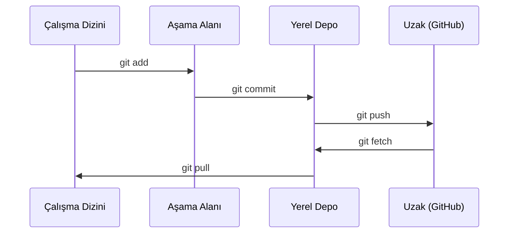

> **Orijinal İçerik:** [docs/en.md](https://github.com/rohitg00/ai-engineering-from-scratch/blob/main/phases/00-setup-and-tooling/02-git-and-collaboration/docs/en.md)

# Git ve İşbirliği

> Sürüm kontrolü zorunludur. Her deney, her model, burada oluşturduğunuz her ders takip edilir.

**Tür:** Öğrenme
**Diller:** --
**Ön Koşullar:** Faz 0, Ders 01
**Süre:** ~30 dakika

## Öğrenme Hedefleri

- Git kimliğini yapılandırın ve ekleme, commit ve push günlük iş akışını kullanın
- Ana dalı bozmadan yalıtılmış deneyler için dallar oluşturun ve birleştirin
- Model kontrol noktalarını ve büyük ikili dosyaları hariç tutan bir `.gitignore` yazın
- Proje evrimini anlamak için `git log` ile commit geçmişinde gezinin

## Sorun

20 faz boyunca yüzlerce kod dosyası yazacaksınız. Sürüm kontrolü olmadan çalışmayı kaybedersiniz, geri alamayacağınız şeyleri bozersiniz ve başkalarıyla işbirliği yapma yolunuz olmaz.

Git araçtır. GitHub kodun bulunduğu yerdir. Bu ders, bu kurs için ihtiyacınız olanı ve fazlasını değil kapsar.

## Kavram



Hatırlanması gereken üç şey:
1. Sık sık kaydedin (`git commit`)
2. Uzak sunucuya gönderin (`git push`)
3. Deneyler için dal açın (`git checkout -b experiment`)

## Uygulama

### Adım 1: Git'i yapılandırın

```bash
git config --global user.name "Adınız"
git config --global user.email "siz@ornek.com"
```

#### Açıklama
Bu komutlar, tüm commit'lerinizde kullanılacak adınızı ve e-posta adresinizi ayarlar.

### Adım 2: Günlük iş akışı

```bash
git status
git add dosya.py
git commit -m "Algılayıcı uygulaması ekle"
git push origin main
```

#### Açıklama
`git status` değişiklikleri gösterir, `git add` dosyaları aşamaya alır, `git commit` anlık görüntü kaydeder, `git push` uzak sunucuya gönderir.

### Adım 3: Deneyler için dal açma

```bash
git checkout -b experiment/yeni-optimize-edici

# ... değişiklikler yap, commit et ...

git checkout main
git merge experiment/yeni-optimize-edici
```

#### Açıklama
`git checkout -b` yeni bir dal oluşturur ve ona geçiş yapar. Deneylerinizi ana daldan izole tutar.

### Adım 4: Bu kurs deposuyla çalışma

```bash
git clone https://github.com/rohitg00/ai-engineering-from-scratch.git
cd ai-engineering-from-scratch

git checkout -b my-progress
# dersler boyunca çalış, kodunu commit et
git push origin my-progress
```

#### Açıklama
Depoyu klonlayıp kendi dalınızı oluşturarak kişisel ilerlemenizi takip edebilirsiniz.

## Kullanım

Bu kurs için tam olarak bu komutlara ihtiyacınız var:

| Komut | Ne zaman |
|-------|----------|
| `git clone` | Kurs deposunu indirin |
| `git add` + `git commit` | Çalışmanızı kaydedin |
| `git push` | GitHub'a yedekleyin |
| `git checkout -b` | Ana dalı bozmadan bir şey deneyin |
| `git log --oneline` | Neler yaptığınızı görün |

Bu kadar. Bu kurs için rebase, cherry-pick veya submodules'e ihtiyacınız yok.

## Alıştırmalar

1. Bu depoyu klonlayın, `my-progress` adında bir dal oluşturun, bir dosya yapın, commit edin, push edin
2. Model kontrol noktası dosyalarını (`.pt`, `.pth`, `.safetensors`) hariç tutan bir `.gitignore` oluşturun
3. Bu deponun commit geçmişini `git log --oneline` ile inceleyin ve derslerin nasıl eklendiğini okuyun

## Temel Terimler

| Terim | İnsanların söylediği | Gerçekte ne anlama geldiği |
|-------|---------------------|--------------------------|
| Commit | "Kaydetme" | Belirli bir zamanda tüm projenizin anlık görüntüsü |
| Dal (Branch) | "Bir kopya" | Çalışırken ileriye doğru hareket eden bir commit işaretçisi |
| Birleştirme (Merge) | "Kodları birleştirme" | Bir daldan değişiklikleri alıp diğerine uygulama |
| Uzak (Remote) | "Bulut" | Başka bir yerde barındırılan deponuzun kopyası (GitHub, GitLab) |
