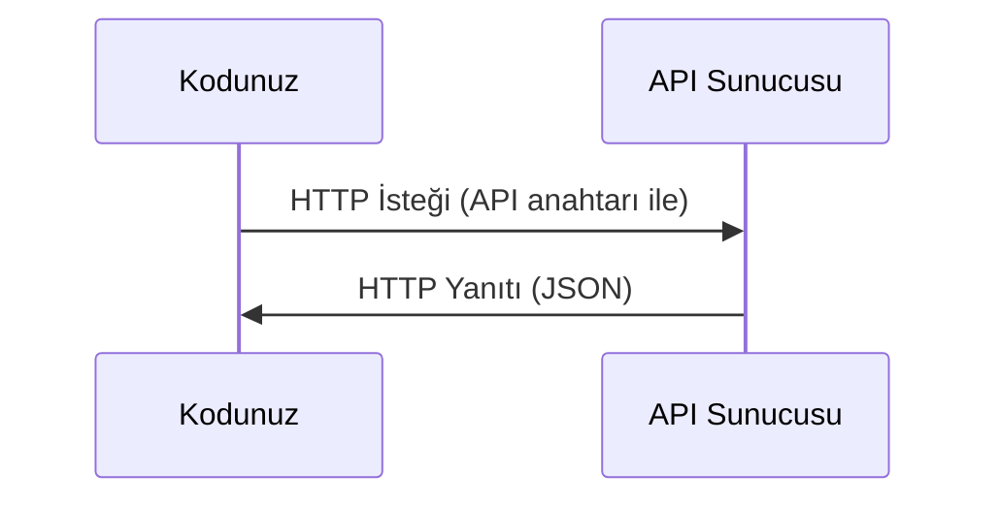

> **Orijinal İçerik:** [docs/en.md](https://github.com/rohitg00/ai-engineering-from-scratch/blob/main/phases/00-setup-and-tooling/04-apis-and-keys/docs/en.md)

# API'ler ve Anahtarlar

> Her yapay zeka API'si aynı şekilde çalışır: istek gönderin, yanıt alın. Ayrıntılar değişir, kalıp değişmez.

**Tür:** Uygulama
**Diller:** Python, TypeScript
**Ön Koşullar:** Faz 0, Ders 01
**Süre:** ~30 dakika

## Öğrenme Hedefleri

- Ortam değişkenleri ve `.env` dosyaları kullanarak API anahtarlarını güvenli bir şekilde saklama
- Hem Anthropic Python SDK'sı hem de ham HTTP ile bir LLM API çağrısı yapma
- Hata ayıklama için SDK tabanlı ve ham HTTP istek/yanıt biçimlerini karşılaştırma
- Kimlik doğrulama ve hız sınırları dahil olmakla yaygın API hatalarını tanımlama ve ele alma

## Sorun

11. fazdan itibaren LLM API'lerini (Anthropic, OpenAI, Google) çağıracaksınız. 13-16. fazlarda bu API'leri döngülerde kullanan ajanlar oluşturacaksınız. API anahtarlarının nasıl çalıştığını, nasıl güvenli saklanacağını ve ilk API çağrınızı nasıl yapacağınızı bilmeniz gerekir.

## Kavram



Her API çağrısında şunlar vardır:
1. Bir uç nokta (URL)
2. Bir API anahtarı (kimlik doğrulama)
3. Bir istek gövdesi (istediğiniz şey)
4. Bir yanıt gövdesi (aldığınız şey)

## Uygulama

### Adım 1: API anahtarlarını güvenli saklayın

API anahtarlarını asla kodda yazmayın. Ortam değişkenleri kullanın.

```bash
export ANTHROPIC_API_KEY="sk-ant-..."
export OPENAI_API_KEY="sk-..."
```

#### Açıklama
Bu komutlar, API anahtarlarını geçici ortam değişkenleri olarak ayarlar. Terminal kapandığında silinirler.

Veya bir `.env` dosyası kullanın (`.gitignore`'a ekleyin):

```
ANTHROPIC_API_KEY=sk-ant-...
OPENAI_API_KEY=sk-...
```

### Adım 2: İlk API çağrısı (Python)

```python
import anthropic

client = anthropic.Anthropic()

response = client.messages.create(
    model="claude-sonnet-4-20250514",
    max_tokens=256,
    messages=[{"role": "user", "content": "Sinir ağı tek cümlede nedir?"}]
)

print(response.content[0].text)
```

#### Açıklama
Anthropic SDK'sı ile basit bir API çağrısı. `model` hangi modeli kullanacağını, `messages` konuşma geçmişini belirtir.

### Adım 3: İlk API çağrısı (TypeScript)

```typescript
import Anthropic from "@anthropic-ai/sdk";

const client = new Anthropic();

const response = await client.messages.create({
  model: "claude-sonnet-4-20250514",
  max_tokens: 256,
  messages: [{ role: "user", content: "Sinir ağı tek cümlede nedir?" }],
});

console.log(response.content[0].text);
```

#### Açıklama
TypeScript versiyonu aynı mantıkla çalışır, sadece sözdizimi farklıdır.

### Adım 4: Ham HTTP (SDK olmadan)

```python
import os
import urllib.request
import json

url = "https://api.anthropic.com/v1/messages"
headers = {
    "Content-Type": "application/json",
    "x-api-key": os.environ["ANTHROPIC_API_KEY"],
    "anthropic-version": "2023-06-01",
}
body = json.dumps({
    "model": "claude-sonnet-4-20250514",
    "max_tokens": 256,
    "messages": [{"role": "user", "content": "Sinir ağı tek cümlede nedir?"}],
}).encode()

req = urllib.request.Request(url, data=body, headers=headers, method="POST")
with urllib.request.urlopen(req) as resp:
    result = json.loads(resp.read())
    print(result["content"][0]["text"])
```

#### Açıklama
SDK'ların arka planda yaptığı şey budur. Ham HTTP çağrısını anlamak hata ayıklamada yardımcı olur.

## Kullanım

Bu kurs için:

| API | Ne zaman lazım | Ücretsiz katman |
|-----|----------------|-----------------|
| Anthropic (Claude) | Faz 11-16 (ajanlar, araçlar) | Kayıtta $5 kredi |
| OpenAI | Faz 11 (karşılaştırma) | Kayıtta $5 kredi |
| Hugging Face | Faz 4-10 (modeller, veri setleri) | Ücretsiz |

Şu anda hepsine ihtiyacınız yok. Ders gerektiğinde kurun.

## Teslimat

Bu ders şunları üretir:
- `outputs/prompt-api-troubleshooter.md` - yaygın API hatalarını teşhis etme

## Alıştırmalar

1. Bir Anthropic API anahtarı alın ve ilk API çağrınızı yapın
2. Ham HTTP versiyonunu deneyin ve yanıt biçimini SDK versiyonuyla karşılaştırın
3. Kasıtlı olarak yanlış bir API anahtarı kullanın ve hata mesajını okuyun

## Temel Terimler

| Terim | İnsanların söylediği | Gerçekte ne anlama geldiği |
|-------|---------------------|--------------------------|
| API anahtarı | "API şifresi" | Hesabınızı tanımlayan ve istekleri yetkilendiren benzersiz dize |
| Hız sınırı | "Beni kısıtlıyorlar" | Kötüye kullanımı önlemek ve adil kullanımı sağlamak için dakika/saat başına maksimum istek |
| Token | "Bir kelime" (API bağlamında) | Faturalandırma birimi: giriş ve çıkış token'ları ayrı sayılır ve ücretlendirilir |
| Akış | "Gerçek zamanlı yanıtlar" | Tam yanıtı beklemeden kelime kelime yanıt alma |
