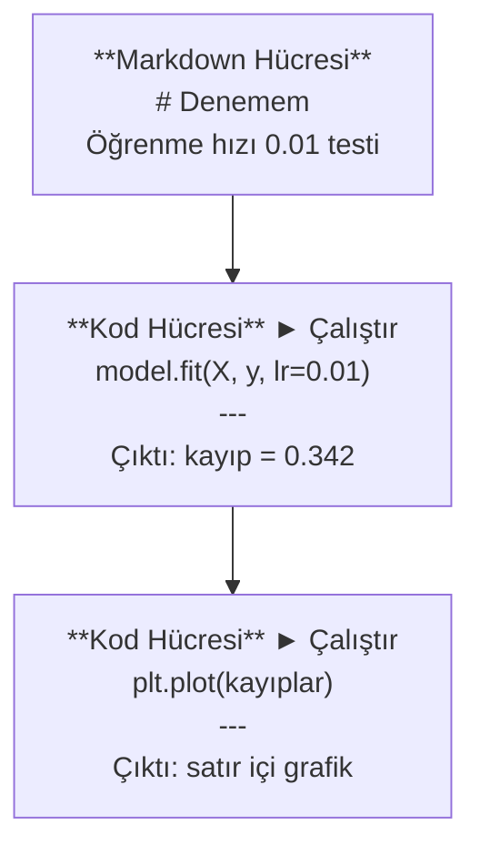
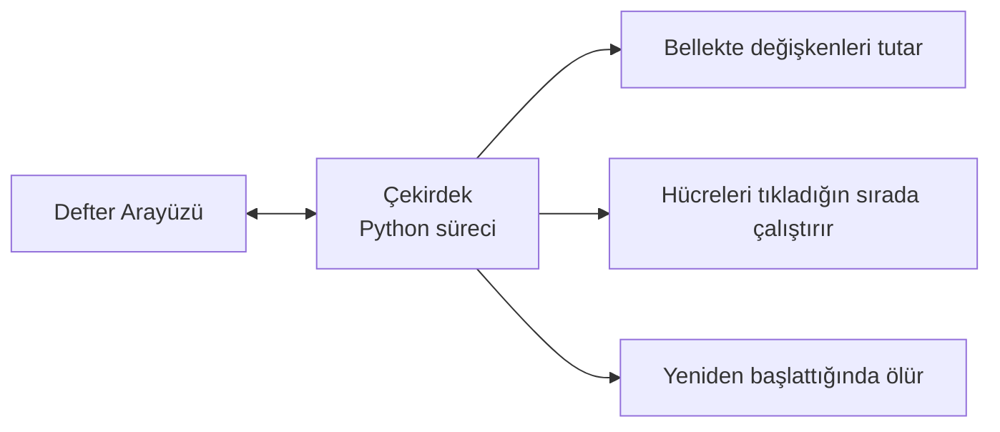

> **Orijinal İçerik:** [docs/en.md](https://github.com/rohitg00/ai-engineering-from-scratch/blob/main/phases/00-setup-and-tooling/05-jupyter-notebooks/docs/en.md)

# Jupyter Defterleri

> Defterler yapay zeka mühendisliğinin laboratuvar tezgahıdır. Burada prototipleme yaparsınız, sonra işe yarayanı üretime taşırsınız.

**Tür:** Uygulama
**Diller:** Python
**Ön Koşullar:** Faz 0, Ders 01
**Süre:** ~30 dakika

## Öğrenme Hedefleri

- JupyterLab, Jupyter Notebook veya Jupyter eklentili VS Code'u kurun ve başlatın
- Sihirli komutları (`%timeit`, `%%time`, `%matplotlib inline`) benchmark ve görselleştirme için kullanın
- Ne zaman defter ne zaman betik kullanılacağını ayırt edin ve "defterlerde keşfet, betiklerde teslim et" iş akışını uygulayın
- Yaygın defter tuzaklarını tanıyın ve önleyin: sıradışı çalıştırma, gizli durum ve bellek sızıntıları

## Sorun

Her yapay zeka makalesi, eğitici ve Kaggle yarışması Jupyter defterleri kullanır. Kodu parçalar halinde çalıştırmanızı, çıktıları satır içi görmenizi, kodu açıklamalarla karıştırmanızı ve hızlıca yinelemenizi sağlar. Defterler olmadan yapay zeka öğrenmeye çalışmak, hesap kağıdı olmadan matematik ödevi yapmak gibidir.

Ama defterlerin gerçek tuzakları vardır. İnsanlar her şey için defter kullanır, kötü oldukları şeyler dahil. Ne zaman defter ne zaman betik kullanılacağını bilmek, daha sonra hata ayıklama kâbuslarından kurtarır.

## Kavram

Bir defter hücrelerin bir listesidir. Her hücre ya koddur ya da metin.



Çekirdek, arka planda çalışan bir Python sürecidir. Bir hücreyi çalıştırdığınızda, kodu çekirdeğe gönderir, çekirdek bunu çalıştırır ve sonucu geri gönderir. Tüm hücreler aynı çekirdeği paylaşır, böylece değişkenler hücreler arasında kalır.



Bu "tıkladığın sırada" özelliği hem büyük bir avantaj hem de ciddi bir risktir.

## Uygulama

### Adım 1: Arayüzünüzü seçin

Üç seçenek, tek biçim:

| Arayüz | Kurulum | En iyi |
|--------|---------|--------|
| JupyterLab | `pip install jupyterlab` sonra `jupyter lab` | Tam IDE deneyimi, çoklu sekme, dosya gezgini, terminal |
| Jupyter Notebook | `pip install notebook` sonra `jupyter notebook` | Basit, hafif, birden fazla defter |
| VS Code | "Jupyter" eklentisini kurun | Zaten düzenleyicinizde, git entegrasyonu, hata ayıklama |

Üçü de aynı `.ipynb` dosyasını okur ve yazar. İstediğinizi seçin. Yapay zeka çalışmalarında en yaygın olanı JupyterLab'dır.

```bash
pip install jupyterlab
jupyter lab
```

#### Açıklama
JupyterLab, tam özellikli bir entegre geliştirme ortamı sunar. Kod düzenleyici, dosya gezgini, terminal ve defter desteği tek bir arayüzde birleşir.

### Adım 2: Önemli klavye kısayolları

İki modda çalışırsınız. Komut modu için `Escape` (solda mavi çubuk), düzenleme modu için `Enter` (yeşil çubuk) tuşuna basın.

**Komut modu (en çok kullanılan):**

| Tuş | Eylem |
|-----|-------|
| `Shift+Enter` | Hücreyi çalıştır, sonrakine geç |
| `A` | Üstüne hücre ekle |
| `B` | Altına hücre ekle |
| `DD` | Hücreyi sil |
| `M` | Markdown'a dönüştür |
| `Y` | Koda dönüştür |
| `Z` | Hücre işlemini geri al |
| `Ctrl+Shift+H` | Tüm kısayolları göster |

**Düzenleme modu:**

| Tuş | Eylem |
|-----|-------|
| `Tab` | Otomatik tamamlama |
| `Shift+Tab` | Fonksiyon imzasını göster |
| `Ctrl+/` | Yorum satırını aç/kapa |

`Shift+Enter`, gününüzde bin kez kullanacağınız tuştur. Önce onu öğrenin.

### Adım 3: Hücre türleri

**Kod hücreleri** Python'u çalıştırır ve çıktıyı gösterir:

```python
import numpy as np
veri = np.random.randn(1000)
veri.mean(), veri.std()
```

#### Açıklama
Bu kod, 1000 rastgele sayıdan oluşan bir dizi oluşturur ve ortalamasını ile standart sapmasını hesaplar.

Çıktı: `(0.0032, 0.9987)`

**Markdown hücreleri** biçimlendirilmiş metni görüntüler. Ne yaptığınızı ve neden yaptığınızı belgelemek için kullanın. Başlıklar, kalın, italik, LaTeX matematiği (`$E = mc^2$`), tablolar ve görseller destekler.

### Adım 4: Sihirli komutlar

Bunlar Python değil. `%` (satır sihri) veya `%%` (hücre sihri) ile başlayan Jupyter'a özgü komutlardır.

**Kodunuzu zamanlayın:**

```python
%timeit np.random.randn(10000)
```

#### Açıklama
`%timeit` kodu birçok kez çalıştırarak ortalama süre verir. Mikro karşılaştırmalar için mükemmeldir.

Çıktı: `45.2 us +/- 1.3 us per loop`

```python
%%time
model.fit(X_train, y_train, epochs=10)
```

#### Açıklama
`%%time` kodu bir kez çalıştırır ve duvar zamanını gösterir. Eğitim çalıştırmaları için kullanılır.

`%timeit` kodu birçok kez çalıştırıp ortalama alır. `%%time` bir kez çalıştırır. Mikro benchmark'lar için `%timeit`, eğitim çalıştırmaları için `%%time` kullanın.

**Satır içi grafikleri etkinleştirin:**

```python
%matplotlib inline
```

#### Açıklama
Artık her `plt.plot()` veya `plt.show()` doğrudan defterde görüntülenir.

**Defterden çıkmadan paket yükleyin:**

```python
!pip install scikit-learn
```

#### Açıklama
`!` ön eki herhangi bir kabuk komutunu çalıştırır.

**Ortam değişkenlerini kontrol edin:**

```python
%env CUDA_VISIBLE_DEVICES
```

### Adım 5: Zengin çıktıyı satır içi görüntüleyin

Defterler bir hücredeki son ifadeyi otomatik görüntüler. Ama bunu kontrol edebilirsiniz:

```python
import pandas as pd

df = pd.DataFrame({
    "model": ["Doğrusal", "Rastgele Orman", "Sinir Ağı"],
    "doğruluk": [0.72, 0.89, 0.94],
    "eğitim_süresi": [0.1, 2.3, 45.6]
})
df
```

#### Açıklama
Bu, metin dökümü yerine biçimlendirilmiş bir HTML tablosu görüntüler.

Grafikler için de aynı:

```python
import matplotlib.pyplot as plt

plt.figure(figsize=(8, 4))
plt.plot([1, 2, 3, 4], [1, 4, 2, 3])
plt.title("Satır İçi Grafik")
plt.show()
```

#### Açıklama
Grafik hücrenin hemen altında görünür. Bu yüzden defterler yapay zeka çalışmalarına hakimdir. Veriyi, grafiği ve kodu bir arada görürsünüz.

Görseller için:

```python
from IPython.display import Image, display
display(Image(filename="mimari.png"))
```

### Adım 6: Google Colab

Colab, buluttaki ücretsiz bir Jupyter defteridir. GPU, önceden yüklenmiş kütüphaneler ve Google Drive entegrasyonu sağlar. Kurulum gerekmez.

1. [colab.research.google.com](https://colab.research.google.com) adresine gidin
2. Bu kurstaki herhangi bir `.ipynb` dosyasını yükleyin
3. Çalışma Zamanı > Çalışma Zamanı Türünü Değiştir > T4 GPU (ücretsiz)

Yerel Jupyter'dan Colab farkları:
- Dosyalar oturumlar arasında kalıcı değildir (Drive'a kaydedin veya indirin)
- Önceden yüklenmiş: numpy, pandas, matplotlib, torch, tensorflow, sklearn
- Dosya yüklemek/indirmek için `from google.colab import files`
- Kalıcı depolama için `from google.colab import drive; drive.mount('/content/drive')`
- 90 dakika hareketsizlikten sonra oturumlar zaman aşımına uğrar (ücretsiz katman)

## Kullanım

### Defterler vs Betikler: Hangisi ne zaman

| Defterleri şunun için kullanın | Betikleri şunun için kullanın |
|--------------------------------|-------------------------------|
| Veri setini keşfetmek | Eğitim hatları |
| Model prototiplemek | Yeniden kullanılabilir yardımcı programlar |
| Sonuçları görselleştirmek | `if __name__` içeren her şey |
| Çalışmanızı açıklamak | Zamanlanmış kod |
| Hızlı deneyler | Üretim kodu |
| Kurs alıştırmaları | Paketler ve kütüphaneler |

Kural: **defterlerde keşfet, betiklerde teslim et.**

Yapay zekada yaygın bir iş akışı:
1. Veriyi bir defterde keşfedin
2. Modelinizi defterde prototipleyin
3. Çalıştığına kodu `.py` dosyalarına taşıyın
4. Daha fazla deneme için o `.py` dosyalarını tekrar deftere içe aktarın

### Yaygın tuzaklar

**Sıradışı çalıştırma.** Hücre 5'i, sonra hücre 2'yi, sonra hücre 7'yi çalıştırırsınız. Defter sizin makinenizde çalışır ama biri onu baştan sona çalıştırdığında bozulur. Çözüm: paylaşmadan önce Çekirdek > Yeniden Başlat ve Tümünü Çalıştır.

**Gizli durum.** Bir hücreyi silersiniz ama oluşturduğu değişken bellekte hala vardır. Defter temiz görünür ama bir hayalet hücreye bağlıdır. Çözüm: Çekirdeği düzenli olarak yeniden başlatın.

**Bellek sızıntıları.** 4GB'lık bir veri seti yükleme, model eğitme, başka bir veri seti yükleme. Hiçbir şey serbest bırakılmaz. Çözüm: `değişken_adı sil` ve `gc.collect()` veya çekirdeği yeniden başlatın.

## Teslimat

Bu ders şunları üretir:
- `outputs/prompt-notebook-helper.md` - defter sorunlarını hata ayıklama

## Alıştırmalar

1. JupyterLab'ı açın, bir defter oluşturun ve `%timeit` kullanarak 100.000 rastgele sayı oluşturmak için liste kavraması vs numpy'yı karşılaştırın
2. Hem markdown hem kod hücreleri içeren, CSV yükleyen, veri çerçevesi görüntüleyen ve grafik çizen bir defter oluşturun. Sonra Çekirdek > Yeniden Başlat ve Tümünü Çalıştır ile baştan sona çalıştığını doğrulayın
3. `code/notebook_tips.py` dosyasından kodu alın, bir Colab defterine yapıştırın ve ücretsiz GPU ile çalıştırın

## Temel Terimler

| Terim | İnsanların söylediği | Gerçekte ne anlama geldiği |
|-------|---------------------|--------------------------|
| Çekirdek (Kernel) | "Kodumu çalıştıran şey" | Hücreleri çalıştıran ve değişkenleri bellekte tutan ayrı bir Python süreci |
| Hücre | "Bir kod bloğu" | Bir defterde bağımsız çalıştırılabilir birim, kod veya markdown |
| Sihirli komut | "Jupyter hileleri" | `%` veya `%%` ile başlayan, defter ortamını kontrol eden özel komutlar |
| `.ipynb` | "Defter dosyası" | Hücreleri, çıktıları ve meta verileri içeren JSON dosyası. IPython Notebook'un kısaltmasıdır |

## İleri Okuma

- [JupyterLab Dokümanları](https://jupyterlab.readthedocs.io/) - tam özellik seti için
- [Google Colab SSS](https://research.google.com/colaboratory/faq.html) - Colab'a özgü sınırlamalar ve özellikler için
- [28 Jupyter Notebook İpucu](https://www.dataquest.io/blog/jupyter-notebook-tips-tricks-shortcuts/) - güç kullanıcısı kısayolları için
