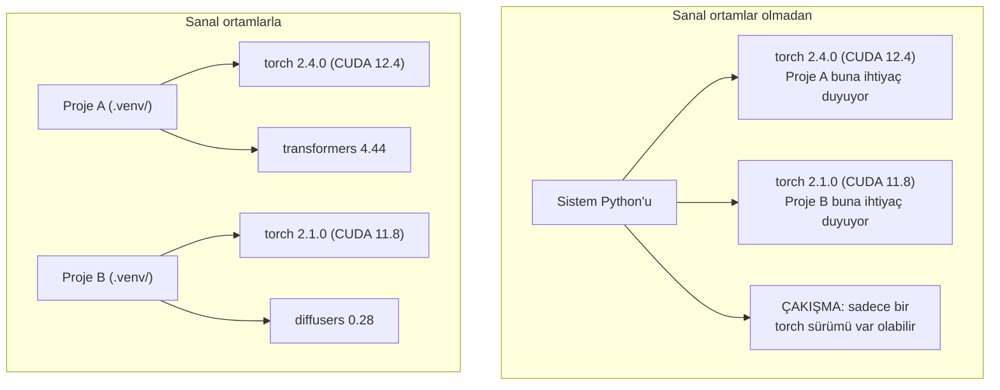

> **Orijinal İçerik:** [docs/en.md](https://github.com/rohitg00/ai-engineering-from-scratch/blob/main/phases/00-setup-and-tooling/06-python-environments/docs/en.md)

# Python Ortamları

> Bağımlılık cehennemi gerçektir. Sanal ortamlar ilacıdır.

**Tür:** Uygulama
**Diller:** Kabuk
**Ön Koşullar:** Faz 0, Ders 01
**Süre:** ~30 dakika

## Öğrenme Hedefleri

- `uv`, `venv` veya `conda` ile izole sanal ortamlar oluşturun
- İsteğe bağlı bağımlılık gruplarıyla `pyproject.toml` yazın ve tekrarlanabilirlik için kilit dosyaları oluşturun
- Yaygın tuzakları teşhis edin ve düzeltin: global kurulumlar, pip/conda karıştırma, CUDA sürüm uyumsuzlukları
- Çakışan bağımlılıklara sahip projeler için faz bazlı ortam stratejisi uygulayın

## Sorun

Bir ince ayar projesi için PyTorch 2.4 yüklüyorsunuz. Gelecek hafta, farklı bir projenin CUDA derlemesi sabitlendiği için PyTorch 2.1'e ihtiyacı var. Global olarak yükseltiyorsunuz ve ilk proje bozuluyor. Düşürüyorsunuz ve ikinci proje bozuluyor.

Bu bağımlılık cehennemidir. Yapay zeka/ML çalışmalarında sürekli olur çünkü:

- PyTorch, JAX ve TensorFlow her biri kendi CUDA bağımlılıklarını sunar
- Model kütüphaneleri belirli çerçeve sürümlerini sabitler
- Global `pip install`, orada ne varsa üzerine yazar
- CUDA 11.8 derlemeleri CUDA 12.x sürücüleriyle çalışmaz (ve tersi)

Çözüm: her proje kendi paketlerine sahip izole bir ortam alır.

## Kavram



## Uygulama

### Seçenek 1: uv venv (Önerilen)

`uv`, en hızlı Python paket yöneticisidir (pip'den 10-100 kat hızlı). Sanal ortamları, Python sürümlerini ve bağımlılık çözümünü tek bir araçta yönetir.

```bash
curl -LsSf https://astral.sh/uv/install.sh | sh

uv python install 3.12

projeniz-cd
uv venv
source .venv/bin/activate
```

#### Açıklama
`uv`'yü kurup Python'u indiriyoruz, sonra sanal ortam oluşturup etkinleştiriyoruz.

Paketleri yükleyin:

```bash
uv pip install torch numpy
```

`pyproject.toml` ile tek adımda proje oluşturun:

```bash
uv init benim-ai-projem
cd benim-ai-projem
uv add torch numpy matplotlib
```

### Seçenek 2: venv (Dahili)

`uv`'yü kuramıyorsanız, Python `venv` ile birlikte gelir:

```bash
python3 -m venv .venv
source .venv/bin/activate  # Linux/macOS
.venv\Scripts\activate     # Windows

pip install torch numpy
```

`uv`'den daha yavaştır ama Python'un yüklü olduğu her yerde çalışır.

### Seçenek 3: conda (Gerektiğinde)

Conda, CUDA araç setleri, cuDNN ve C kütüphaneleri gibi Python dışı bağımlılıkları yönetir. Şu durumlarda kullanın:

- Sistem genelinde kurulum yapmadan belirli bir CUDA araç seti sürümüne ihtiyacınız varsa
- Sistem paketlerini kuramadığınız paylaşımlı bir küme üzerindeyseniz
- Bir kütüphanenin kurulum talimatları "conda kullanın" diyorsa

```bash
# miniconda'yı kurun (tam Anaconda değil)
curl -LsSf https://repo.anaconda.com/miniconda/Miniconda3-latest-Linux-x86_64.sh -o miniconda.sh
bash miniconda.sh -b

conda create -n benimprojem python=3.12
conda activate benimprojem

conda install pytorch torchvision torchaudio pytorch-cuda=12.4 -c pytorch -c nvidia
```

#### Açıklama
Conda, Python dışı bağımlılıkları yönetmek için mükemmeldir, özellikle CUDA sürüm uyumsuzluklarını çözer.

Bir kural: bir ortam için conda kullanıyorsanız, o ortamdaki tüm paketler için conda kullanın. Conda ortamına `pip install` karıştırmak, hata ayıklaması acı veren bağımlılık çakışmalarına neden olur.

### Bu Kurs İçin: Faz Bazlı Strateji

Tüm kurs için bir ortam oluşturabilirsiniz. Yapmayın. Farklı fazlar farklı (bazen çakışan) bağımlılıklara ihtiyaç duyar.

Strateji:

```
ai-engineering-from-scratch/
├── .venv/                    <-- faz 0-3 için paylaşımlı hafif ortam
├── phases/
│   ├── 04-sinir-aglari/
│   │   └── .venv/            <-- PyTorch ortamı
│   ├── 05-cnns/
│   │   └── .venv/            <-- aynı PyTorch ortamı (sembolik bağlantı veya paylaşımlı)
│   ├── 08-transformers/
│   │   └── .venv/            <-- farklı transformer sürümleri gerekebilir
│   └── 11-llm-api/
│       └── .venv/            <-- API SDK'ları, torch gerekmez
```

`code/env_setup.sh` dosyasındaki betik, bu kurs için temel ortamı oluşturur.

## pyproject.toml Temelleri

Her Python projesinin bir `pyproject.toml` dosyası olmalıdır. `setup.py`, `setup.cfg` ve `requirements.txt` dosyalarının yerini tek dosyada alır.

```toml
[project]
name = "ai-engineering-from-scratch"
version = "0.1.0"
requires-python = ">=3.11"
dependencies = [
    "numpy>=1.26",
    "matplotlib>=3.8",
    "jupyter>=1.0",
    "scikit-learn>=1.4",
]

[project.optional-dependencies]
torch = ["torch>=2.3", "torchvision>=0.18"]
llm = ["anthropic>=0.39", "openai>=1.50"]
```

Sonra yükleyin:

```bash
uv pip install -e ".[torch]"    # temel + PyTorch
uv pip install -e ".[llm]"     # temel + LLM SDK'ları
uv pip install -e ".[torch,llm]" # her şey
```

#### Açıklama
`pyproject.toml`, proje bağımlılıklarını ve yapılandırmasını tanımlar. Seçenekli gruplar, farklı ortamlar için farklı paketleri yüklemenizi sağlar.

## Kilit Dosyaları

Bir kilit dosyası her bağımlılığı (dolaylı olanlar dahil) kesin sürümlere sabitler. Bu tekrarlanabilirliği garanti eder: kilit dosyasından yükleyen herkes tam olarak aynı paketleri alır.

```bash
# uv, uv add kullanırken otomatik olarak uv.lock oluşturur
uv add numpy

# pip-tools yaklaşımı
uv pip compile pyproject.toml -o requirements.lock
uv pip install -r requirements.lock
```

Kilit dosyanızı git'e commit edin. Birisi depoyu klonladığında kilit dosyasından yükler ve aynı sürümleri alır.

## Yaygın Hatalar

### 1. Global kurulum

```bash
pip install torch  # KÖTÜ: sistem Python'una yükler

source .venv/bin/activate
pip install torch  # İYİ: sanal ortama yükler
```

Paketlerinizin nereye gittiğini kontrol edin:

```bash
which python       # .venv/bin/python göstermeli, /usr/bin/python değil
which pip           # .venv/bin/pip göstermeli
```

### 2. pip ve conda karıştırma

```bash
conda create -n benimortam python=3.12
conda activate benimortam
conda install pytorch -c pytorch
pip install baska-paket   # KÖTÜ: conda'nın bağımlılık izlemesini bozabilir
conda install baska-paket # İYİ: conda her şeyi yönetsin
```

Conda içinde pip kullanmanız gerekiyorsa (bazı paketler sadece pip'tedir), önce tüm conda paketlerini, sonra pip paketlerini yükleyin.

### 3. Etkinleştirmeyi unutmak

```bash
python train.py           # sistem Python'unu kullanır, paketler eksik
source .venv/bin/activate
python train.py           # proje Python'unu kullanır, paketler bulunur
```

Kabuk istemeniz ortam adını göstermeli:

```
(.venv) $ python train.py
```

### 4. .venv'yi git'e commit etmek

```bash
echo ".venv/" >> .gitignore
```

Sanal ortamlar 200MB-2GB arasındadır. Yereldir, makineler arası taşınmaz. Bunun yerine `pyproject.toml` ve kilit dosyasını commit edin.

### 5. CUDA sürüm uyumsuzluğu

```bash
nvidia-smi                # sürücü CUDA sürümünü gösterir (örn., 12.4)
python -c "import torch; print(torch.version.cuda)"  # PyTorch CUDA sürümünü gösterir

# Bunlar uyumlu olmalı.
# PyTorch CUDA sürümü <= sürücü CUDA sürümü olmalı.
```

#### Açıklama
PyTorch, belirli bir CUDA sürümü için derlenmiştir. Sürücü sürümünden yüksekse CUDA kullanılamaz.

## Kullanım

Kurs ortamınızı oluşturmak için kurulum betiğini çalıştırın:

```bash
bash phases/00-setup-and-tooling/06-python-environments/code/env_setup.sh
```

Bu, deponun kökünde temel bağımlılıklar yüklenmiş ve doğrulanmış bir `.venv` oluşturur.

## Alıştırmalar

1. `env_setup.sh`'yi çalıştırın ve tüm kontrollerin geçtiğini doğrulayın
2. İkinci bir sanal ortam oluşturun, içine farklı bir numpy sürümü yükleyin ve iki ortamın izole olduğunu doğrulayın
3. Hem PyTorch hem de Anthropic SDK'sına ihtiyaç duyan bir proje için bir `pyproject.toml` yazın
4. Kasıtlı olarak bir paketi global yükleyin (venv etkinleştirmeden), nereye gittiğini fark edin, sonra kaldırın

## Temel Terimler

| Terim | İnsanların söylediği | Gerçekte ne anlama geldiği |
|-------|---------------------|--------------------------|
| Sanal ortam | "Bir venv" | Python yorumlayıcısı ve paketlerini içeren izole dizin, sistem Python'undan ayrı |
| Kilit dosyası | "Sabitlenmiş bağımlılıklar" | Her paketi ve kesin sürümünü listeleyen dosya, makineler arası aynı yüklemleri garanti eder |
| pyproject.toml | "Yeni setup.py" | Standart Python proje yapılandırma dosyası, setup.py/setup.cfg/requirements.txt'nin yerini alır |
| Dolaylı bağımlılık | "Bir bağımlılığın bağımlılığı" | Paket B, C'ye bağlıdır; B'ye bağlı A'yı yüklerseniz, C'nin dolaylı bağımlılığıdır |
| CUDA uyumsuzluğu | "GPU'm çalışmıyor" | PyTorch, GPU sürücünüzün desteklediğinden farklı bir CUDA sürümü için derlenmiştir |
