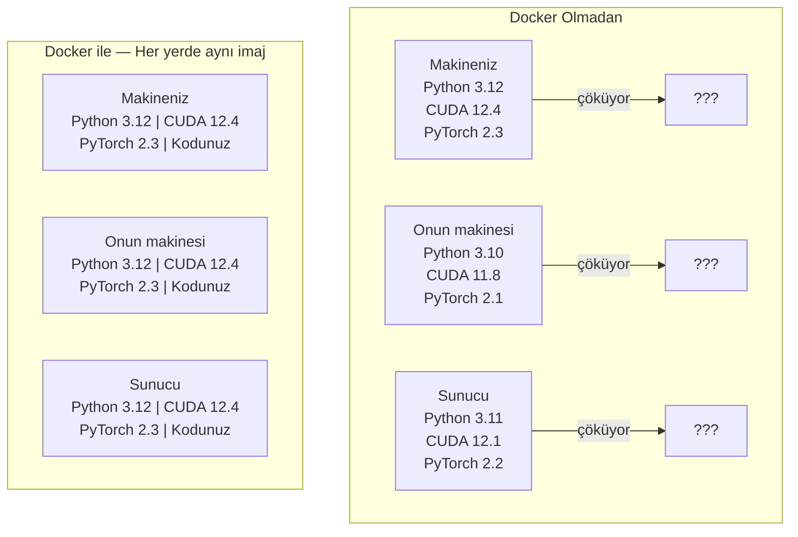

> **Orijinal İçerik:** [docs/en.md](https://github.com/rohitg00/ai-engineering-from-scratch/blob/main/phases/00-setup-and-tooling/07-docker-for-ai/docs/en.md)

# Yapay Zeka İçin Docker

> Konteynerlar "benim makinemde çalışıyor" ifadesini geçmişte bıraktı.

**Tür:** Uygulama
**Diller:** Docker
**Ön Koşullar:** Faz 0, Ders 01 ve 03
**Süre:** ~60 dakika

## Öğrenme Hedefleri

- Dockerfile'dan CUDA, PyTorch ve yapay zeka kütüphaneleri içeren GPU etkin bir Docker imajı oluşturun
- Model dosyalarını, veri setlerini ve kodu konteyner yeniden oluşturmaları arasında kalıcı hale getirmek için ana bilgisayar dizinlerini birim olarak bağlayın
- Konteynerların içinde GPU'ları sunmak için NVIDIA Conteyner Araç Seti'ni yapılandırın
- Docker Compose ile çok servisli yapay zeka uygulamalarını orkestre edin (çıkarma sunucusu + vektör veritabanı)

## Sorun

Laptopunuzda PyTorch 2.3, CUDA 12.4 ve Python 3.12 ile bir model eğittiniz. Meslektaşınızın PyTorch 2.1, CUDA 11.8 ve Python 3.10'u var. Modeliniz onun makinesinde çöküyor. Dockerfile'ınız her ikisinde de çalışıyor.

Yapay zeka projeleri bağımlılık kâbuslarıdır. Tipik bir yığın Python, PyTorch, CUDA sürücüleri, cuDNN, sistem düzeyindeki C kütüphaneleri ve flash-attn gibi kesin derleyici sürümleri gerektiren özel paketleri içerir. Docker tümünü her yerde aynı çalışan tek bir imajda paketler.

## Kavram

Docker, kodunuzu, çalışma zamanınızı, kütüphanelerinizi ve sistem araçlarınızı konteyner adı verilen izole bir birimde paketler. Bunu hafif bir sanal makine gibi düşünün, ama kendi işletim sistemi çekirdeğini çalıştırmak yerine ana bilgisayar çekirdeğini paylaşır, bu yüzden dakikalar yerine saniyeler içinde başlar.



### Neden yapay zeka projeleri çoğundan daha çok Docker'a ihtiyaç duyar

1. **GPU sürücüleri kırılgandır.** CUDA 12.4 kodu CUDA 11.8'de çalışmaz. Docker, NVIDIA Conteyner Araç Seti aracılığıyla ana bilgisayar GPU sürücüsünü paylaşırken CUDA araç setini konteyner içinde izole eder.

2. **Model ağırlıkları büyüktür.** 7B parametreli bir model fp16'da 14 GB'tır. Her yeniden oluşturmada yeniden indirmek istemezsiniz. Docker birimleri, ana bilgisayardan bir model diziniormanızı sağlar.

3. **Çok servisli mimariler yaygındır.** Gerçek bir yapay zeka uygulaması sadece bir Python betiği değil, bir çıkarma sunucusu, RAG için bir vektör veritabanı, belki bir web ön yüzüdür. Docker Compose tümünü tek komutla orkestre eder.

### Temel sözcük dağarcığı

| Terim | Ne anlama geldiği |
|-------|-------------------|
| İmaj | Salt okunur şablon. Tarifiniz. Dockerfile'dan oluşturulur. |
| Konteyner | Bir imajın çalışan örneği. Mutfağınız. |
| Dockerfile | İmaj oluşturmak için talimatlar. Katman katman. |
| Birim | Konteyner yeniden başlatmalarında dayanıklı depolama. |
| docker-compose | Çoklu konteyner uygulamalarını YAML'da tanımlamak için araç. |

### Yapay zekada yaygın konteyner kalıpları

```
Geliştirme Konteynerı
  Tam araç seti. Düzenleyici desteği. Jupyter. Hata ayıklama araçları.
  Geliştirme ve deneme sırasında kullanılır.

Eğitim Konteynerı
  Asgari. Sadece eğitim betiği ve bağımlılıkları.
  GPU kümelerinde çalıştırılır. Düzenleyici, Jupyter yok.

Çıkarma Konteynerı
  Sunum için optimize edilmiş. Küçük imaj. Hızlı soğuk başlatma.
  Üretimde dengeleyici arkasında çalıştırılır.
```

## Uygulama

### Adım 1: Docker'ı kurun

```bash
# macOS
brew install --cask docker
open /Applications/Docker.app

# Ubuntu
curl -fsSL https://get.docker.com | sh
sudo usermod -aG docker $USER
# Grup değişikliğinin geçerli olması için çıkış yapıp tekrar giriş yapın
```

Doğrulama:

```bash
docker --version
docker run hello-world
```

#### Açıklama
Docker'ın düzgün kurulduğunu ve çalıştığını doğrulayan temel testler.

### Adım 2: NVIDIA Conteyner Araç Seti'ni kurun (NVIDIA GPU'lu Linux)

Bu, Docker konteynerlarının GPU'nıza erişmesini sağlar. macOS ve Windows (WSL2) kullanıcıları bunu atlayabilir; Docker Desktop bu platformlarda GPU passthrough'u farklı şekilde yönetir.

```bash
distribution=$(. /etc/os-release;echo $ID$VERSION_ID)
curl -fsSL https://nvidia.github.io/libnvidia-container/gpgkey | sudo gpg --dearmor -o /usr/share/keyrings/nvidia-container-toolkit-keyring.gpg
curl -s -L https://nvidia.github.io/libnvidia-container/$distribution/libnvidia-container.list | \
    sed 's#deb https://#deb [signed-by=/usr/share/keyrings/nvidia-container-toolkit-keyring.gpg] https://#g' | \
    sudo tee /etc/apt/sources.list.d/nvidia-container-toolkit.list

sudo apt-get update
sudo apt-get install -y nvidia-container-toolkit
sudo nvidia-ctk runtime configure --runtime=docker
sudo systemctl restart docker
```

Konteyner içinde GPU erişimini test edin:

```bash
docker run --rm --gpus all nvidia/cuda:12.4.1-base-ubuntu22.04 nvidia-smi
```

GPU bilgilerinizi görürseniz, araç seti çalışıyor demektir.

### Adım 3: Temel imajları anlayın

Doğru temel imajı seçmek saatlerce hata ayıklamadan kurtarır.

```
nvidia/cuda:12.4.1-devel-ubuntu22.04
  Tam CUDA araç seti. Derleyiciler dahil.
  nvcc gerektiren paketleri derlemek için kullanın (flash-attn, bitsandbytes)
  Boyut: ~4 GB

nvidia/cuda:12.4.1-runtime-ubuntu22.04
  Sadece çalışma zamanı. Derleyici yok.
  Önceden derlenmiş kodu çalıştırmak için kullanın
  Boyut: ~1.5 GB

pytorch/pytorch:2.3.1-cuda12.4-cudnn9-runtime
  CUDA üzerine önceden yüklenmiş PyTorch.
  PyTorch kurulum adımını atlamak için kullanın
  Boyut: ~6 GB

python:3.12-slim
  CUDA yok. Sadece CPU.
  CPU'da çıkarma, hafif araçlar için kullanın
  Boyut: ~150 MB
```

### Adım 4: Yapay zeka geliştirme için Dockerfile yazın

İşte `code/Dockerfile`'daki Dockerfile. Üzerinden geçelim:

```dockerfile
FROM nvidia/cuda:12.4.1-devel-ubuntu22.04

ENV DEBIAN_FRONTEND=noninteractive
ENV PYTHONUNBUFFERED=1

RUN apt-get update && apt-get install -y --no-install-recommends \
    python3.12 \
    python3.12-venv \
    python3.12-dev \
    python3-pip \
    git \
    curl \
    build-essential \
    && rm -rf /var/lib/apt/lists/*

RUN update-alternatives --install /usr/bin/python python /usr/bin/python3.12 1

RUN python -m pip install --no-cache-dir --upgrade pip setuptools wheel

RUN python -m pip install --no-cache-dir \
    torch==2.3.1 \
    torchvision==0.18.1 \
    torchaudio==2.3.1 \
    --index-url https://download.pytorch.org/whl/cu124

RUN python -m pip install --no-cache-dir \
    numpy \
    pandas \
    scikit-learn \
    matplotlib \
    jupyter \
    transformers \
    datasets \
    accelerate \
    safetensors

WORKDIR /workspace

VOLUME ["/workspace", "/models"]

EXPOSE 8888

CMD ["python"]
```

#### Açıklama
Bu Dockerfile, CUDA temel imajı üzerine Python, PyTorch ve gerekli kütüphaneleri kuran bir geliştirme ortamı tanımlar. Her `RUN` komutu yeni bir katman oluşturur.

Oluşturun:

```bash
docker build -t ai-dev -f phases/00-setup-and-tooling/07-docker-for-ai/code/Dockerfile .
```

Bu ilk seferde biraz zaman alır (CUDA temel imajı + PyTorch indirme). Sonraki derlemeler önbelleğe alınmış katmanları kullanır.

Çalıştırın:

```bash
docker run --rm -it --gpus all \
    -v $(pwd):/workspace \
    -v ~/models:/models \
    ai-dev python -c "import torch; print(f'PyTorch {torch.__version__}, CUDA: {torch.cuda.is_available()}')"
```

Konteyner içinde Jupyter çalıştırın:

```bash
docker run --rm -it --gpus all \
    -v $(pwd):/workspace \
    -v ~/models:/models \
    -p 8888:8888 \
    ai-dev jupyter notebook --ip=0.0.0.0 --port=8888 --no-browser --allow-root
```

### Adım 5: Veri ve modeller için birim bağları

Birim bağları yapay zeka çalışmaları için kritiktir. Onlar olmadan, 14 GB'lık model indirmeleriniz konteyner durduğunda kaybolur.

```bash
# Kodunuzu bağlayın
-v $(pwd):/workspace

# Paylaşımlı bir model dizini bağlayın
-v ~/models:/models

# Veri setlerini bağlayın
-v ~/datasets:/data
```

Eğitim betiğinizde bağlanmış yoldan yükleyin:

```python
from transformers import AutoModel

model = AutoModel.from_pretrained("/models/llama-7b")
```

Model ana bilgisayar dosya sisteminde yaşar. Konteynerı istediğiniz sıklıkta yeniden oluşturun, yeniden indirmeye gerek yok.

### Adım 6: Çok servisli yapay zeka uygulamaları için Docker Compose

Gerçek bir RAG uygulaması bir çıkarma sunucusu ve bir vektör veritabanı gerektirir. Docker Compose her ikisini tek komutla çalıştırır.

`code/docker-compose.yml` dosyasına bakın:

```yaml
services:
  ai-dev:
    build:
      context: .
      dockerfile: Dockerfile
    deploy:
      resources:
        reservations:
          devices:
            - driver: nvidia
              count: all
              capabilities: [gpu]
    volumes:
      - ../../../:/workspace
      - ~/models:/models
      - ~/datasets:/data
    ports:
      - "8888:8888"
    stdin_open: true
    tty: true
    command: jupyter notebook --ip=0.0.0.0 --port=8888 --no-browser --allow-root

  qdrant:
    image: qdrant/qdrant:v1.12.5
    ports:
      - "6333:6333"
      - "6334:6334"
    volumes:
      - qdrant_data:/qdrant/storage

volumes:
  qdrant_data:
```

Tümünü başlatın:

```bash
cd phases/00-setup-and-tooling/07-docker-for-ai/code
docker compose up -d
```

Artık yapay zeka geliştirme konteynerınız `http://qdrant:6333` adresine hizmet adıyla ulaşabilir. Docker Compose otomatik olarak paylaşımlı bir ağ oluşturur.

Yapay zeka konteynerından bağlantıyı test edin:

```python
from qdrant_client import QdrantClient

istemci = QdrantClient(host="qdrant", port=6333)
print(istemci.get_collections())
```

Tümünü durdurun:

```bash
docker compose down
```

Qdrant birimini de silmek için `-v` ekleyin:

```bash
docker compose down -v
```

### Adım 7: Yapay zeka çalışmaları için faydalı Docker komutları

```bash
# Çalışan konteynerları listele
docker ps

# Tüm imajları ve boyutlarını listele
docker images

# Kullanılmayan imajları kaldır (disk alanını geri kazan)
docker system prune -a

# Çalışan bir konteynerın içinde GPU kullanımını kontrol et
docker exec -it <konteyner_id> nvidia-smi

# Konteynerdan ana bilgisayara dosya kopyala
docker cp <konteyner_id>:/workspace/sonuclar.csv ./sonuclar.csv

# Konteyner günlüklerini görüntüle
docker logs -f <konteyner_id>
```

## Kullanım

Artık tekrarlanabilir bir yapay zeka geliştirme ortamınız var. Bu kursun geri kalanı için:

- Geliştirme ortamınızı ve vektör veritabanını birlikte başlatmak için `docker compose up` kullanın
- Kodunuzu, modellerinizi ve verinizi birim olarak bağlayın ki yeniden oluşturmalar arasında hiçbir şey kaybolmasın
- Bir ders yeni bir Python paketi gerektirdiğinde, Dockerfile'a ekleyin ve yeniden derleyin
- Dockerfile'ınızı takım arkadaşlarınızla paylaşın. Tam olarak aynı ortamı alırlar.

### GPU yok mu?

`--gpus all` bayrağını ve NVIDIA deploy bloğunu kaldırın. Konteyner hala CPU tabanlı dersler için çalışır. PyTorch, CUDA'nın yokluğunu algılar ve otomatik olarak CPU'ya döner.

## Alıştırmalar

1. Dockerfile'ı oluşturun ve konteyner içinde `python -c "import torch; print(torch.__version__)"` çalıştırın
2. docker-compose yığınını başlatın ve Qdrant'ın yapay zeka konteynerından `http://qdrant:6333/collections` adresinde erişilebilir olduğunu doğrulayın
3. Dockerfile'a `flask` ekleyin, yeniden derleyin ve 5000 numaralı limanda basit bir API sunucusu çalıştırın. Limanı `-p 5000:5000` ile eşleyin
4. `docker images` ile imaj boyutunu ölçün. Temel imajı `devel`'den `runtime`'a değiştirmeyi deneyin ve boyutları karşılaştırın

## Temel Terimler

| Terim | İnsanların söylediği | Gerçekte ne anlama geldiği |
|-------|---------------------|--------------------------|
| Konteyner | "Hafif sanal makine" | Ana bilgisayar çekirdeğini kullanan izole süreç, kendi dosya sistemi ve ağıyla |
| İmaj katmanı | "Önbelleğe alınmış adım" | Her Dockerfile talimatı bir katman oluşturur. Değişmeyen katmanlar önbelleğe alınır, böylece yeniden oluşturmalar hızlı olur. |
| NVIDIA Conteyner Araç Seti | "Docker'da GPU" | `--gpus` bayrağı aracılığıyla ana bilgisayar GPU'larını konteynerlara sunan çalışma zamanı eklentisi |
| Birim bağlama | "Paylaşımlı klasör" | Ana bilgisayardaki bir dizinin konteynera eşlenmesi. Değişiklikler konteyner durduktan sonra devam eder. |
| Temel imaj | "Başlangıç noktası" | Dockerfile'ın üzerine inşa ettiği `FROM` imajı. Önceden neyin yüklü olduğunu belirler. |
