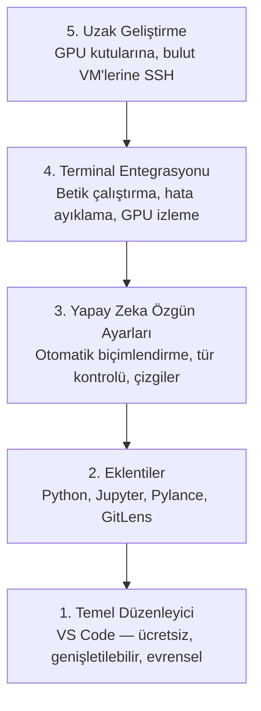

> **Orijinal İçerik:** [docs/en.md](https://github.com/rohitg00/ai-engineering-from-scratch/blob/main/phases/00-setup-and-tooling/08-editor-setup/docs/en.md)

# Düzenleyici Kurulumu

> Düzenleyiciniz pilotunuzdur. Bir kez yapılandırın ki yolunuza çıkmadan işini yapmaya başlasın.

**Tür:** Uygulama
**Diller:** --
**Ön Koşullar:** Faz 0, Ders 01
**Süre:** ~20 dakika

## Öğrenme Hedefleri

- Python, Jupyter, kod kalitesi ve uzak SSH için gerekli eklentilerle VS Code'u kurun
- Yapay zeka iş akışları için kaydettiğinde biçimlendirme, tür kontrolü ve defter çıktısı kaydırmayı yapılandırın
- Uzak GPU makinelerinde kodu düzenlemek ve hata ayıklamak için Uzak SSH'yı kurun
- Düzenleyici alternatiflerini (Cursor, Windsurf, Neovim) ve yapay zeka çalışmaları için artılarını/eksilerini değerlendirin

## Sorun

Düzenleyicinizde Python yazarak, defterler çalıştırarak, eğitim döngülerini hata ayıklayarak ve GPU kutularına SSH ile bağlanarak binlerce saat geçireceksiniz. Yanlış yapılandırılmış bir düzenleyici her oturumu sürtünmeye dönüştürür: otomatik tamamlama yok, tür ipuçları yok, satır içi hatalar yok, manuel biçimlendirme ve hantal bir terminal iş akışı.

Doğru kurulum 20 dakika sürer. Atlamak her gün 20 dakikanıza mal olur.

## Kavram

Bir yapay zeka mühendisliği düzenleyici kurulumu beş şeye ihtiyaç duyar:



## Uygulama

### Adım 1: VS Code'u kurun

VS Code önerilen düzenleyicidir. Ücretsizdir, her işletim sisteminde çalışır, birinci sınıf Jupyter defter desteği vardır ve eklenti ekosistemi yapay zeka çalışmaları için ihtiyacınız olan her şeyi kapsar.

[code.visualstudio.com](https://code.visualstudio.com/) adresinden indirin.

Terminalden doğrulayın:

```bash
code --version
```

macOS'te `code` bulunamazsa, VS Code'u açın, `Cmd+Shift+P` tuşlayın, "Shell Command" yazın ve "Install 'code' command in PATH" seçeneğini seçin.

### Adım 2: Gerekli eklentileri kurun

| Eklenti | Ne yapar |
|---------|----------|
| Python (Microsoft) | Python sözdizimi vurgulama, otomatik tamamlama, hata ayıklama |
| Pylance | Hızlı tür kontrolü ve otomatik tamamlama |
| Jupyter | Defterleri VS Code içinde çalıştırma |
| GitLens | Git commit geçmişini inline görüntüleme |
| Remote - SSH | Uzak makinelerde düzenleme |

```bash
code --install-extension ms-python.python
code --install-extension ms-python.vscode-pylance
code --install-extension ms-toolsai.jupyter
code --install-extension eamodio.gitlens
code --install-extension ms-vscode-remote.remote-ssh
```

### Adım 3: Yapay zeka ayarlarını yapılandırın

VS Code ayarlarında (`settings.json`) şunları ekleyin:

```json
{
  "editor.formatOnSave": true,
  "python.analysis.typeCheckingMode": "basic",
  "notebook.output.scrolling": true,
  "python.analysis.extraPaths": ["./phases"]
}
```

#### Açıklama
- `formatOnSave`: Kaydettiğinizde kodu otomatik biçimlendirir
- `typeCheckingMode`: Kod çalıştırılmadan önce tür hatalarını yakalar
- `output.scrolling`: Uzun çıktıları kaydırılabilir yapar

### Adım 4: Uzak SSH ile GPU makinelerine bağlanma

1. `F1` tuşuna basın, "Remote-SSH: Connect to Host" yazın
2. `kullanici@gpu-makinesi` girin
3. Uzak makinede Python kurun ve kodu orada çalıştırın

## Kullanım

### Düzenleyici Seçimi: Hangisi ne zaman

| VS Code | Cursor | Neovim |
|---------|--------|--------|
| Ücretsiz, geniş ekosistem | Yapay zeka odaklı, entegre LLM | Hafif, özelleştirilebilir |
| Herkes için iyi | Hızlı kod üretimi için iyi | Deneyimli kullanıcılar için |

## Alıştırmalar

1. VS Code'u kurun ve tüm eklentileri yükleyin
2. Bir Python dosyası açın ve Pylance'ın tür hatalarını nasıl gösterdiğini test edin
3. Bir GPU makinesine Uzak SSH ile bağlanın ve uzaktan bir Python dosyası düzenleyin

## Temel Terimler

| Terim | İnsanların söylediği | Gerçekte ne anlama geldiği |
|-------|---------------------|--------------------------|
| Dil Sunucusu Protokolü (LSP) | "Düzenleyici zekası" | Düzenleyicilerin dil sunucularıyla iletişim kurmasını sağlayan standart protokol |
| Kaydettiğinde biçimlendirme | "Otomatik düzeltme" | Dosya kaydedildiğinde otomatik olarak kodu biçimlendiren ayar |
| Pylance | "Python denetleyicisi" | Microsoft'un yüksek performanslı Python dil sunucusu |
| Remote SSH | "Uzaktan düzenleme" | Uzak bir makinede SSH üzerinden kod düzenleme yeteneği |
