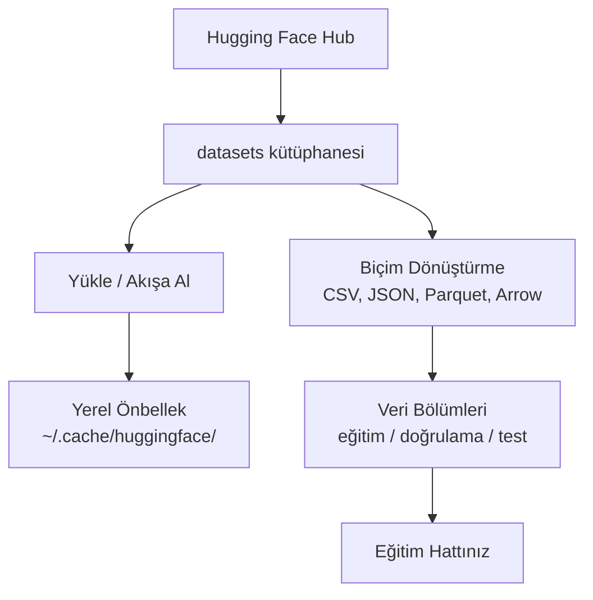

> **Orijinal İçerik:** [docs/en.md](https://github.com/rohitg00/ai-engineering-from-scratch/blob/main/phases/00-setup-and-tooling/09-data-management/docs/en.md)

# Veri Yönetimi

> Veri yakıttır. Onu nasıl yönettiğiniz ne kadar hızlı gittiğinizi belirler.

**Tür:** Uygulama
**Diller:** Python
**Ön Koşullar:** Faz 0, Ders 01
**Süre:** ~45 dakika

## Öğrenme Hedefleri

- Hugging Face `datasets` kütüphanesiyle veri setlerini yükleyin, akışa alın ve önbelleğe alın
- CSV, JSON, Parquet ve Arrow biçimleri arasında dönüştürün ve artılarını/eksilerini açıklayın
- Sabit rastgele tohumlarıyla tekrarlanabilir eğitim/doğrulama/test bölümleri oluşturun
- Büyük model ve veri seti dosyalarını `.gitignore`, Git LFS veya DVC kullanarak yönetin

## Sorun

Her yapay zeka projesi veriyle başlar. Veri setleri bulmanız, indirmeniz, biçimler arasında dönüştürmeniz, eğitim ve değerlendirme için bölmeniz ve deneyleri tekrarlanabilir kılmak için sürümlemeniz gerekir. Bunu her seferinde manuel yapmak yavaş ve hata eğilimlidir. Tekrarlanabilir bir iş akışına ihtiyacınız vardır.

## Kavram



Hugging Face `datasets` kütüphanesi, yapay zeka çalışmaları için veri yüklemenin standart yoludur. İndirmeyi, önbelleğe almayı, biçim dönüştürmeyi ve akışı kutudan çıktığı gibi yönetir.

## Uygulama

### Adım 1: datasets kütüphanesini kurun

```bash
pip install datasets huggingface_hub
```

### Adım 2: Bir veri seti yükleyin

```python
from datasets import load_dataset

veri_seti = load_dataset("imdb")
print(veri_seti)
print(veri_seti["train"][0])
```

#### Açıklama
Bu kod, IMDB film yorumları veri setini indirir ve yükler. "train" bölümü eğitim verisini, ilk örnek bir film yorumunu içerir.

### Adım 3: Veriyi akışa alın

```python
from datasets import load_dataset

veri_seti = load_dataset("imdb", split="train", streaming=True)
for ornek in veri_seti:
    print(ornek["text"][:100])
    break
```

#### Açıklama
`streaming=True` ile veri seti diske indirilmeden satır satır yüklenir. Büyük veri setleri için idealdir.

### Adım 4: Parquet'e dönüştürme

```python
veri_seti = load_dataset("imdb")
veri_seti["train"].to_parquet("imdb_train.parquet")
```

#### Açıklama
Parquet, sütunlu bir ikili biçimidir. CSV'den daha küçüktür ve daha hızlı okunur. ML veri setleri için tercih edilen biçimdir.

### Adım 5: Eğitim/doğrulama/test bölme

```python
bolumlu = veri_seti["train"].train_test_split(test_size=0.2, seed=42)
egitim = bolumlu["train"]
test = bolumlu["test"]
```

#### Açıklama
`seed=42` ile bölme tekrarlanabilir olur. Her seferinde aynı veriler aynı bölümlere gider.

## Kullanım

### Biçim Karşılaştırması

| Biçim | En iyi | Dezavantajı |
|-------|--------|-------------|
| CSV | Basit, okunabilir | Büyük, yavaş |
| JSON | Esnek, hiyerarşik | Büyük dosyalarda yavaş |
| Parquet | Sütunlu, sıkıştırılmış | İnsan okunamaz |
| Arrow | Hızlı, bellenmiş | Sadece programatik erişim |

## Alıştırmalar

1. `datasets` kütüphanesiyle IMDB veri setini yükleyin ve ilk 5 örneği görüntüleyin
2. Veri setini CSV'ye, sonra Parquet'e dönüştürün ve boyutları karşılaştırın
3. Farklı `seed` değerleriyle train/test bölme yapın ve sonuçların değiştiğini doğrulayın
4. Büyük bir veri setini akış modunda yükleyin ve bellek kullanımını izleyin

## Temel Terimler

| Terim | İnsanların söylediği | Gerçekte ne anlama geldiği |
|-------|---------------------|--------------------------|
| Veri seti | "Veri dosyası" | Yapay zeka eğitimi için yapılandırılmış veri koleksiyonu |
| Akış (Streaming) | "İndirmeden okuma" | Verinin tamamı indirilmeden parçalar halinde yüklenmesi |
| Parquet | "Sütunlu dosya" | Veri setleri için optimize edilmiş, sıkıştırılmış ikili biçim |
| Bölme (Split) | "Ayırma" | Veri setinin eğitim, doğrulama ve test alt kümelerine ayrılması |
| Tohum (Seed) | "Rastgelelik sabiti" | Rastgele işlemleri tekrarlanabilir kılan başlangıç değeri |
| Git LFS | "Büyük dosya deposu" | Git'in büyük dosyaları-version kontrolü için Optimizasyon aracı |
