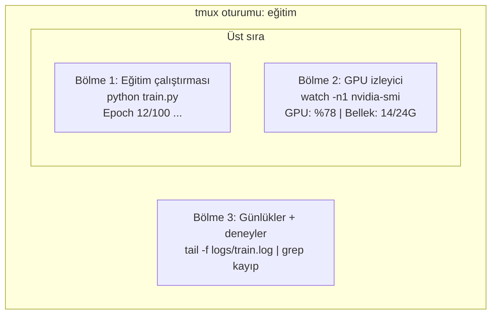

> **Orijinal İçerik:** [docs/en.md](https://github.com/rohitg00/ai-engineering-from-scratch/blob/main/phases/00-setup-and-tooling/10-terminal-and-shell/docs/en.md)

# Terminal ve Kabuk

> Terminal, yapay zeka mühendislerinin yaşadığı yerdir. Burada rahat olun.

**Tür:** Öğrenme
**Diller:** --
**Ön Koşullar:** Faz 0, Ders 01
**Süre:** ~35 dakika

## Öğrenme Hedefleri

- Eğitim günlüklerini komut satırından filtrelemek ve işlemek için boru, yönlendirmeler ve `grep` kullanın
- Eş zamanlı eğitim ve GPU izleme için çoklu bölmeli kalıcı tmux oturumları oluşturun
- `htop`, `nvtop` ve `nvidia-smi` ile sistem ve GPU kaynaklarını izleyin
- SSH, `scp` ve `rsync` kullanarak yerel ve uzak makineler arasında dosya aktarın

## Sorun

Terminalde düzenleyiciden daha fazla zaman geçireceksiniz. Eğitim çalıştırmaları, GPU izleme, günlük takibi, uzak SSH oturumları, ortam yönetimi. Her yapay zeka iş akışı kabuğa dokunur. Buradaysanız her yerdesiniz.

Bu ders, yapay zeka çalışmaları için önemli olan becerileri kapsar. Unix tarihi yok. Bash betikleme derin dalışı yok. Sadece ihtiyacınız olan.

## Kavram



Bir anda üç şey çalışıyor. Tek terminal. Ayrılabilir, eve gidebilir, tekrar SSH ile bağlanabilir ve yeniden ekleyebilirsiniz. Eğitim çalışmaya devam eder.

## Uygulama

### Adım 1: Kabuğunuzu bilin

Hangi kabuğu çalıştırdığınızı kontrol edin:

```bash
echo $SHELL
```

Çoğu sistem `bash` veya `zsh` kullanır. Her ikisi de sorunsuz çalışır.

Bilinmesi gereken önemli şeyler:

```bash
# Tarihçe
history                    # Komut geçmişini göster
history | grep git         # Git ile ilgili komutları bul

# Kısayollar
Ctrl+R                     # Ters arama
Ctrl+C                     # Çalışan komutu durdur
Ctrl+D                     # Oturumu kapat
Ctrl+L                     # Ekranı temizle
```

### Adım 2: Boru ve yönlendirmeler

```bash
# Boru: çıktıyı başka bir komutun girdisine gönder
cat train.log | grep "loss" | tail -5

# Yönlendirme: çıktıyı dosyaya yaz
python train.py > output.log 2>&1

# Ek: dosyaya ekle (üzerine yazma)
echo "deneme" >> notlar.txt
```

#### Açıklama
Boru (`|`), bir komutun çıktısını diğerinin girdisi yapar. `>` dosyaya yazar, `>>` ekler. `2>&1` hata çıkışını da yönlendirir.

### Adım 3: tmux ile kalıcı oturumlar

```bash
# Yeni oturum oluştur
tmux new -s egitim

# Otuurumdan ayrıl (oturum arka planda devam eder)
Ctrl+B sonra D

# Mevcut oturumlardan listele
tmux ls

# Otuuruma yeniden bağlan
tmux attach -t egitim

# Bölme oluştur
Ctrl+B sonra % (yatay) veya " (dikey)
```

#### Açıklama
tmux, eğitim çalıştırmaları gibi uzun süren işlemler için mükemmeldir. SSH bağlantısı kopsa bile eğitim devam eder.

### Adım 4: Dosya aktarımı

```bash
# Yerel → Uzak
scp model.pth kullanici@sunucu:/path/to/dest

# Uzak → Yerel
scp kullanici@sunucu:/path/to/file.csv ./

# rsync (büyük dosyalar için daha hızlı, devam ettirilebilir)
rsync -avz --progress model.pth kullanici@sunucu:/path/to/dest
```

### Adım 5: Sistem izleme

```bash
# CPU ve bellek kullanımı
htop

# GPU kullanımı
nvtop

# NVIDIA GPU durumu
nvidia-smi

# Süreçleri bul ve öldür
ps aux | grep python
kill -9 <PID>
```

## Kullanım

### Faydalı Kabuk Fonksiyonları

| İşlem | Komut |
|-------|-------|
| Dosya arama | `find . -name "*.py"` |
| İçerik arama | `grep -r "torch" . --include="*.py"` |
| Dosya boyutu | `du -sh /path/to/dir` |
| Çalışan süreçler | `ps aux \| grep python` |
| Port kullanımı | `lsof -i :8888` |

## Alıştırmalar

1. `tmux` ile yeni bir oturum oluşturun, birkaç komut çalıştırın, ayrılın ve tekrar bağlanın
2. `train.log` dosyasında "loss" içeren satırları `grep` ile bulun
3. Bir dosyayı `scp` ile uzak bir makineye yükleyin
4. `htop` ile sistem kaynaklarını izleyin ve Python süreçlerini bulun

## Temel Terimler

| Terim | İnsanların söylediği | Gerçekte ne anlama geldiği |
|-------|---------------------|--------------------------|
| Boru (Pipe) | "Bağlantı" | Bir komutun çıktısını diğerinin girdisine yönlendirme |
| tmux | "Kalıcı terminal" | Bağlantı kopsa bile devam eden terminal oturumları |
| scp | "Dosya kopyalama" | SSH üzerinden güvenli dosya aktarımı |
| rsync | "Senkronizasyon" | Büyük dosyalar için fark tabanlı, devam ettirilebilir aktarım |
| htop | "Gelişmiş görev yöneticisi" | CPU, bellek ve süreçleri interaktif gösteren araç |
| nvtop | "GPU izleyici" | NVIDIA GPU kullanımını gerçek zamanlı gösteren araç |
