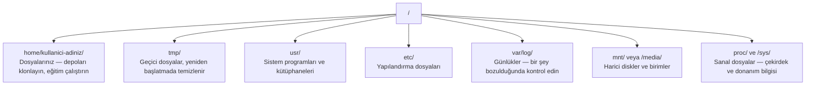

> **Orijinal İçerik:** [docs/en.md](https://github.com/rohitg00/ai-engineering-from-scratch/blob/main/phases/00-setup-and-tooling/11-linux-for-ai/docs/en.md)

# Yapay Zeka İçin Linux

> Çoğu yapay zeka Linux'ta çalışır. Takılmamak için yeterince bilmeniz gerekir.

**Tür:** Öğrenme
**Diller:** --
**Ön Koşullar:** Faz 0, Ders 01
**Süre:** ~30 dakika

## Öğrenme Hedefleri

- Linux dosya sisteminde gezinin ve komut satırından temel dosya işlemleri yapın
- `chmod` ve `chown` ile dosya izinlerini yönetin, "Permission denied" hatalarını çözün
- `apt` ile sistem paketleri kurun ve yapay zeka çalışmaları için yeni bir GPU kutusunu hazırlayın
- Uzak makinelerde geliştiricilerin sık karşılaştığı macOS-to-Linux farklarını tanıyın

## Sorun

macOS veya Windows'ta geliştiriyorsunuz. Ama bir bulut GPU kutusuna SSH ile bağlandığınızda, bir Lambda örneği kiraladığınızda veya bir EC2 makinesi kaldırdığınızda Ubuntu'ya iniş yapıyorsunuz. Terminal tek arayüzünüz. Finder yok, Explorer yok, GUI yok. Dosya sisteminde gezinemezseniz, paket yükleyemezseniz ve süreçleri komut satırından yönetemezseniz, "Linux'ta dosya nasıl çıkartılır" diye Google'larken boşta GPU saatleri için ödeme yapmak zorunda kalırsınız.

Bu bir hayatta kalma kılavuzudur. Uzak bir Linux makinesinde yapay zeka çalışmaları için çalışmanıza olanak tanıyan şeyleri tam olarak kapsar. Fazlası değil.

## Dosya Sistemi Düzeni

Linux her şeyi tek bir kök `/` altında düzenler. `C:\` veya `/Volumes` yoktur. Asıl dokunacağınız dizinler:



Ev dizininiz `~` veya `/home/kullanici-adiniz`. Yaptığınız neredeyse her şey burada gerçekleşir.

## Temel Komutlar

Uzak bir GPU kutusunda yapacağınız işin %95'ini kapsayan 15 komut.

### Gezinme

```bash
pwd                         # Neredeyim?
ls                          # Burada ne var?
ls -la                      # Burada ne var, gizli dosyalar ve ayrıntılar dahil?
cd /yol/neresi               # Oraya git
cd ~                        # Eve git
cd ..                       # Üst dizine çık
```

### Dosya İşlemleri

```bash
mkdir klasor                 # Dizin oluştur
cp dosya.py kopya.py         # Kopyala
mv eski.py yeni.py           # Taşımak veya yeniden adlandırmak için
rm dosya.py                  # Sil
rm -rf klasor/               # Dizini ve içini sil (DİKKATLİ OLUN)
```

### Dosya Görüntüleme

```bash
cat dosya.py                 # Dosyanın tamamını göster
head -20 dosya.py            # İlk 20 satırı göster
tail -20 dosya.py            # Son 20 satırı göster
tail -f log.txt              # Günlüğü canlı takip et
wc -l dosya.py               # Satır sayısını say
```

### Arama

```bash
find . -name "*.py"          # Py dosyalarını bul
grep -r "torch" .            # Tüm dosyalarda "torch" ara
grep -n "def " dosya.py      # Dosyadaki "def" satırlarını bul
```

### İzinler

```bash
chmod +x betik.sh            # Çalıştırma izni ver
chmod 755 dizin              # Dizin izinlerini ayarla
chown kullanici:grup dosya   # Sahipliği değiştir
```

#### Açıklama
`chmod` dosya izinlerini, `chown` sahipliği değiştirir. 755: sahip对她可写可执行, grup okuyabilir, diğerleri okuyabilir.

### Paket Yönetimi

```bash
sudo apt update              # Paket listesini güncelle
sudo apt upgrade             # Paketleri yükselt
sudo apt install paket-adi   # Paket kur
sudo apt remove paket-adi    # Paket kaldır
```

### Süreç Yönetimi

```bash
ps aux | grep python         # Python süreçlerini bul
kill PID                     # Süreci öldür
kill -9 PID                  # Zorla öldür
nohup python train.py &      # Arka planda çalıştır
```

### Ağ

```bash
curl -O https://ornek.com/dosya.py   # Dosya indir
wget https://ornek.com/dosya.py       # Dosya indir (alternatif)
ssh kullanici@sunucu                  # Uzak sunucuya bağlan
scp dosya.py kullanici@sunucu:/yol    # Dosya aktar
```

### Disk ve Bellek

```bash
df -h                        # Disk kullanımını göster
du -sh klasor/               # Dizin boyutunu göster
free -h                      # Bellek kullanımını göster
nvidia-smi                   # GPU durumunu göster
```

## Alıştırmalar

1. `ls -la` ile ev dizininizin içeriğini görüntüleyin
2. `mkdir` ile yeni bir dizin oluşturun, `cp` ile bir dosya kopyalayın, `rm` ile silin
3. `chmod +x` ile bir dosyaya çalıştırma izni verin
4. `ssh` ile bir uzak sunucuya bağlanın
5. `htop` ile sistem kaynaklarını izleyin

## Temel Terimler

| Terim | İnsanların söylediği | Gerçekte ne anlama geldiği |
|-------|---------------------|--------------------------|
| Kök dizin (/) | "Başlangıç noktası" | Tüm dosya sisteminin atası |
| Ev dizini (~) | "Benim klasörüm" | Mevcut kullanıcının kişisel dizini |
| chmod | "İzin verme" | Dosya erişim izinlerini değiştirme |
| sudo | "Yönetici olarak" | Kök ayrıcalıklarıyla komut çalıştırma |
| apt | "Paket kurma" | Debian/Ubuntu tabanlı sistemler için paket yöneticisi |
| grep | "İçerik arama" | Dosyalarda normal ifade ile arama yapma |
| pipe (|) | "Bağlantı" | Bir komutun çıktısını diğerinin girdisine yönlendirme |
