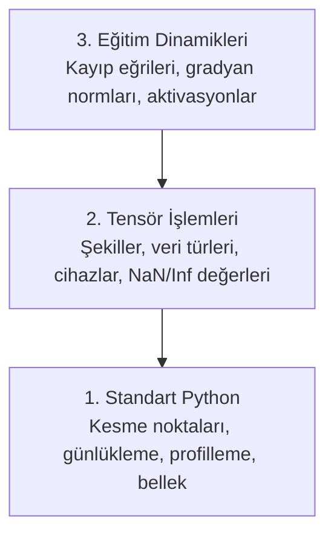

> **Orijinal İçerik:** [docs/en.md](https://github.com/rohitg00/ai-engineering-from-scratch/blob/main/phases/00-setup-and-tooling/12-debugging-and-profiling/docs/en.md)

# Hata Ayıklama ve Profilleme

> En kötü yapay zeka hataları çökmez. Sessizce çöp üzerinde eğitim yapar ve güzel bir kayıp eğrisi rapor eder.

**Tür:** Uygulama
**Diller:** Python
**Ön Koşullar:** Ders 1 (Geliştirme Ortamı), temel PyTorch bilgisi
**Süre:** ~60 dakika

## Öğrenme Hedefleri

- Eğitim sırasında tensör şekillerini, veri türlerini ve NaN değerlerini incelemek için koşullu `breakpoint()` ve `debug_print` kullanın
- Darboğazları bulmak için `cProfile`, `line_profiler` ve `tracemalloc` ile eğitim döngülerini profilleyin
- Yaygın yapay zeka hatalarını tespit edin: şekil uyumsuzlukları, NaN kaybı, veri sızması ve yanlış cihaz tensörleri
- Kayıp eğrileri, ağırlık histogramları ve gradyan dağılımlarını görselleştirmek için TensorBoard'u kurun

## Sorun

Yapay zeka kodu normal koddan farklı başarısız olur. Bir web uygulaması istif iziyle çöker. Yanlış yapılandırılmış bir eğitim döngüsü 8 saat çalışır, $200 GPU zamanı yakar ve her girdinin ortalamasını tahmin eden bir model üretir. Kodda asla hata olmadı. Hata, yanlış cihazdaki bir tensör, unutulmuş bir `.detach()` veya özelliklere sızan etiketlerdi.

Zamanınızı ve hesaplama gücünüzü boşa harcamadan önce bu sessiz başarısızlıkları yakalayan hata ayıklama araçlarına ihtiyacınız var.

## Kavram

Yapay zeka hata ayıklaması üç düzeyde çalışır:



Çoğu insan doğrudan 3. düzeye atlar (TensorBoard'a bakar). Ama yapay zeka hatalarının %80'i 1. ve 2. düzeydedir.

## Uygulama

### Bölüm 1: Yazdırma Hata Ayıklaması (Evet, Çalışır)

Yazdırma hata ayıklaması göz ardı edilir. Edilmemeli. Tensör kodu için, hedefli bir yazdırma ifadesi, hata ayıklayıcıda adım adım ilerlemekten daha iyidir çünkü şekilleri, veri türlerini ve değer aralıklarını aynı anda görmelisiniz.

```python
def debug_print(ad, tensor):
    print(f"{ad}: shape={tensor.shape}, dtype={tensor.dtype}, "
          f"device={tensor.device}, "
          f"min={tensor.min().item():.4f}, max={tensor.max().item():.4f}, "
          f"mean={tensor.mean().item():.4f}, "
          f"has_nan={tensor.isnan().any().item()}")
```

#### Açıklama
Bu yardımcı fonksiyon, bir tensörün tüm önemli özelliklerini tek satırda yazdırır: şekil, veri türü, cihaz, minimum/maksimum değerler ve NaN varlığı.

### Bölüm 2: Koşullu Kesme Noktaları

```python
# Belirli bir koşulda dur
if kayip.isnan():
    breakpoint()  # Burada dur ve tensörleri incele

# Eğitimi durdurmak için
if step == 500:
    breakpoint()  # 500. adımda dur
```

#### Açıklama
`breakpoint()`, kodun o noktasında交互li bir hata ayıklayıcı başlatır. Değişkenleri inceleyebilir, tensörleri yazdırabilir ve devam edebilirsiniz.

### Bölüm 3: Yaygın Yapay Zeka Hataları

**1. Şekil uyumsuzluğu:**
```python
# HATA: matris çarpımı şekil uyuşmazlığı
c = a @ b  # a: (32, 784), b: (256, 10) → HATA!

# ÇÖZÜM: Shapes'i kontrol et
print(f"a: {a.shape}, b: {b.shape}")
```

**2. NaN kaybı:**
```python
# HATA: Öğrenme hızı çok yüksek
kayip = kayip_fonksiyonu(tahmin, hedef)
print(f"Kayıp: {kayip}")  # nan yazdırırsa

# ÇÖZÜM: Öğrenme hızını düşür
```

**3. Yanlış cihaz:**
```python
# HATA: Tensörler farklı cihazlarda
model = model.to("cuda")
veri = veri  # CPU'da kaldı → HATA!

# ÇÖZÜM: Tensörleri aynı cihaza taşı
veri = veri.to("cuda")
```

### Bölüm 4: Profilleme

```python
import cProfile

cProfile.run('model_egit()', 'cikti.prof')
```

#### Açıklama
cProfile, her fonksiyonun ne kadar zaman harcadığını gösterir. Darboğazları bulmak için mükemmeldir.

### Bölüm 5: TensorBoard Kurulumu

```python
from torch.utils.tensorboard import SummaryWriter

yazar = SummaryWriter("runs/deney-1")

for step in range(1000):
    # ... eğitim kodu ...
    yazar.add_scalar("Kayıp/kayip", kayip.item(), step)
    yazar.add_scalar("Dogruluk/dogruluk", dogruluk, step)

yazar.close()
```

```bash
tensorboard --logdir=runs
```

#### Açıklama
TensorBoard, kayıp eğrilerini, ağırlık dağılımlarını ve gradyanları görselleştirmek için güçlü bir araçtır.

## Kullanım

### Hata Ayıklama Kontrol Listesi

| Belirti | Kontrol |
|---------|---------|
| Kayıp NaN | Öğrenme hızını düşür, gradyanları kontrol et |
| Kayıp azalmıyor | Veriyi kontrol et, model mimarisini kontrol et |
| Doğruluk çok yüksek | Veri sızmasını kontrol et (test verisi eğitim verisine sızmış olabilir) |
| Bellek hatası | Toplu iş boyutunu küçült, `torch.cuda.empty_cache()` kullanın |
| Çok yavaş veri yükleme | `num_workers` değerini artırın |

## Alıştırmalar

1. `debug_print` fonksiyonunu kullanarak bir eğitimin ilk 5 adımında tensörleri inceleyin
2. `cProfile` ile bir eğitim döngüsünü profilleyin ve en yavaş 5 fonksiyonu bulun
3. TensorBoard'a kayıp eğrisi ve gradyan dağılımı ekleyin
4. Kasıtlı olarak bir tensör uyumsuzluğu yaratın ve hata mesajını okuyun

## Temel Terimler

| Terim | İnsanların söylediği | Gerçekte ne anlama geldiği |
|-------|---------------------|--------------------------|
| Profilleyici | "Kod sayaçı" | Fonksiyonların ne kadar zaman ve bellek kullandığını ölçen araç |
| TensorBoard | "Eğitim görselleştirici" | Kayıp eğrileri, gradyanlar ve metrikler için web tabanlı gösterge paneli |
| NaN | "Sayı değil" | Tanımsız sonuçları gösteren kayan nokta değeri |
| Breakpoint | "Duraklama noktası" | Kodun o noktasında交互li hata ayıklayıcı başlatan komut |
| Veri sızması | "Test verisi sızıntısı" | Test verisinin eğitim verisine karışması, yapay yüksek doğruluk yanıltıcılığı yaratır |
| Darboğaz | "En yavaş nokta" | Sistemin en yavaş çalışan bileşeni, performansı sınırlayan |
