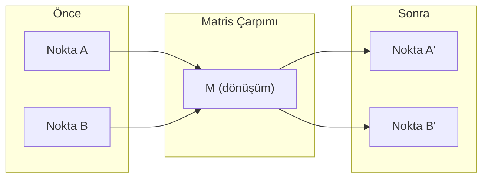

> **Orijinal İçerik:** [docs/en.md](https://github.com/rohitg00/ai-engineering-from-scratch/blob/main/phases/01-math-foundations/01-linear-algebra-intuition/docs/en.md)

# Doğrusal Cebir Sezgisi

> Her yapay zeka modeli, şık bir şapka takmış matris matematiğinden başka bir şey değildir.

**Tür:** Öğrenme
**Diller:** Python, Julia
**Ön Koşullar:** Faz 0
**Süre:** ~60 dakika

## Öğrenme Hedefleri

- Python ile sıfırdan vektör ve matris işlemlerini (toplama, iç çarpım, matris çarpımı) uygulayın
- İç çarpımın, projenin ve Gram-Schmidt sürecinin geometrik olarak ne yaptığını açıklayın
- Sıra azaltma kullanarak bir vektör kümesinin doğrusal bağımsızlığını, derecesini ve temelini belirleyin
- Doğrusal cebir kavramlarını yapay zeka uygulamalarıyla bağlayın: gömmeler, dikkat puanları ve LoRA

## Sorun

Herhangi bir ML makalesini açın. İlk sayfada vektörleri, matrisleri, iç çarpımları ve dönüşümleri göreceksiniz. Doğrusal cebir sezgisi olmadan bunlar sadece simgeler. Onunla, bir sinir ağının gerçekte ne yaptığını görebilirsiniz — noktaları uzayda hareket ettirmek.

Matematikçi olmanıza gerek yok. Bu işlemlerin geometrik olarak ne anlama geldiğini görmeniz, sonra da kendiniz kodlamanız gerekiyor.

## Kavram

### Vektörler Noktalardır (ve Yönler)

Bir vektör sadece bir sayı listesidir. Ama o sayılar bir şey ifade eder — uzaydaki koordinatlardır.

**2B vektör [3, 2]:**

| x | y | Nokta |
|---|---|-------|
| 3 | 2 | Vektör orijinden (0,0) düzlemdeki (3, 2) noktasına yönlenir |

Vektörün büyüklüğü sqrt(3^2 + 2^2) = sqrt(13)'dür ve sağa yukarı doğru yönlenir.

Yapay zekada vektörler her şeyi temsil eder:
- Bir kelime → 768 sayılık bir vektör (gömmeler uzayındaki "anlamı")
- Bir görüntü → milyonlarca piksel değerinden oluşan bir vektör
- Bir kullanıcı → tercihlerden oluşan bir vektör

### Matrisler Dönüşümlerdir

Bir matris bir vektörü diğerine dönüştürür. Döndürebilir, ölçekleyebilir, uzatabilir veya projeksiyon yapabilir.



Yapay zekada matrisler MODELİN kendisidir:
- Sinir ağı ağırlıkları → girdiyi çıktıya dönüştüren matrisler
- Dikkat puanları → neye odaklanılmasına karar veren matrisler
- Gömmeler → kelimeleri vektörlere eşleyen matrisler

### İç Çarpım Benzerliği Ölçer

İki vektörün iç çarpımı, ne kadar benzer olduklarını söyler.

```
a · b = a₁×b₁ + a₂×b₂ + ... + aₙ×bₙ

Aynı yön:      a · b > 0  (benzer)
Dik:           a · b = 0  (ilgisiz)
Ters yön:      a · b < 0  (farklı)
```

Yapay zekada iç çarpım:
- Kelime gömmeleri arasında benzerlik ölçmek için kullanılır
- Dikkat mekanizmasının temelidir
- Öneri sistemlerinde tercih benzerliğini hesaplar

## Alıştırmalar

1. Python ile iki 3B vektörün iç çarpımını sıfırdan hesaplayın
2. Bir vektörün başka bir vektör üzerine projeksiyonunu hesaplayın
3. 2x2 bir matrisin determinantını hesaplayın

## Temel Terimler

| Terim | İnsanların söylediği | Gerçekte ne anlama geldiği |
|-------|---------------------|--------------------------|
| Vektör | "Sayı listesi" | Yönlü bir büyüklük, uzayda bir nokta veya yön |
| Matris | "Sayı tablosu" | Bir uzayı diğerine dönüştüren lineer harita |
| İç çarpım | "Çarpım toplamı" | İki vektör arasındaki benzerlik ölçümü |
| Özdeğer | "Özel değer" | Matrisin bir vektörü yalnızca ölçeklediği değer |
| Özvektör | "Özel vektör" | Matrisin yalnızca ölçeklediği vektör |
| Derece (Rank) | "Bağımsız sütun sayısı" | Matrisin bağımsız sütunlarının veya satırlarının sayısı |
