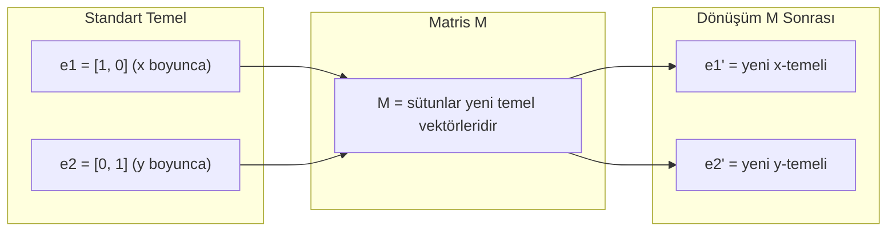
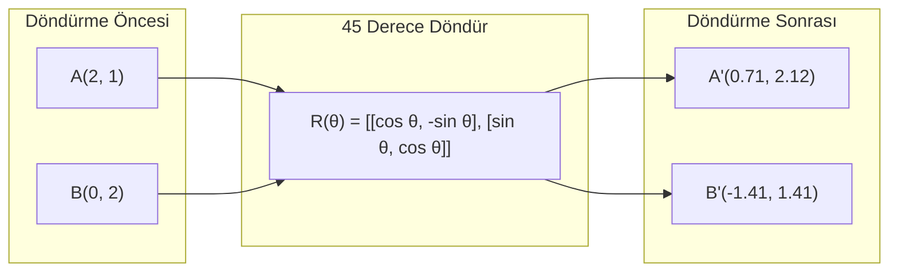

> **Orijinal İçerik:** [docs/en.md](https://github.com/rohitg00/ai-engineering-from-scratch/blob/main/phases/01-math-foundations/03-matrix-transformations/docs/en.md)

# Matris Dönüşümleri

> Matris, uzayı yeniden şekillendiren bir makinedir. Her noktaya ne yaptığını öğrenin, tüm dönüşümü anlarsınız.

**Tür:** Uygulama
**Diller:** Python, Julia
**Ön Koşullar:** Faz 1, Ders 01-02 (Doğrusal Cebir Sezgisi, Vektörler ve Matrisler İşlemleri)
**Süre:** ~75 dakika

## Öğrenme Hedefleri

- Döndürme, ölçekleme, eğme ve yansıma matrisleri oluşturun ve 2B ile 3B noktalara uygulayın
- Birden fazla dönüşümü matris çarpımıyla birleştirin ve sıranın önemli olduğunu doğrulayın
- Karakteristik denklemden 2x2 matrislerin özdeğerlerini ve özvektörlerini hesaplayın
- Özdeğerlerin neden PCA yönlerini, RNN kararlılığını ve spektral kümeleme davranışını belirlediğini açıklayın

## Sorun

PCA hakkında okuyorsunuz ve "kovaryans matrisinin özvektörlerini bulun" diyorsunuz. Model kararlılığı hakkında okuyorsunuz ve "tüm özdeğerlerin büyüklüğünün 1'den küçük olup olmadığını kontrol edin" diyorsunuz. Veri artırma hakkında okuyorsunuz ve "rastgele bir döndürme uygulayın" diyorsunuz. Bunların hiçbiri, matrislerin uzaya geometrik olarak ne yaptığını anlayana kadar mantıklı gelmez.

Matrisler sadece sayı ızgaraları değildir. Uzamsal makinelerdir. Döndürme matrisleri noktaları döndürür. Ölçekleme matrisleri onları uzatır. Eğme matrisleri onları eğir. Bir sinir ağının veriye uyguladığı her dönüşüm, bu işlemlerden birinin kendisidir veya bileşimidir. Bu ders bu işlemleri somutlaştırır.

## Kavram

### Dönüşümler matris olarak

2B'deki her lineer dönüşüm 2x2 bir matris olarak yazılabilir. Matris, temel vektörlerin [1, 0] ve [0, 1]'in tam olarak nereye gittiğini söyler. Diğer her şey bundan türetilir.



### Döndürme

Teta açısıyla yapılan 2B döndürme, mesafeleri ve açıları korur. Her noktayı dairesel bir yay boyunca hareket ettirir.



3B'de bir eksen etrafında döndürürsünüz. Her eksendi kendi döndürme matrisi vardır:

```
Rz(theta) = | cos  -sin  0 |     z ekseni etrafında döndür
            | sin   cos  0 |     (x-y düzlemini döndürür, z sabit)
            |  0     0   1 |

Rx(theta) = | 1   0     0    |   x ekseni etrafında döndür
            | 0  cos  -sin   |   (y-z düzlemini döndürür, x sabit)
            | 0  sin   cos   |

Ry(theta) = |  cos  0  sin |     y ekseni etrafında döndür
            |   0   1   0  |     (x-z düzlemini döndürür, y sabit)
            | -sin  0  cos |
```

#### Açıklama
Her döndürme matrisi trigonometrik fonksiyonlar kullanarak noktaları belirli bir açıyla döndürür.

### Ölçekleme

Ölçekleme matrisi noktaları boyut olarak değiştirir.

```
S = | sx  0  |    x boyunca sx, y boyunca sy ölçekleme
    | 0  sy |
```

Yapay zekada ölçekleme:
- Giriş verilerini normalleştirme
- Farklı boyutlardaki özellikleri eşitleme

### Eğme (Shear)

Eğme matrisi noktaları eğerek bozar, ama paralellik ve alanı korur.

```
Sh = | 1  k  |    k eğme miktarı
     | 0  1  |
```

### Yansıma

Yansıma matrisi noktaları bir eksen etrafında simetrik olarak çevirir.

```
Mx = | 1   0  |    x ekseni etrafında yansıtma
     | 0  -1  |

My = | -1  0  |    y ekseni etrafında yansıtma
     |  0  1  |
```

### Özdeğer ve Özvektör

Bir matrisin özvektörü, matrisin onu yalnızca ölçeklediği (döndürmediği) vektördür. Özdeğer ise o ölçekleme faktörüdür.

```
M @ v = λ × v
M: matris, v: özvektör, λ: özdeğer
```

Yapay zekada özdeğerler:
- PCA: En yüksek özdeğerler en yüksek varyans yönlerini gösterir
- RNN kararlılığı: Tüm özdeğerlerin büyüklüğü 1'den küçükse model kararlıdır
- Spektral kümeleme: Laplace matrisinin özdeğerleri küme yapısını açığa çıkarır

## Alıştırmalar

1. 45 derece döndürme matrisini oluşturun ve (1, 0) noktasına uygulayın
2. 2x2 bir matrisin özdeğerlerini ve özvektörlerini hesaplayın
3. Bir döndürme ve bir ölçekleme matrisini çarparak sıranın önemli olduğunu gösterin

## Temel Terimler

| Terim | İnsanların söylediği | Gerçekte ne anlama geldiği |
|-------|---------------------|--------------------------|
| Döndürme matrisi | "Noktaları döndüren matris" | Açıyı koruyarak noktaları dairesel yay boyunca hareket ettiren dönüşüm |
| Ölçekleme matrisi | "Boyut değiştiren matris" | Noktaları bir veya daha fazla eksende uzatan veya sıkıştıran dönüşüm |
| Özdeğer | "Özel değer" | Matrisin özvektörü yalnızca ölçeklediği skaler çarpan |
| Özvektör | "Özel vektör" | Matrisin yönünü değiştirmeden yalnızca büyüklüğünü değiştirdiği vektör |
| Karakteristik denklem | "Özdeğer denklemi" | det(M - λI) = 0 formülündeki λ değerlerini bulan denklem |
| Simetri | "Ayna görüntüsü" | Bir eksen etrafında noktaların yer değiştirmesi |
