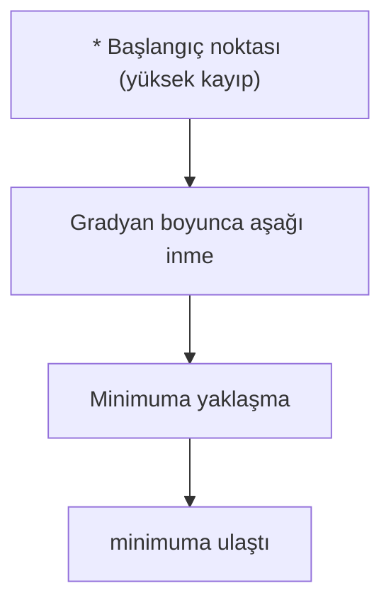

> **Orijinal İçerik:** [docs/en.md](https://github.com/rohitg00/ai-engineering-from-scratch/blob/main/phases/01-math-foundations/08-optimization/docs/en.md)

# Optimizasyon

> Bir sinir ağı eğitmek, bir vadinin dibini bulmaktan başka bir şey değildir.

**Tür:** Uygulama
**Diller:** Python
**Ön Koşullar:** Faz 1, Ders 04-05 (Türevler, Gradyanlar)
**Süre:** ~75 dakika

## Öğrenme Hedefleri

- Sade gradyan inişini, momentumlu SGD'yi ve Adam'ı sıfırdan uygulayın
- Rosenbrock fonksiyonunda optimize edicilerin yakınsamasını karşılaştırın ve Adam'ın neden ağırlık başına öğrenme hızlarını uyarladığını açıklayın
- Konveks ve konveks olmayan kayıp manzaralarını ayırt edin ve yüksek boyutlarda eyer noktalarının rolünü açıklayın
- Eğitim kararlılığı için öğrenme hızı programlarını (basamak azaltma, kosinüs azaltma, ısınma) yapılandırın

## Sorun

Bir kayıp fonksiyonunuz var. Modelinizin ne kadar yanlış olduğunu söylüyor. Gradyanlarınız var. Kaybı hangi yönde kötüleştirdiklerini söylüyor. Şimdi aşağı inmek için bir stratejiye ihtiyacınız var.

Saf yaklaşım basittir: gradyana ters yönde hareket et. Adımı öğrenme hızı adı verilen birsayıyla ölçekle. Tekrarla. Bu gradyan inişidir ve çalışır. Ama "çalışmak" sakıncaları vardır. Çok yüksek öğrenme hızıyla tamamen vadiden dışarı çıkarsınız, duvarlar arasında zıplarsınız. Çok düşükse binlerce gereksiz adımda cevaba doğru sürüngenlik edersiniz. Eyer noktasına çarptığınızda minimumu bulamasanız bile hareketi durdurursunuz.

Derin öğrenmedeki her optimize edici aynı sorunun cevabıdır: vadinin dibine nasıl daha hızlı ve daha güvenilir bir şekilde ulaşılır?

## Kavram

### Optimizasyon ne anlama gelir

Optimizasyon, bir fonksiyonu asgari yapan (veya maksimum yapan) girdi değerlerini bulmaktır. Makine öğrenmesinde fonksiyon kayıptır. Girdiler modelin ağırlıklarıdır. Eğitim optimizasyondur.

```
L(w)'yi asgari yap nerede:
  L = kayıp fonksiyonu
  w = model ağırlıkları (milyonlarca parametre olabilir)
```

### Gradyan inişi (sade)

En basit optimize edici. Kaybın her ağırlığa göre gradyanını hesapla. Her ağırlığı gradyanının tersi yönünde hareket ettir. Adımı öğrenme hızıyla ölçekle.

```
w = w - ogrenme_hizi × gradyan
```

Bu tüm algoritmadır. Tek satır.



### SGD (Stokastik Gradyan İnişi)

Gradyan inişinde gradyanı TÜM veri seti için hesaplarsınız. Büyük veri setlerinde çok yavaştır. SGD, gradyanı her adımda tek bir örnek (veya küçük bir toplu iş) için hesaplar.

```
# Gradyan İnişi
gradyan = tum_veri_uzerinde_kayip_turevi(w)

# SGD
ornek = rastgele_veri_orkeni()
gradyan = ornek_uzerinde_kayip_turevi(w)
```

SGD gürültüldür ama çok daha hızlıdır. Gürültü, minimumları bulmaya yardımcı olur (yerel minimumlardan kurtulmaya).

### Momentum

Topu yuvarlama gibi düşünün. Hız kazanır, küçük çukurlardan atlar.

```
v = momentum × v - lr × gradyan
w = w + v
```

#### Açıklama
Momentum, önceki gradyanların yönünü hatırlayarak hızlıca alçalan bölgelerde hızlanmasını sağlar.

### Adam (Adaptif Moment Tahmini)

En popüler optimize edici. Momentum ve adaptif öğrenme hızını birleştirir.

```
m = β1 × m + (1-β1) × gradyan           # 1. moment (ortalama)
v = β2 × v + (1-β2) × gradyan²          # 2. moment (kare ortalama)
m_duzeltme = m / (1-β1^t)                # Önyargı düzeltmesi
v_duzeltme = v / (1-β2^t)
w = w - lr × m_duzeltme / (√v_duzeltme + ε)
```

#### Açıklama
Adam, her ağırlık için ayrı öğrenme hızı belirler. Sık güncellenen ağırlıklar için daha küçük, seyrek güncellenenler için daha büyük adım atar.

## Alıştırmalar

1. Rosenbrock fonksiyonunda gradyan inişini, momentumlu SGD'yi ve Adam'ı karşılaştırın
2. Farklı öğrenme hızlarıyla eğitimi görselleştirin
3. Eyer noktasını gösteren 2B bir kayıp manzarası çizin

## Temel Terimler

| Terim | İnsanların söylediği | Gerçekte ne anlama geldiği |
|-------|---------------------|--------------------------|
| Optimizasyon | "En iyiyi bulma" | Fonksiyonun minimumunu veya maksimumunu bulma süreci |
| Gradyan inişi | "Aşağı inme" | Gradyana ters yönde ağırlıkları güncelleme algoritması |
| Öğrenme hızı | "Adım boyutu" | Her adımda ne kadar hareket edileceğini belirleyen skaler |
| Momentum | "Hızlanma" | Önceki gradyanların yönünü hatırlayan optimize edici |
| Adam | "Akıllı optimize edici" | Adaptif öğrenme hızı kullanan popüler optimize edici |
| Eyer noktası | "Düz bölge" | Gradyanın sıfır olduğu ama minimum olmadığı nokta |
| Konveks | "Kase şeklinde" | Tek bir minimumu olan kayıp manzarası |
