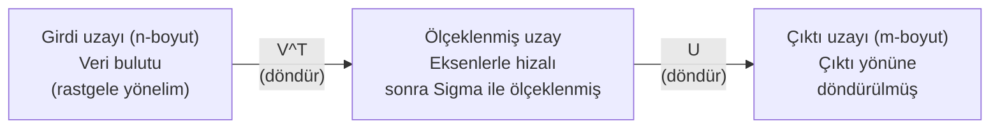

> **Orijinal İçerik:** [docs/en.md](https://github.com/rohitg00/ai-engineering-from-scratch/blob/main/phases/01-math-foundations/11-singular-value-decomposition/docs/en.md)

# Tekil Değer Ayrıştırması

> SVD, doğrusal cebirin İsviçre çakısıdır. Her matrisin bir tane vardır. Her veri bilimci bir tanesine ihtiyaç duyar.

**Tür:** Uygulama
**Diller:** Python, Julia
**Ön Koşullar:** Faz 1, Ders 01 (Doğrusal Cebir Sezgisi), 02 (Vektörler ve Matrisler İşlemleri), 03 (Matris Dönüşümleri)
**Süre:** ~120 dakika

## Öğrenme Hedefleri

- SVD'yi güç yinelemesiyle uygulayın ve U, Sigma ile V^T'nin geometrik anlamını açıklayın
- Görüntü sıkıştırma için kesilmiş SVD uygulayın ve sıkıştırma oranını yeniden oluşturma hatasıyla karşılaştırın
- SVD aracılığıyla Moore-Penrose sanal tersini hesaplayarak aşıetermined en küçük kareler sistemlerini çözün
- SVD'yı PCA, öneri sistemleri (gizli faktörler) ve NLP'de Gizli Anlamsal Analiz ile bağlayın

## Sorun

1000x2000 matrisiniz var. Belki kullanıcı-film puanları. Belki belge-terim sıklık tablosu. Belki bir görüntünün piksel değerleri. Bunu sıkıştırmanız, gürültüden temizlemeniz, içinde gizli yapı bulmanız veya en küçük kareler sistemiyle çözmeniz gerekiyor. Özdeğere ayrıştırma sadece kare matrislerle çalışır. O zaman bile, matrisin tam bir doğrusal bağımsız özvektör kümesine sahip olmasını gerektirir.

SVD her matrisle çalışır. Her şekil. Her derece. Koşul yok. Matrisi, uzaya ne yaptığını ortaya çıkaran üç çarpana böler. Tüm doğrusal cebirdeki en genel ve en kullanışlı ayrıştırmadır.

## Kavram

### SVD geometrik olarak ne yapar

Her matris, şeklinden bağımsız olarak sırayla üç işlem yapar: döndür, ölçekle, döndür. SVD bu ayrıştırmayı açık yapar.

```
A = U * Sigma * V^T

      m x n     m x m    m x n    n x n
     (herhangi) (döndür) (ölçekle) (döndür)
```

Herhangi bir matris A verildiğinde, SVD onu şu üç çarpana böler:
- V^T, girdi uzayındaki (n boyutlu) vektörleri döndürür
- Sigma, her eksen boyunca ölçekler (uzatır veya sıkıştırır)
- U, sonucu çıktı uzayına (m boyutlu) döndürür



Bunu şöyle düşünün. SVD'ye bir matris veriyorsunuz. Size şunu söylüyor: "Bu matris, girdilerin küresini alır, önce V^T ile döndürür, sonra Sigma ile bir elipsoit olarak uzatır, sonra elipsoiti U ile döndürür." Tekil değerler, elipsoitin eksenlerinin uzunluklarıdır.

### Tam ayrıştırma

Herhangi bir m×n matrisi üç çarpana ayrıştırılır:
- U: m×m ortogonal matris (sol tekil vektörler)
- Sigma: m×n diagonal matris (tekil değerler)
- V^T: n×n ortogonal matris (sağ tekil vektörlerin transpozu)

```python
import numpy as np

A = np.array([[1, 2], [3, 4], [5, 6]])

U, Sigma, Vt = np.linalg.svd(A, full_matrices=False)

# Yeniden oluşturma
A_tekrar = U @ np.diag(Sigma) @ Vt
```

### Kesilmiş SVD

En büyük k tekil değeri tutarak matrisi sıkıştırır:

```python
k = 1  # Tek bir bileşen
U_k = U[:, :k]
Sigma_k = Sigma[:k]
Vt_k = Vt[:k, :]

A_kesilmis = U_k @ np.diag(Sigma_k) @ Vt_k
```

#### Açıklama
Kesilmiş SVD, görüntülerin ve metinlerin sıkıştırılmasında kullanılır. En önemli bilgiyi koruyarak boyutu azaltır.

## Alıştırmalar

1. 3x3 bir matris için SVD'yi el ile hesaplayın
2. Bir görüntüyü kesilmiş SVD ile sıkıştırın ve sıkıştırma oranını karşılaştırın
3. SVD kullanarak en küçük kareler çözümünü bulun

## Temel Terimler

| Terim | İnsanların söylediği | Gerçekte ne anlama geldiği |
|-------|---------------------|--------------------------|
| SVD | "Matris ayrıştırma" | Her matrisi üç çarpana ayıran evrensel ayrıştırma |
| Tekil değer | "Önem sırası" | Matrisin her boyutta ne kadar "geniş" olduğunu gösteren değerler |
| Tekil vektör | "Temel yön" | Matrisin uzayı döndürdüğü yönler |
| Kesilmiş SVD | "Sıkıştırılmış ayrıştırma" | En büyük k tekil değeri tutarak_approximate|
| Ortoğonal | "Dik ve birim" | Sütunları birbirine dik ve birim uzunlukta olan matris |
