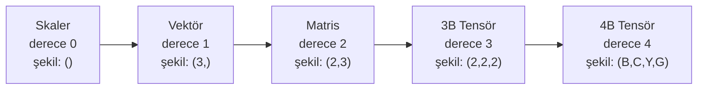

> **Orijinal İçerik:** [docs/en.md](https://github.com/rohitg00/ai-engineering-from-scratch/blob/main/phases/01-math-foundations/12-tensor-operations/docs/en.md)

# Tensör İşlemleri

> Tensörler, veri ile derin öğrenme arasındaki ortak dildir. Her görüntü, her cümle, her gradyan bunların içinden akar.

**Tür:** Uygulama
**Diller:** Python
**Ön Koşullar:** Faz 1, Ders 01 (Doğrusal Cebir Sezgisi), 02 (Vektörler, Matrisler ve İşlemler)
**Süre:** ~90 dakika

## Öğrenme Hedefleri

- Şekil, adımlar, yeniden şekillendirme, transpoz ve eleman bazlı işlemlerle sıfırdan bir tensör sınıfı uygulayın
- Veri kopyalamadan farklı şekillerdeki tensörlerle çalışmak için yayma kurallarını uygulayın
- İç çarpımlar, matris çarpımları, dış çarpımlar ve toplu iş işlemleri için einsum ifadeleri yazın
- Çoklu başlı dikkatte her adımdaki kesin tensör şekillerini takip edin

## Sorun

Bir transformer oluşturuyorsunuz. İleri besleme temiz görünüyor. Çalıştırıyorsunuz ve şunu alıyorsunuz: `RuntimeError: mat1 ve mat2 şekilleri çarpılamaz (32x768 ve 512x768)`. Şekillere bakıyorsunuz. Bir transpoz deniyorsunuz. Şimdi diyor ki `Beklenen 4B girdi (3B girdi alındı)`. Bir squeeze ekliyorsunuz. Bir şey daha bozuluyor.

Şekil hataları, derin öğrenme kodundaki en yaygın hatadır. Kavram olarak zor değiller — her işlemin bir şekil sözleşmesi vardır — ama hızla çarpışırlar. Bir transformer'da düzinelerce yeniden şekillendirme, transpoz ve yayma zincirlenmiştir. Yanlış bir eksen ve hata kaskat halinde yayılır. Daha da kötüsü, bazı şekil hataları hiç hata fırlatmaz. Yanlış boyut boyunca yayarak veya yanlış eksende toplayarak sessizce çöp üretirler.

Matrisler iki nesne kümesi arasındaki ikili ilişkileri yönetir. Gerçek veri iki boyuta sığmaz. 224x224 boyutunda 32 RGB görüntüden oluşan bir toplu iş 4B tensördür: `(32, 3, 224, 224)`. 12 başlı öz-dikkat de 4B'dir: `(toplu_iş, başlar, dizi_uzunluğu, baş_boyutu)`. Herhangi bir boyuta genelleşen, tümünde temiz birleşen işlemlerle bir veri yapısına ihtiyacınız var. O yapı tensördür. İşlemlerine hakim olursanız, şekil hatalarını basitçe hata ayıklayabilirsiniz.

## Kavram

### Tensör nedir

Bir tensör, tek bir veri türüne sahip çok boyutlu bir sayı dizisi. Boyut sayısına **derece** (veya **sıra**) denir. Her boyut bir **eksen**dir. **Şekil**, her eksendeki boyutu listeleyen bir demet.



Toplam eleman = tüm boyutların çarpımı. `(2, 3, 4)` şeklinde `2 * 3 * 4 = 24` eleman sığar.

### Derin öğrenmede tensör tipleri

Farklı veri türleri, geleneksel olarak belirli tensör şekillerine eşlenir.

```
Görüntü:     (toplu_iş, kanal, yükseklik, genişlik) → (32, 3, 224, 224)
Metin:       (toplu_iş, dizi_uzunluğu) → (32, 128)
Ses:         (toplu_iş, kanal, zaman) → (1, 1, 16000)
```

### Yayma (Broadcasting)

Farklı boyutlardaki tensörlerle çalışırken otomatik genişletme yapar.

```python
import numpy as np

# 3x3 matris + 3'lük vektör
A = np.ones((3, 3))
b = np.array([1, 2, 3])
C = A + b  # b otomatik olarak 3x3'e genişletilir
```

#### Açıklama
Yayma, veriyi kopyalamadan boyutları eşler. Bu, sinir ağlarında sapma eklemenin nasıl çalıştığıdır.

### Einsum

Çarpımları kompakt bir şekilde yazmanın yoludur.

```python
import numpy as np

A = np.random.randn(3, 4)
B = np.random.randn(4, 5)

# Matris çarpımı
C = np.einsum('ij,jk->ik', A, B)

# İç çarpım
d = np.einsum('i,i->', v1, v2)

# Dış çarpım
P = np.einsum('i,j->ij', v1, v2)
```

## Alıştırmalar

1. Sıfırdan bir tensör sınıfı oluşturun (şekil, yeniden şekillendirme, transpoz)
2. İki farklı boyutlu tensörün toplamını yayma kullanarak hesaplayın
3. Einsum kullanarak matris çarpımı, iç çarpım ve dış çarpımı kodlayın

## Temel Terimler

| Terim | İnsanların söylediği | Gerçekte ne anlama geldiği |
|-------|---------------------|--------------------------|
| Tensör | "Çok boyutlu dizi" | Herhangi bir boyuttaki veri yapısı |
| Şekil | "Boyut listesi" | Her eksendeki eleman sayısını gösteren demet |
| Yayma | "Otomatik genişletme" | Farklı boyutlu tensörleri eşleme |
| Einsum | "Kompakt çarpım" | Tensör çarpımlarını sembolik olarak yazma |
| Toplu iş | "Örnek demeti" | Birkaç örneği aynı anda işleme |
| Eksen | "Boyut" | Tensörün bir boyutu |
