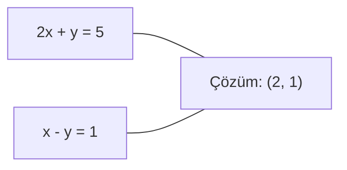

> **Orijinal İçerik:** [docs/en.md](https://github.com/rohitg00/ai-engineering-from-scratch/blob/main/phases/01-math-foundations/17-linear-systems/docs/en.md)

# Doğrusal Sistemler

> Ax = b'yi çözmek, hala sinir ağınızı çalıştıran en eski matematik sorunudur.

**Tür:** Uygulama
**Diller:** Python
**Ön Koşullar:** Faz 1, Ders 01 (Doğrusal Cebir Sezgisi), 02 (Vektörler ve Matrisler), 03 (Matris Dönüşümleri)
**Süre:** ~120 dakika

## Öğrenme Hedefleri

- Kısmi pivotlu Gaussian eliminasyonu ve geri yerine koyma ile Ax = b'yi çözün
- LU, QR ve Cholesky ayrıştırmalarıyla matrisleri ayrıştırın ve her birinin ne zaman uygun olduğunu açıklayın
- En küçük kareler için normal denklemleri türetin ve bunları doğrusal ve ridge regresyonuyla bağlayın
- Durum sayısı kullanarak hastalıklı sistemleri teşhis edin ve kararlılaştırmak için düzenleme uygulayın

## Sorun

Her doğrusal regresyon eğittiğinizde bir doğrusal sistem çözüyorsunuz. Her en küçük kareler uydurması hesapladığınızda bir doğrusal sistem çözüyorsunuz. Her sinir ağı katmanı `y = Wx + b` hesapladığında bir doğrusal sistemin bir tarafını değerlendiriyorsunuz. Düzenleme eklediğinizde sistemi değiştiriyorsunuz. Gauss süreçleri kullandığınızda bir matrisi ayrıştırıyorsunuz. Mahalanobis mesafesi için kovaryans matrisini tersine çevirdiğinizde bir doğrusal sistem çözüyorsunuz.

Ax = b denklemi her yerde görünür. A, bilinen katsayıların matrisidir. b, bilinen çıktıların vektörüdür. x, bulmak istediğiniz bilinmeyenlerin vektörüdür. Doğrusal regresyon'da A veri matrisiniz, b hedef vektörünüz ve x ağırlık vektörüdür. Tüm model şuna indirgenir: Ax'in b'ye mümkün olduğunca yakın olduğu x'i bulun.

## Kavram

### Ax = b geometrik olarak ne anlama gelir

Doğrusal denklem sistemi几何 bir yorumu vardır. Her denklem bir hiperdüzlem tanımlar. Çözüm, tüm hiperdüzlemlerin kesiştiği noktadır.

```
2x + y = 5          2B'de iki çizgi.
x - y  = 1          x=2, y=1'de kesişirler.
```



### Gaussian Eliminasyonu

Sistemi üst üçgensel forma dönüştürüp geri yerine koyma ile çözer.

```python
import numpy as np

def gaussian_eliminasyon(A, b):
    n = len(b)
    # İleri eleme
    for i in range(n):
        for j in range(i+1, n):
            oran = A[j][i] / A[i][i]
            for k in range(i, n):
                A[j][k] -= oran * A[i][k]
            b[j] -= oran * b[i]
    
    # Geri yerine koyma
    x = np.zeros(n)
    for i in range(n-1, -1, -1):
        x[i] = (b[i] - np.dot(A[i][i+1:], x[i+1:])) / A[i][i]
    return x
```

#### Açıklama
Bu, doğrusal sistemleri çözmek için temel algoritmadır. O(n³) karmaşıklığa sahiptir.

### LU Ayrıştırması

Matrisi alt üçgensel (L) ve üst üçgensel (U) matrislerin çarpımı olarak böler.

```
A = L × U
```

### QR Ayrıştırması

Matrisi ortogonal (Q) ve üst üçgensel (R) matrisler olarak böler. En küçük kareler için kullanılır.

### Koşul Sayısı

Sistemin ne kadar hassas olduğunu ölçer. Yüksek koşul sayısı = hassas sistem.

```
koşul(A) = ||A|| × ||A⁻¹||
```

#### Açıklama
Koşul sayısı 1'e yakınsa sistem kararlıdır. Büyükse, küçük girdi değişiklikleri büyük çıktı değişikliklerine yol açar.

## Alıştırmalar

1. 3x3 bir Gaussian eliminasyonu uygulayın
2. LU ayrıştırması ile bir sistemi çözün
3. Koşul sayısını hesaplayın ve sistemin hassasiyetini yorumlayın

## Temel Terimler

| Terim | İnsanların söylediği | Gerçekte ne anlama geldiği |
|-------|---------------------|--------------------------|
| Gaussian eliminasyonu | "Sistemi çözme" | Üst üçgensel forma dönüştürerek sistemi çözme |
| LU ayrıştırması | "Matris bölme" | Matrisi alt ve üst üçgensel parçalara bölme |
| QR ayrıştırması | "Ortoğonal bölme" | Matrisi ortogonal ve üst üçgensel parçalara bölme |
| Koşul sayısı | "Hassasiyet" | Sistemin girdi değişikliklerine ne kadar duyarlı olduğunu ölçen sayı |
| Düzenleme | "Kararlılaştırma" | Hastalıklı sistemleri kararlı hale getirme tekniği |
| Normal denklemler | "En küçük kareler" | En küçük kareler çözümünü veren denklem sistemi |
