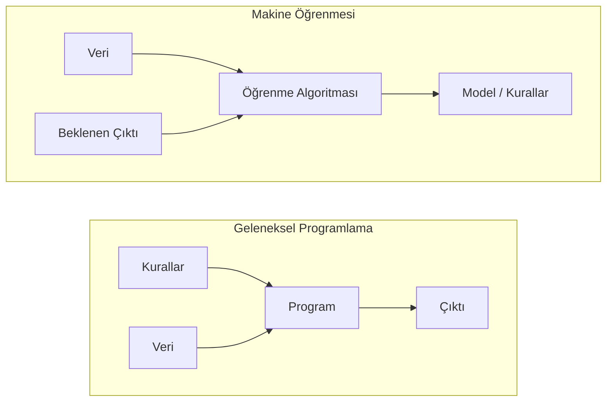
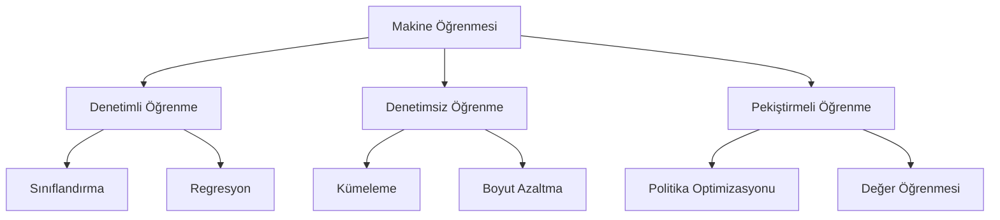
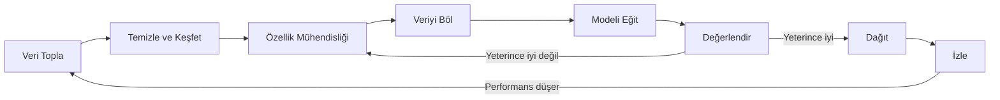

> **Orijinal İçerik:** [docs/en.md](https://github.com/rohitg00/ai-engineering-from-scratch/blob/main/phases/02-ml-fundamentals/01-what-is-machine-learning/docs/en.md)

# Makine Öğrenmesi Nedir

> Makine öğrenmesi, bilgisayarlara kural yazmak yerine verideki örüntüleri bulmayı öğretmektir.

**Tür:** Öğrenme
**Diller:** Python
**Ön Koşullar:** Faz 1 (Matematik Temelleri)
**Süre:** ~45 dakika

## Öğrenme Hedefleri

- Denetimli, denetimsiz ve pekiştirmeli öğrenme arasındaki farkı açıklayın ve verilen bir soruna hangi türün uygulanacağını belirleyin
- Sıfırdan bir en yakın merkez sınıflandırıcısı uygulayın ve rastgele bir başlangıç çizgisine karşı değerlendirin
- Sınıflandırma ve regresyon görevleri arasındaki farkı ayırt edin ve her biri için uygun kayıp fonksiyonunu seçin
- Verilen bir iş sorununun makine öğrenmesi için uygun mu yoksa belirleyici kurallarla mı daha iyi çözüleceğini değerlendirin

## Sorun

Bir spam filtresi oluşturmak istiyorsunuz. Geleneksel yaklaşım: oturup yüzlerce kural yazmak. "E-posta 'ÜCRETSİZ PARA' içeriyorsa, spam olarak işaretle. 3'ten fazla ünlem işareti varsa, spam olarak işaretle." Haftalarca kural yazıyorsunuz. Sonra spamcılar kelime seçimlerini değiştiriyor. Kurallarınız bozuluyor. Daha fazla kural yazıyorsunuz. Döngü bitmiyor.

Makine öğrenmesi bunu tersine çevirir. Kurallar yazmak yerine, bilgisayara binlerce etiketli e-posta ("spam" veya "spam değil") verirsiniz ve kuralları kendi başına bulmasını sağlarsınız. Bilgisayar, sizin hiç aklınıza gelmeyecek örüntüleri keşfeder. Spamcılar taktiklerini değiştirdiğinde, kodu yeniden yazmak yerine yeni verilerle yeniden eğitirsiniz.

"Kural programlamadan" "veriden öğrenmeye" geçiş, makine öğrenmesinin özüdür. Her öneri motoru, ses asistanı, otonom araba ve dil modeli böyle çalışır.

## Kavram

### Kurallardan Değil, Veriden Öğrenme

Geleneksel programlama ve makine öğrenmesi sorunları zıt yönlerde çözer.

Geleneksel programlama: siz kuralları yazarsınız. Program bunları veriye uygular ve çıktı üretir.

Makine öğrenmesi: veri ve beklenen çıktıları sağlarsınız. Algoritma kuralları keşfeder.

Eğitimden çıkan "model", rakamlar olarak kodlanmış kurallardır (ağırlıklar, parametreler). Görünten örneklere genelleme yaparak, hiç görmediği veriler üzerinde tahminler yapar.

### Makine Öğrenmesinin Üç Türü

**Denetimli Öğrenme**: Girdi-çıktı çiftleriniz vardır. Model, girdileri çıktı eşlemeyi öğrenir.
- "İşte kedi veya köpek olarak etiketlenmiş 10.000 fotoğraf. Ayırt etmeyi öğren."
- "İşte ev özellikleri ve fiyatları. Fiyatı tahmin etmeyi öğren."

**Denetimsiz Öğrenme**: Sadece girdileriniz vardır. Etiket yok. Model kendi başına yapı bulur.
- "İşte 10.000 müşteri satın alma geçmişi. Doğal grupları bul."
- "İşte 1.000 boyutlu veri noktaları. Yapıyı koruyarak 2 boyuta düşür."

**Pekiştirmeli Öğrenme**: Bir ajan bir ortamda eylemler yapar ve ödüller veya cezalar alır. Toplam ödülleri en büyük yapan bir strateji (politika) öğrenir.
- "Bu oyunu oyna. Kazanırsan +1, kaybedersen -1. Bir strateji bul."
- "Bu robot kolunu kontrol et. Nesneyi kaldırırsan +1, her saniye için -0.01."

Pratikte oluşturacağınız şeylerin çoğu denetimli öğrenme kullanır. Denetimsiz öğrenme ön işleme ve keşif için yaygındır. Pekiştirmeli öğrenme oyun yapay zekasını, robotiği ve dil modelleri için RLHF'yi güçlendirir.

### Büyük Üçünün Ötesinde

Yukarıdaki üç kategori temizdir, ama gerçek dünya ML'si çizgileri genellikle bulanlaştırır.

**Yarı denetimli öğrenme**, küçük bir etiketli veri kümesi ve büyük bir etiketsiz veri kümesi kullanır. 100 etiketli tıbbi görüntü ve 100.000 etiketsiz görüntünüz olabilir.

**Öz-denetimli öğrenme**, denetimi doğrudan veriden oluşturur. Hiç insan etiketine gerek yoktur. Model, verinin yapısından kendi tahmin görevini oluşturur.

### Sınıflandırma vs Regresyon

Bunlar iki temel denetimli öğrenme görevidir.

| Yön | Sınıflandırma | Regresyon |
|-----|---------------|-----------|
| Çıktı | Ayrık kategoriler | Sürekli sayılar |
| Örnek | "Bu e-posta spam mi?" | "Ev fiyatı ne olacak?" |
| Çıktı uzayı | {kedi, köpek, kuş} | Herhangi bir reel sayı |
| Kayıp fonksiyonu | Çapraz entropi, doğruluk | Ortalama kare hata, MAE |
| Karar | Sınıflar arası sınırlar | Veriye uyan bir eğri |

Sınıflandırma "hangi kategori?" sorusunu yanıtlar. Regresyon "ne kadar?" sorusunu yanıtlar.

### ML İş Akışı

Her makine öğrenmesi projesi, algoritmadan bağımsız olarak aynı hattı takip eder.

**Veri Topla**: Ham veri toplama. Daha fazla veri neredeyse her zaman daha iyidir, ama kalite miktar kadar önemlidir.

**Temizle ve Keşfet**: Eksik değerleri ele alın, tekrarları kaldırın, dağılımları görselleştirin, anormallikleri fark edin. Bu adım genellikle toplam proje süresinin %60-80'ini alır.

**Özellik Mühendisliği**: Ham veriyi modelin kullanabileceği özelliklere dönüştürün. Tarihleri haftanın gününe çevirin. Sayısal sütunları normalleştirin. Kategorik değişkenleri kodlayın.

**Veriyi Böl**: Eğitim, doğrulama ve test setlerine bölün. Model eğitim verisiyle eğitilir, hiperparametreler doğrulama verisiyle ayarlanır, nihai performans test verisiyle raporlanır.

**Modeli Eğit**: Eğitim verisini bir algoritmaya besleyin. Algoritma, kayıp fonksiyonunu asgari yapmak için dahili parametreleri ayarlar.

**Değerlendir**: Doğrulama/test verisi üzerinde performansı ölçün. Performans kabul edilebilir değilse, geri dönün ve farklı özellikler, algoritmalar veya hiperparametreler deneyin.

**Dağıt**: Modeli üretime koyun, yeni veriler üzerinde tahminler yapsın.

**İzle**: Zaman içinde performansı takip edin. Veri dağılımları değişir (veri kayması) ve modeller düşüş gösterir. Performans düştüğünde, yeniden eğitin.

### Eğitim, Doğrulama ve Test Bölümleri

Bu, acemilerin en yanlış anladığı kavramdır. Modelinizi, eğitim sırasında hiç görmediği verilerde değerlendirmelisiniz. Aksi takdirde ezberlemeyi değil, öğrenmeyi ölçersiniz.

| Bölüm | Amaç | Ne zaman kullanılır | Tipik boyut |
|-------|------|---------------------|-------------|
| Eğitim | Model bu veriden öğrenir | Eğitim sırasında | %60-80 |
| Doğrulama | Hiperparametreleri ayarla, modelleri karşılaştır | Her eğitim çalıştırmasından sonra | %10-20 |
| Test | Nihai tarafsız performans tahmini | Bir kez, en sonda | %10-20 |

Test seti kutsaldır. Ona tam olarak bir kez bakarsınız. Test performansına dayanarak modelinizi sürekli ayarlarsanız, aslında test seti üzerinde eğitim yapıyorsunuzdur ve raporladığınız sayılar anlamsızdır.

### Aşırı Uyum vs Yetersiz Uyum

**Yetersiz Uyum**: Model, verideki desenleri yakalamak için çok basit. Eğri bir ilişkiye uymaya çalışan düz bir çizgi. Eğitim hatası yüksek. Test hatası yüksek.

**Aşırı Uyum**: Model çok karmaşıktır ve eğitim verisini, gürültüsü dahil ezberler. Her eğitim noktasından geçen, ama yeni verilerde başarısız olan dalgalı bir eğri. Eğitim hatası düşük. Test hatası yüksek.

**İyi uyum**: Model gürültüyü ezberlemeden gerçek desenleri yakalar. Eğitim hatası ve test hatası her ikisi de makul ölçüde düşüktür.

Aşırı uyumun belirtileri:
- Eğitim doğruluğu doğrulama doğruluğundan çok daha yüksek
- Model eğitim verisinde iyi, yeni verilerde kötü performans gösteriyor
- Daha fazla eğitim verisi eklemek performansı artırıyor

Aşırı uyum düzeltmeleri:
- Daha fazla eğitim verisi elde edin
- Model karmaşıklığını azaltın (daha az parametre, daha basit mimari)
- Düzenleme (büyük ağırlıklara ceza ekleme)
- Bırakma (eğitim sırasında rastgele nöronları devre dışı bırakma)
- Erken durdurma (doğrulama hatası artmaya başladığında eğitimi durdurma)

Yetersiz uyum düzeltmeleri:
- Daha karmaşık bir model kullanın
- Daha fazla özellik ekleyin
- Düzenlemeyi azaltın
- Daha uzun eğitim
