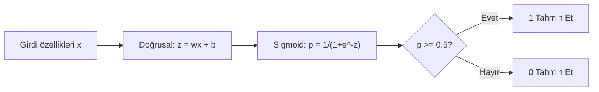

> **Orijinal İçerik:** [docs/en.md](https://github.com/rohitg00/ai-engineering-from-scratch/blob/main/phases/02-ml-fundamentals/03-logistic-regression/docs/en.md)

# Lojistik Regresyon

> Lojistik regresyon, düz bir çizgiyi S-eğrisine bükerek evet-hayır sorularını olasılıklarla yanıtlar.

**Tür:** Uygulama
**Diller:** Python
**Ön Koşullar:** Faz 2 Ders 1-2 (ML Nedir, Doğrusal Regresyon)
**Süre:** ~90 dakika

## Öğrenme Hedefleri

- Sigmoid fonksiyonu ve ikili çapraz entropi kaybı kullanarak sıfırdan lojistik regresyon uygulayın
- İkili sınıflandırma için kesinlik, duyarlılık, F1 puanı ve karışıklık matrisini hesaplayın ve yorumlayın
- MSE'in sınıflandırma için neden başarısız olduğunu ve ikili çapraz entropinin neden konveks bir maliyet yüzeyi ürettiğini açıklayın
- Çoklu sınıflandırma için softmax regresyon modeli oluşturun ve eşik ayarlama takaslarını değerlendirin

## Sorun

Bir tümörün boyutuna bağlı olarak kötü huylu mu iyi huylu mu olduğunu tahmin etmek istiyorsunuz. Doğrusal regresyonu deniyorsunuz. 0.3 veya 1.7 veya -0.5 gibi sayılar üretiyor. Bunlar ne anlama geliyor? 1.7 "çok kötü huylu" mu demek? -0.5 "çok iyi huylu" mu? Doğrusal regresyon sınırsız sayılar üretir. Sınıflandırma, 0 ile 1 arasında sınırlı olasılıklar ve net bir karar ister: evet veya hayır.

Lojistik regresyon bunu çözer. Aynı doğrusal kombinasyonu (wx + b) alır ve sigmoid fonksiyonundan geçirir, herhangi bir sayıyı (0, 1) aralığına sıkıştırır. Çıktı bir olasılıktır. Bir eşik belirlersiniz (genellikle 0.5) ve karar verirsiniz.

Bu, pratikte en yaygın kullanılan algoritmalardan biridir. Adına rağmen, lojistik regresyon bir sınıflandırma algoritmasıdır, regresyon algoritması değil. Ad, kullandığı lojistik (sigmoid) fonksiyonundan gelir.

## Kavram

### Neden Doğrusal Regresyon Sınıflandırma İçin Başarısız

Çalışma saatlerine dayanarak geçme/kalma (1/0) tahmini yaptığınızı hayal edin. Doğrusal regresyon veriye bir çizgi uydurur:

```
saatler:  1   2   3   4   5   6   7   8   9   10
gerçek:   0   0   0   0   1   1   1   1   1   1
```

Doğrusal uyum, 1. saatte -0.2 ve 10. saatte 1.3 gibi tahminler üretebilir. Bu değerler olasılık değildir. 0'ın altına ve 1'in üstüne gider. Daha da kötüsü, tek bir aykırı değer (50 saat çalışan biri) tüm çizgiyi çeker, herkesin tahminini değiştirir.

Sınıflandırma şu özelliklere sahip bir fonksiyon ister:
- 0 ile 1 arasında çıktı verir (olasılıklar)
- Keskin bir geçiş oluşturur (karar sınırı)
- Sınırın çok uzağındaki aykırı değerlerden bozulmaz

### Sigmoid Fonksiyonu

Sigmoid fonksiyonu tam olarak bunu yapar:

```
sigmoid(z) = 1 / (1 + e^(-z))
```

Özellikler:
- z büyük ve pozitif olduğunda, sigmoid(z) 1'e yaklaşır
- z büyük ve negatif olduğunda, sigmoid(z) 0'a yaklaşır
- z = 0 olduğunda, sigmoid(z) = 0.5
- Çıktı her zaman 0 ile 1 arasındadır
- Fonksiyon pürüzsüzdür ve her yerde türevi alınabilir

Türevin kullanışlı bir biçimi vardır: sigmoid'(z) = sigmoid(z) × (1 - sigmoid(z)). Bu, gradyan hesaplamasını verimli yapar.

### Lojistik Regresyon = Doğrusal Model + Sigmoid

Model z = wx + b hesaplar (doğrusal regresyonla aynı), sonra sigmoid uygular:



Çıktı p, P(y=1 | x) olarak yorumlanır, yani girdinin 1. sınıfa ait olma olasılığıdır. Karar sınırı wx + b = 0 olan yerdir, bu da sigmoid çıktısını tam olarak 0.5 yapar.

### İkili Çapraz Entropi Kaybı

Lojistik regresyon için MSE kullanamazsınız. Sigmoid ile MSE, birçok yerel minimum içeren konveks olmayan bir maliyet yüzeyi oluşturur. Bunun yerine ikili çapraz entropi (kayıp) kullanın:

```
Kayıp = -(1/n) * Σ(y × log(p) + (1-y) × log(1-p))
```

Bu, konveks bir yüzey oluşturur ve gradyan inişi her zaman global minimumu bulur.

## Alıştırmalar

1. Sıfırdan lojistik regresyon uygulayın
2. Karışıklık matrisini hesaplayın ve yorumlayın
3. Farklı eşik değerleriyle kesinlik-duyarlılık takasını görselleştirin

## Temel Terimler

| Terim | İnsanların söylediği | Gerçekte ne anlama geldiği |
|-------|---------------------|--------------------------|
| Lojistik regresyon | "Evet/hayır tahmini" | Olasılık çıktı sınıflandırma modeli |
| Sigmoid | "S-eğrisi" | Sayıları 0-1 arasına sıkıştıran fonksiyon |
| Çapraz entropi | "Sınıflandırma hatası" | Tahmin ile gerçek arasındaki farkın ölçüsü |
| Karışıklık matrisi | "Hata tablosu" | Sınıflandırma performansının detaylı dökümü |
| Kesinlik | "Doğruluk oranı" | Pozitif tahminlerin ne kadarının doğru olduğu |
| Duyarlılık | "Yakalama oranı" | Gerçek pozitiflerin ne kadarının yakalandığı |
