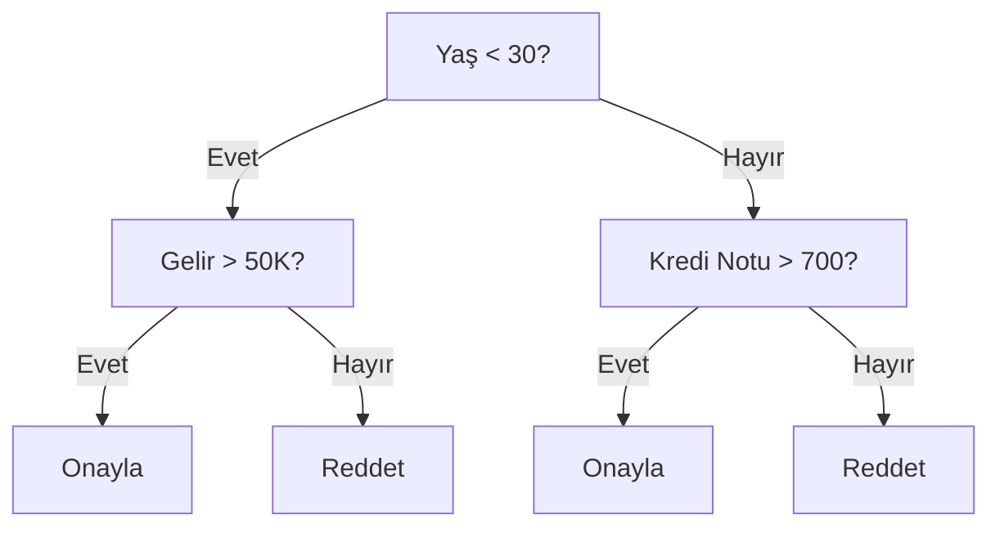

> **Orijinal İçerik:** [docs/en.md](https://github.com/rohitg00/ai-engineering-from-scratch/blob/main/phases/02-ml-fundamentals/04-decision-trees/docs/en.md)

# Karar Ağaçları ve Rastgele Ormanlar

> Bir karar ağacı sadece bir iş akışı diyagramıdır. Ama bir orman, ML'deki en güçlü araçlardan biridir.

**Tür:** Uygulama
**Diller:** Python
**Ön Koşullar:** Faz 1 (Ders 09 Bilgi Teorisi, 06 Olasılık)
**Süre:** ~90 dakika

## Öğrenme Hedefleri

- En iyi karar ağacı bölümlerini bulmak için Gini saflığını, entropiyi ve bilgi kazancı hesaplamalarını uygulayın
- Önceden budama denetimleri (maks derinlik, minimum örnek) ile sıfırdan bir karar ağacı sınıflandırıcısı oluşturun
- Bootstrap örnekleme ve özellik rastgeleliği kullanarak bir rastgele orman oluşturun ve neden varyansı azalttığını açıklayın
- MDI özellik önemini permütasyon önemıyla karşılaştırın ve MDI'nin ne zaman taraflı olduğunu belirleyin

## Sorun

Tablo veriniz var. Satırlar örneklerdir, sütunlar özelliklerdir ve tahmin etmek istediğiniz bir hedef sütun vardır. Bir sinir ağı atabilirsiniz. Ama tablo verileri için ağaç tabanlı modeller (karar ağaçları, rastgele ormanlar, gradyan artırılmış ağaçlar) derin öğrenmeyi tutarlı olarak geçer. Yapılandırılmış verilerdeki Kaggle yarışmaları XGBoost ve LightGBM tarafından domine edilir, transformerlar tarafından değil.

Neden? Ağaçlar, ön işleme olmadan karışık özellik türlerini (sayısal ve kategorik) ele alır. Özellik mühendisliği olmadan doğrusal olmayan ilişkileri ele alır. Yorumlanabilirler: ağaca bakıp bir tahminin neden yapıldığını tam olarak görebilirsiniz. Ve orta boy veri setlerinde aşırı uyuma karşı son derece dayanıklı olan rastgele ormanlar, birçok ağacın ortalamasını alır.

Bu ders, karar ağaçlarını özyinelemeli bölme kullanarak sıfırdan oluşturur, sonra üzerine bir rastgele orman inşa eder. Bölme kriterlerinin (Gini saflığı, entropi, bilgi kazancı) arkasındaki matematiği uygulayacaksınız ve zayıf öğreniciler topluluğunun neden güçlü bir aprenden dönüştüğünü anlayacaksınız.

## Kavram

### Karar ağacı ne yapar

Bir karar ağacı, evet/hayır soruları dizisi sorarak özellik uzayını dikdörtgen bölgelere böler.



Her dahili düğüm bir özelliği bir eşikle test eder. Her yaprak düğüm bir tahmin yapar. Yeni bir veri noktasını sınıflandırmak için kökten başlarsınız ve dalları takip ederek yaprağa ulaşırsınız.

Ağaç, her düğümde veriyi en iyi ayıran özelliği ve eşiği seçerek yukarıdan aşağıya doğru inşa edilir. "En iyi", bir bölme kriteriyle tanımlanır.

### Bölme kriterleri: saflığı ölçme

Her düğümde, bir örnek kümemiz var. Onları, elde edilen alt düğümlerin mümkün olduğunca "safin" olacak şekilde bölmek istiyoruz, yani her alt düğüm çoğunlukla tek bir sınıf içersin.

**Gini saflığı**, rastgele seçilen bir örneğin o düğümdeki sınıf dağılımına göre etiketlenseydi yanlış sınıflandırılma olasılığını ölçer.

```
Gini(S) = 1 - Σ(p_k²)

burada p_k, S kümesindeki k. sınıfın oranıdır.
```

Saf bir düğüm (hepsi tek sınıf) için Gini = 0. 50/50 ikili bölme için Gini = 0.5. Düşük olan daha iyidir.

**Entropi**, bir düğümdeki bilgi içeriğini (düzensizliği) ölçer. Faz 1 Ders 09'da ele alınmıştır.

```
Entropi(S) = -Σ(p_k × log2(p_k))
```

Saf bir düğüm için entropi = 0. 50/50 ikili bölme için entropi = 1.0. Düşük olan daha iyidir.

**Bilgi kazancı**, bir bölmenin saflığı ne kadar artırdığını ölçer.

```
Kazanç = Ebeveyn entropisi - Ağırlıklı çocuk entropisi
```

En yüksek bilgi kazancına sahip bölme seçilir.

## Alıştırmalar

1. Sıfırdan bir karar ağacı sınıflandırıcısı oluşturun
2. Gini ve entropi kullanarak bölme sonuçlarını karşılaştırın
3. Bir rastgele orman oluşturun ve tek bir ağaçla karşılaştırın

## Temel Terimler

| Terim | İnsanların söylediği | Gerçekte ne anlama geldiği |
|-------|---------------------|--------------------------|
| Karar ağacı | "Evet/hayır soruları dizisi" | Özellik uzayını dikdörtgen bölgelere bölen model |
| Gini saflığı | "Karışıklık ölçüsü" | Bir düğümdeki sınıflandırma hataları olasılığı |
| Entropi | "Düzensizlik" | Bir düğümdeki bilgi içeriği |
| Bilgi kazancı | "Saflık artışı" | Bir bölmenin sağladığı bilgi miktarı |
| Rastgele orman | "Ağaç topluluğu" | Birçok karar ağacının ortalaması |
| Budama | "Basitleştirme" | Ağaç karmaşıklığını azaltma tekniği |
