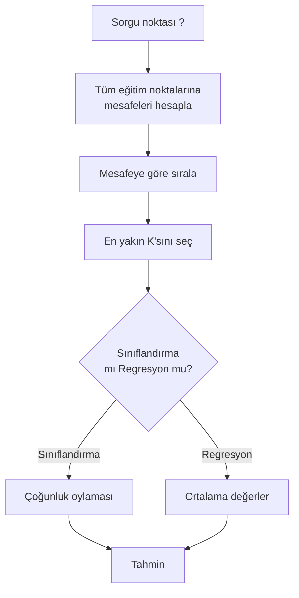

> **Orijinal İçerik:** [docs/en.md](https://github.com/rohitg00/ai-engineering-from-scratch/blob/main/phases/02-ml-fundamentals/06-knn-and-distances/docs/en.md)

# K-En Yakın Komşu ve Mesafeler

> Her şeyi depolayın. Komşularınıza bakarak tahmin edin. Çalışan en basit algoritma.

**Tür:** Uygulama
**Diller:** Python
**Ön Koşullar:** Faz 1 (Ders 14 Normlar ve Mesafeler)
**Süre:** ~90 dakika

## Öğrenme Hedefleri

- Sıfırdan KNN sınıflandırması ve regresyonu uygulayın (yapılandırılabilir K ve mesafe ağırlıklı oylama ile)
- L1, L2, kosinüs ve Minkowski mesafe metriklerini karşılaştırın ve verilen bir veri türü için uygun olanı seçin
- Boyutun lanetini açıklayın ve KNN'in yüksek boyutlu uzaylarda neden kötüleştiğini gösterin
- Verimli en yakın komşu araması için bir KD-ağaç oluşturun ve kaba kuvveti ne zaman geçtiğini analiz edin

## Sorun

Bir veri setiniz var. Yeni bir veri noktası geliyor. Onu sınıflandırmanız veya değerini tahmin etmeniz gerekiyor. Veriden parametre öğrenmek yerine (doğrusal regresyon veya SVM'ler gibi), yeni noktaya en yakın K eğitim noktasını bulup onlara oylatıyorsunuz.

Bu K-en yakın komştur. Eğitim aşaması yok. Öğrenecek parametre yok. Asgari yapılacak kayıp fonksiyonu yok. Tüm eğitim setini depolar ve tahmin zamanında mesafeleri hesaplarsınız.

Çok basit görünüyor. Ama KNN birçok sorun için şaşırtıcı kadar rekabetçidir, özellikle küçük ve orta boy veri setlerinde.

## Kavram

### KNN nasıl çalışır

Verimli etiketli noktalar ve yeni bir sorgu noktası verildiğinde:

1. Sorgunun veri setindeki her noktaya olan mesafesini hesaplayın
2. Mesafeye göre sıralayın
3. En yakın K noktayı alın
4. Sınıflandırma için: K komşu arasında çoğunluk oylaması
5. Regresyon için: K komşunun değerlerinin ortalaması

Bu tüm algoritmadır. Uyum yok. Gradyan inişi yok. Epok yok.

### K seçimi

K, tek hiperparametredir. Önyargı-varyans takasını kontrol eder:

| K | Davranış |
|---|----------|
| K = 1 | Karar sınırı her noktayı takip eder. Sıfır eğitim hatası. Yüksek varyans. Aşırı uyum |
| Küçük K (3-5) | Yerel yapıya duyarlı. Karmaşık sınırları yakalayabilir |
| Büyük K | Daha pürüzsüz sınırlar. Gürültüye karşı daha dayanıklı. Yetersiz uyum yapabilir |
| K = N | Her nokta için çoğunluk sınıfını tahmin eder. Maksimum önyargı |

Ortak bir başlangıç noktası, N noktalı veri seti için K = sqrt(N)'dir.

### Mesafe metrikleri

Mesafe fonksiyonu "yakın"ın ne anlama geldiğini tanımlar.

**L2 (Öklid)** varsayılandır. Doğrudan çizgi mesafesi. Özellik ölçeğine duyarlıdır.

**L1 (Manhattan)** mutlak farkları toplar. Aykırı değerlere karşı L2'den daha dayanıklıdır.

**Kosinüs mesafesi** vektörler arasındaki açıyı ölçer, büyüklüğü yok sayar. Metin ve embedding verileri için gereklidir.

## Alıştırmalar

1. Sıfırdan KNN uygulayın
2. Farklı K değerleriyle sonuçları görselleştirin
3. Farklı mesafe metriklerini karşılaştırın

## Temel Terimler

| Terim | İnsanların söylediği | Gerçekte ne anlama geldiği |
|-------|---------------------|--------------------------|
| KNN | "En yakın komşu" | Eğitim zamanında öğrenmeyen, doğrudan tahmin yapan algoritma |
| K | "Komşu sayısı" | Tahmin için kullanılan komşu noktası sayısı |
| Mesafe metriği | "Yakınlık ölçümü" | Noktalar arasındaki benzerlik ölçüsü |
| Boyut laneti | "Yüksek boyut sorunu" | Yüksek boyutlarda mesafe ölçümlerinin bozulması |
| KD-ağaç | "Hızlı arama" | En yakın komşu aramasını hızlandıran veri yapısı |
