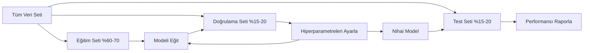

> **Orijinal İçerik:** [docs/en.md](https://github.com/rohitg00/ai-engineering-from-scratch/blob/main/phases/02-ml-fundamentals/09-model-evaluation/docs/en.md)

# Model Değerlendirme

> Bir model, ancak onu ölçme şekliniz kadar iyidir.

**Tür:** Uygulama
**Diller:** Python, Julia
**Ön Koşullar:** Faz 1 (Olasılık ve Dağılımlar, ML için İstatistik), Faz 2 Ders 1-8
**Süre:** ~90 dakika

## Öğrenme Hedefleri

- Sıfırdan K-fold ve stratified K-fold çapraz doğrulama (cross-validation) uygulayın ve dengesiz veride stratifikasyonun neden önemli olduğunu açıklayın
- Precision, recall, F1, AUC-ROC ve regresyon metriklerini (MSE, RMSE, MAE, R-squared) sıfırdan hesaplayın
- Öğrenme eğrilerini (learning curves) yorumlayarak bir modelin yüksek bias (high bias) mı yoksa yüksek varyans (high variance) mı yaşadığını teşhis edin
- Veri sızıntısı (data leakage), yanlış metrik seçimi ve test seti kontaminasyonu dahil olmak üzere yaygın değerlendirme hatalarını belirleyin

## Sorun

Bir model eğittiniz. Verinizde %95 doğruluk alıyor. İyi mi?

Belki. Belki değil. Verinizin %95'i tek bir sınıfa aitse, her zaman o sınıfı tahmin eden bir model %95 doğruluk alırken tamamen işe yaramaz. Eğer aynı veri üzerinde değerlendirdiyseniz, %95 sayısı anlamsızdır çünkü model cevapları ezberlemiştir. Veri setinizde zaman bileşeni varsa ve bölmeden önce rastgele karıştırdıysanız, model geçmişi tahmin etmek için gelecek verisini kullanıyor olabilir.

Model değerlendirme, çoğu ML projesinin yanlış gittiği yerdir. Yanlış metrik, kötü bir modeli iyi gösterir. Yanlış bölünme, modelin hile yapmasına izin verir. Yanlış karşılaştırma, daha kötü modeli seçmenize neden olur. Değerlendirmeyi doğru yapmak seçimlik değildir. Prodüksiyonda çalışan bir modelle, gerçek veriyi gördüğü anda başarısız olan bir model arasındaki farktır.

## Kavram

### Eğitim, Doğrulama, Test



Üç bölünme, üç amaç:

- **Eğitim seti**: model bu veriden öğrenir. Eğitim sırasında bu örnekleri görür.
- **Doğrulama seti**: hiperparametreleri ayarlamak ve modeller arasında seçim yapmak için kullanılır. Model bu veride asla eğitilmez, ancak kararlarınız ondan etkilenir.
- **Test seti**: en sonda, nihai performansı raporlamak için tam olarak bir kez dokunulur. Test performansına bakıp modeli değiştirmeye giderseniz, artık bir test seti değildir. İkinci bir doğrulama seti haline gelmiştir.

Test seti, raporlanan performansın modelin gerçekten görülmemiş veride nasıl çalışacağını yansıttığının garantisidir.

### K-Fold Çapraz Doğrulama

Küçük veri setlerinde, tek bir eğitim/doğrulama bölünmesi veri israf eder ve gürültülü tahminler verir. K-fold çapraz doğrulama, tüm veriyi hem eğitim hem de doğrulama için kullanır:

```mermaid
flowchart TB
    subgraph Fold1["Kat 1"]
        direction LR
        V1["Doğ"] --- T1a["Eğt"] --- T1b["Eğt"] --- T1c["Eğt"] --- T1d["Eğt"]
    end
    subgraph Fold2["Kat 2"]
        direction LR
        T2a["Eğt"] --- V2["Doğ"] --- T2b["Eğt"] --- T2c["Eğt"] --- T2d["Eğt"]
    end
    subgraph Fold3["Kat 3"]
        direction LR
        T3a["Eğt"] --- T3b["Eğt"] --- V3["Doğ"] --- T3c["Eğt"] --- T3d["Eğt"]
    end
    subgraph Fold4["Kat 4"]
        direction LR
        T4a["Eğt"] --- T4b["Eğt"] --- T4c["Eğt"] --- V4["Doğ"] --- T4d["Eğt"]
    end
    subgraph Fold5["Kat 5"]
        direction LR
        T5a["Eğt"] --- T5b["Eğt"] --- T5c["Eğt"] --- T5d["Eğt"] --- V5["Doğ"]
    end
    Fold1 --> R[Ortalama Skorlar]
    Fold2 --> R
    Fold3 --> R
    Fold4 --> R
    Fold5 --> R
```



1. Veriyi K eşit boyutlu kata bölün
2. Her kat için, K-1 katında eğitin ve kalan katta doğrulayın
3. K doğrulama skorunun ortalamasını alın

K=5 veya K=10 standart seçimlerdir. Her veri noktası tam olarak bir kez doğrulama için kullanılır. Ortalama skor, tek bir bölünmeden daha istikrarlı bir tahmindir.

**Stratified K-fold**: her katta sınıf dağılımını korur. Veri setiniz %70 A sınıfı ve %30 B sınıfıysa, her kat yaklaşık olarak aynı orana sahip olur. Bu, rastgele bir bölünmenin tüm azınlık örneklerini tek bir kata koyabileceği dengesiz veri setleri için önemlidir.


### Sınıflandırma Metrikleri

**Karmaşıklık matrisi (confusion matrix)**: temel. İkili sınıflandırma için:

|  | Pozitif Tahmin | Negatif Tahmin |
|--|---|---|
| Gerçek Pozitif | True Positive (TP) | False Negative (FN) |
| Gerçek Negatif | False Positive (FP) | True Negative (TN) |

Bu matristen diğer tüm metrikler türetilir:

- **Accuracy (doğruluk)** = (TP + TN) / (TP + TN + FP + FN). Doğru tahminlerin oranı. Sınıflar dengesiz olduğunda yanıltıcıdır.
- **Precision (kesinlik)** = TP / (TP + FP). Pozitif tahmin edilenlerin kaçı gerçekten pozitifti? Yanlış pozitiflerin maliyetli olduğu durumlarda kullanın (örn. spam filtresinin gerçek e-postayı spam işaretlemesi).
- **Recall (duyarlılık)** = TP / (TP + FN). Tüm gerçek pozitiflerin kaçını yakaladık? Yanlış negatiflerin maliyetli olduğu durumlarda kullanın (örn. kanser taramasının tümörü kaçırması).
- **F1 skoru** = 2 * precision * recall / (precision + recall). Precision ve recall'un harmonik ortalaması. İkisinin de açıkça baskın olmadığı durumlarda dengeler.
- **AUC-ROC**: Receiver Operating Characteristic eğrisi altındaki alan. Çeşitli sınıflandırma eşiklerinde true positive rate vs false positive rate grafiğidir. AUC = 0.5 rastgele tahmin, AUC = 1.0 mükemmel ayrım demektir. Eşikten bağımsızdır: hangi kesme noktasını seçerseniz seçin, modelin pozitifleri negatiflerin üzerinde ne kadar iyi sıraladığını ölçer.

### Regresyon Metrikleri

- **MSE** (Ortalama Kare Hata) = ortalama((y_gerçek - y_tahmin)^2). Büyük hataları ikinci dereceden cezalandırır. Aykırı değerlere duyarlıdır.
- **RMSE** (Karekok Ortalama Kare Hata) = sqrt(MSE). Hedef değişkenle aynı birimdedir. MSE'den daha yorumlanabilirdir.
- **MAE** (Ortalama Mutlak Hata) = ortalama(|y_gerçek - y_tahmin|). Tüm hataları doğrusal işlemle muamele eder. MSE'den aykırı değerlere karşı daha sağlamdır.
- **R-squared** = 1 - SS_kal / SS_top, SS_kal = toplam((y_gerçek - y_tahmin)^2) ve SS_top = toplam((y_gerçek - y_ortalama)^2). Model tarafından açıklanan varyansın oranı. R² = 1.0 mükemmel, R² = 0.0 model her zaman ortalamayı tahmin etmekten iyi değil demektir. R², model ortalamadan kötüyse negatif olabilir.

### Öğrenme Eğrileri

Eğitim ve doğrulama skorlarını eğitim seti boyutunun bir fonksiyonu olarak çizin:

- **Yüksek bias (yetersiz öğrenme)**: her iki eğri de düşük bir skora yakınsar. Daha fazla veri eklemek yardımcı olmaz. Daha karmaşık bir modele ihtiyacınız vardır.
- **Yüksek varyans (aşırı öğrenme)**: eğitim skoru yüksektir ancak doğrulama skoru çok daha düşüktür. Aralarındaki fark büyüktür. Daha fazla veri eklemek yardımcı olmalıdır.

### Doğrulama Eğrileri

Eğitim ve doğrulama skorlarını bir hiperparametrenin fonksiyonu olarak çizin:

- Düşük karmaşıklıkta: her iki skor da düşüktür (yetersiz öğrenme)
- Doğru karmaşıklıkta: her iki skor da yüksektir ve birbirine yakındır
- Yüksek karmaşıklıkta: eğitim skoru yüksek kalır ancak doğrulama skoru düşer (aşırı öğrenme)

Optimal hiperparametre değeri, doğrulama skorunun zirve yaptığı yerdir.

### Yaygın Değerlendirme Hataları

**Veri sızıntısı (data leakage)**: test setinden gelen bilgi eğitime sızar. Örnekler: bölmeden önce tüm veri setine scaler uydurmak, zaman serisi tahmininde gelecek verisini dahil etmek, hedeften türetilmiş bir özellik kullanmak. Önce bölün, sonra ön işle.

**Sınıf dengesizliği**: İşlemlerin %99'u meşru, %1'i sahtekarlıktır. Her zaman "meşru" tahmin eden bir model %99 doğruluk alır. Bunun yerine precision, recall, F1 veya AUC-ROC kullanın.

**Yanlış metrik**: recall'u optimize etmeniz gerekirken accuracy'yi (tıbbi tanı) veya verinizde ağır aykırı değerler varken RMSE'yi optimize etmek (bunun yerine MAE kullanın).

**Stratified bölünme kullanmamak**: dengesiz veride, rastgele bir bölünme doğrulama katına çok az azınlık örneği koyabilir ve dengesiz tahminler verebilir.

**Çok sık test etme**: test performansına her baktığınızda ve ayarlama yaptığınızda, test setine aşırı öğrenirsiniz. Test seti tek kullanımlıktır.

## Uygulama

### Adım 1: Eğitim/doğrulama/test bölünmesi

```python
import random
import math


def train_val_test_split(X, y, train_ratio=0.6, val_ratio=0.2, seed=42):
    random.seed(seed)
    n = len(X)
    indices = list(range(n))
    random.shuffle(indices)

    train_end = int(n * train_ratio)
    val_end = int(n * (train_ratio + val_ratio))

    train_idx = indices[:train_end]
    val_idx = indices[train_end:val_end]
    test_idx = indices[val_end:]

    X_train = [X[i] for i in train_idx]
    y_train = [y[i] for i in train_idx]
    X_val = [X[i] for i in val_idx]
    y_val = [y[i] for i in val_idx]
    X_test = [X[i] for i in test_idx]
    y_test = [y[i] for i in test_idx]

    return X_train, y_train, X_val, y_val, X_test, y_test
```

#### Açıklama
Veriyi rastgele karıştırıp train_ratio ve val_ratio oranlarında üç parçaya böler. Eğitim seti modelin öğrenmesi, doğrulama seti hiperparametre ayarı, test seti nihai değerlendirme içindir.

### Adım 2: K-fold ve stratified K-fold çapraz doğrulama

```python
def kfold_split(n, k=5, seed=42):
    random.seed(seed)
    indices = list(range(n))
    random.shuffle(indices)

    fold_size = n // k
    folds = []

    for i in range(k):
        start = i * fold_size
        end = start + fold_size if i < k - 1 else n
        val_idx = indices[start:end]
        train_idx = indices[:start] + indices[end:]
        folds.append((train_idx, val_idx))

    return folds


def stratified_kfold_split(y, k=5, seed=42):
    random.seed(seed)

    class_indices = {}
    for i, label in enumerate(y):
        class_indices.setdefault(label, []).append(i)

    for label in class_indices:
        random.shuffle(class_indices[label])

    folds = [{"train": [], "val": []} for _ in range(k)]

    for label, indices in class_indices.items():
        fold_size = len(indices) // k
        for i in range(k):
            start = i * fold_size
            end = start + fold_size if i < k - 1 else len(indices)
            val_part = indices[start:end]
            train_part = indices[:start] + indices[end:]
            folds[i]["val"].extend(val_part)
            folds[i]["train"].extend(train_part)

    return [(f["train"], f["val"]) for f in folds]


def cross_validate(X, y, model_fn, k=5, metric_fn=None, stratified=False):
    n = len(X)

    if stratified:
        folds = stratified_kfold_split(y, k)
    else:
        folds = kfold_split(n, k)

    scores = []
    for train_idx, val_idx in folds:
        X_train = [X[i] for i in train_idx]
        y_train = [y[i] for i in train_idx]
        X_val = [X[i] for i in val_idx]
        y_val = [y[i] for i in val_idx]

        model = model_fn()
        model.fit(X_train, y_train)
        predictions = [model.predict(x) for x in X_val]

        if metric_fn:
            score = metric_fn(y_val, predictions)
        else:
            score = sum(1 for yt, yp in zip(y_val, predictions) if yt == yp) / len(y_val)
        scores.append(score)

    return scores
```

#### Açıklama
`kfold_split` veriyi K eşit parçaya böler; her parça bir kez doğrulama olur. `stratified_kfold_split` her katta sınıf oranlarını korur. `cross_validate` verilen model fonksiyonunu her kat için eğitip değerlendirir ve K skor döndürür.


### Adım 3: Karmaşıklık matrisi ve sınıflandırma metrikleri

```python
def confusion_matrix(y_true, y_pred):
    tp = sum(1 for yt, yp in zip(y_true, y_pred) if yt == 1 and yp == 1)
    tn = sum(1 for yt, yp in zip(y_true, y_pred) if yt == 0 and yp == 0)
    fp = sum(1 for yt, yp in zip(y_true, y_pred) if yt == 0 and yp == 1)
    fn = sum(1 for yt, yp in zip(y_true, y_pred) if yt == 1 and yp == 0)
    return tp, tn, fp, fn


def accuracy(y_true, y_pred):
    tp, tn, fp, fn = confusion_matrix(y_true, y_pred)
    total = tp + tn + fp + fn
    return (tp + tn) / total if total > 0 else 0.0


def precision(y_true, y_pred):
    tp, tn, fp, fn = confusion_matrix(y_true, y_pred)
    return tp / (tp + fp) if (tp + fp) > 0 else 0.0


def recall(y_true, y_pred):
    tp, tn, fp, fn = confusion_matrix(y_true, y_pred)
    return tp / (tp + fn) if (tp + fn) > 0 else 0.0


def f1_score(y_true, y_pred):
    p = precision(y_true, y_pred)
    r = recall(y_true, y_pred)
    return 2 * p * r / (p + r) if (p + r) > 0 else 0.0


def roc_curve(y_true, y_scores):
    thresholds = sorted(set(y_scores), reverse=True)
    tpr_list = []
    fpr_list = []

    total_positives = sum(y_true)
    total_negatives = len(y_true) - total_positives

    for threshold in thresholds:
        y_pred = [1 if s >= threshold else 0 for s in y_scores]
        tp = sum(1 for yt, yp in zip(y_true, y_pred) if yt == 1 and yp == 1)
        fp = sum(1 for yt, yp in zip(y_true, y_pred) if yt == 0 and yp == 1)

        tpr = tp / total_positives if total_positives > 0 else 0.0
        fpr = fp / total_negatives if total_negatives > 0 else 0.0

        tpr_list.append(tpr)
        fpr_list.append(fpr)

    return fpr_list, tpr_list, thresholds


def auc_roc(y_true, y_scores):
    fpr_list, tpr_list, _ = roc_curve(y_true, y_scores)

    pairs = sorted(zip(fpr_list, tpr_list))
    fpr_sorted = [p[0] for p in pairs]
    tpr_sorted = [p[1] for p in pairs]

    area = 0.0
    for i in range(1, len(fpr_sorted)):
        width = fpr_sorted[i] - fpr_sorted[i - 1]
        height = (tpr_sorted[i] + tpr_sorted[i - 1]) / 2
        area += width * height

    return area
```

#### Açıklama
`confusion_matrix` TP/TN/FP/FN sayılarını hesaplar. `accuracy`, `precision`, `recall`, `f1_score` bu matristen türetilir. `roc_curve` her eşikte TPR ve FPR'yi hesaplar; `auc_roc` yamuk kuralı (trapezoidal rule) ile eğri altındaki alanı sayısal olarak entegre eder.

### Adım 4: Regresyon metrikleri

```python
def mse(y_true, y_pred):
    n = len(y_true)
    return sum((yt - yp) ** 2 for yt, yp in zip(y_true, y_pred)) / n


def rmse(y_true, y_pred):
    return math.sqrt(mse(y_true, y_pred))


def mae(y_true, y_pred):
    n = len(y_true)
    return sum(abs(yt - yp) for yt, yp in zip(y_true, y_pred)) / n


def r_squared(y_true, y_pred):
    mean_y = sum(y_true) / len(y_true)
    ss_res = sum((yt - yp) ** 2 for yt, yp in zip(y_true, y_pred))
    ss_tot = sum((yt - mean_y) ** 2 for yt in y_true)
    if ss_tot == 0:
        return 0.0
    return 1.0 - ss_res / ss_tot
```

#### Açıklama
MSE büyük hataları ikinci dereceden cezalandırır, RMSE onu orijinal birime döndürür. MAE tüm hataları doğrusal işlemle muamele eder (aykırı değerlere daha dayanıklı). R-squared modelin açıkladığı varyans oranını ölçer.

### Adım 5: Öğrenme eğrileri

```python
def learning_curve(X, y, model_fn, metric_fn, train_sizes=None, val_ratio=0.2, seed=42):
    random.seed(seed)
    n = len(X)
    indices = list(range(n))
    random.shuffle(indices)

    val_size = int(n * val_ratio)
    val_idx = indices[:val_size]
    pool_idx = indices[val_size:]

    X_val = [X[i] for i in val_idx]
    y_val = [y[i] for i in val_idx]

    if train_sizes is None:
        train_sizes = [int(len(pool_idx) * r) for r in [0.1, 0.2, 0.4, 0.6, 0.8, 1.0]]

    train_scores = []
    val_scores = []

    for size in train_sizes:
        subset = pool_idx[:size]
        X_train = [X[i] for i in subset]
        y_train = [y[i] for i in subset]

        model = model_fn()
        model.fit(X_train, y_train)

        train_pred = [model.predict(x) for x in X_train]
        val_pred = [model.predict(x) for x in X_val]

        train_scores.append(metric_fn(y_train, train_pred))
        val_scores.append(metric_fn(y_val, val_pred))

    return train_sizes, train_scores, val_scores
```

#### Açıklama
Veriyi artan eğitim seti boyutlarında eğitip hem eğitim hem doğrulama skorlarını döndürür. Skorlar arasındaki fark aşırı öğrenmeyi (overfitting), düşük doğruluk yetersiz öğrenmeyi (underfitting) gösterir.


### Adım 6: Test için basit bir sınıflandırıcı ve tam demo

```python
class SimpleLogistic:
    def __init__(self, lr=0.1, epochs=100):
        self.lr = lr
        self.epochs = epochs
        self.weights = None
        self.bias = 0.0

    def sigmoid(self, z):
        z = max(-500, min(500, z))
        return 1.0 / (1.0 + math.exp(-z))

    def fit(self, X, y):
        n_features = len(X[0])
        self.weights = [0.0] * n_features
        self.bias = 0.0

        for _ in range(self.epochs):
            for xi, yi in zip(X, y):
                z = sum(w * x for w, x in zip(self.weights, xi)) + self.bias
                pred = self.sigmoid(z)
                error = yi - pred
                for j in range(n_features):
                    self.weights[j] += self.lr * error * xi[j]
                self.bias += self.lr * error

    def predict_proba(self, x):
        z = sum(w * xi for w, xi in zip(self.weights, x)) + self.bias
        return self.sigmoid(z)

    def predict(self, x):
        return 1 if self.predict_proba(x) >= 0.5 else 0


class SimpleLinearRegression:
    def __init__(self, lr=0.001, epochs=200):
        self.lr = lr
        self.epochs = epochs
        self.weights = None
        self.bias = 0.0

    def fit(self, X, y):
        n_features = len(X[0])
        self.weights = [0.0] * n_features
        self.bias = 0.0
        n = len(X)

        for _ in range(self.epochs):
            for xi, yi in zip(X, y):
                pred = sum(w * x for w, x in zip(self.weights, xi)) + self.bias
                error = yi - pred
                for j in range(n_features):
                    self.weights[j] += self.lr * error * xi[j] / n
                self.bias += self.lr * error / n

    def predict(self, x):
        return sum(w * xi for w, xi in zip(self.weights, x)) + self.bias


def standardize(values):
    n = len(values)
    mean = sum(values) / n
    var = sum((v - mean) ** 2 for v in values) / n
    std = math.sqrt(var) if var > 0 else 1.0
    return [(v - mean) / std for v in values], mean, std


def make_classification_data(n=300, seed=42):
    random.seed(seed)
    X = []
    y = []
    for _ in range(n):
        x1 = random.gauss(0, 1)
        x2 = random.gauss(0, 1)
        label = 1 if (x1 + x2 + random.gauss(0, 0.5)) > 0 else 0
        X.append([x1, x2])
        y.append(label)
    return X, y


def make_regression_data(n=200, seed=42):
    random.seed(seed)
    X = []
    y = []
    for _ in range(n):
        x1 = random.uniform(0, 10)
        x2 = random.uniform(0, 5)
        target = 3 * x1 + 2 * x2 + random.gauss(0, 2)
        X.append([x1, x2])
        y.append(target)
    return X, y


def make_imbalanced_data(n=300, minority_ratio=0.05, seed=42):
    random.seed(seed)
    X = []
    y = []
    for _ in range(n):
        if random.random() < minority_ratio:
            x1 = random.gauss(3, 0.5)
            x2 = random.gauss(3, 0.5)
            label = 1
        else:
            x1 = random.gauss(0, 1)
            x2 = random.gauss(0, 1)
            label = 0
        X.append([x1, x2])
        y.append(label)
    return X, y


if __name__ == "__main__":
    X_clf, y_clf = make_classification_data(300)

    print("=== Train/Validation/Test Split ===")
    X_train, y_train, X_val, y_val, X_test, y_test = train_val_test_split(X_clf, y_clf)
    print(f"  Train: {len(X_train)}, Val: {len(X_val)}, Test: {len(X_test)}")
    print(f"  Train class distribution: {sum(y_train)}/{len(y_train)} positive")
    print(f"  Val class distribution: {sum(y_val)}/{len(y_val)} positive")

    model = SimpleLogistic(lr=0.1, epochs=200)
    model.fit(X_train, y_train)

    print("\n=== Classification Metrics ===")
    y_pred = [model.predict(x) for x in X_test]
    tp, tn, fp, fn = confusion_matrix(y_test, y_pred)
    print(f"  Confusion matrix: TP={tp}, TN={tn}, FP={fp}, FN={fn}")
    print(f"  Accuracy:  {accuracy(y_test, y_pred):.4f}")
    print(f"  Precision: {precision(y_test, y_pred):.4f}")
    print(f"  Recall:    {recall(y_test, y_pred):.4f}")
    print(f"  F1 Score:  {f1_score(y_test, y_pred):.4f}")

    y_scores = [model.predict_proba(x) for x in X_test]
    auc = auc_roc(y_test, y_scores)
    print(f"  AUC-ROC:   {auc:.4f}")

    print("\n=== K-Fold Cross-Validation (K=5) ===")
    cv_scores = cross_validate(
        X_clf, y_clf,
        model_fn=lambda: SimpleLogistic(lr=0.1, epochs=200),
        k=5,
        metric_fn=accuracy,
    )
    mean_cv = sum(cv_scores) / len(cv_scores)
    std_cv = math.sqrt(sum((s - mean_cv) ** 2 for s in cv_scores) / len(cv_scores))
    print(f"  Fold scores: {[round(s, 4) for s in cv_scores]}")
    print(f"  Mean: {mean_cv:.4f} (+/- {std_cv:.4f})")

    print("\n=== Stratified K-Fold Cross-Validation (K=5) ===")
    strat_scores = cross_validate(
        X_clf, y_clf,
        model_fn=lambda: SimpleLogistic(lr=0.1, epochs=200),
        k=5,
        metric_fn=accuracy,
        stratified=True,
    )
    strat_mean = sum(strat_scores) / len(strat_scores)
    strat_std = math.sqrt(sum((s - strat_mean) ** 2 for s in strat_scores) / len(strat_scores))
    print(f"  Fold scores: {[round(s, 4) for s in strat_scores]}")
    print(f"  Mean: {strat_mean:.4f} (+/- {strat_std:.4f})")

    print("\n=== Imbalanced Data: Why Accuracy Lies ===")
    X_imb, y_imb = make_imbalanced_data(300, minority_ratio=0.05)
    positives = sum(y_imb)
    print(f"  Class distribution: {positives} positive, {len(y_imb) - positives} negative ({positives/len(y_imb)*100:.1f}% positive)")

    always_negative = [0] * len(y_imb)
    print(f"  Always-negative baseline:")
    print(f"    Accuracy:  {accuracy(y_imb, always_negative):.4f}")
    print(f"    Precision: {precision(y_imb, always_negative):.4f}")
    print(f"    Recall:    {recall(y_imb, always_negative):.4f}")
    print(f"    F1 Score:  {f1_score(y_imb, always_negative):.4f}")

    X_tr_i, y_tr_i, X_v_i, y_v_i, X_te_i, y_te_i = train_val_test_split(X_imb, y_imb)
    model_imb = SimpleLogistic(lr=0.5, epochs=500)
    model_imb.fit(X_tr_i, y_tr_i)
    y_pred_imb = [model_imb.predict(x) for x in X_te_i]
    print(f"\n  Trained model on imbalanced data:")
    print(f"    Accuracy:  {accuracy(y_te_i, y_pred_imb):.4f}")
    print(f"    Precision: {precision(y_te_i, y_pred_imb):.4f}")
    print(f"    Recall:    {recall(y_te_i, y_pred_imb):.4f}")
    print(f"    F1 Score:  {f1_score(y_te_i, y_pred_imb):.4f}")

    print("\n=== Regression Metrics ===")
    X_reg, y_reg = make_regression_data(200)

    col0 = [x[0] for x in X_reg]
    col1 = [x[1] for x in X_reg]
    col0_s, m0, s0 = standardize(col0)
    col1_s, m1, s1 = standardize(col1)
    X_reg_scaled = [[col0_s[i], col1_s[i]] for i in range(len(X_reg))]

    X_tr_r, y_tr_r, X_v_r, y_v_r, X_te_r, y_te_r = train_val_test_split(X_reg_scaled, y_reg)
    reg_model = SimpleLinearRegression(lr=0.01, epochs=500)
    reg_model.fit(X_tr_r, y_tr_r)
    y_pred_r = [reg_model.predict(x) for x in X_te_r]

    print(f"  MSE:       {mse(y_te_r, y_pred_r):.4f}")
    print(f"  RMSE:      {rmse(y_te_r, y_pred_r):.4f}")
    print(f"  MAE:       {mae(y_te_r, y_pred_r):.4f}")
    print(f"  R-squared: {r_squared(y_te_r, y_pred_r):.4f}")

    mean_baseline = [sum(y_tr_r) / len(y_tr_r)] * len(y_te_r)
    print(f"\n  Mean baseline:")
    print(f"    MSE:       {mse(y_te_r, mean_baseline):.4f}")
    print(f"    R-squared: {r_squared(y_te_r, mean_baseline):.4f}")

    print("\n=== Learning Curve ===")
    sizes, train_sc, val_sc = learning_curve(
        X_clf, y_clf,
        model_fn=lambda: SimpleLogistic(lr=0.1, epochs=200),
        metric_fn=accuracy,
    )
    print(f"  {'Size':>6} {'Train':>8} {'Val':>8}")
    for s, tr, va in zip(sizes, train_sc, val_sc):
        print(f"  {s:>6} {tr:>8.4f} {va:>8.4f}")

    print("\n=== Statistical Model Comparison ===")
    model_a_scores = cross_validate(
        X_clf, y_clf,
        model_fn=lambda: SimpleLogistic(lr=0.1, epochs=100),
        k=5, metric_fn=accuracy,
    )
    model_b_scores = cross_validate(
        X_clf, y_clf,
        model_fn=lambda: SimpleLogistic(lr=0.1, epochs=500),
        k=5, metric_fn=accuracy,
    )
    diffs = [a - b for a, b in zip(model_a_scores, model_b_scores)]
    mean_diff = sum(diffs) / len(diffs)
    std_diff = math.sqrt(sum((d - mean_diff) ** 2 for d in diffs) / len(diffs))
    t_stat = mean_diff / (std_diff / math.sqrt(len(diffs))) if std_diff > 0 else 0.0
    print(f"  Model A (100 epochs) mean: {sum(model_a_scores)/len(model_a_scores):.4f}")
    print(f"  Model B (500 epochs) mean: {sum(model_b_scores)/len(model_b_scores):.4f}")
    print(f"  Mean difference: {mean_diff:.4f}")
    print(f"  Paired t-statistic: {t_stat:.4f}")
    print(f"  (|t| > 2.78 for significance at p<0.05 with df=4)")
```

#### Açıklama
`SimpleLogistic` ve `SimpleLinearRegression` gradient descent ile eğitilen basit modellerdir. Veri üretme fonksiyonları farklı senaryolar için sentetik veri oluşturur. Tam demo tüm metrikleri uçtan uca çalıştırır: eğitim/doğrulama/test bölünmesi, sınıflandırma metrikleri, K-fold ve stratified K-fold karşılaştırması, dengesiz veride accuracy'nin neden yalan söylediği, regresyon metrikleri, öğrenme eğrisi ve eşleştirilmiş t-testi ile model karşılaştırması.

## Kullanım

scikit-learn ile değerlendirme, workflow'un içine yerleşiktir:

```python
from sklearn.model_selection import cross_val_score, StratifiedKFold, learning_curve
from sklearn.metrics import (
    accuracy_score, precision_score, recall_score, f1_score,
    roc_auc_score, confusion_matrix, mean_squared_error, r2_score,
)
from sklearn.linear_model import LogisticRegression

model = LogisticRegression()
scores = cross_val_score(model, X, y, cv=StratifiedKFold(5), scoring="f1")
```

Sıfırdan yazılan versiyonlar çapraz doğrulamanın ne yaptığını (sihir yok, sadece for-döngüleri ve indeks takibi), her metriğin nasıl hesaplandığını (sadece TP/FP/TN/FN sayma) ve stratifikasyonun neden önemli olduğunu (her katta sınıf oranlarını korumak) gösterir. Kütüphane versiyonları paralellik, daha fazla skorlama seçeneği ve pipeline entegrasyonu ekler.


## Çıktılar

Bu ders şunları üretir:
- `outputs/skill-evaluation.md` — sınıflandırma ve regresyon modelleri için değerlendirme stratejisini kapsayan bir skill

## Alıştırmalar

1. Precision-recall eğrileri uygulayın: farklı eşiklerde precision vs recall grafiği çizin. Ortalama precision'ı (PR eğrisi altındaki alan) hesaplayın. Dengesiz bir veri setinde PR eğrisini ROC eğrisiyle karşılaştırın ve hangisinin ne zaman daha bilgilendirici olduğunu açıklayın.
2. İç içe (nested) çapraz doğrulama döngüsü oluşturun: dış döngü model performansını değerlendirir, iç döngü hiperparametreleri ayarlar. Doğrulama verisini değerlendirmeye sızdırmadan iki modeli adil bir şekilde karşılaştırmak için kullanın.
3. Model karşılaştırması için bir permütasyon testi uygulayın: etiketleri karıştırın, yeniden eğitin ve performansı ölçün. Bir null dağılımı oluşturmak için 100 kez tekrarlayın. Gözlemlenen model performansının bu dağılıma karşı p-değerini hesaplayın.

## Anahtar Terimler

| Terim | Söylenen | Gerçek Anlamı |
|-------|----------|---------------|
| Overfitting | "Eğitim verisini ezberlemek" | Model eğitim verisindeki gürültüyü yakalar, eğitimde iyi ama görülmemiş veride kötü performans gösterir |
| Cross-validation | "Farklı alt kümelerde test etmek" | Verinin hangi kısmının doğrulama için kullanılacağını sistematik olarak döndürür, tüm döndürmelerde sonuçların ortalamasını alır |
| Precision | "Tahmin edilen pozitiflerin kaçı doğru" | TP / (TP + FP): pozitif tahminlerin gerçekten pozitif olanların oranı |
| Recall | "Gerçek pozitiflerin kaçını bulduk" | TP / (TP + FN): doğru şekilde tanımlanan gerçek pozitiflerin oranı |
| AUC-ROC | "Modelin sınıfları ne kadar iyi ayırdığı" | Tüm eşiklerde true positive rate vs false positive rate eğrisinin altındaki alan, 0.5 (rastgele) ile 1.0 (mükemmel) arasında |
| R-squared | "Ne kadar varyans açıklandığı" | 1 - (kare artıklar toplamı / kareler toplamı): model tarafından yakalanan hedef varyansın oranı |
| Data leakage | "Model hile yaptı" | Eğitim sırasında tahmin anında mevcut olmayacak bilgiyi kullanmak, iyimser değerlendirmeye yol açar |
| Learning curve | "Performansın daha fazla veriyle nasıl değiştiği" | Eğitim ve doğrulama skorlarının eğitim seti boyutuna göre grafiği, yetersiz veya aşırı öğrenmeyi ortaya çıkarır |
| Stratified split | "Sınıf oranlarını dengeli tutmak" | Her alt kümenin tüm veri setiyle aynı sınıf oranına sahip olması için veriyi bölmek |

## İleri Okuma

- [scikit-learn Model Selection Guide](https://scikit-learn.org/stable/model_selection.html) — çapraz doğrulama, metrikler ve hiperparametre ayarı hakkında kapsamlı referans
- [Beyond Accuracy: Precision and Recall (Google ML Crash Course)](https://developers.google.com/machine-learning/crash-course/classification/precision-and-recall) — interaktif örneklerle net açıklama
- [A Survey of Cross-Validation Procedures (Arlot & Celisse, 2010)](https://projecteuclid.org/journals/statistics-surveys/volume-4/issue-none/A-survey-of-cross-validation-procedures-for-model-selection/10.1214/09-SS054.full) — farklı CV stratejilerinin ne zaman ve neden çalıştığına dair titiz bir inceleme
