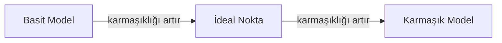
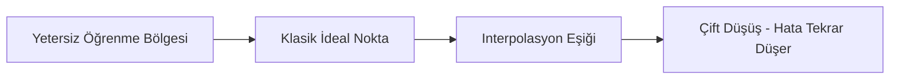
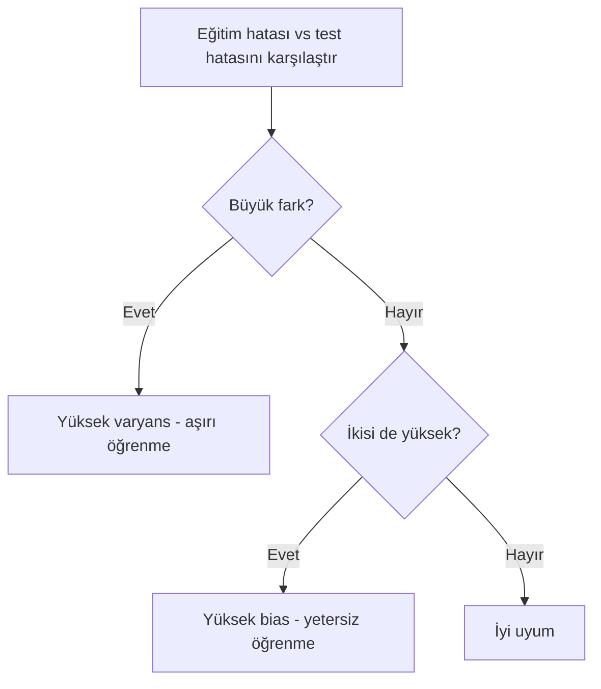
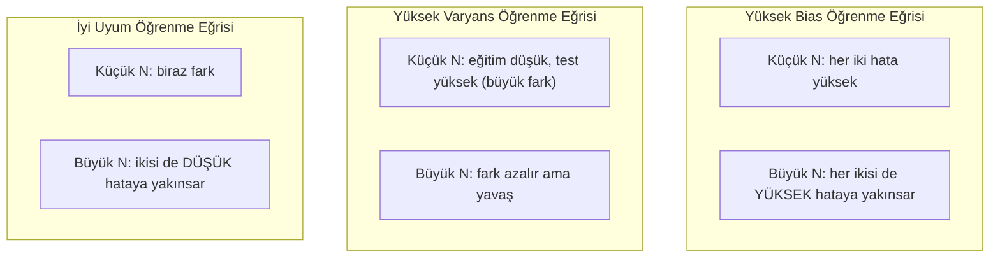
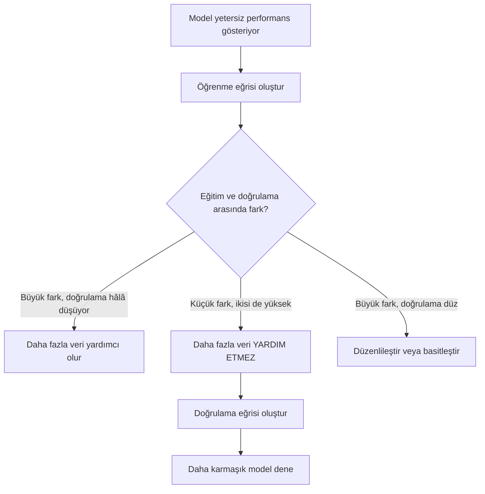

> **Orijinal İçerik:** [docs/en.md](https://github.com/rohitg00/ai-engineering-from-scratch/blob/main/phases/02-ml-fundamentals/10-bias-variance/docs/en.md)

# Bias-Variance Dengesi

> Her model hatası üç kaynaktan birinden gelir: bias, varyans veya gürültü. Yalnızca ilk ikisini kontrol edebilirsiniz.

**Tür:** Öğrenme
**Dil:** Python
**Ön Koşullar:** Faz 2, Ders 01-09 (ML temelleri, regresyon, sınıflandırma, değerlendirme)
**Süre:** ~75 dakika

## Öğrenme Hedefleri

- Beklenen tahmin hatasının bias-variance ayrışımını türetin ve indirgenemez gürültünün (irreducible noise) rolünü açıklayın
- Eğitim ve test hata örüntülerini kullanarak bir modelin yüksek bias mı yoksa yüksek varyans mı yaşadığını teşhis edin
- Düzenlileştirme tekniklerinin (L1, L2, dropout, erken durdurma) bias ile varyans arasında nasıl bir değiş tokuş yaptığını açıklayın
- Bias-variance dengesini artan model karmaşıklığında görselleştiren deneyler uygulayın

## Sorun

Bir model eğittiniz. Test verisinde bir miktar hatası var. Bu hata nereden geliyor?

Modeliniz çok basitse (eğrisel bir veri setinde doğrusal regresyon), gerçek örüntüyü sürekli olarak kaçırır. Bu bias'tır. Modeliniz çok karmaşıksa (15 veri noktasında 20. dereceden polinom), eğitim verisine mükemmel uyar ancak yeni veride çılgınca farklı tahminler verir. Bu varyanstır.

Sabit bir model kapasitesinde ikisini aynı anda minimize edemezsiniz. Bias'ı aşağı itersiniz, varyans yukarı çıkar. Varyansı aşağı itersiniz, bias yukarı çıkar. Bu dengeyi anlamak, makine öğrenimindeki en kullanışlı teşhis becerisidir. Size modelinizi daha karmaşık mı yoksa daha basit mi yapmanız gerektiğini, daha fazla veri mi almanız yoksa daha iyi özellikler mi mühendislik yapmanız gerektiğini, daha fazla mı yoksa daha az mı düzenlileştirme uygulamanız gerektiğini söyler.

## Kavram

### Bias: Sistematik Hata

Bias, modelinizin ortalama tahmininin gerçek değerden ne kadar uzak olduğunu ölçer. Aynı modeli aynı dağılımdan çekilmiş birçok farklı eğitim setinde eğitip tahminlerin ortalamasını alsaydınız, bias bu ortalama ile gerçek değer arasındaki farktır.

Yüksek bias, modelin gerçek örüntüyü yakalamak için çok katı olduğu anlamına gelir. Bir parabole uydurulan düz bir çizgi, ne kadar veri verirseniz verin eğriyi her zaman kaçıracaktır. Buna yetersiz öğrenme (underfitting) denir.

```
Yüksek bias (yetersiz öğrenme):
  Model her zaman yaklaşık olarak aynı yanlış şeyi tahmin eder.
  Eğitim hatası: YÜKSEK
  Test hatası: YÜKSEK
  Aralarındaki fark: KÜÇÜK
```

### Varyans: Eğitim Verisine Duyarlılık

Varyans, farklı veri alt kümelerinde eğittiğinizde tahminlerinizin ne kadar değiştiğini ölçer. Eğitim setindeki küçük değişiklikler modelde büyük değişikliklere neden oluyorsa, varyans yüksektir.

Yüksek varyans, modelin altta yatan sinyali değil, eğitim verisindeki gürültüyü uydurduğu anlamına gelir. 20. dereceden bir polinom her eğitim noktasından geçer ancak aralarında çılgınca salınır. Buna aşırı öğrenme (overfitting) denir.

```
Yüksek varyans (aşırı öğrenme):
  Model eğitim verisine mükemmel uyar ancak yeni veride başarısız olur.
  Eğitim hatası: DÜŞÜK
  Test hatası: YÜKSEK
  Aralarındaki fark: BÜYÜK
```

### Ayrışım

Herhangi bir x noktası için, kare hata kaybı altında beklenen tahmin hatası tam olarak şöyle ayrışır:

```
Beklenen Hata = Bias^2 + Varyans + İndirgenemez Gürültü

burada:
  Bias^2   = (E[f_hat(x)] - f(x))^2
  Varyans  = E[(f_hat(x) - E[f_hat(x)])^2]
  Gürültü  = E[(y - f(x))^2]             (sigma^2)
```

- `f(x)` gerçek fonksiyondur
- `f_hat(x)` modelinizin tahminidir
- `E[...]` farklı eğitim setleri üzerinden beklenen değerdir
- `y` gözlemlenen etikettir (gerçek fonksiyon artı gürültü)

Gürültü terimi indirgenemez. Hiçbir model gürültülü veride sigma^2'den daha iyisini yapamaz. Sizin işiniz bias^2 ile varyans arasında doğru dengeyi bulmaktır.

### Model Karmaşıklığı ve Hata



Klasik U-şekilli eğri:

| Karmaşıklık | Bias | Varyans | Toplam Hata |
|-----------|------|----------|-------------|
| Çok düşük | YÜKSEK | DÜŞÜK | YÜKSEK (yetersiz öğrenme) |
| Tam ideal | ORTA | ORTA | EN DÜŞÜK |
| Çok yüksek | DÜŞÜK | YÜKSEK | YÜKSEK (aşırı öğrenme) |

### Düzenlileştirme ve Bias-Variance Kontrolü

Düzenlileştirme (regularization), varyansı azaltmak için bilinçli olarak bias'ı artırır. Modeli kısıtlar, böylece gürültünün peşinden gidemez.

- **L2 (Ridge):** Tüm ağırlıkları sıfıra doğru büzüştürür. Tüm özellikleri tutar ancak etkilerini azaltır.
- **L1 (Lasso):** Bazı ağırlıkları tam olarak sıfıra iter. Özellik seçimi yapar.
- **Dropout:** Eğitim sırasında nöronları rastgele devre dışı bırakır. Yedekli temsilleri zorlar.
- **Erken durdurma (early stopping):** Model eğitim verisine tam olarak uymadan önce eğitimi durdurur.

Düzenlileştirme gücü (lambda, dropout oranı, epoch sayısı) bias-variance eğrisinde nerede duracağınızı doğrudan kontrol eder. Daha fazla düzenlileştirme = daha fazla bias, daha az varyans.

### Çift Düşüş (Double Descent): Modern Perspektif

Klasik teori der ki: ideal noktadan sonra daha fazla karmaşıklık her zaman zararlıdır. Ancak 2019'dan beri yapılan araştırmalar beklenmedik bir şey gösterdi. Model kapasitesini interpolasyon eşiğinin (modelin eğitim verisine mükemmel uyacak kadar parametreye sahip olduğu nokta) çok ötesine artırmaya devam ederseniz, test hatası tekrar düşebilir.



Bu "çift düşüş" (double descent) olgusu, aşırı parametreli sinir ağlarının (eğitim örneklerinden çok daha fazla parametreye sahip olan) neden hâlâ iyi genelleme yaptığını açıklar. Klasik bias-variance dengesi yanlış değildir, ancak modern rejim için eksiktir.

Çift düşüş hakkında temel gözlemler:
- Doğrusal modellerde, karar ağaçlarında ve sinir ağlarında görülür
- İnterpolasyon bölgesinde daha fazla veri aslında zarar verebilir (örnek bazında çift düşüş)
- Daha fazla eğitim epoch'u da buna neden olabilir (epoch bazında çift düşüş)
- Düzenlileştirme tepeyi yumuşatır ancak ortadan kaldırmaz

Bu neden olur? İnterpolasyon eşiğinde, model tüm eğitim noktalarına uyacak kadar kapasiteye sahiptir. Her noktadan geçen çok spesifik bir çözüme zorlanır ve verideki küçük pertürbasyonlar uyumda büyük değişikliklere neden olur. Varyansın zirve yaptığı yer burasıdır. Eşiğin ötesinde, modelin veriye mükemmel uyan birçok olası çözümü vardır. Öğrenme algoritması (örn. örtük düzenlileştirmeli gradient descent), bunların arasından en basit olanı seçme eğilimindedir. Basit çözümlere yönelik bu örtük bias, aşırı parametreli modellerin genelleme yapmasının nedenidir.

| Rejim | Parametre vs Örnek | Davranış |
|--------|----------------------|----------|
| Az parametreli | p << n | Klasik denge geçerlidir |
| İnterpolasyon eşiği | p ~ n | Varyans zirve yapar, test hatası fırlar |
| Aşırı parametreli | p >> n | Örtük düzenlileştirme devreye girer, test hatası düşer |

Pratik amaçlar için: sinir ağları veya büyük ağaç toplulukları kullanıyorsanız, interpolasyon eşiğinde durmayın. Ya iyice altında kalın (açık düzenlileştirmeyle) ya da iyice ötesine geçin. Olabilecek en kötü yer, eşiğin tam üzeridir.

### Modelinizi Teşhis Etme



| Belirti | Teşhis | Çözüm |
|---------|--------|-------|
| Yüksek eğitim hatası, yüksek test hatası | Bias | Daha fazla özellik, karmaşık model, azaltılmış düzenlileştirme |
| Düşük eğitim hatası, yüksek test hatası | Varyans | Daha fazla veri, düzenlileştirme, basit model, dropout |
| Düşük eğitim hatası, düşük test hatası | İyi uyum | Yayınlayın |
| Eğitim hatası düşüyor, test hatası artıyor | Aşırı öğrenme sürüyor | Erken durdurma |

### Pratik Stratejiler

**Bias sorunu olduğunda:**
- Polinom veya etkileşim özellikleri ekleyin
- Daha esnek bir model kullanın (doğrusal yerine ağaç topluluğu)
- Düzenlileştirme gücünü azaltın
- Daha uzun eğitin (henüz yakınsamamışsa)

**Varyans sorunu olduğunda:**
- Daha fazla eğitim verisi alın
- Bagging kullanın (rastgele ormanlar)
- Düzenlileştirmeyi artırın (yüksek lambda, daha fazla dropout)
- Özellik seçimi (gürültülü özellikleri kaldırın)
- Erken tespit için çapraz doğrulama kullanın

### Topluluk Yöntemleri ve Varyans Azaltma

Topluluk yöntemleri (ensemble methods), varyansla mücadele için en pratik araçtır.

**Bagging (Bootstrap Aggregating)**, eğitim verisinin farklı bootstrap örneklemlerinde birden çok model eğitir ve tahminlerinin ortalamasını alır. Her bir model yüksek varyansa sahiptir, ancak ortalaması çok daha düşük varyansa sahiptir. Rastgele ormanlar, bagging'in karar ağaçlarına uygulanmasıdır.

Matematiksel olarak neden çalışır: her biri sigma^2 varyansına sahip N bağımsız tahmini ortalamalarsanız, ortalamanın varyansı sigma^2 / N olur. Modeller tam olarak bağımsız değildir (hepsi benzer veri görür), bu nedenle azalma 1/N'den azdır, ancak yine de önemlidir.

**Boosting**, modelleri sırayla oluşturarak bias'ı azaltır ve her yeni model, o ana kadarki topluluğun hatalarına odaklanır. Gradient boosting ve AdaBoost başlıca örneklerdir. Boosting, çok fazla model eklenirse aşırı öğrenebilir, bu nedenle erken durdurma veya düzenlileştirme gerekir.

| Yöntem | Birincil Etki | Bias Değişimi | Varyans Değişimi |
|--------|---------------|-------------|-----------------|
| Bagging | Varyansı azaltır | Değişim yok | Azalır |
| Boosting | Bias'ı azaltır | Azalır | Artabilir |
| Stacking | İkisini de azaltır | Meta-öğreniciye bağlıdır | Temel modellere bağlıdır |
| Dropout | Örtük bagging | Hafif artış | Azalır |

**Pratik kural:** temel modeliniz yüksek varyansa sahipse (derin ağaçlar, yüksek dereceli polinomlar), bagging kullanın. Temel modeliniz yüksek bias'a sahipse (sığ ağaçlar, basit doğrusal modeller), boosting kullanın.

### Öğrenme Eğrileri

Öğrenme eğrileri (learning curves), eğitim ve doğrulama hatasını eğitim seti boyutunun bir fonksiyonu olarak çizer. Bunlar sahip olduğunuz en pratik teşhis aracıdır. Tek bir eğitim/test karşılaştırmasının aksine, öğrenme eğrileri modelinizin yörüngesini gösterir ve daha fazla verinin yardımcı olup olmayacağını söyler.



Nasıl okunur:

| Senaryo | Eğitim Hatası | Doğrulama Hatası | Fark | Anlamı | Ne Yapmalı |
|---------|--------------|------------------|------|--------|------------|
| Yüksek bias | Yüksek | Yüksek | Küçük | Model örüntüyü yakalayamıyor | Daha fazla özellik, karmaşık model, az düzenlileştirme |
| Yüksek varyans | Düşük | Yüksek | Büyük | Model eğitim verisini ezberliyor | Daha fazla veri, düzenlileştirme, basit model |
| İyi uyum | Orta | Orta | Küçük | Model genelliyor | Yayınlayın |
| Yüksek varyans, iyileşiyor | Düşük | Veriyle azalıyor | Daralıyor | Verinin çözebileceği varyans sorunu | Daha fazla veri toplayın |
| Yüksek bias, düz | Yüksek | Yüksek ve düz | Küçük ve düz | Daha fazla veri YARDIM ETMEZ | Model mimarisini değiştirin |

Kritik içgörü: her iki eğri de platoya ulaştıysa ve fark küçükse ancak her iki hata da yüksekse, daha fazla veri işe yaramaz. Daha iyi bir modele ihtiyacınız vardır. Fark büyükse ve hâlâ daralıyorsa, daha fazla veri yardımcı olacaktır.

### Öğrenme Eğrileri Nasıl Oluşturulur

İki yaklaşım vardır:

**Yaklaşım 1: Eğitim seti boyutunu değiştir, modeli sabit tut.** Modeli ve hiperparametreleri sabit tutun. Eğitim verisinin giderek artan alt kümelerinde eğitin. Her boyutta eğitim hatası ve doğrulama hatasını ölçün. Bu standart öğrenme eğrisidir.

**Yaklaşım 2: Model karmaşıklığını değiştir, veriyi sabit tut.** Veriyi sabit tutun. Bir karmaşıklık parametresini (polinom derecesi, ağaç derinliği, katman sayısı) tarayın. Her karmaşıklıkta eğitim hatası ve doğrulama hatasını ölçün. Bu bir doğrulama eğrisidir (validation curve) ve bias-variance dengesini doğrudan gösterir.

Her iki yaklaşım da birbirini tamamlar. İlki, daha fazla verinin yardımcı olup olmayacağını söyler. İkincisi, farklı bir modelin yardımcı olup olmayacağını söyler. Bir sonraki adımınıza karar vermeden önce ikisini de çalıştırın.




## Uygulama

`code/bias_variance.py` dosyası, tam bias-variance ayrışımı deneyini çalıştırır. İşte adım adım yaklaşım.

### Adım 1: Bilinen Bir Fonksiyondan Sentetik Veri Üretme

`f(x) = sin(1.5x) + 0.5x` fonksiyonunu Gauss gürültüsüyle kullanıyoruz. Gerçek fonksiyonu bilmek, tam bias ve varyans hesaplamamızı sağlar.

```python
import numpy as np

def true_function(x):
    return np.sin(1.5 * x) + 0.5 * x

def generate_data(n_samples=30, noise_std=0.5, x_range=(-3, 3), seed=None):
    rng = np.random.RandomState(seed)
    x = rng.uniform(x_range[0], x_range[1], n_samples)
    y = true_function(x) + rng.normal(0, noise_std, n_samples)
    return x, y
```

#### Açıklama
`true_function` sinüzoidal ve doğrusal bileşenleri birleştirir. `generate_data` belirtilen gürültü seviyesinde rastgele örnekler üretir. Gerçek fonksiyonu bildiğimiz için bias ve varyansı tam olarak hesaplayabiliriz.

### Adım 2: Bootstrap Örnekleme ve Polinom Uydurma

Her polinom derecesi için, birçok bootstrap eğitim seti çekeriz, polinomu uydururuz ve sabit bir test ızgarasında tahminleri kaydederiz. Bu bize her test noktasında bir tahmin dağılımı verir.

```python
def fit_polynomial(x_train, y_train, degree, lam=0.0):
    X = np.column_stack([x_train ** d for d in range(degree + 1)])
    if lam > 0:
        penalty = lam * np.eye(X.shape[1])
        penalty[0, 0] = 0
        w = np.linalg.solve(X.T @ X + penalty, X.T @ y_train)
    else:
        w = np.linalg.lstsq(X, y_train, rcond=None)[0]
    return w
```

200 farklı bootstrap örnekleminde uydurma yaparız. Her bootstrap örneklemi aynı temel dağılımdan çekilir ancak farklı noktalar içerir.

#### Açıklama
`fit_polynomial` verilen dereceye kadar polinom özelliklerini oluşturur ve normal denklemleri (lam > 0 ise Ridge düzenlileştirmeli, değilse sıradan en küçük kareler) çözer.

### Adım 3: Bias^2 ve Varyans Ayrışımını Hesaplama

200 tahmin setiyle, ayrışımı doğrudan tanımdan hesaplayabiliriz:

```python
def bias_variance_decomposition(degrees, n_bootstrap=200, n_train=30,
                                 noise_std=0.5, n_test=100, lam=0.0):
    rng = np.random.RandomState(42)
    x_test = np.linspace(-2.5, 2.5, n_test)
    y_true = true_function(x_test)

    results = {}
    for degree in degrees:
        predictions = np.zeros((n_bootstrap, n_test))
        for b in range(n_bootstrap):
            x_train, y_train = generate_data(
                n_samples=n_train, noise_std=noise_std, seed=rng.randint(0, 100000)
            )
            w = fit_polynomial(x_train, y_train, degree, lam=lam)
            predictions[b] = predict_polynomial(x_test, w)

        mean_pred = predictions.mean(axis=0)
        bias_sq = np.mean((mean_pred - y_true) ** 2)
        variance = np.mean(predictions.var(axis=0))
        total_error = np.mean(np.mean((predictions - y_true) ** 2, axis=1))

        results[degree] = {
            "bias_sq": bias_sq, "variance": variance,
            "total_error": total_error, "noise": noise_std ** 2,
        }
    return results
```

#### Açıklama
`mean_pred` bootstrap örneklemlerinden tahmin edilen E[f_hat(x)]'dir. `bias_sq` ortalama tahmin ile gerçek değer arasındaki kare farktır. `variance` tahminlerin bootstrap örneklemleri arasındaki ortalama yayılımıdır. `total_error` yaklaşık olarak bias^2 + variance + noise'e eşit olmalıdır.

### Adım 4: Öğrenme Eğrileri

Öğrenme eğrileri, model karmaşıklığını sabit tutarken eğitim seti boyutunu tarar. Modelinizin veri sınırlı mı yoksa kapasite sınırlı mı olduğunu gösterirler.

```python
def demo_learning_curves():
    sizes = [10, 15, 20, 30, 50, 75, 100, 150, 200, 300]
    degree = 5
    for n in sizes:
        train_errors = []
        test_errors = []
        for seed in range(50):
            x_train, y_train = generate_data(n_samples=n, seed=seed * 100)
            w = fit_polynomial(x_train, y_train, degree)
            train_pred = predict_polynomial(x_train, w)
            train_mse = np.mean((train_pred - y_train) ** 2)
            test_pred = predict_polynomial(x_test, w)
            test_mse = np.mean((test_pred - y_test) ** 2)
            train_errors.append(train_mse)
            test_errors.append(test_mse)
```

Yüksek varyanslı bir model (derece 5, küçük veri) için:
- Eğitim hatası düşük başlar ve daha fazla veri ezberlemeyi zorlaştırdıkça artar
- Test hatası yüksek başlar ve model daha fazla sinyal aldıkça düşer
- Fark daha fazla veriyle daralır

Yüksek biaslı bir model (derece 1) için, her iki hata da hızla aynı yüksek değere yakınsar ve daha fazla veri yardımcı olmaz.

#### Açıklama
`demo_learning_curves` artan eğitim seti boyutlarında hem eğitim hem test hatasını hesaplar. Yüksek varyans durumunda eğitim hatası düşük kalırken test hatası yüksektir; yüksek bias durumunda ikisi de yüksektir ve birbirine yakındır.

### Adım 5: Düzenlileştirme Taraması

Kod ayrıca, yüksek dereceli bir polinomu (derece 15) sabitleyip Ridge düzenlileştirme gücünü 0.001'den 100'e tarayan `demo_regularization_sweep()` içerir. Bu, bias-variance dengesini farklı bir açıdan gösterir: model karmaşıklığını değiştirmek yerine kısıtlama gücünü değiştiririz.

```python
def demo_regularization_sweep():
    alphas = [0.001, 0.005, 0.01, 0.05, 0.1, 0.5, 1.0, 5.0, 10.0, 50.0, 100.0]
    for alpha in alphas:
        results = bias_variance_decomposition([15], lam=alpha)
        r = results[15]
        print(f"alpha={alpha:.3f}  bias={r['bias_sq']:.4f}  var={r['variance']:.4f}")
```

Düşük alpha'da, 15. dereceden polinom neredeyse kısıtlanmamıştır. Her bootstrap örnekleminde gürültüyü takip ettiği için varyans baskındır. Yüksek alpha'da, ceza o kadar güçlüdür ki model etkili bir şekilde sabit bir fonksiyon haline gelir. Bias baskındır. Optimal alpha bu uç noktaların arasında yer alır.

Bu, polinom derecesini değiştirmekle aynı U-eğrisidir, ancak ayrı bir anahtar yerine sürekli bir düğme ile kontrol edilir. Pratikte, düzenlileştirme, dengeyi kontrol etmenin tercih edilen yoludur çünkü özellik setini değiştirmeden ince ayar yapmaya izin verir.

#### Açıklama
`demo_regularization_sweep` Ridge alpha değerini tarayarak bias ve varyansın nasıl değiştiğini gösterir. Düşük alpha = düşük bias + yüksek varyans; yüksek alpha = yüksek bias + düşük varyans. Optimal alpha, toplam hatayı minimize eder.

## Kullanım

sklearn, bu teşhisleri bootstrap döngüleri yazmadan otomatikleştirmek için `learning_curve` ve `validation_curve` sağlar.

### Doğrulama Eğrisi: Model Karmaşıklığını Tara

```python
from sklearn.model_selection import validation_curve
from sklearn.pipeline import make_pipeline
from sklearn.preprocessing import PolynomialFeatures
from sklearn.linear_model import Ridge

degrees = list(range(1, 16))
train_scores_all = []
val_scores_all = []

for d in degrees:
    pipe = make_pipeline(PolynomialFeatures(d), Ridge(alpha=0.01))
    train_scores, val_scores = validation_curve(
        pipe, X, y, param_name="polynomialfeatures__degree",
        param_range=[d], cv=5, scoring="neg_mean_squared_error"
    )
    train_scores_all.append(-train_scores.mean())
    val_scores_all.append(-val_scores.mean())
```

Bu, bias-variance dengesi eğrisini doğrudan verir. Doğrulama skorunun eğitim skoruna göre en kötü olduğu yerde varyans baskındır. İkisinin de kötü olduğu yerde bias baskındır.

#### Açıklama
`validation_curve` her polinom derecesi için 5-fold çapraz doğrulama ile eğitim ve doğrulama skorlarını hesaplar. Bu, hangi karmaşıklık seviyesinin optimal olduğunu gösteren klasik U-eğrisini üretir.

### Öğrenme Eğrisi: Eğitim Seti Boyutunu Tara

```python
from sklearn.model_selection import learning_curve

pipe = make_pipeline(PolynomialFeatures(5), Ridge(alpha=0.01))
train_sizes, train_scores, val_scores = learning_curve(
    pipe, X, y, train_sizes=np.linspace(0.1, 1.0, 10),
    cv=5, scoring="neg_mean_squared_error"
)
train_mse = -train_scores.mean(axis=1)
val_mse = -val_scores.mean(axis=1)
```

`train_mse` ve `val_mse`'yi `train_sizes`'a karşı çizin. Şekil size modeliniz hakkında her şeyi söyler.

#### Açıklama
`learning_curve` eğitim seti boyutunu artırarak modelin veri açlığını test eder. Eğitim ve doğrulama eğrileri birbirine yakınsıyorsa ancak hata yüksekse, model kapasite sınırlıdır (bias sorunu). Büyük bir fark varsa, model veri sınırlıdır (varyans sorunu).

### Düzenlileştirme Taraması ile Çapraz Doğrulama

```python
from sklearn.model_selection import cross_val_score

alphas = [0.001, 0.01, 0.1, 1.0, 10.0, 100.0]
for alpha in alphas:
    pipe = make_pipeline(PolynomialFeatures(10), Ridge(alpha=alpha))
    scores = cross_val_score(pipe, X, y, cv=5, scoring="neg_mean_squared_error")
    print(f"alpha={alpha:>7.3f}  MSE={-scores.mean():.4f} +/- {scores.std():.4f}")
```

Bu, sabit model karmaşıklığı için düzenlileştirme gücünü tarar. Aynı bias-variance dengesini görürsünüz: düşük alpha = yüksek varyans, yüksek alpha = yüksek bias.

#### Açıklama
`cross_val_score` her alpha için 5-fold CV ile MSE hesaplar. Bu, düzenlileştirme gücünü optimize etmenin pratik yoludur — en düşük CV hatasını veren alpha'yı seçin.

### Hepsini Birleştirmek: Tam Bir Teşhis İş Akışı

Pratikte, bu teşhisleri sırayla çalıştırırsınız:

1. Modelinizi eğitin. Eğitim ve test hatasını hesaplayın.
2. İkisi de yüksekse: bias sorununuz var. 4. adıma geçin.
3. Eğitim düşük ancak test yüksekse: varyans sorununuz var. Daha fazla verinin yardımcı olup olmayacağını görmek için bir öğrenme eğrisi oluşturun. Yardımcı olmazsa, düzenlileştirin.
4. Ana karmaşıklık parametrenizi tarayan bir doğrulama eğrisi oluşturun. İdeal noktayı bulun.
5. İdeal noktada bir öğrenme eğrisi oluşturun. Fark hâlâ büyükse, daha fazla veriye veya düzenlileştirmeye ihtiyacınız var.
6. Farklı alpha değerleriyle Ridge/Lasso'yu `cross_val_score` kullanarak deneyin. Çapraz doğrulanmış hatanın en düşük olduğu alpha'yı seçin.

Bu, çoğu tabular veri seti için 10-15 dakikalık hesaplama süresi alır ve saatlerce süren tahmin yapmayı önler.

## Çıktılar

Bu ders şunları üretir: `outputs/prompt-model-diagnostics.md`

## Alıştırmalar

1. Ayrışımı `noise_std=0` (gürültü yok) ile çalıştırın. İndirgenemez hata terimine ne olur? Optimal karmaşıklık değişir mi?
2. Eğitim seti boyutunu 30'dan 300'e çıkarın. Bu varyans bileşenini nasıl etkiler? Optimal polinom derecesi kayar mı?
3. Deneye L2 düzenlileştirme (Ridge regresyonu) ekleyin. Sabit bir yüksek dereceli polinom (derece 15) için lambda'yı 0'dan 100'e tarayın. Bias^2 ve varyansı lambda'nın fonksiyonları olarak çizin.
4. Gerçek fonksiyonu bir polinomdan `sin(x)`'e değiştirin. Bias-variance ayrışımı nasıl değişir? Hâlâ net bir optimal derece var mı?
5. Basit bir bootstrap topluluğu (bagging) sarmalayıcısı uygulayın: bootstrap örneklemlerinde 10 model eğitin ve tahminlerin ortalamasını alın. Bunun, bias'ı fazla artırmadan varyansı azalttığını gösterin.

## Anahtar Terimler

| Terim | Söylenen | Gerçek Anlamı |
|-------|----------|---------------|
| Bias | "Model çok basit" | Yanlış varsayımlardan kaynaklanan sistematik hata. Ortalama model tahmini ile gerçek değer arasındaki fark. |
| Varyans | "Model aşırı öğreniyor" | Eğitim verisine duyarlılıktan kaynaklanan hata. Tahminlerin farklı eğitim setlerinde ne kadar değiştiği. |
| İndirgenemez hata | "Verideki gürültü" | Gerçek veri üretme sürecindeki rastgelelikten kaynaklanan hata. Hiçbir model onu yok edemez. |
| Yetersiz öğrenme | "Yeterince öğrenmemek" | Model yüksek bias'a sahiptir. Eğitim verisinde bile gerçek örüntüyü kaçırır. |
| Aşırı öğrenme | "Veriyi ezberlemek" | Model yüksek varyansa sahiptir. Genellemeyen eğitim verisindeki gürültüyü uydurur. |
| Düzenlileştirme | "Modeli kısıtlamak" | Model karmaşıklığını azaltmak için ceza eklemek, bias'ı artırarak varyansı düşürmek. |
| Çift düşüş | "Daha fazla parametre yardımcı olabilir" | Model kapasitesi interpolasyon eşiğini çok aştığında test hatası tekrar düşer. |
| Model karmaşıklığı | "Model ne kadar esnek" | Modelin rastgele örüntüleri uydurma kapasitesi. Mimari, özellikler veya düzenlileştirme ile kontrol edilir. |

## İleri Okuma

- [Hastie, Tibshirani, Friedman: Elements of Statistical Learning, Bölüm 7](https://hastie.su.domains/ElemStatLearn/) — bias-variance ayrışımının kesin tedavisi
- [Belkin ve diğerleri, Reconciling modern machine learning practice and the bias-variance trade-off (2019)](https://arxiv.org/abs/1812.11118) — çift düşüş makalesi
- [Nakkiran ve diğerleri, Deep Double Descent (2019)](https://arxiv.org/abs/1912.02292) — epoch ve örnek bazında çift düşüş
- [Scott Fortmann-Roe: Understanding the Bias-Variance Tradeoff](http://scott.fortmann-roe.com/docs/BiasVariance.html) — net görsel açıklama
