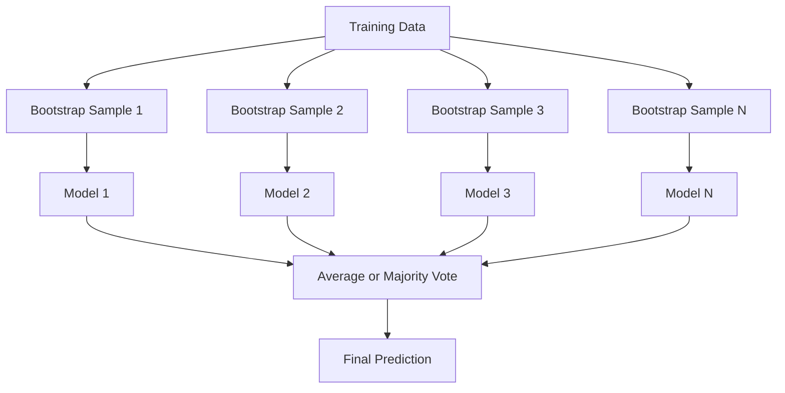
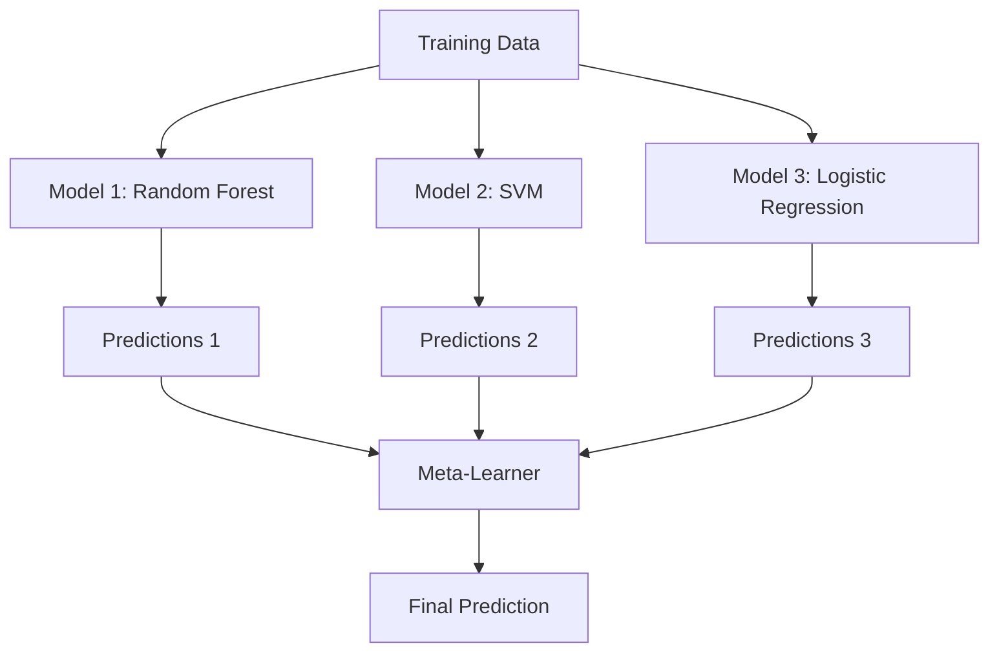

> **Orijinal İçerik:** [docs/en.md](https://github.com/rohitg00/ai-engineering-from-scratch/blob/main/phases/02-ml-fundamentals/11-ensemble-methods/docs/en.md)

# Topluluk Yöntemleri (Ensemble Methods)

> Bir grup zayıf öğrenici, doğru şekilde birleştirildiğinde güçlü bir öğreniciye dönüşür. Bu bir metafor değil, bir teoremdir.

**Tür:** Build
**Diller:** Python
**Ön Koşullar:** Phase 2, Lesson 10 (Bias-Variance Tradeoff)
**Süre:** ~120 dakika

## Öğrenim Hedefleri

- AdaBoost ve gradient boosting algoritmalarını sıfırdan uygulamak ve boosting'in bias'ı nasıl sırayla azalttığını açıklamak
- Bir bagging topluluğu oluşturmak ve ilişkisi azaltılmış modellerin ortalamasının alınmasının, bias'ı artırmadan variance'ı nasıl düşürdüğünü göstermek
- Bagging, boosting ve stacking yöntemlerini her birinin hedeflediği hata bileşeni açısından karşılaştırmak
- Topluluk çeşitliliğini (ensemble diversity) değerlendirmek ve daha fazla bağımsız zayıf öğrenici kullanıldığında çoğunluk oylaması doğruluğunun neden arttığını açıklamak

## Sorun

Tek bir karar ağacı (decision tree) hızlı eğitilir ve yorumlaması kolaydır, ancak ezberler (overfit). Tek bir doğrusal model (linear model) ise karmaşık sınırlarda yetersiz kalır (underfit). Mükemmel model mimarisini oluşturmak için günler harcayabilirsiniz. Ya da bir grup kusurlu modeli birleştirip her birinden daha iyi bir sonuç elde edebilirsiniz.

Topluluk yöntemleri (ensemble methods) tam olarak bunu yapar. Tabular verilerde Kaggle yarışmalarını kazanmanın en güvenilir tekniğidir, çoğu üretim ML sisteminin temelini oluşturur ve bias-variance ödünleşimini (bias-variance tradeoff) fiilen gözler önüne serer. Bagging variance'ı azaltır. Boosting bias'ı azaltır. Stacking ise hangi modelin hangi girdide güvenilir olduğunu öğrenir.

## Kavram

### Topluluklar Neden Çalışır

Her biri p > 0.5 doğruluğa sahip N adet bağımsız sınıflandırıcınız olduğunu varsayalım. Çoğunluk oylamasının doğruluğu:

```
P(çoğunluk doğru) = k > N/2 için C(N,k) * p^k * (1-p)^(N-k) toplamı
```

Her biri %60 doğrulukta 21 sınıflandırıcı için çoğunluk oylaması doğruluğu yaklaşık %74 olur. 101 sınıflandırıcıda bu %84'e yükselir. Modeller farklı hatalar yaptığında hatalar birbirini götürür.

Anahtar gereklilik **çeşitliliktir** (diversity). Tüm modeller aynı hataları yaparsa, birleştirmenin hiçbir faydası olmaz. Topluluklar, modelleri şu yollarla çeşitlendirerek çalışır:

- Farklı eğitim altkümeleri (bagging)
- Farklı öznitelik altkümeleri (random forests)
- Sıralı hata düzeltme (boosting)
- Farklı model aileleri (stacking)

### Bagging (Bootstrap Aggregating)

Bagging, her modeli eğitim verisinin farklı bir bootstrap örneği üzerinde eğiterek çeşitlilik yaratır.



Bootstrap örneği, orijinal veriden yerine koyarak (with replacement) ve aynı boyutta çekilir. Her bootstrap örneğinde benzersiz örneklerin yaklaşık %63.2'si bulunur. Kalan %36.8 (out-of-bag örnekleri) ücretsiz bir doğrulama seti sağlar.

Bagging, bias'ı fazla artırmadan variance'ı azaltır. Her bir ağaç kendi bootstrap örneğine ezber yapar, ancak ezberleme her ağaçta farklıdır, bu nedenle ortalama alma gürültüyü giderir.

**Random Forests**, bagging'in ek bir iyileştirmeyle uyarlanmış halidir: her bölmede (split) özniteliklerin yalnızca rastgele bir altkümesi değerlendirilir. Bu, ağaçlar arasında daha fazla çeşitlilik sağlar. Kullanılan öznitelik sayısı sınıflandırma için tipik olarak `sqrt(n_features)`, regresyon için `n_features / 3` olur.

### Boosting (Sıralı Hata Düzeltme)

Boosting, modelleri sırayla eğitir. Her yeni model, önceki modellerin yanlış yaptığı örneklere odaklanır.


Boosting bias'ı azaltır. Her yeni model, topluluğun şimdiye kadar yaptığı sistematik hataları düzeltir. Nihai tahmin, tüm modellerin ağırlıklı toplamıdır ve daha iyi modeller daha yüksek ağırlık alır.

Ödünleşim: çok fazla tur çalıştırılırsa boosting ezber yapabilir (overfit), çünkü giderek zorlaşan örneklere uyum sağlamaya devam eder ve bunların bazıları gürültü olabilir.

### AdaBoost

AdaBoost (Adaptive Boosting) ilk pratik boosting algoritmasıdır. Herhangi bir temel öğreniciyle (base learner) çalışır, tipik olarak karar kütükleri (decision stumps — derinliği 1 olan ağaçlar) kullanılır.

Algoritma:

```
1. Örnek ağırlıklarını başlat: tüm i için w_i = 1/N

2. t = 1'den T'ye:
   a. Zayıf öğrenici h_t'yi ağırlıklı veri üzerinde eğit
   b. Ağırlıklı hatayı hesapla:
      err_t = sum(w_i * I(h_t(x_i) != y_i)) / sum(w_i)
   c. Model ağırlığını hesapla:
      alpha_t = 0.5 * ln((1 - err_t) / err_t)
   d. Örnek ağırlıklarını güncelle:
      w_i = w_i * exp(-alpha_t * y_i * h_t(x_i))
   e. Ağırlıkları toplamı 1 olacak şekilde normalize et

3. Nihai tahmin: H(x) = sign(sum(alpha_t * h_t(x)))
```

Düşük hataya sahip modeller daha yüksek alpha alır. Yanlış sınıflandırılan örnekler daha yüksek ağırlık kazanır, böylece sonraki model onlara odaklanır.

### Gradient Boosting

Gradient boosting, boosting'i keyfi kayıp fonksiyonlarına (loss functions) genelleştirir. Örnekleri yeniden ağırlıklandırmak yerine, her yeni modeli mevcut topluluğun artıklarına (residuals — kaybın negatif gradyanı) uydurur.

```
1. Başlat: F_0(x) = argmin_c sum(L(y_i, c))

2. t = 1'den T'ye:
   a. Sözde-artıkları (pseudo-residuals) hesapla:
      r_i = -dL(y_i, F_{t-1}(x_i)) / dF_{t-1}(x_i)
   b. Artıklara r_i uyan bir ağaç h_t uydur
   c. Optimal adım boyutunu bul:
      gamma_t = argmin_gamma sum(L(y_i, F_{t-1}(x_i) + gamma * h_t(x_i)))
   d. Güncelle:
      F_t(x) = F_{t-1}(x) + learning_rate * gamma_t * h_t(x)

3. Nihai tahmin: F_T(x)
```

Karesel hata kaybı (squared error loss) için sözde-artıklar gerçek artıklardır: `r_i = y_i - F_{t-1}(x_i)`. Her ağaç, kelimenin tam anlamıyla önceki topluluğun hatalarını öğrenir.

Öğrenme hızı (learning rate / shrinkage), her ağacın ne kadar katkıda bulunacağını kontrol eder. Daha düşük öğrenme hızları daha fazla ağaç gerektirir ancak daha iyi genelleme yapar. Tipik değerler: 0.01 ile 0.3 arası.

### XGBoost: Tabular Veride Neden Baskındır

XGBoost (eXtreme Gradient Boosting), gradient boosting'in hızlı, doğru ve ezberlemeye (overfitting) karşı dirençli hale getiren mühendislik optimizasyonlarıyla geliştirilmiş halidir:

- **Düzenlileştirilmiş hedef (Regularized objective):** Yaprak ağırlıklarına uygulanan L1 ve L2 cezaları, bireysel ağaçların aşırı güvenli olmasını engeller
- **İkinci derece yaklaşımı (Second-order approximation):** Kaybın hem birinci hem de ikinci türevlerini kullanarak daha iyi bölme kararları verir
- **Seyreklik bilinçli bölmeler (Sparsity-aware splits):** Eksik değerleri doğal olarak işler; her bölmede eksik veri için en iyi yönü öğrenir
- **Kolon altörneklemesi (Column subsampling):** Random forests gibi, her bölmede çeşitlilik için öznitelikleri örnekler
- **Ağırlıklı yüzdelik dilim taslağı (Weighted quantile sketch):** Dağıtık veride sürekli öznitelikler için bölme noktalarını verimli şekilde bulur
- **Önbellek bilinçli blok yapısı (Cache-aware block structure):** CPU önbellek hatları için optimize edilmiş bellek düzeni

Tabular verilerde XGBoost (ve halefi LightGBM) sinir ağlarından sürekli olarak daha iyi performans gösterir. Bu durum yakın zamanda değişmeyecektir. Veriniz satırlar ve sütunlardan oluşan bir tabloya sığıyorsa, gradient boosting ile başlayın.

### Stacking (Meta-Öğrenme)

Stacking, birden fazla temel modelin (base model) tahminlerini bir meta-öğrenici (meta-learner) için öznitelik olarak kullanır.



Meta-öğrenici, hangi temel modele hangi girdilerde güveneceğini öğrenir. Random forest belirli bölgelerde daha iyiyse ve SVM başka bölgelerde daha iyiyse, meta-öğrenici buna göre yönlendirme yapar.

Veri sızıntısını (data leakage) önlemek için, temel model tahminleri eğitim seti üzerinde çapraz doğrulama (cross-validation) ile oluşturulmalıdır. Temel modelleri eğitip meta-öznitelikleri aynı veri üzerinde asla oluşturmazsınız.

### Oylama (Voting)

En basit topluluk yöntemi. Tahminleri doğrudan birleştirir.

- **Sert oylama (Hard voting):** Sınıf etiketleri üzerinde çoğunluk oylaması.
- **Yumuşak oylama (Soft voting):** Tahmin edilen olasılıkların ortalamasını alır, en yüksek ortalama olasılığa sahip sınıfı seçer. Güven bilgisini kullandığı için genellikle daha iyidir.

## Uygulama

### Adım 1: Karar Kütüğü (Decision Stump) — Temel Öğrenici

`code/ensembles.py` dosyasındaki kod her şeyi sıfırdan uygular. Bir karar kütüğü ile başlıyoruz: tek bölmeli bir ağaç.

```python
class DecisionStump:
    def __init__(self):
        self.feature_idx = None
        self.threshold = None
        self.polarity = 1
        self.alpha = None

    def fit(self, X, y, weights):
        n_samples, n_features = X.shape
        best_error = float("inf")

        for f in range(n_features):
            thresholds = np.unique(X[:, f])
            for thresh in thresholds:
                for polarity in [1, -1]:
                    pred = np.ones(n_samples)
                    pred[polarity * X[:, f] < polarity * thresh] = -1
                    error = np.sum(weights[pred != y])
                    if error < best_error:
                        best_error = error
                        self.feature_idx = f
                        self.threshold = thresh
                        self.polarity = polarity

    def predict(self, X):
        n = X.shape[0]
        pred = np.ones(n)
        idx = self.polarity * X[:, self.feature_idx] < self.polarity * self.threshold
        pred[idx] = -1
        return pred
```

#### Açıklama
`DecisionStump`, tek bir bölme (split) yaparak çalışan en basit karar ağacıdır. `fit` metodu, tüm öznitelikler ve tüm eşik değerleri için olası iki polariteyi (büyüktür/küçüktür) dener ve ağırlıklı hatayı en aza indiren bölmeyi seçer. `predict` metodu ise seçilen öznitelik ve eşiğe göre her örneği -1 veya +1 olarak sınıflandırır.

### Adım 2: AdaBoost'u Sıfırdan Yazmak

```python
class AdaBoostScratch:
    def __init__(self, n_estimators=50):
        self.n_estimators = n_estimators
        self.stumps = []
        self.alphas = []

    def fit(self, X, y):
        n = X.shape[0]
        weights = np.full(n, 1 / n)

        for _ in range(self.n_estimators):
            stump = DecisionStump()
            stump.fit(X, y, weights)
            pred = stump.predict(X)

            err = np.sum(weights[pred != y])
            err = np.clip(err, 1e-10, 1 - 1e-10)

            alpha = 0.5 * np.log((1 - err) / err)
            weights *= np.exp(-alpha * y * pred)
            weights /= weights.sum()

            stump.alpha = alpha
            self.stumps.append(stump)
            self.alphas.append(alpha)

    def predict(self, X):
        total = sum(a * s.predict(X) for a, s in zip(self.alphas, self.stumps))
        return np.sign(total)
```

#### Açıklama
`AdaBoostScratch` sınıfı, AdaBoost algoritmasını sıfırdan uygular. Her turda bir karar kütüğü eğitilir, ağırlıklı hata oranı hesaplanır ve bu hataya göre modelin ağırlığı (`alpha`) belirlenir. Yanlış sınıflandırılan örneklerin ağırlıkları artırılır, böylece bir sonraki model zor örneklere odaklanır. Nihai tahmin, tüm kütüklerin ağırlıklı oylarının toplamının işaretidir (`sign`).

### Adım 3: Gradient Boosting'i Sıfırdan Yazmak

```python
class GradientBoostingScratch:
    def __init__(self, n_estimators=100, learning_rate=0.1, max_depth=3):
        self.n_estimators = n_estimators
        self.lr = learning_rate
        self.max_depth = max_depth
        self.trees = []
        self.initial_pred = None

    def fit(self, X, y):
        self.initial_pred = np.mean(y)
        current_pred = np.full(len(y), self.initial_pred)

        for _ in range(self.n_estimators):
            residuals = y - current_pred
            tree = SimpleRegressionTree(max_depth=self.max_depth)
            tree.fit(X, residuals)
            update = tree.predict(X)
            current_pred += self.lr * update
            self.trees.append(tree)

    def predict(self, X):
        pred = np.full(X.shape[0], self.initial_pred)
        for tree in self.trees:
            pred += self.lr * tree.predict(X)
        return pred
```

#### Açıklama
`GradientBoostingScratch` sınıfı, gradient boosting'i sıfırdan uygular. İlk tahmin olarak hedef değişkenin ortalaması alınır. Her turda, mevcut tahminlerin artıkları (residuals = gerçek değer - tahmin) hesaplanır ve bu artıkları tahmin etmek için yeni bir regresyon ağacı eğitilir. Ağacın katkısı, öğrenme hızı (`lr`) ile ölçeklenerek mevcut tahmine eklenir. Bu süreç, artıklar sıfıra yaklaşana kadar tekrarlanır.

### Adım 4: sklearn ile Karşılaştırma

Kod, sıfırdan yazılan uygulamalarımızın sklearn'in `AdaBoostClassifier` ve `GradientBoostingClassifier` sınıflarına benzer doğruluk ürettiğini doğrular ve tüm yöntemleri yan yana karşılaştırır.

## Kullanım

### Her Yöntemin Ne Zaman Kullanılacağı

| Yöntem | Azaltır | En iyi olduğu yer | Dikkat edilmesi gereken |
|--------|---------|-------------------|-------------------------|
| Bagging / Random Forest | Variance | Gürültülü veri, çok sayıda öznitelik | Bias'a yardımcı olmaz |
| AdaBoost | Bias | Temiz veri, basit temel öğreniciler | Aykırı değerlere ve gürültüye duyarlı |
| Gradient Boosting | Bias | Tabular veri, yarışmalar | Eğitimi yavaştır, ayar yapılmazsa kolayca ezberler |
| XGBoost / LightGBM | Her ikisi | Üretim tabular ML | Çok sayıda hiperparametre |
| Stacking | Her ikisi | Son %1-2 doğruluğu yakalamak | Karmaşıktır, meta-öğrenicide ezberleme riski |
| Oylama (Voting) | Variance | Farklı modelleri hızlıca birleştirme | Yalnızca modeller çeşitliyse işe yarar |

### Tabular Veri için Üretim Yığını

Çoğu tabular tahmin problemi için şu sıra izlenmelidir:

1. Varsayılan parametrelerle **LightGBM veya XGBoost**
2. n_estimators, learning_rate, max_depth, min_child_weight ayarlarını optimize edin
3. Son %0.5'i yakalamanız gerekiyorsa, 3-5 farklı modelle bir stacking topluluğu oluşturun
4. Her adımda çapraz doğrulama (cross-validation) kullanın

Süregelen araştırma çabalarına rağmen, tabular verilerde sinir ağları neredeyse her zaman gradient boosting'ten daha kötüdür. TabNet, NODE ve benzeri mimariler ara sıra eşleşse de iyi ayarlanmış bir XGBoost'u nadiren geçer.

## Çıktılar

Bu ders, `outputs/prompt-ensemble-selector.md` dosyasını üretir — belirli bir veri kümesi için doğru topluluk yöntemini seçmenize yardımcı olan bir prompt. Verinizi (boyut, öznitelik türleri, gürültü seviyesi, sınıf dengesi) ve çözmek istediğiniz problemi tanımlayın. Prompt, bir karar kontrol listesi üzerinden ilerler, bir yöntem önerir, başlangıç hiperparametrelerini belirtir ve o yöntemle ilgili yaygın hatalar konusunda uyarır. Ayrıca `outputs/skill-ensemble-builder.md` ile kapsamlı seçim kılavuzunu üretir.

## Alıştırmalar

1. AdaBoost uygulamasını, her turdan sonra eğitim doğruluğunu izleyecek şekilde değiştirin. Doğruluk ile tahmin edici sayısı arasındaki ilişkiyi grafikle gösterin. Hangi noktada yakınsıyor?

2. Regresyon ağacına rastgele öznitelik altörneklemesi ekleyerek sıfırdan bir random forest uygulayın. `max_features=sqrt(n_features)` ile 100 ağaç eğitin ve tahminlerin ortalamasını alın. Tek bir ağaca kıyasla variance azalmasını karşılaştırın.

3. Gradient boosting uygulamasına erken durdurma (early stopping) ekleyin: her turdan sonra doğrulama kaybını izleyin ve 10 ardışık turda iyileşme olmazsa durdurun. Gerçekte kaç ağaca ihtiyaç duyuluyor?

4. Üç temel model (lojistik regresyon, karar ağacı, k-en yakın komşu) ve bir lojistik regresyon meta-öğrenicisi kullanarak bir stacking topluluğu oluşturun. Meta-öznitelikleri oluşturmak için 5 katlı çapraz doğrulama kullanın. Sonucu her bir temel modelle ayrı ayrı karşılaştırın.

5. XGBoost'u aynı veri kümesinde varsayılan parametrelerle çalıştırın. Doğruluğunu sıfırdan yazdığınız gradient boosting ile karşılaştırın. İkisinin de çalışma süresini ölçün. Hız farkı ne kadar büyük?

## Anahtar Terimler

| Terim | Söylenen | Gerçek anlamı |
|-------|----------|---------------|
| Bagging | "Rastgele altkümelerde eğit" | Bootstrap aggregating: bootstrap örneklerinde modeller eğit, variance'ı azaltmak için tahminlerin ortalamasını al |
| Boosting | "Zor örneklere odaklan" | Modelleri sırayla eğit, her biri bias'ı azaltmak için topluluğun şimdiye kadarki hatalarını düzeltir |
| AdaBoost | "Veriyi yeniden ağırlıklandır" | Örnek ağırlığı güncellemeleriyle boosting; yanlış sınıflandırılan noktalar sonraki öğrenicide daha yüksek ağırlık alır |
| Gradient boosting | "Artıkları uydur" | Her yeni modeli kayıp fonksiyonunun negatif gradyanına uydurarak boosting |
| XGBoost | "Kaggle silahı" | Düzenlileştirme, ikinci derece optimizasyon ve sistem düzeyinde hız iyileştirmeleriyle gradient boosting |
| Stacking | "Model üstüne model" | Temel modellerin tahminlerini meta-öğrenici için girdi özniteliği olarak kullan |
| Random forest | "Bir sürü rastgele ağaç" | Karar ağaçlarıyla bagging, her bölmede çeşitlilik için rastgele öznitelik altörneklemesi eklenir |
| Topluluk çeşitliliği (Ensemble diversity) | "Farklı hatalar yap" | Topluluğun bireysel modellerden daha iyi olması için modellerin hataları ilişkisiz olmalıdır |
| Out-of-bag hatası | "Ücretsiz doğrulama" | Bootstrap çekiminde yer almayan örnekler (~%36.8) ayrı bir doğrulama setine ihtiyaç duymadan doğrulama görevi görür |

## İleri Okuma

- [Schapire & Freund: Boosting: Foundations and Algorithms](https://mitpress.mit.edu/9780262526036/) — AdaBoost'un yaratıcılarından kapsamlı kitap
- [Friedman: Greedy Function Approximation: A Gradient Boosting Machine (2001)](https://statweb.stanford.edu/~jhf/ftp/trebst.pdf) — orijinal gradient boosting makalesi
- [Chen & Guestrin: XGBoost (2016)](https://arxiv.org/abs/1603.02754) — XGBoost makalesi
- [Wolpert: Stacked Generalization (1992)](https://www.sciencedirect.com/science/article/abs/pii/S0893608005800231) — orijinal stacking makalesi
- [scikit-learn Ensemble Methods](https://scikit-learn.org/stable/modules/ensemble.html) — pratik referans
