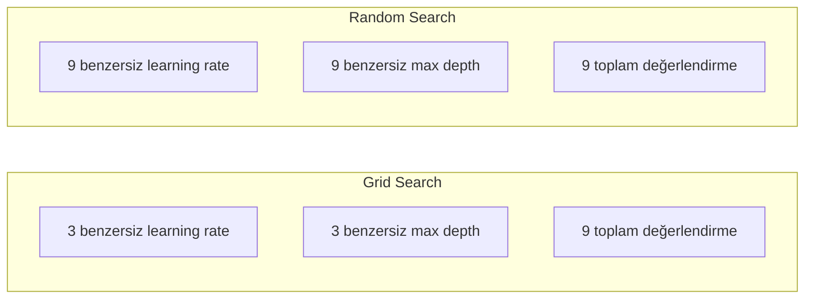
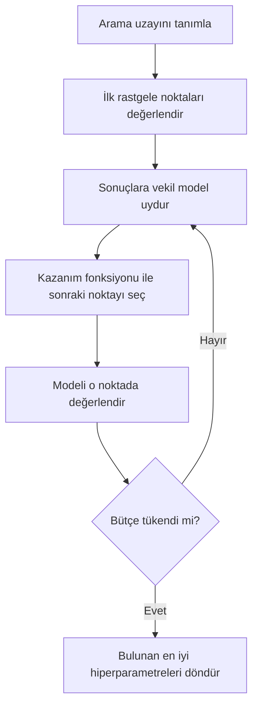
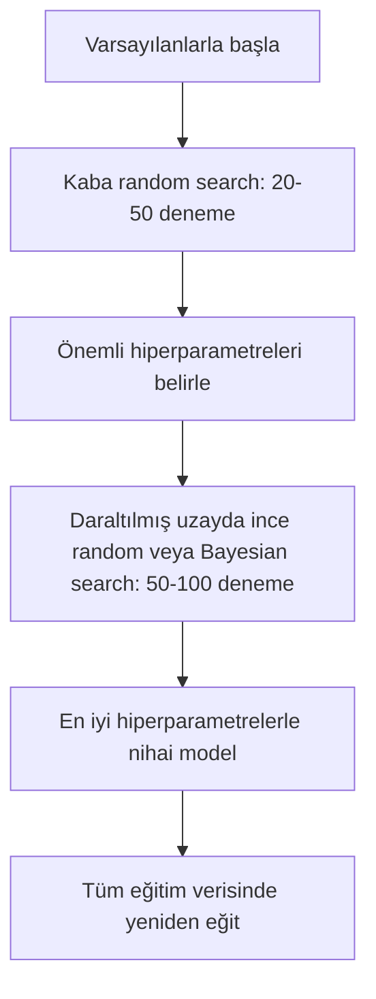
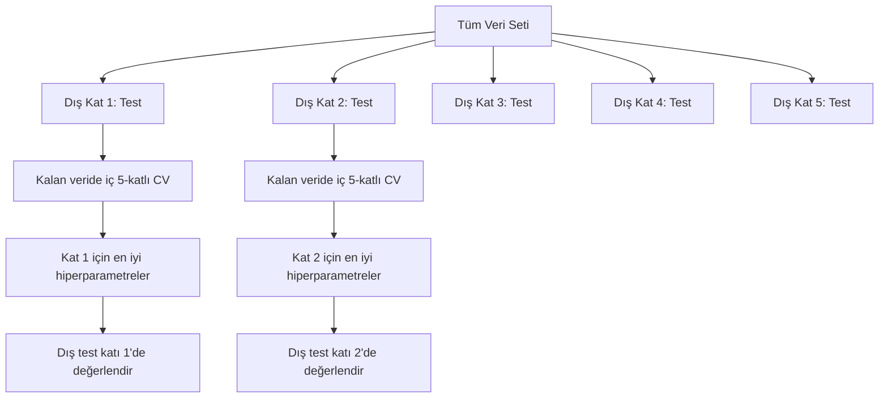

> **Orijinal İçerik:** [docs/en.md](https://github.com/rohitg00/ai-engineering-from-scratch/blob/main/phases/02-ml-fundamentals/12-hyperparameter-tuning/docs/en.md)

# Hiperparametre Ayarı (Hyperparameter Tuning)

> Hiperparametreler, eğitim başlamadan önce çevirdiğiniz düğmelerdir. Onları iyi ayarlamak, vasat bir modelle harika bir model arasındaki farktır.

**Tür:** Build
**Diller:** Python
**Ön Koşullar:** Phase 2, Lesson 11 (Ensemble Methods)
**Süre:** ~90 dakika

## Öğrenme Hedefleri

- Grid search, random search ve Bayesian optimizasyonu sıfırdan uygulamak ve örneklem verimliliklerini karşılaştırmak
- Çoğu hiperparametrenin düşük efektif boyutuluğa (low effective dimensionality) sahip olması nedeniyle random search'ün neden grid search'ten daha iyi performans gösterdiğini açıklamak
- Aramayı yönlendirmek için bir vekil model (surrogate model) ve kazanım fonksiyonu (acquisition function) kullanan bir Bayesian optimizasyon döngüsü kurmak
- Doğru çapraz doğrulama (cross-validation) ile validasyon setine overfitting'i önleyen bir hiperparametre ayarlama stratejisi tasarlamak

## Problem

Gradient boosting modelinizin bir öğrenme oranı (learning rate), ağaç sayısı, maksimum derinlik, yaprak başına minimum örnek sayısı, alt örnekleme oranı ve sütun örnekleme oranı vardır. Bu altı hiperparametredir. Her birinin 5 makul değeri varsa, grid 5^6 = 15,625 kombinasyona sahiptir. Her birini eğitmek 10 saniye sürer. Hepsini denemek 43 saatlik işlem gücü demektir.

Grid search bariz yaklaşımdır ve ölçekte en kötüsüdür. Random search daha az işlemle daha iyisini yapar. Bayesian optimizasyon ise geçmiş değerlendirmelerden öğrenerek daha da iyisini yapar. Hangi stratejiyi kullanacağınızı ve hangi hiperparametrelerin gerçekten önemli olduğunu bilmek, günlerce boşa harcanmış GPU süresinden tasarruf sağlar.

## Konsept

### Parametreler ve Hiperparametreler

Parametreler eğitim sırasında öğrenilir (ağırlıklar, bias'lar, bölünme eşikleri). Hiperparametreler eğitim başlamadan önce belirlenir ve öğrenmenin nasıl gerçekleşeceğini kontrol eder.

| Hiperparametre | Ne kontrol eder | Tipik aralık |
|---------------|-----------------|---------------|
| Öğrenme oranı (learning rate) | Güncelleme başına adım büyüklüğü | 0.001 ile 1.0 |
| Ağaç/epoch sayısı | Ne kadar süre eğitileceği | 10 ile 10,000 |
| Maksimum derinlik (max depth) | Model karmaşıklığı | 1 ile 30 |
| Regularizasyon (lambda) | Overfitting önleme | 0.0001 ile 100 |
| Batch boyutu | Gradyan tahmin gürültüsü | 16 ile 512 |
| Dropout oranı | Düşürülen nöron oranı | 0.0 ile 0.5 |

### Grid Search

Grid search, belirtilen değerlerin her kombinasyonunu değerlendirir. Kapsamlıdır ve anlaşılması kolaydır, ancak hiperparametre sayısıyla üstel olarak ölçeklenir.

```
2 hiperparametre için grid:

  learning_rate: [0.01, 0.1, 1.0]
  max_depth:     [3, 5, 7]

  Değerlendirme: 3 x 3 = 9 kombinasyon

  (0.01, 3)  (0.01, 5)  (0.01, 7)
  (0.1,  3)  (0.1,  5)  (0.1,  7)
  (1.0,  3)  (1.0,  5)  (1.0,  7)
```

Grid search'in temel bir kusuru vardır: eğer bir hiperparametre önemliyken diğeri önemsizse, çoğu değerlendirme boşa gider. 9 değerlendirmeden önemli parametrenin yalnızca 3 benzersiz değerini elde edersiniz.

### Random Search

Random search, hiperparametreleri bir grid yerine dağılımlardan örnekler. Aynı 9 değerlendirme bütçesiyle, her hiperparametrenin 9 benzersiz değerini elde edersiniz.



Random'ın grid'i neden yendiği (Bergstra & Bengio, 2012):

- Çoğu hiperparametrenin düşük efektif boyutuluğu vardır. Belirli bir problem için genellikle 6 hiperparametreden yalnızca 1-2'si önemlidir.
- Grid search, değerlendirmeleri önemsiz boyutlarda harcar.
- Random search, aynı bütçeyle önemli boyutları daha yoğun şekilde kapsar.
- 60 rastgele denemede, optimumun %5'i içinde bir nokta bulma olasılığınız %95'tir (eğer arama uzayında böyle bir nokta varsa).

### Bayesian Optimizasyonu

Random search sonuçları görmezden gelir. Yüksek öğrenme oranlarının ıraksamaya neden olduğunu veya derinlik 3'ün derinlik 10'dan sürekli daha iyi performans gösterdiğini öğrenmez. Bayesian optimizasyonu, bir sonraki adımda nereyi arayacağına karar vermek için geçmiş değerlendirmeleri kullanır.



İki temel bileşen:

**Vekil model (surrogate model):** Değerlendirmesi ucuz olan (genellikle bir Gaussian process), pahalı amaç fonksiyonunu yaklaşık olarak hesaplayan bir modeldir. Arama uzayındaki herhangi bir noktada hem tahmin hem de belirsizlik tahmini verir.

**Kazanım fonksiyonu (acquisition function):** Sömürü (exploitation - bilinen iyi noktaların yakınında arama) ve keşif (exploration - belirsizliğin yüksek olduğu yerlerde arama) arasında denge kurarak bir sonraki noktanın nerede değerlendirileceğine karar verir. Yaygın seçenekler:

- **Expected Improvement (EI):** Bu noktada mevcut en iyiden ne kadar iyileşme bekliyoruz?
- **Upper Confidence Bound (UCB):** Tahmin artı belirsizliğin bir katı. Yüksek UCB ya umut verici ya da keşfedilmemiş anlamına gelir.
- **Probability of Improvement (PI):** Bu noktanın mevcut en iyiyi geçme olasılığı nedir?

Bayesian optimizasyonu tipik olarak random search'ten 2-5 kat daha az değerlendirmeyle daha iyi hiperparametreler bulur. Vekil modeli uydurmanın getirdiği ek yük, gerçek modeli eğitmeye kıyasla ihmal edilebilir düzeydedir.

### Erken Durdurma (Early Stopping)

Her eğitim çalışmasının bitmesi gerekmez. Bir konfigürasyon 10 epoch'tan sonra açıkça kötüyse, durdurun ve devam edin. Hiperparametre araması bağlamında buna erken durdurma denir.

Stratejiler:
- **Patience-tabanlı:** Validasyon kaybı art arda N epoch iyileşmediyse durdur
- **Median pruning:** Denemenin ara sonucu, aynı adımdaki tamamlanmış denemelerin medyanından kötüyse durdur
- **Hyperband:** Birçok konfigürasyona küçük bütçeler ayırın, ardından en iyilerin bütçesini kademeli olarak artırın

Hyperband özellikle etkilidir. 81 konfigürasyonu 1 epoch ile başlatır, en iyi üçte birini tutar, onlara 3 epoch verir, en iyi üçte birini tutar ve bu şekilde devam eder. Bu, tüm konfigürasyonları tam bütçeyle değerlendirmekten 10-50 kat daha hızlı iyi konfigürasyonlar bulur.

### Öğrenme Oranı Zamanlayıcıları (Learning Rate Schedulers)

Öğrenme oranı neredeyse her zaman en önemli hiperparametredir. Sabit tutmak yerine, zamanlayıcılar onu eğitim sırasında ayarlar.

| Zamanlayıcı | Formül | Ne zaman kullanılır |
|-----------|---------|-------------|
| Step decay | Her N epoch'ta 0.1 ile çarp | Klasik CNN eğitimi |
| Cosine annealing | lr * 0.5 * (1 + cos(pi * t / T)) | Modern varsayılan |
| Warmup + decay | Lineer artış sonra cosine azalış | Transformer'lar |
| One-cycle | Bir döngüde artış sonra azalış | Hızlı yakınsama |
| Reduce on plateau | Metrik durduğunda faktörle azalt | Güvenli varsayılan |

### Hiperparametre Önemi

Tüm hiperparametreler eşit derecede önemli değildir. Random forest (Probst ve ark., 2019) ve gradient boosting üzerine araştırmalar tutarlı modeller gösterir:

**Yüksek önem:**
- Öğrenme oranı (her zaman önce ayarlayın)
- Tahminleyici/epoch sayısı (ayarlamak yerine erken durdurma kullanın)
- Regularizasyon şiddeti

**Orta önem:**
- Maksimum derinlik / katman sayısı
- Yaprak başına minimum örnek / weight decay
- Alt örnekleme oranı

**Düşük önem:**
- Maksimum özellik sayısı (random forest için)
- Spesifik aktivasyon fonksiyonu seçimi
- Batch boyutu (makul aralık içinde)

Önce önemli olanları ayarlayın, gerisini varsayılanlarda bırakın.

### Pratik Strateji



Somut iş akışı:

1. **Kütüphane varsayılanlarıyla başlayın.** Deneyimli uygulayıcılar tarafından seçilmiştir ve genellikle hedefin %80'ine ulaşırlar.
2. **Kaba random search.** Geniş aralıklar, 20-50 deneme. Kötü çalışmaları hızlıca öldürmek için erken durdurma kullanın.
3. **Sonuçları analiz edin.** Hangi hiperparametreler performansla ilişkili? Arama uzayını daraltın.
4. **İnce arama.** Daraltılmış uzayda Bayesian optimizasyonu veya odaklı random search. 50-100 deneme.
5. **Tüm eğitim verisinde yeniden eğitin** bulunan en iyi hiperparametrelerle.

### Çapraz Doğrulama Entegrasyonu

Hiperparametreleri tek bir validasyon bölmesinde (split) ayarlamak risklidir. En iyi hiperparametreler belirli validasyon katına (fold) overfit olabilir. Nested cross-validation, iki döngü kullanarak bunu çözer:

- **Dış döngü** (değerlendirme): veriyi eğitim+validasyon ve test olarak ayırır. Tarafsız performans raporlar.
- **İç döngü** (ayar): eğitim+validasyonu eğitim ve validasyon olarak ayırır. En iyi hiperparametreleri bulur.



Her dış kat, kendi en iyi hiperparametrelerini bağımsız olarak bulur. Dış skorlar, genelleme performansının tarafsız bir tahminidir.

sklearn ile:

```python
from sklearn.model_selection import cross_val_score, GridSearchCV
from sklearn.ensemble import GradientBoostingRegressor

inner_cv = GridSearchCV(
    GradientBoostingRegressor(),
    param_grid={
        "learning_rate": [0.01, 0.05, 0.1],
        "max_depth": [2, 3, 5],
        "n_estimators": [50, 100, 200],
    },
    cv=5,
    scoring="neg_mean_squared_error",
)

outer_scores = cross_val_score(
    inner_cv, X, y, cv=5, scoring="neg_mean_squared_error"
)

print(f"Nested CV MSE: {-outer_scores.mean():.4f} +/- {outer_scores.std():.4f}")
```

#### Açıklama
Bu kod, nested cross-validation (iç içe çapraz doğrulama) uygular. `GridSearchCV` iç döngü olarak çalışır ve her kat için en iyi hiperparametreleri bulur. `cross_val_score` dış döngüdür ve modelin genelleme performansını tarafsız bir şekilde değerlendirir. Bu pahalıdır (5 dış kat x 5 iç kat x 27 grid noktası = 675 model uyumu), ancak güvenilir bir performans tahmini verir. Makalelerde nihai sonuçları raporlarken veya kararın önemli olduğu durumlarda kullanın.

### Pratik İpuçları

**Öğrenme oranıyla başlayın.** Gradyan tabanlı yöntemler için her zaman en önemli hiperparametredir. Kötü bir öğrenme oranı diğer her şeyi anlamsız kılar. Diğer hiperparametreleri varsayılanlarda sabitleyin ve önce öğrenme oranını tarayın.

**Öğrenme oranı ve regularizasyon için log-uniform dağılımlar kullanın.** 0.001 ile 0.01 arasındaki fark, 0.1 ile 1.0 arasındaki fark kadar önemlidir. Lineer arama, bütçeyi büyük uçta boşa harcar.

**n_estimators'ı ayarlamak yerine erken durdurma kullanın.** Boosting ve sinir ağları için n_estimators veya epoch'ları yüksek ayarlayın ve erken durdurmanın ne zaman duracağına karar vermesine izin verin. Bu, aramadan bir hiperparametreyi çıkarır.

**Bütçe dağılımı.** Ayar bütçenizin %60'ını en önemli 2 hiperparametreye harcayın. Kalan %40'ını diğer her şeye ayırın. En önemli 2 tanesi, performans değişiminin çoğundan sorumludur.

**Ölçek önemlidir.** Batch boyutunu asla log ölçekte aramayın (16, 32, 64 iyidir). Öğrenme oranını her zaman log ölçekte arayın. Arama dağılımını, hiperparametrenin modeli nasıl etkilediğiyle eşleştirin.

| Model Türü | En Önemli Hiperparametreler | Önerilen Arama | Bütçe |
|-----------|--------------------|--------------------|--------|
| Random Forest | n_estimators, max_depth, min_samples_leaf | Random search, 50 deneme | Düşük (hızlı eğitim) |
| Gradient Boosting | learning_rate, n_estimators, max_depth | Bayesian, 100 deneme + erken durdurma | Orta |
| Sinir Ağı | learning_rate, weight_decay, batch_size | Bayesian veya random, 100+ deneme | Yüksek (yavaş eğitim) |
| SVM | C, gamma (RBF kernel) | Log ölçekte grid, 25-50 deneme | Düşük (2 parametre) |
| Lasso/Ridge | alpha | Log ölçekte 1B arama, 20 deneme | Çok düşük |
| XGBoost | learning_rate, max_depth, subsample, colsample | Bayesian, 100-200 deneme + erken durdurma | Orta |

**Emin olmadığınızda:** deneme sayısı hiperparametre sayısının 2 katı olacak şekilde random search (örneğin, 6 hiperparametre = en az 12+ deneme). 50 denemeli random search'ün dikkatlice tasarlanmış grid search'ü ne sıklıkla yendiğine şaşıracaksınız.

## Build It (İnşa Et)

### Adım 1: Sıfırdan Grid Search

```python
def grid_search(model_fn, param_grid, X_train, y_train, X_val, y_val):
    keys = list(param_grid.keys())
    values = list(param_grid.values())
    best_score = -float("inf")
    best_params = None
    n_evals = 0

    for combo in itertools.product(*values):
        params = dict(zip(keys, combo))
        model = model_fn(**params)
        model.fit(X_train, y_train)
        score = evaluate(model, X_val, y_val)
        n_evals += 1

        if score > best_score:
            best_score = score
            best_params = params

    return best_params, best_score, n_evals
```

#### Açıklama
Bu fonksiyon grid search'i sıfırdan uygular. `param_grid` sözlüğündeki tüm anahtar-değer kombinasyonlarını dolaşır (`itertools.product` ile), her bir kombinasyon için model oluşturup eğitir ve validasyon setindeki performansı kaydeder. En yüksek skoru veren parametreleri döndürür.

### Adım 2: Sıfırdan Random Search

```python
def random_search(model_fn, param_distributions, X_train, y_train,
                  X_val, y_val, n_iter=50, seed=42):
    rng = np.random.RandomState(seed)
    best_score = -float("inf")
    best_params = None

    for _ in range(n_iter):
        params = {k: sample(v, rng) for k, v in param_distributions.items()}
        model = model_fn(**params)
        model.fit(X_train, y_train)
        score = evaluate(model, X_val, y_val)

        if score > best_score:
            best_score = score
            best_params = params

    return best_params, best_score, n_iter
```

#### Açıklama
Bu fonksiyon random search'ü uygular. Grid'deki tüm kombinasyonları denemek yerine, `param_distributions` içinde tanımlanan dağılımlardan `n_iter` kere rastgele örnekler alır. Her örnek, grid search'ün her parametre için verdiği sabit sayıdaki benzersiz değerin aksine, her parametre için benzersiz bir değer sağlar. Bu, önemli hiperparametrelerin daha yoğun taranmasını sağlar.

### Adım 3: Bayesian Optimizasyonu (Basitleştirilmiş)

```python
class SimpleBayesianOptimizer:
    def __init__(self, search_space, n_initial=5):
        self.search_space = search_space
        self.n_initial = n_initial
        self.X_observed = []
        self.y_observed = []

    def _kernel(self, x1, x2, length_scale=1.0):
        dists = np.sum((x1[:, None, :] - x2[None, :, :]) ** 2, axis=2)
        return np.exp(-0.5 * dists / length_scale ** 2)

    def _fit_gp(self, X_new):
        X_obs = np.array(self.X_observed)
        y_obs = np.array(self.y_observed)
        y_mean = y_obs.mean()
        y_centered = y_obs - y_mean

        K = self._kernel(X_obs, X_obs) + 1e-4 * np.eye(len(X_obs))
        K_star = self._kernel(X_new, X_obs)

        L = np.linalg.cholesky(K)
        alpha = np.linalg.solve(L.T, np.linalg.solve(L, y_centered))
        mu = K_star @ alpha + y_mean

        v = np.linalg.solve(L, K_star.T)
        var = 1.0 - np.sum(v ** 2, axis=0)
        var = np.maximum(var, 1e-6)

        return mu, var

    def _expected_improvement(self, mu, var, best_y):
        sigma = np.sqrt(var)
        z = (mu - best_y) / (sigma + 1e-10)
        ei = sigma * (z * norm_cdf(z) + norm_pdf(z))
        return ei

    def suggest(self):
        if len(self.X_observed) < self.n_initial:
            return sample_random(self.search_space)

        candidates = [sample_random(self.search_space) for _ in range(500)]
        X_cand = np.array([to_vector(c) for c in candidates])
        mu, var = self._fit_gp(X_cand)
        ei = self._expected_improvement(mu, var, max(self.y_observed))
        return candidates[np.argmax(ei)]

    def observe(self, params, score):
        self.X_observed.append(to_vector(params))
        self.y_observed.append(score)
```

#### Açıklama
Bu sınıf Bayesian optimizasyonunu basitleştirilmiş bir şekilde uygular. Temel fikir: gözlemlenen (hiperparametre, skor) çiftlerine bir Gaussian process (RBF kernel ile) uydurur, ardından Expected Improvement (EI) kazanım fonksiyonunu kullanarak bir sonraki noktayı seçer. GP vekil modeli her aday noktada iki şey verir: tahmin edilen skor (mu) ve belirsizlik (var). Expected Improvement bunları dengeler: modelin yüksek skor tahmin ettiği VEYA belirsizliğin yüksek olduğu noktaları tercih eder. Başlangıçta çoğu noktanın belirsizliği yüksektir, bu nedenle keşif (exploration) yapılır. Zamanla en umut verici bölgeye odaklanılır.

### Adım 4: Tüm Yöntemleri Karşılaştır

```python
def synthetic_objective(params):
    lr = params["learning_rate"]
    depth = params["max_depth"]
    return -(np.log10(lr) + 2) ** 2 - (depth - 4) ** 2 + 10

param_grid = {
    "learning_rate": [0.001, 0.01, 0.1, 1.0],
    "max_depth": [2, 3, 4, 5, 6, 7, 8],
}

grid_best = None
grid_score = -float("inf")
grid_history = []
for combo in itertools.product(*param_grid.values()):
    params = dict(zip(param_grid.keys(), combo))
    score = synthetic_objective(params)
    grid_history.append((params, score))
    if score > grid_score:
        grid_score = score
        grid_best = params

param_dist = {
    "learning_rate": ("log_float", 0.001, 1.0),
    "max_depth": ("int", 2, 8),
}

rand_best = None
rand_score = -float("inf")
rand_history = []
rng = np.random.RandomState(42)
for _ in range(28):
    params = {k: sample(v, rng) for k, v in param_dist.items()}
    score = synthetic_objective(params)
    rand_history.append((params, score))
    if score > rand_score:
        rand_score = score
        rand_best = params

optimizer = SimpleBayesianOptimizer(param_dist, n_initial=5)
bayes_history = []
for _ in range(28):
    params = optimizer.suggest()
    score = synthetic_objective(params)
    optimizer.observe(params, score)
    bayes_history.append((params, score))
bayes_score = max(s for _, s in bayes_history)

print(f"{'Method':<20} {'Best Score':>12} {'Evaluations':>12}")
print("-" * 50)
print(f"{'Grid Search':<20} {grid_score:>12.4f} {len(grid_history):>12}")
print(f"{'Random Search':<20} {rand_score:>12.4f} {len(rand_history):>12}")
print(f"{'Bayesian Opt':<20} {bayes_score:>12.4f} {len(bayes_history):>12}")
```

#### Açıklama
Bu karşılaştırma, aynı sentetik amaç fonksiyonu üzerinde üç yöntemi aynı bütçeyle test eder. Aynı bütçeyle, Bayesian optimizasyonu en iyi skoru en hızlı bulur çünkü değerlendirmeleri açıkça kötü bölgelerde harcamaz. Random search, grid search'ten daha fazla alanı kapsar. Grid search yalnızca çok az hiperparametreniz olduğunda ve kapsamlı olmayı göze alabildiğinizde kazanır.

## Use It (Kullan)

### Pratikte Optuna

Optuna, ciddi hiperparametre ayarı için önerilen kütüphanedir. Kullanıma hazır pruning, dağıtık arama ve görselleştirme desteği sunar.

```python
import optuna

def objective(trial):
    lr = trial.suggest_float("learning_rate", 1e-4, 1e-1, log=True)
    n_est = trial.suggest_int("n_estimators", 50, 500)
    max_depth = trial.suggest_int("max_depth", 2, 10)

    model = GradientBoostingRegressor(
        learning_rate=lr,
        n_estimators=n_est,
        max_depth=max_depth,
    )
    model.fit(X_train, y_train)
    return mean_squared_error(y_val, model.predict(X_val))

study = optuna.create_study(direction="minimize")
study.optimize(objective, n_trials=100)

print(f"Best params: {study.best_params}")
print(f"Best MSE: {study.best_value:.4f}")
```

#### Açıklama
Bu kod Optuna kullanarak hiperparametre ayarı yapar. `suggest_float(..., log=True)` log ölçekte aranması gereken parametreler içindir (learning rate, regularizasyon). `suggest_int` tam sayı parametreler, `suggest_categorical` kategorik seçimler içindir. `study.optimize` belirtilen sayıda denemeyi çalıştırır ve en iyi parametreleri bulur.

### Optuna ile Pruning

Pruning, umut vermeyen denemeleri erken durdurarak büyük miktarda işlem gücü tasarrufu sağlar.

```python
import optuna
from sklearn.model_selection import cross_val_score

def objective(trial):
    params = {
        "learning_rate": trial.suggest_float("lr", 1e-4, 0.5, log=True),
        "max_depth": trial.suggest_int("max_depth", 2, 10),
        "n_estimators": trial.suggest_int("n_estimators", 50, 500),
        "subsample": trial.suggest_float("subsample", 0.5, 1.0),
    }

    model = GradientBoostingRegressor(**params)
    scores = cross_val_score(model, X_train, y_train, cv=3,
                             scoring="neg_mean_squared_error")
    mean_score = -scores.mean()

    trial.report(mean_score, step=0)
    if trial.should_prune():
        raise optuna.TrialPruned()

    return mean_score

pruner = optuna.pruners.MedianPruner(n_startup_trials=10, n_warmup_steps=5)
study = optuna.create_study(direction="minimize", pruner=pruner)
study.optimize(objective, n_trials=200)
```

#### Açıklama
`MedianPruner`, bir denemenin ara değeri aynı adımdaki tamamlanmış denemelerin medyanından kötüyse o denemeyi durdurur. `trial.report()` ara metrikleri bildirmek, `trial.should_prune()` ise denemenin durdurulup durdurulmayacağını kontrol etmek için kullanılır. `n_startup_trials=10` en az 10 denemenin tamamlanmasını sağlar, ardından pruning devreye girer. Bu tipik olarak toplam işlem gücünün %40-60'ını tasarruf eder.

### sklearn'in Yerleşik Ayarlayıcıları

Hızlı deneyler için sklearn, `GridSearchCV`, `RandomizedSearchCV` ve `HalvingRandomSearchCV` sunar.

```python
from sklearn.model_selection import RandomizedSearchCV
from scipy.stats import loguniform, randint

param_dist = {
    "learning_rate": loguniform(1e-4, 0.5),
    "max_depth": randint(2, 10),
    "n_estimators": randint(50, 500),
}

search = RandomizedSearchCV(
    GradientBoostingRegressor(),
    param_dist,
    n_iter=100,
    cv=5,
    scoring="neg_mean_squared_error",
    random_state=42,
    n_jobs=-1,
)
search.fit(X_train, y_train)
print(f"Best params: {search.best_params_}")
print(f"Best CV MSE: {-search.best_score_:.4f}")
```

#### Açıklama
Bu kod, sklearn'in `RandomizedSearchCV` sınıfını kullanır. `loguniform` (scipy'dan) öğrenme oranı ve regularizasyon için, `randint` ise tamsayı hiperparametreler için kullanılır. `n_jobs=-1` parametresi işlemi tüm CPU çekirdeklerine paralelleştirir.

### Hiperparametre Ayarında Sık Yapılan Hatalar

**Ön işleme yoluyla veri sızıntısı (data leakage).** Çapraz doğrulamadan önce tüm veri setine bir scaler uydurursanız, validasyon katındaki bilgi eğitime sızar. Ön işlemeyi her zaman bir `Pipeline` içine koyun, böylece yalnızca eğitim katında uyum yapılır.

**Validasyon setine overfitting.** Binlerce deneme çalıştırmak, etkili bir şekilde validasyon seti üzerinde eğitim yapmaktır. Nihai performans tahminleri için nested cross-validation kullanın veya ayar sırasında asla dokunmadığınız ayrı bir test seti ayırın.

**Çok dar bir aralık aramak.** En iyi değeriniz arama uzayınızın sınırındaysa, yeterince geniş aramamışsınız demektir. Optimum değer aralığınızın dışında olabilir. En iyi parametrelerin her zaman kenarlarda olup olmadığını kontrol edin.

**Etkileşim etkilerini göz ardı etmek.** Boosting'de öğrenme oranı ve tahminleyici sayısı güçlü bir şekilde etkileşir. Düşük bir öğrenme oranı daha fazla tahminleyici gerektirir. Bunları bağımsız ayarlamak, birlikte ayarlamaktan daha kötü sonuç verir.

**Yinelemeli modeller için erken durdurma kullanmamak.** Gradient boosting ve sinir ağları için n_estimators veya epoch'ları yüksek bir değere ayarlayın ve erken durdurma kullanın. Bu, yineleme sayısını bir hiperparametre olarak ayarlamaktan kesinlikle daha iyidir.

## Alıştırmalar

1. Aynı toplam bütçeyle (örneğin 50 değerlendirme) grid search ve random search çalıştırın. Bulunan en iyi skorları karşılaştırın. Deneyi farklı seed'lerle 10 kez tekrarlayın. Random search ne sıklıkla kazanıyor?

2. Hyperband'ı sıfırdan uygulayın. Her biri 1 epoch eğitilmiş 81 konfigürasyonla başlayın. Her turda en iyi 1/3'ü tutun ve bütçelerini üçe katlayın. Toplam işlem gücünü (tüm konfigürasyonlardaki tüm epoch'ların toplamı) 81 konfigürasyonu tam bütçeyle çalıştırmakla karşılaştırın.

3. Ders 11'deki gradient boosting uygulamasına bir öğrenme oranı zamanlayıcısı (cosine annealing) ekleyin. Sabit bir öğrenme oranına göre daha iyi performans gösteriyor mu?

4. Gerçek bir veri setinde (örneğin sklearn'in breast cancer veri seti) bir RandomForestClassifier'ı ayarlamak için Optuna kullanın. `optuna.visualization.plot_param_importances(study)` ile hangi hiperparametrelerin en önemli olduğunu görün. Bu dersin önem sıralamasıyla eşleşiyor mu?

5. Basit bir kazanım fonksiyonu (Expected Improvement) uygulayın ve keşif (exploration) ile sömürüyü (exploitation) gösterin. Vekil modelin ortalamasını ve belirsizliğini çizin ve EI'nin nerede değerlendirme yapmayı seçtiğini gösterin.

## Anahtar Terimler

| Terim | İnsanlar ne der | Gerçekte ne anlama gelir |
|------|----------------|----------------------|
| Hiperparametre | "Seçtiğiniz bir ayar" | Eğitimden önce belirlenen, öğrenme sürecini kontrol eden, veriden öğrenilmeyen değer |
| Grid search | "Her kombinasyonu dene" | Belirtilen parametre grid'i üzerinde kapsamlı arama. Üstel maliyet. |
| Random search | "Rastgele örnekle" | Hiperparametreleri dağılımlardan örnekle. Önemli boyutları grid search'ten daha iyi kapsar. |
| Bayesian optimizasyonu | "Akıllı arama" | Amaç fonksiyonunun bir vekil modelini kullanarak bir sonraki noktanın nerede değerlendirileceğine karar verir, keşif ve sömürüyü dengeler |
| Vekil model (surrogate model) | "Ucuz bir yaklaşım" | Gözlemlenen değerlendirmelerden pahalı amaç fonksiyonunu yaklaşık olarak hesaplayan model (genellikle Gaussian process) |
| Kazanım fonksiyonu (acquisition function) | "Nereye bakmalı" | Aday noktaları, beklenen iyileşme ile belirsizliği dengeleyerek puanlar. EI ve UCB yaygın seçeneklerdir. |
| Erken durdurma (early stopping) | "Zaman harcamayı bırak" | Validasyon performansı iyileşmeyi durdurduğunda eğitimi erken sonlandır |
| Hyperband | "Turnuva usulü konfigürasyon seçimi" | Uyarlanabilir kaynak dağıtımı: küçük bütçelerle çok sayıda konfigürasyona başla, en iyileri tut ve bütçelerini artır |
| Öğrenme oranı zamanlayıcısı | "Eğitim sırasında lr'yi değiştir" | Daha iyi yakınsama için öğrenme oranını eğitim süresince ayarlayan fonksiyon |

## Daha Fazla Okuma

- [Bergstra & Bengio: Random Search for Hyper-Parameter Optimization (2012)](https://jmlr.org/papers/v13/bergstra12a.html) -- random'ın grid'i yendiğini gösteren makale
- [Snoek et al., Practical Bayesian Optimization of Machine Learning Algorithms (2012)](https://arxiv.org/abs/1206.2944) -- ML için Bayesian optimizasyonu
- [Li et al., Hyperband: A Novel Bandit-Based Approach (2018)](https://jmlr.org/papers/v18/16-558.html) -- Hyperband makalesi
- [Optuna: A Next-generation Hyperparameter Optimization Framework](https://arxiv.org/abs/1907.10902) -- Optuna makalesi
- [Probst et al., Tunability: Importance of Hyperparameters (2019)](https://jmlr.org/papers/v20/18-444.html) -- hangi hiperparametrelerin önemli olduğu
