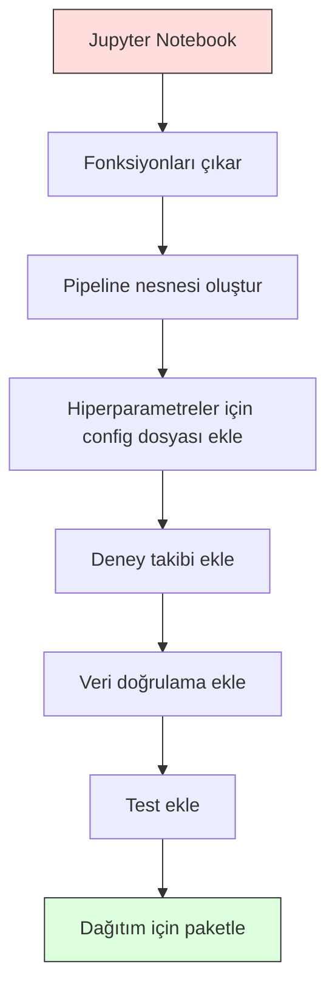

> **Orijinal İçerik:** [docs/en.md](https://github.com/rohitg00/ai-engineering-from-scratch/blob/main/phases/02-ml-fundamentals/13-ml-pipelines/docs/en.md)

# ML Pipeline'ları (İş Hatları)

> Bir model ürün değildir. Pipeline öyledir. Pipeline, ham veriden canlı tahmine kadar her şeydir ve her adım tekrarlanabilir olmalıdır.

**Tür:** Build
**Diller:** Python
**Ön Koşullar:** Phase 2, Lesson 12 (Hyperparameter Tuning)
**Süre:** ~120 dakika

## Öğrenme Hedefleri

- Sıfırdan bir ML pipeline inşa ederek imputation, scaling, encoding ve model eğitimini tek bir tekrarlanabilir nesnede zincirleme
- Veri sızıntısı (data leakage) senaryolarını tanıma ve pipeline'ların transform'ları yalnızca eğitim verisine fit ederek bu sızıntıları nasıl önlediğini açıklama
- Sayısal ve kategorik feature'lara farklı ön işleme uygulayan bir ColumnTransformer oluşturma
- Pipeline serileştirme (serialization) uygulama ve aynı fitted pipeline'ın eğitim ve üretim ortamlarında özdeş sonuçlar verdiğini gösterme

## Problem

Bir notebook'unuz var: veriyi yüklüyor, eksik değerleri medyan ile dolduruyor, feature'ları ölçekliyor, bir model eğitiyor ve doğruluk yazdırıyor. Çalışıyor. Gönderiyorsunuz.

Bir ay sonra birisi modeli yeniden eğitiyor ve farklı sonuçlar alıyor. Medyan, test verisi dahil tüm veri kümesi üzerinden hesaplanmıştı (veri sızıntısı). Scaling parametreleri kaydedilmemişti, bu yüzden inference farklı istatistikler kullanıyor. Feature engineering kodu eğitim ve sunum arasında kopyalanıp yapıştırılmıştı ve kopyalar farklılaşmıştı. Kategorik bir sütun, üretimde encoder'ın hiç görmediği yeni bir değer almıştı.

Bunlar varsayımsal değil. ML sistemlerinin üretimde başarısız olmasının en yaygın nedenleridir. Pipeline'lar, her dönüşüm adımını tek bir sıralı, tekrarlanabilir nesnede paketleyerek tüm bu sorunları çözer.

## Kavram

### Pipeline Nedir?

Pipeline, ardından bir model gelen, sıralı veri dönüşümleridir. Her adım, bir önceki adımın çıktısını girdi olarak alır. Pipeline'ın tamamı eğitim verisi üzerinde bir kez fit edilir. Çıkarım (inference) anında aynı fitted pipeline yeni veriyi dönüştürür ve tahmin üretir.


Pipeline şunları garanti eder:
- Dönüşümler yalnızca eğitim verisine fit edilir (sızıntı olmaz)
- Aynı dönüşümler çıkarım anında da uygulanır
- Tüm nesne tek bir yapı olarak serileştirilebilir ve dağıtılabilir
- Cross-validation pipeline'ı her fold'da ayrı ayrı uygulayarak ince sızıntıları önler

### Veri Sızıntısı (Data Leakage): Sessiz Katil

Veri sızıntısı, test seti veya gelecek verilerden gelen bilginin eğitimi kirletmesidir. Pipeline'lar en yaygın biçimlerini engeller.

**Sızıntılı (yanlış):**
```python
X = df.drop("target", axis=1)
y = df["target"]

scaler = StandardScaler()
X_scaled = scaler.fit_transform(X)

X_train, X_test = X_scaled[:800], X_scaled[800:]
y_train, y_test = y[:800], y[800:]
```
#### Açıklama
Scaler test verisini görmüştür. Ortalama ve standart sapma test örneklerini içerir. Bu, doğruluk tahminini şişirir.

**Doğru:**
```python
X_train, X_test = X[:800], X[800:]

scaler = StandardScaler()
X_train_scaled = scaler.fit_transform(X_train)
X_test_scaled = scaler.transform(X_test)
```
#### Açıklama
Pipeline ile bunu düşünmeniz gerekmez. Pipeline sizin için otomatik halleder.

### sklearn Pipeline

sklearn'in `Pipeline`'ı, transformer'ları ve bir estimator'ı zincirler. Tüm adımları sırayla uygulayan `.fit()`, `.predict()` ve `.score()` metotlarını sunar.

```python
from sklearn.pipeline import Pipeline
from sklearn.preprocessing import StandardScaler
from sklearn.linear_model import LogisticRegression

pipe = Pipeline([
    ("scaler", StandardScaler()),
    ("model", LogisticRegression()),
])

pipe.fit(X_train, y_train)
predictions = pipe.predict(X_test)
```
#### Açıklama
`pipe.fit(X_train, y_train)` çağrıldığında:
1. Scaler, X_train üzerinde `fit_transform` çağırır
2. Model, ölçeklenmiş X_train üzerinde `fit` çağırır

`pipe.predict(X_test)` çağrıldığında:
1. Scaler, X_test üzerinde `transform` çağırır (fit_transform değil)
2. Model, ölçeklenmiş X_test üzerinde `predict` çağırır

Scaler, fit sırasında test verisini asla görmez. Bütün mesele budur.

### ColumnTransformer: Farklı Sütunlar İçin Farklı Pipeline'lar

Gerçek veri kümeleri, farklı ön işleme gerektiren sayısal ve kategorik sütunlar içerir. `ColumnTransformer` bunu halleder.

```python
from sklearn.compose import ColumnTransformer
from sklearn.preprocessing import StandardScaler, OneHotEncoder
from sklearn.impute import SimpleImputer

numeric_pipe = Pipeline([
    ("impute", SimpleImputer(strategy="median")),
    ("scale", StandardScaler()),
])

categorical_pipe = Pipeline([
    ("impute", SimpleImputer(strategy="most_frequent")),
    ("encode", OneHotEncoder(handle_unknown="ignore")),
])

preprocessor = ColumnTransformer([
    ("num", numeric_pipe, ["age", "income", "score"]),
    ("cat", categorical_pipe, ["city", "gender", "plan"]),
])

full_pipeline = Pipeline([
    ("preprocess", preprocessor),
    ("model", GradientBoostingClassifier()),
])
```
#### Açıklama
`OneHotEncoder`'daki `handle_unknown="ignore"` parametresi üretim için kritiktir. Modelin daha önce görmediği yeni bir kategori (örneğin yeni bir şehir) geldiğinde, çökme yerine sıfır vektörü üretir.

### Deney Takibi (Experiment Tracking)

Bir pipeline eğitimi tekrarlanabilir kılar, ancak deneyler arasında neler olduğunu da takip etmeniz gerekir: hangi hiperparametreler kullanıldı, hangi veri kümesi sürümü, metrikler neydi, hangi kod çalışıyordu.

**MLflow** en yaygın açık kaynak çözümdür:

```python
import mlflow

with mlflow.start_run():
    mlflow.log_param("max_depth", 5)
    mlflow.log_param("n_estimators", 100)
    mlflow.log_param("learning_rate", 0.1)

    pipe.fit(X_train, y_train)
    accuracy = pipe.score(X_test, y_test)

    mlflow.log_metric("accuracy", accuracy)
    mlflow.sklearn.log_model(pipe, "model")
```
#### Açıklama
Her çalışma, parametreler, metrikler, yapıtlar (artifacts) ve modelin tamamıyla kaydedilir. Çalışmaları karşılaştırabilir, herhangi bir deneyi yeniden oluşturabilir ve herhangi bir model sürümünü dağıtabilirsiniz.

**Weights & Biases (wandb)** aynı işlevselliği barındırılan bir gösterge paneli ile sunar:

```python
import wandb

wandb.init(project="my-pipeline")
wandb.config.update({"max_depth": 5, "n_estimators": 100})

pipe.fit(X_train, y_train)
accuracy = pipe.score(X_test, y_test)

wandb.log({"accuracy": accuracy})
```
#### Açıklama
wandb, MLflow'a benzer bir deney takibi arayüzü sağlar. Bulut üzerinde barındırılan panosu ile ekip arkadaşlarınızla sonuçları paylaşmayı kolaylaştırır.

### Model Sürümleme (Model Versioning)

Deney takibinden sonra, model sürümlerini yönetmeniz gerekir. Hangi model üretimde? Hangi model staging'de? Geçen haftaki hangisiydi?

MLflow'un Model Registry'si şunları sağlar:
- **Sürüm takibi:** Kaydedilen her model bir sürüm numarası alır
- **Aşama geçişleri:** "Staging", "Production", "Archived"
- **Onay iş akışı:** Modeller üretime ancak açıkça yükseltilerek geçebilir
- **Geri alma (rollback):** Önceki bir sürüme anında dönüş

### DVC ile Veri Sürümleme

Kod git ile sürümlenir. Veri de sürümlenmelidir, ancak git büyük dosyaları işleyemez. DVC (Data Version Control) bunu çözer.

```
dvc init
dvc add data/training.csv
git add data/training.csv.dvc data/.gitignore
git commit -m "Eğitim verisini izlemeye al"
dvc push
```
#### Açıklama
DVC, gerçek veriyi uzak depolamada (S3, GCS, Azure) saklar ve git içinde hash'i kaydeden küçük bir `.dvc` dosyası tutar. Bir git commit'ine geçtiğinizde, `dvc checkout` kullanılan verinin aynısını geri yükler.

Bu, her git commit'inin hem kodu hem de veriyi sabitlediği anlamına gelir. Tam tekrarlanabilirlik.

### Tekrarlanabilir Deneyler (Reproducible Experiments)

Tekrarlanabilir bir deney dört şey gerektirir:

1. **Sabit rastgele tohumlar (fixed random seeds):** numpy, random ve framework (torch, sklearn) için seed'ler belirleyin
2. **Sabitlenmiş bağımlılıklar:** Tam sürümlerle requirements.txt veya poetry.lock
3. **Sürümlenmiş veri:** DVC veya benzeri
4. **Yapılandırma dosyaları:** Tüm hiperparametreler kodda sabitlenmiş değil, bir config dosyasında

```python
import numpy as np
import random

def set_seed(seed=42):
    random.seed(seed)
    np.random.seed(seed)
    try:
        import torch
        torch.manual_seed(seed)
        torch.cuda.manual_seed_all(seed)
        torch.backends.cudnn.deterministic = True
    except ImportError:
        pass
```
#### Açıklama
Bu fonksiyon, rastgele sayı üreteçlerini sabit bir tohumla başlatarak aynı kodun her çalıştırıldığında aynı sonuçları üretmesini sağlar.

### Notebook'tan Üretim Pipeline'ına



Tipik ilerleme:

1. **Notebook keşfi:** Hızlı deneyler, görselleştirmeler, feature fikirleri
2. **Fonksiyonları çıkarma:** Ön işleme, feature engineering ve değerlendirmeyi modüllere taşıyın
3. **Pipeline oluşturma:** Dönüşümleri bir sklearn Pipeline veya özel sınıf olarak zincirleyin
4. **Config yönetimi:** Tüm hiperparametreleri bir YAML/JSON config'e taşıyın
5. **Deney takibi:** MLflow veya wandb kaydı ekleyin
6. **Veri doğrulama:** Eğitimden önce şema, dağılımlar ve eksik değer desenlerini kontrol edin
7. **Testler:** Transformer'lar için birim testleri, tam pipeline için entegrasyon testleri
8. **Dağıtım:** Pipeline'ı serileştirin, bir API (FastAPI, Flask) ile sarın, konteynerize edin

### Yaygın Pipeline Hataları

| Hata | Neden kötüdür | Çözüm |
|---------|-------------|-----|
| Bölmeden önce tüm veriye fit etmek | Veri sızıntısı | cross_val_score ile Pipeline kullanın |
| Feature engineering'i pipeline dışında yapmak | Eğitim ve sunumda farklı dönüşümler | Tüm dönüşümleri Pipeline'a koyun |
| Bilinmeyen kategorileri ele almamak | Yeni değerlerde üretim çökmesi | OneHotEncoder(handle_unknown="ignore") |
| Sabit kodlanmış sütun isimleri | Şema değişince bozulur | Config'den sütun adı listeleri kullanın |
| Veri doğrulama olmaması | Kötü veride sessizce yanlış tahmin | Tahmin öncesi şema kontrolleri ekleyin |
| Eğitim/sunum uyuşmazlığı (training/serving skew) | Model prod'da farklı feature'lar görür | Her ikisi için tek Pipeline nesnesi |

## Build It

`code/pipeline.py` içindeki kod, sıfırdan eksiksiz bir ML pipeline'ı inşa eder:

### Adım 1: Özel Transformer

```python
class CustomTransformer:
    def __init__(self):
        self.means = None
        self.stds = None

    def fit(self, X):
        self.means = np.mean(X, axis=0)
        self.stds = np.std(X, axis=0)
        self.stds[self.stds == 0] = 1.0
        return self

    def transform(self, X):
        return (X - self.means) / self.stds

    def fit_transform(self, X):
        return self.fit(X).transform(X)
```
#### Açıklama
Bu sınıf, sklearn'in StandardScaler'ına benzer bir standardizasyon yapar. `fit`, verinin ortalama ve standart sapmasını hesaplar; `transform` bu istatistikleri kullanarak veriyi ölçekler. Sıfır standart sapma durumunda bölme hatasını önlemek için 1.0'e ayarlar.

### Adım 2: Sıfırdan Pipeline

```python
class PipelineFromScratch:
    def __init__(self, steps):
        self.steps = steps

    def fit(self, X, y=None):
        X_current = X.copy()
        for name, step in self.steps[:-1]:
            X_current = step.fit_transform(X_current)
        name, model = self.steps[-1]
        model.fit(X_current, y)
        return self

    def predict(self, X):
        X_current = X.copy()
        for name, step in self.steps[:-1]:
            X_current = step.transform(X_current)
        name, model = self.steps[-1]
        return model.predict(X_current)
```
#### Açıklama
Bu sınıf, sklearn Pipeline mantığını sıfırdan uygular. Tüm transformer'ları sırayla fit eder ve dönüştürür, ardından son adımdaki modeli eğitir. Tahmin sırasında transformer'ları `fit_transform` yerine `transform` ile çağırarak veri sızıntısını önler.

### Adım 3: Pipeline ile Cross-Validation

Kod, pipeline ile cross-validation'un veri sızıntısını nasıl önlediğini gösterir: scaler her fold'un eğitim verisi üzerinde ayrı ayrı fit edilir.

### Adım 4: sklearn ile Tam Üretim Pipeline'ı

`ColumnTransformer`, birden çok ön işleme yolu ve bir model içeren, uygun cross-validation ve deney kaydı ile eğitilmiş eksiksiz bir pipeline.

## Ship It

Bu ders şunları üretir:
- `outputs/prompt-ml-pipeline.md` -- ML pipeline'ları oluşturma ve hata ayıklama için bir skill
- `code/pipeline.py` -- sıfırdan sklearn'e kadar eksiksiz bir pipeline

## Alıştırmalar

1. 3 sayısal sütun ve 2 kategorik sütun içeren bir veri kümesini işleyen bir pipeline oluşturun. Sayısallara medyan imputation + scaling, kategoriksele en-sık imputation + one-hot encoding uygulamak için `ColumnTransformer` kullanın. 5-fold cross-validation ile eğitin.

2. Bilinçli olarak veri sızıntısı yaratın: scaler'ı bölmeden önce tüm veri kümesine fit edin. Sızıntılı cross-validation skorunu temiz pipeline skoruyla karşılaştırın. Fark ne kadar büyük?

3. Pipeline'ınızı `joblib.dump` ile serileştirin. Ayrı bir betikte yükleyin ve tahmin çalıştırın. Tahminlerin aynı olduğunu doğrulayın.

4. En önemli iki sayısal sütun için polinom feature'lar (derece 2) oluşturan bir özel transformer ekleyin. Pipeline'da nereye yerleşmeli?

5. Pipeline için MLflow takibi kurun. Farklı hiperparametrelerle 5 deney çalıştırın. MLflow arayüzünü (`mlflow ui`) kullanarak çalışmaları karşılaştırın ve en iyi modeli seçin.

## Anahtar Terimler

| Terim | Ne denir | Gerçek anlamı |
|------|----------------|----------------------|
| Pipeline (iş hattı) | "Dönüşüm + model zinciri" | Fit edilmiş transformer'lar ve bir modelin sıralı dizisi, sızıntıyı önlemek için tek birim olarak uygulanır |
| Data leakage (veri sızıntısı) | "Test bilgisi eğitime sızdı" | Eğitim seti dışındaki bilgiyi model oluşturmak için kullanma, performans tahminini şişirme |
| ColumnTransformer | "Sütun başına farklı ön işleme" | Farklı sütun alt kümelerine farklı pipeline'lar uygular, sonuçları birleştirir |
| Experiment tracking (deney takibi) | "Çalışmalarını kaydetme" | Her eğitim çalışması için parametreleri, metrikleri, yapıtları ve kod sürümlerini kaydetme |
| MLflow | "Modelleri takip et ve dağıt" | Deney takibi, model kaydı ve dağıtım için açık kaynak platform |
| DVC | "Veri için git" | Büyük veri dosyaları için sürüm kontrol sistemi, hash'leri git'te, veriyi uzak depolamada saklar |
| Model registry (model kaydı) | "Model sürüm kataloğu" | Aşama etiketleriyle (staging, production, archived) model sürümlerini izleyen sistem |
| Training/serving skew (eğitim/sunum uyuşmazlığı) | "Notebook'ta çalışıyordu" | Verinin eğitim ve çıkarım sırasında farklı işlenmesi, sessiz hatalara yol açar |
| Reproducibility (tekrarlanabilirlik) | "Aynı kod, aynı sonuç" | Aynı kod, veri ve yapılandırmadan özdeş sonuçlar elde edebilme |

## Daha Fazla Okuma

- [scikit-learn Pipeline dokümanı](https://scikit-learn.org/stable/modules/compose.html) -- resmi pipeline referansı
- [MLflow dokümantasyonu](https://mlflow.org/docs/latest/index.html) -- deney takibi ve model kaydı
- [DVC dokümantasyonu](https://dvc.org/doc) -- veri sürümleme
- [Sculley ve diğ., Hidden Technical Debt in Machine Learning Systems (2015)](https://papers.nips.cc/paper/2015/hash/86df7dcfd896fcaf2674f757a2463eba-Abstract.html) -- ML sistem karmaşıklığı üzerine öncü makale
- [Google ML Best Practices: Rules of ML](https://developers.google.com/machine-learning/guides/rules-of-ml) -- pratik üretim ML tavsiyeleri
