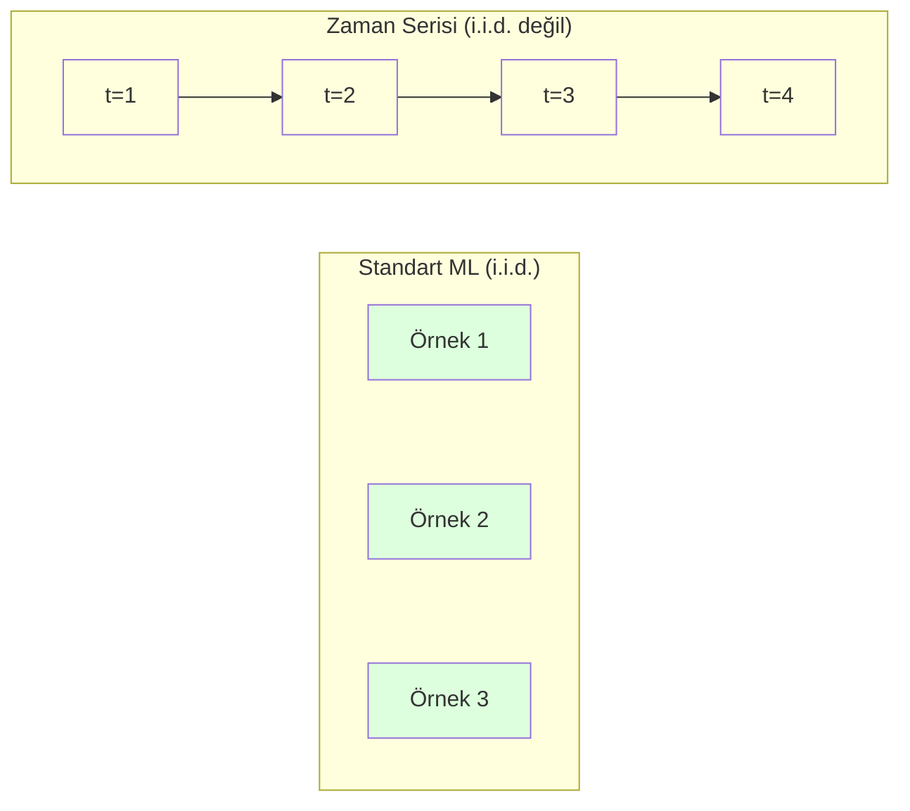
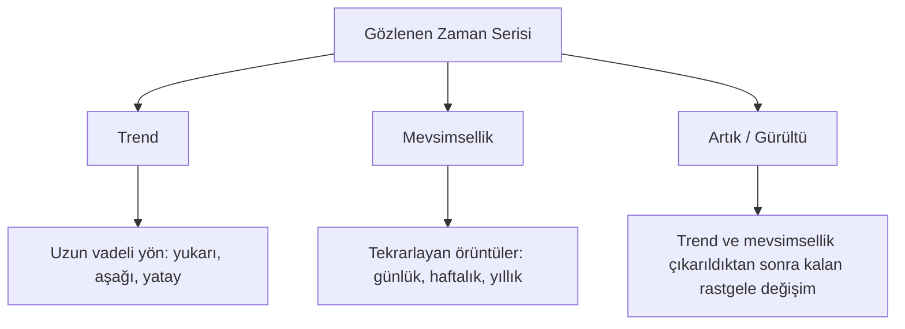
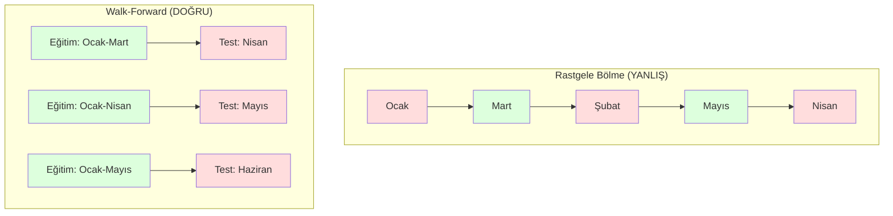

> **Orijinal İçerik:** [docs/en.md](https://github.com/rohitg00/ai-engineering-from-scratch/blob/main/phases/02-ml-fundamentals/15-time-series/docs/en.md)

# Zaman Serisi Temelleri (Time Series Fundamentals)

> Geçmiş performans gelecekteki sonuçları tahmin edebilir -- yeter ki önce stationarity'i kontrol edin.

**Tür:** Build
**Dil:** Python
**Ön Koşullar:** Phase 2, Lessons 01-09
**Süre:** ~90 dakika

## Öğrenim Hedefleri

- Bir zaman serisini (time series) trend, mevsimsellik (seasonality) ve artık (residual) bileşenlerine ayırmak ve stationarity test etmek
- Lag öznitelikleri ve rolling statistics kullanarak bir zaman serisini gözetimli öğrenme problemine dönüştürmek
- Gelecek verilerin eğitime sızmasını engelleyen bir walk-forward validation çerçevesi kurmak
- Rastgele train/test bölmelerinin neden zaman serileri için geçersiz olduğunu açıklamak ve uygun zamansal bölmelere kıyasla performans farkını göstermek

## Problem

Zamana göre sıralanmış verileriniz var. Günlük satışlar, saatlik sıcaklık, dakika başına CPU kullanımı, haftalık hisse senedi fiyatları. Bir sonraki değeri, bir sonraki haftayı, bir sonraki çeyreği tahmin etmek istiyorsunuz.

Standart ML araç kutunuza uzanıyorsunuz: rastgele train/test bölmesi, çapraz doğrulama, öznitelik matrisi, tahmin. Her adım yanlış.

Zaman serileri, standart ML'nin dayandığı varsayımları bozar. Örnekler bağımsız değildir -- bugünün sıcaklığı dünküne bağlıdır. Rastgele bölmeler gelecek bilgisini geçmişe sızdırır. Geriye dönük testlerde harika görünen öznitelikler, zamanla değişen örüntülere dayandıkları için üretimde başarısız olur.

Rastgele çapraz doğrulama ile %95 doğruluk alan bir model, uygun zaman tabanlı değerlendirme ile %55 alabilir. Aradaki fark bir teknik ayrıntı değildir. Kağıt üzerinde çalışan bir model ile üretimde çalışan bir model arasındaki farktır.

Bu ders temel konuları kapsar: zaman verisini farklı kılan şey nedir, modeller nasıl dürüstçe değerlendirilir ve bir zaman serisi standart ML modellerinin tüketebileceği özniteliklere nasıl dönüştürülür.

## Kavram

### Zaman Serisini Farklı Kılan Nedir

Standart ML, i.i.d. -- bağımsız ve özdeş dağılmış (independent and identically distributed) varsayar. Her örnek aynı dağılımdan, diğer örneklerden bağımsız olarak çekilir. Zaman serileri her ikisini de ihlal eder:

- **Bağımsız değil.** Bugünkü hisse fiyatı dünküne bağlıdır. Bu haftanın satışları geçen haftayla ilişkilidir.
- **Özdeş dağılmamış.** Dağılım zamanla değişir. Aralık ayı satışları Mart ayı satışlarından farklı görünür.

Bu ihlaller küçük değildir. Öznitelikleri nasıl oluşturduğunuzu, modelleri nasıl değerlendirdiğinizi ve hangi algoritmaların çalıştığını değiştirirler.



Standart ML'de örnekler birbiriyle değiştirilebilir. Karıştırmak hiçbir şeyi değiştirmez. Zaman serilerinde sıralama her şeydir. Karıştırmak sinyali yok eder.

### Zaman Serisinin Bileşenleri

Her zaman serisi bir kombinasyondur:



- **Trend**: Uzun vadeli yön. Gelir yılda %10 büyüyor. Küresel sıcaklık yükseliyor.
- **Mevsimsellik (Seasonality)**: Sabit aralıklarla tekrarlayan örüntüler. Perakende satışları Aralık'ta patlama yapar. Klima kullanımı Temmuz'da zirve yapar.
- **Artık (Residual)**: Trend ve mevsimsellik çıkarıldıktan sonra kalan şey. Artık beyaz gürültüye (white noise) benziyorsa, ayrıştırma sinyali yakalamış demektir.

### Stationarity

Bir zaman serisi, istatistiksel özellikleri (ortalama, varyans, autocorrelation) zamanla değişmiyorsa stationarity'dir. Çoğu tahminleme (forecasting) yöntemi stationarity varsayar.

**Neden önemlidir:** Stationary olmayan bir serinin ortalaması kayar. Ocak ayı verisiyle eğitilmiş bir model, Şubat ayının göstereceği ortalamadan farklı bir ortalama öğrenmiştir. Sistematik olarak yanlış tahmin yapacaktır.

**Nasıl kontrol edilir:** Pencere boyunca rolling mean ve rolling standard deviation hesaplayın. Kayıyorlarsa, seri non-stationary'dir.

**Nasıl düzeltilir:** Fark alma (differencing). Ham değerleri modellemek yerine, ardışık değerler arasındaki farkı modelleyin:

```
diff[t] = value[t] - value[t-1]
```

Bir tur fark alma seriyi stationary yapmazsa, tekrar uygulayın (ikinci derece fark alma). Çoğu gerçek dünya serisi en fazla iki tura ihtiyaç duyar.

**Örnek:**

Orijinal seri: [100, 102, 106, 112, 120]
Birinci fark:   [2, 4, 6, 8] (hâlâ yukarı trendli)
İkinci fark:    [2, 2, 2] (sabit -- stationary)

Orijinal serinin ikinci dereceden bir trendi vardı. Birinci fark alma onu doğrusal bir trene dönüştürdü. İkinci fark alma düz hale getirdi. Pratikte nadiren ikiden fazla tura ihtiyacınız olur.

**Formal test:** Augmented Dickey-Fuller (ADF) testi, stationarity için standart istatistiksel testtir. Sıfır hipotezi "seri non-stationary'dir" şeklindedir. 0.05'in altındaki bir p-değeri, sıfır hipotezini reddedip stationarity sonucuna varabileceğiniz anlamına gelir. ADF'yi sıfırdan uygulamıyoruz (asimptotik dağılım tabloları gerektirir), ancak kodumuzdaki rolling statistics yaklaşımı pratik bir görsel kontrol sağlar.

### Otokorelasyon (Autocorrelation)

Otokorelasyon (autocorrelation), t zamanındaki bir değerin t-k zamanındaki (k adım geçmişteki) değerle ne kadar ilişkili olduğunu ölçer. Autocorrelation function (ACF) bu korelasyonu her lag k için çizer.

**ACF size şunları söyler:**
- Serinin ne kadar geriyi hatırladığı. ACF lag 5'ten sonra sıfıra düşüyorsa, 5 adımdan eski değerler ilgisizdir.
- Mevsimsellik olup olmadığı. ACF lag 12'de (aylık veri) sıçrama yapıyorsa, yıllık mevsimsellik vardır.
- Kaç tane lag özniteliği oluşturulacağı. ACF'nin ihmal edilebilir hale geldiği noktaya kadar lag kullanın.

**PACF (Partial Autocorrelation Function)** dolaylı korelasyonları giderir. Bugün yalnızca her ikisi de dünle ilişkili olduğu için 3 gün önceyle korelasyon gösteriyorsa, lag 3'te PACF sıfır olurken ACF sıfır olmaz.

### Lag Öznitelikleri: Zaman Serisini Gözetimli Öğrenmeye Dönüştürmek

Standart ML modelleri bir öznitelik matrisi X ve bir hedef y'ye ihtiyaç duyar. Zaman serisi size tek bir değer sütunu verir. Köprü lag öznitelikleridir (lag features).

[10, 12, 14, 13, 15] serisini alın ve lag-1 ile lag-2 öznitelikleri oluşturun:

| lag_2 | lag_1 | hedef |
|-------|-------|--------|
| 10    | 12    | 14     |
| 12    | 14    | 13     |
| 14    | 13    | 15     |

Artık standart bir regresyon probleminiz var. Herhangi bir ML modeli (linear regression, random forest, gradient boosting) hedefi lag'lardan tahmin edebilir.

Ekleyebileceğiniz diğer öznitelikler:
- **Rolling statistics:** son k değerin ortalaması, standart sapması, minimumu, maksimumu
- **Takvim öznitelikleri:** haftanın günü, ay, tatil_mi, haftasonu_mu
- **Farkı alınmış değerler:** önceki adımdan değişim
- **Genişleyen istatistikler (expanding statistics):** kümülatif ortalama, kümülatif toplam
- **Oran öznitelikleri:** mevcut değer / rolling mean (son ortalamadan ne kadar uzak)
- **Etkileşim öznitelikleri (interaction features):** lag_1 * haftanın_günü (hafta içi momentum etkileri)

**Kaç tane lag?** Autocorrelation function'ı kullanın. ACF lag 10'a kadar anlamlıysa, en az 10 lag kullanın. Haftalık mevsimsellik varsa lag 7'yi (ve muhtemelen 14'ü) ekleyin. Daha fazla lag, modele daha fazla geçmiş verir ancak aynı zamanda daha fazla öznitelik uydurması gerekir, bu da aşırı uyum (overfitting) riskini artırır.

**Hedef hizalama tuzağı.** Lag öznitelikleri oluştururken, hedef t zamanındaki değer olmalı ve tüm öznitelikler t-1 veya daha önceki değerleri kullanmalıdır. Yanlışlıkla t zamanındaki değeri bir öznitelik olarak eklerseniz, mükemmel bir tahmin ediciniz olur -- ancak tamamen işe yaramaz bir model. Bu, zaman serisi öznitelik mühendisliğindeki en yaygın hatadır.

### Walk-Forward Validation

Bu, bu dersteki en önemli kavramdır. Standart k-fold çapraz doğrulama, örnekleri rastgele train ve test'e atar. Zaman serileri için bu, gelecek bilgisini sızdırır.



Walk-forward validation:
1. t zamanına kadar olan veriyle eğit
2. t+1 (veya çok adımlı için t+1'den t+k'ya) tahmin et
3. Pencereyi ileri kaydır
4. Tekrarla

Her test katı, yalnızca tüm eğitim verilerinden sonra gelen verileri içerir. Gelecek sızıntısı yok. Bu, modelin üretime alındığında nasıl performans göstereceğine dair dürüst bir tahmin verir.

**Genişleyen pencere (expanding window)** eğitim için tüm geçmiş verileri kullanır (pencere büyür). **Kayan pencere (sliding window)** sabit boyutlu bir eğitim penceresi kullanır (pencere kayar). Eski verilerin hâlâ geçerli olduğuna inanıyorsanız genişleyen pencere kullanın. Dünya değişiyorsa ve eski veriler zarar veriyorsa kayan pencere kullanın.

### ARIMA Sezgisi

ARIMA, klasik zaman serisi modelidir. Üç bileşeni vardır:

- **AR (Autoregressive):** Geçmiş değerlerden tahmin. AR(p) son p değerini kullanır.
- **I (Integrated):** Stationarity elde etmek için fark alma. I(d) d tur fark alma uygular.
- **MA (Moving Average):** Geçmiş tahmin hatalarından tahmin. MA(q) son q hatayı kullanır.

ARIMA(p, d, q) üçünü birleştirir. p, d, q'yu ACF/PACF analizine veya otomatik aramaya (auto-ARIMA) göre seçersiniz.

ARIMA'yı sıfırdan uygulamayacağız -- bu dersin kapsamı dışında kalan sayısal optimizasyon gerektirir. Önemli olan, her bileşenin ne yaptığını anlayarak ARIMA sonuçlarını yorumlayabilmek ve ne zaman kullanılacağını bilmektir.

### Ne Zaman Ne Kullanılır

| Yaklaşım | En İyi Olduğu Yer | Mevsimsellikle Baş Eder | Dış Özniteliklerle Baş Eder |
|----------|---------|-------------------|------------------------|
| Lag öznitelikleri + ML | Çok sayıda dış özniteliği olan tabüler veri | Takvim öznitelikleriyle | Evet |
| ARIMA | Tek değişkenli seri, kısa vadeli | SARIMA varyantı | Hayır (ARIMAX sınırlı) |
| Üstel düzeltme (Exponential smoothing) | Basit trend + mevsimsellik | Evet (Holt-Winters) | Hayır |
| Prophet | İş tahminlemesi, tatiller | Evet (Fourier terimleri) | Sınırlı |
| Sinir ağları (LSTM, Transformer) | Uzun diziler, çok sayıda seri | Öğrenilir | Evet |

Çoğu pratik problem için lag öznitelikleri + gradient boosting en güçlü başlangıç noktasıdır. Dış öznitelikleri doğal olarak işler, stationarity gerektirmez ve hata ayıklaması kolaydır.

### Tahmin Ufukları ve Stratejileri (Forecasting Horizons and Strategies)

Tek adımlı tahmin (single-step forecasting) bir zaman adımı ilerisini tahmin eder. Çok adımlı tahmin (multi-step forecasting) birden çok adımı tahmin eder. Üç strateji vardır:

**Recursive (ardışık):** Bir adım ilerisini tahmin et, tahmini sonraki adım için girdi olarak kullan. Basittir ancak hatalar birikir -- her tahmin bir önceki tahmini kullanır, bu nedenle hatalar katlanır.

**Direct (doğrudan):** Her ufuk için ayrı bir model eğit. Model-1 t+1'i, Model-5 t+5'i tahmin eder. Hata birikimi olmaz, ancak her modelin daha az eğitim örneği vardır ve bilgi paylaşmazlar.

**Multi-output (çok çıktılı):** Tüm ufukları aynı anda çıktı veren tek bir model eğit. Ufuklar arasında bilgi paylaşır ancak çoklu çıktıyı destekleyen bir model (veya özel bir kayıp fonksiyonu) gerektirir.

Çoğu pratik problem için kısa ufuklarda (1-5 adım) recursive, daha uzun ufuklarda direct ile başlayın.

### Zaman Serilerinde Sık Yapılan Hatalar

| Hata | Neden Olur | Nasıl Düzeltilir |
|---------|---------------|-----------|
| Rastgele train/test bölmesi | Standart ML alışkanlığı | Walk-forward veya zamansal bölme kullanın |
| Gelecek özniteliklerini kullanmak | t zamanındaki öznitelik yanlışlıkla dahil edilir | Her özniteliği zamansal hizalama açısından denetleyin |
| Mevsimselliğe aşırı uyum | Model takvim örüntülerini ezberler | Test setinde tam bir mevsimsel döngü ayırın |
| Ölçek değişimlerini görmezden gelmek | Gelir ikiye katlanır ancak örüntüler aynı kalır | Mutlak değişim yerine yüzde değişimi modelleyin |
| Çok fazla lag özniteliği | "Daha fazla geçmiş daha iyidir" | İlgili lag'leri belirlemek için ACF kullanın |
| Fark almamak | "Model çözer" | Ağaç modeller trendleri işler; doğrusal modeller stationarity ister |

## Build It

`code/time_series.py` dosyasındaki kod, temel yapı taşlarını sıfırdan uygular.

### Lag Özniteliği Oluşturucu

```python
def make_lag_features(series, n_lags):
    n = len(series)
    X = np.full((n, n_lags), np.nan)
    for lag in range(1, n_lags + 1):
        X[lag:, lag - 1] = series[:-lag]
    valid = ~np.isnan(X).any(axis=1)
    return X[valid], series[valid]
```
#### Açıklama
Bu fonksiyon, 1 boyutlu bir seriyi öznitelik matrisine dönüştürür. Her satır, son `n_lags` değerini öznitelik olarak, mevcut değeri ise hedef olarak içerir.

### Walk-Forward Cross-Validation

```python
def walk_forward_split(n_samples, n_splits=5, min_train=50):
    assert min_train < n_samples, "min_train must be less than n_samples"
    step = max(1, (n_samples - min_train) // n_splits)
    for i in range(n_splits):
        train_end = min_train + i * step
        test_end = min(train_end + step, n_samples)
        if train_end >= n_samples:
            break
        yield slice(0, train_end), slice(train_end, test_end)
```
#### Açıklama
Her bölme, eğitim verisinin kesinlikle test verisinden önce gelmesini sağlar. Eğitim penceresi her katla birlikte genişler.

### Basit Otoregresif Model (Simple Autoregressive Model)

Saf bir AR modeli, lag öznitelikleri üzerinde doğrusal regresyondan ibarettir:

```python
class SimpleAR:
    def __init__(self, n_lags=5):
        self.n_lags = n_lags
        self.weights = None
        self.bias = None

    def fit(self, series):
        X, y = make_lag_features(series, self.n_lags)
        # Solve via normal equations
        X_b = np.column_stack([np.ones(len(X)), X])
        theta = np.linalg.lstsq(X_b, y, rcond=None)[0]
        self.bias = theta[0]
        self.weights = theta[1:]
        return self
```
#### Açıklama
Bu, kavramsal olarak Ders 02'deki doğrusal regresyonla aynıdır, ancak aynı değişkenin zaman gecikmeli versiyonlarına uygulanır.

### Stationarity Kontrolü

Kod, stationarity'yi görsel ve sayısal olarak değerlendirmek için rolling statistics hesaplar:

```python
def check_stationarity(series, window=50):
    rolling_mean = np.array([
        series[max(0, i - window):i].mean()
        for i in range(1, len(series) + 1)
    ])
    rolling_std = np.array([
        series[max(0, i - window):i].std()
        for i in range(1, len(series) + 1)
    ])
    return rolling_mean, rolling_std
```
#### Açıklama
Rolling mean kayıyorsa veya rolling std değişiyorsa, seri non-stationary'dir. Fark alma uygulayın ve tekrar kontrol edin.

Kod ayrıca serinin ilk yarısı ile ikinci yarısını karşılaştırarak stationarity kontrolü yapar. Ortalamalar yarım standart sapmadan fazla farklıysa veya varyans oranı 2x'i aşıyorsa, seri non-stationary olarak işaretlenir.

### Otokorelasyon (Autocorrelation)

```python
def autocorrelation(series, max_lag=20):
    n = len(series)
    mean = series.mean()
    var = series.var()
    acf = np.zeros(max_lag + 1)
    for k in range(max_lag + 1):
        cov = np.mean((series[:n-k] - mean) * (series[k:] - mean))
        acf[k] = cov / var if var > 0 else 0
    return acf
```
#### Açıklama
Bu fonksiyon, her lag k için autocorrelation katsayısını hesaplar ve bir ACF vektörü döndürür.

## Use It

sklearn ile, lag özniteliklerini herhangi bir regresörle doğrudan kullanabilirsiniz:

```python
from sklearn.linear_model import Ridge
from sklearn.ensemble import GradientBoostingRegressor

X, y = make_lag_features(series, n_lags=10)

for train_idx, test_idx in walk_forward_split(len(X)):
    model = Ridge(alpha=1.0)
    model.fit(X[train_idx], y[train_idx])
    predictions = model.predict(X[test_idx])
```
#### Açıklama
Walk-forward validation döngüsü içinde sklearn modellerini lag öznitelikleriyle eğitip test eder. Bu yaklaşım, herhangi bir regresyon algoritmasıyla çalışır.

ARIMA için statsmodels kullanın:

```python
from statsmodels.tsa.arima.model import ARIMA

model = ARIMA(train_series, order=(5, 1, 2))
fitted = model.fit()
forecast = fitted.forecast(steps=30)
```
#### Açıklama
statsmodels kütüphanesi ARIMA modelinin eksiksiz bir uygulamasını sağlar. Parametreler (p, d, q) sırasıyla AR derecesi, fark alma derecesi ve MA derecesidir.

`time_series.py` dosyasındaki kod, her iki yaklaşımı da gösterir ve walk-forward validation kullanarak karşılaştırır.

### sklearn TimeSeriesSplit

sklearn, walk-forward validation uygulayan `TimeSeriesSplit` sağlar:

```python
from sklearn.model_selection import TimeSeriesSplit

tscv = TimeSeriesSplit(n_splits=5)
for train_index, test_index in tscv.split(X):
    X_train, X_test = X[train_index], X[test_index]
    y_train, y_test = y[train_index], y[test_index]
    model.fit(X_train, y_train)
    score = model.score(X_test, y_test)
```
#### Açıklama
Bu, sıfırdan yazdığımız `walk_forward_split` ile eşdeğerdir ancak sklearn'in çapraz doğrulama çerçevesine entegre edilmiştir. `cross_val_score` ile kullanabilirsiniz:

```python
from sklearn.model_selection import cross_val_score

scores = cross_val_score(model, X, y, cv=TimeSeriesSplit(n_splits=5))
print(f"Ortalama skor: {scores.mean():.4f} +/- {scores.std():.4f}")
```
#### Açıklama
`cross_val_score` ve `TimeSeriesSplit` kombinasyonu, zaman serileri için dürüst değerlendirme yapmanın en kısa yoludur.

### Değerlendirme Metrikleri (Evaluation Metrics)

Zaman serisi tahminlemesi regresyon metriklerini kullanır, ancak zaman bilincine sahip bir bağlamda:

- **MAE (Mean Absolute Error):** |y_gerçek - y_tahmin| ortalaması. Orijinal birimlerde yorumlaması kolaydır. "Tahminler ortalama 3.2 derece sapıyor."
- **RMSE (Root Mean Squared Error):** Ortalama kare hatasının karekökü. Büyük hataları MAE'den daha fazla cezalandırır. Büyük hataların çok sayıda küçük hatadan daha kötü olduğu durumlarda kullanın.
- **MAPE (Mean Absolute Percentage Error):** |hata / gerçek_değer| * 100 ortalaması. Ölçekten bağımsızdır, farklı serileri karşılaştırmak için kullanışlıdır. Ancak gerçek değerler sıfır olduğunda tanımsızdır.
- **Naif temel çizgi karşılaştırması (Naive baseline comparison):** Her zaman basit temel çizgilerle karşılaştırın. Mevsimsel naif temel çizgi, bir dönem önceki değeri (dün, geçen hafta) tahmin eder. Modeliniz naif yaklaşımı yenemiyorsa, bir sorun vardır.

### Rolling Öznitelikler

Kod, lag özniteliklerine rolling statistics (7 ve 14 günlük pencerelerde ortalama, standart sapma, minimum, maksimum) eklemeyi gösterir. Bunlar modele, tek başına lag özniteliklerinin yakalayamadığı güncel trendler ve volatilite hakkında bilgi verir.

Örneğin, rolling mean yükseliyorsa yukarı yönlü bir trend olduğunu gösterir. Rolling std artıyorsa artan volatilite olduğunu gösterir. Bunlar, ağaç tabanlı modellerin öğrenebildiği ancak doğrusal modellerin öğrenemediği türden örüntülerdir.

## Ship It

Bu ders şunları üretir:
- `outputs/prompt-time-series-advisor.md` -- zaman serisi problemlerini çerçevelemek için bir prompt
- `code/time_series.py` -- lag öznitelikleri, walk-forward validation, AR modeli, stationarity kontrolleri

### Yenmeniz Gereken Temel Çizgiler (Baselines You Must Beat)

Herhangi bir model kurmadan önce, temel çizgiler oluşturun:

1. **Son değer (persistence).** Yarının bugünle aynı olacağını tahmin edin. Çoğu seri için bu şaşırtıcı derecede zordur.
2. **Mevsimsel naif (Seasonal naive).** Bugünün geçen haftanın (veya geçen yılın) aynı günüyle aynı olacağını tahmin edin. Modeliniz bunu yenemiyorsa, mevsimselliğin ötesinde hiçbir yararlı örüntü öğrenmemiştir.
3. **Hareketli ortalama (Moving average).** Son k değerin ortalamasını tahmin edin. Gürültüyü yumuşatır ancak ani değişiklikleri yakalayamaz.

Süslü ML modeliniz mevsimsel naif temel çizgiye kaybediyorsa, bir hatanız var demektir. En yaygın olanları: özniteliklerde gelecek sızıntısı, yanlış değerlendirme yöntemi veya serinin gerçekten rastgele ve tahmin edilemez olması.

### Pratik İpuçları

1. **Çizdirerek başlayın.** Herhangi bir modellemeden önce, ham seriyi çizin. Trendler, mevsimsellik, aykırı değerler, yapısal kırılmalar (davranıştaki ani değişiklikler) arayın. 30 saniyelik görsel inceleme genellikle bir saatlik otomatik analizden daha fazlasını söyler.

2. **Önce fark al, sonra modelle.** Serinin net bir trendi varsa, lag öznitelikleri oluşturmadan önce fark alın. Ağaç tabanlı modeller trendleri işleyebilir, ancak doğrusal modeller işleyemez ve fark alma asla zarar vermez.

3. **En az bir tam mevsimsel döngü ayırın.** Haftalık mevsimselliğiniz varsa, test setinizin en az bir tam haftaya ihtiyacı vardır. Aylık ise en az bir tam aya. Aksi takdirde modelin mevsimsel örüntüyü yakalayıp yakalamadığını değerlendiremezsiniz.

4. **Üretimde izleyin.** Dünya değiştikçe zaman serisi modelleri zamanla bozulur. Tahmin hatalarını kayan pencereyle takip edin. Hatalar artmaya başladığında, modeli güncel verilerle yeniden eğitin.

5. **Rejim değişikliklerine dikkat edin.** Pandemi öncesi verilerle eğitilmiş bir model, pandemi sonrası davranışı tahmin edemez. Bilinen rejim değişikliklerinin göstergelerini öznitelik olarak ekleyin veya eski verileri unutan kayan pencere kullanın.

6. **Çarpık serileri log-dönüşümü yapın.** Gelir, fiyat ve sayımlar genellikle sağa çarpıktır. Log almak varyansı dengeler ve çarpımsal örüntüleri toplamsal hale getirir, böylece doğrusal modeller işleyebilir. Log uzayında tahmin yapın, ardından orijinal birimlere dönmek için üstel alın.

## Alıştırmalar

1. **Stationarity deneyi.** Doğrusal trende sahip bir seri oluşturun. Rolling statistics ile stationarity kontrol edin. Birinci fark alma uygulayın. Tekrar kontrol edin. İkinci dereceden bir trend için kaç tur fark alma gerekir?

2. **Lag seçimi.** Mevsimsel bir seride (periyot=7) ACF hesaplayın. Hangi lag'ler en yüksek autocorrelation'a sahip? Yalnızca bu lag'leri kullanarak (ardışık lag'ler değil) lag öznitelikleri oluşturun. Doğruluk, lag 1'den 7'ye kullanmaya kıyasla iyileşiyor mu?

3. **Walk-forward vs rastgele bölme.** Ridge regresyonu lag öznitelikleriyle eğitin. Rastgele %80/20 bölme ve walk-forward validation ile değerlendirin. Rastgele bölme performansı ne kadar fazla tahmin ediyor?

4. **Öznitelik mühendisliği.** Lag özniteliklerine rolling mean (pencere=7), rolling std (pencere=7) ve haftanın günü özniteliklerini ekleyin. Walk-forward validation kullanarak bu eklemelerle ve eklemeler olmadan doğruluğu karşılaştırın.

5. **Çok adımlı tahmin.** AR modelini 1 adım yerine 5 adım ileriyi tahmin edecek şekilde değiştirin. İki stratejiyi karşılaştırın: (a) bir adım tahmin et, tahmini sonraki adım için girdi olarak kullan (recursive) ve (b) her ufuk için ayrı modeller eğit (direct). Hangisi daha doğru?

## Anahtar Terimler

| Terim | İnsanların Söylediği | Gerçek Anlamı |
|------|----------------|----------------------|
| Stationarity | "İstatistikler zamanla değişmez" | Ortalaması, varyansı ve autocorrelation yapısı zamanla sabit olan seri |
| Fark alma (Differencing) | "Ardışık değerleri çıkar" | Trendleri kaldırmak ve stationarity elde etmek için y[t] - y[t-1] hesaplamak |
| Otokorelasyon / ACF | "Bir serinin kendisiyle korelasyonu" | Bir zaman serisi ile kendisinin gecikmeli kopyası arasındaki, gecikmenin bir fonksiyonu olarak korelasyon |
| Kısmi otokorelasyon / PACF (Partial autocorrelation) | "Yalnızca doğrudan korelasyon" | Tüm daha kısa lag'lerin etkisi çıkarıldıktan sonra lag k'deki autocorrelation |
| Lag öznitelikleri (Lag features) | "Geçmiş değerler girdi olarak" | y[t]'yi tahmin etmek için y[t-1], y[t-2], ..., y[t-k]'yı öznitelik olarak kullanmak |
| Walk-forward validation | "Zamana saygılı çapraz doğrulama" | Eğitim verisinin kronolojik olarak her zaman test verisinden önce geldiği değerlendirme |
| ARIMA | "Klasik zaman serisi modeli" | AutoRegressive Integrated Moving Average: geçmiş değerleri (AR), fark almayı (I) ve geçmiş hataları (MA) birleştirir |
| Mevsimsellik (Seasonality) | "Tekrarlayan takvim örüntüleri" | Takvim dönemlerine (günlük, haftalık, yıllık) bağlı düzenli, öngörülebilir döngüler |
| Trend | "Uzun vadeli yön" | Seri seviyesinde zaman içinde kalıcı artış veya azalış |
| Genişleyen pencere (Expanding window) | "Tüm geçmişi kullan" | Eğitim setinin her katla birlikte büyüdüğü walk-forward validation |
| Kayan pencere (Sliding window) | "Sabit boyutlu geçmiş" | Eğitim setinin ileri kayan sabit uzunluklu bir pencere olduğu walk-forward validation |

## İleri Okuma

- [Hyndman and Athanasopoulos, Forecasting: Principles and Practice (3rd ed.)](https://otexts.com/fpp3/) -- zaman serisi tahminlemesi üzerine en iyi ücretsiz ders kitabı
- [scikit-learn Time Series Split](https://scikit-learn.org/stable/modules/generated/sklearn.model_selection.TimeSeriesSplit.html) -- sklearn'in walk-forward bölücüsü
- [statsmodels ARIMA docs](https://www.statsmodels.org/stable/generated/statsmodels.tsa.arima.model.ARIMA.html) -- tanılama araçlarıyla ARIMA uygulaması
- [Makridakis et al., The M5 Competition (2022)](https://www.sciencedirect.com/science/article/pii/S0169207021001874) -- ML yöntemlerinin istatistiksel yöntemlerle karşılaştırıldığı büyük ölçekli tahminleme yarışması
