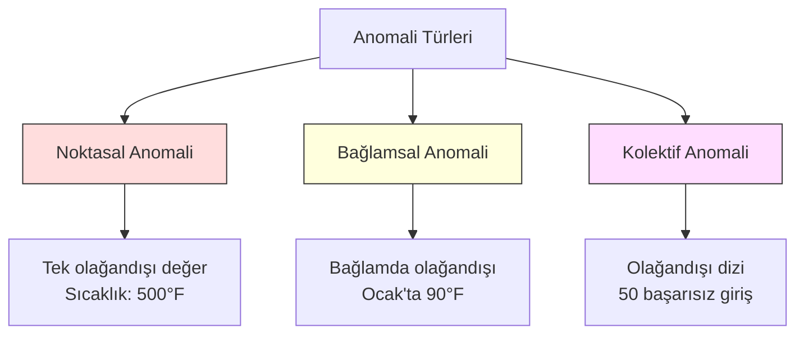
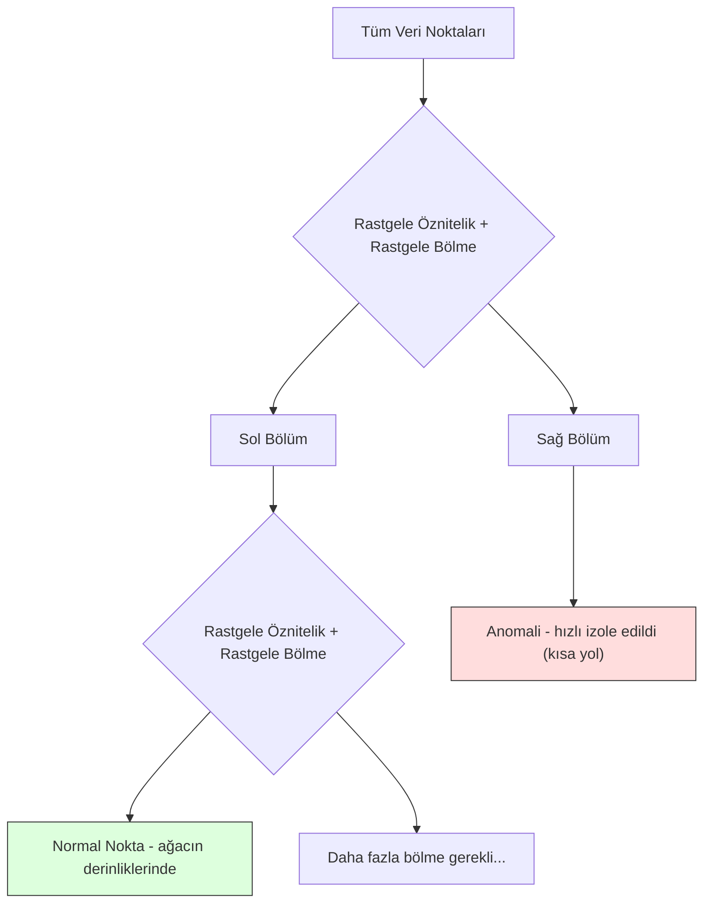
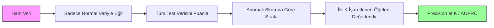

# Anomali Tespiti (Anomaly Detection)

> Normal olanı tanımlamak kolaydır. Anormal olan, kalıba uymayan her şeydir.

**Tür:** Build
**Dil:** Python
**Ön Koşullar:** Faz 2, Ders 01-09
**Süre:** ~75 dakika

## Öğrenim Hedefleri

- Z-score, IQR ve Isolation Forest anomali tespit (anomaly detection) yöntemlerini sıfırdan uygulamak
- Noktasal (point), bağlamsal (contextual) ve kolektif (collective) anomali türlerini ayırt etmek ve her biri için uygun tespit yöntemini seçmek
- Anomali tespitinin neden anormali sınıflandırmak yerine normal veriyi modellemek olarak çerçevelendiğini açıklamak
- Denetimsiz (unsupervised) anomali tespiti ile denetimli (supervised) sınıflandırmayı karşılaştırmak ve yeni anomali türlerini yakalama kapsamı ile kesinlik (precision) arasındaki ödünleşimi değerlendirmek

## Problem

Bir kredi kartı saat 14:00'te New York'ta, ardından 14:05'te Tokyo'da kullanılıyor. Bir fabrika sensörü, normal aralık 80-120 iken 150 derece okuyor. Bir sunucu, günlük ortalama 200 iken saniyede 50.000 istek gönderiyor.

Bunlar anomalidir (anomalies). Onları bulmak önemlidir. Dolandırıcılık milyarlarca dolara mal olur. Ekipman arızaları duruş süresine yol açar. Ağ saldırıları veri kaybına neden olur.

Zorluk şu: anomali örneklerinin etiketlenmiş hallerine nadiren sahip olursunuz. Dolandırıcılık, işlemlerin %0,1'ini oluşturur. Ekipman arızaları yılda birkaç kez olur. Standart bir sınıflandırıcı (classifier) eğitemezsiniz çünkü "anomali" sınıfında öğrenecek neredeyse hiçbir şey yoktur. Etiketleriniz olsa bile, gördüğünüz anomali türleri karşılaşacağınız tek tür değildir. Yarının dolandırıcılık yöntemi bugünkinden farklı olacaktır.

Anomali tespiti problemi tersine çevirir. Anormal olanı öğrenmek yerine, normal olanı öğrenin. Normallikten sapan her şey şüphelidir. Bu yaklaşım etiketler olmadan çalışır, yeni anomali türlerine uyum sağlar ve büyük veri kümelerinde ölçeklenir.

## Kavram

### Anomali Türleri

Tüm anomaliler aynı değildir:

- **Noktasal anomaliler (Point anomalies).** Bağlamdan bağımsız olarak olağandışı olan tek bir veri noktasıdır. 500 derecelik bir sıcaklık okuması. Normalde 50 dolar harcayan bir hesaptan 50.000 dolarlık bir işlem.
- **Bağlamsal anomaliler (Contextual anomalies).** İçinde bulunduğu bağlam göz önüne alındığında olağandışı olan bir veri noktasıdır. 90 derece sıcaklık yazın normal, kışın anormaldir. Aynı değer, farklı bağlam.
- **Kolektif anomaliler (Collective anomalies).** Her bir nokta normal olsa bile bir grup olarak olağandışı olan veri noktası dizisidir. Beş başarısız oturum açma normaldir. Elli tanesi üst üste brute-force saldırısıdır.

Çoğu yöntem noktasal anomalileri tespit eder. Bağlamsal anomaliler zaman veya konum öznitelikleri (features) gerektirir. Kolektif anomaliler dizi farkında (sequence-aware) yöntemler gerektirir.



#### Açıklama
Mermaid diyagramı, üç anomali türü (noktasal, bağlamsal, kolektif) arasındaki ilişkiyi ve her birine örnek senaryoları göstermektedir.

### Denetimsiz Çerçeveleme (Unsupervised Framing)

Standart sınıflandırmada her iki sınıf için de etiketleriniz vardır. Anomali tespitinde tipik olarak üç durumdan biriyle karşılaşırsınız:

1. **Tamamen denetimsiz (Fully unsupervised).** Hiç etiket yok. Tespit ediciyi tüm veriye uydurursunuz ve anomalilerin "normal" modeli bozmayacak kadar nadir olduğunu umarsınız.
2. **Yarı denetimli (Semi-supervised).** Yalnızca normal veriden oluşan temiz bir veri kümeniz vardır. Modeli bu temiz kümeye uydurup diğer her şeyi puanlarsınız. Mümkün olduğunda en güçlü kurulum budur.
3. **Zayıf denetimli (Weakly supervised).** Birkaç etiketli anomaliniz vardır. Bunları eğitim için değil, değerlendirme için kullanırsınız. Denetimsiz eğitin, ardından etiketli alt küme üzerinde kesinlik/duyarlılık (precision/recall) ölçün.

Kilit içgörü: anomali tespiti, sınıflandırmadan temelde farklıdır. İki sınıf arasındaki karar sınırını değil, normal verinin dağılımını modelliyorsunuz.

### Denetimli ve Denetimsiz: Ödünleşim

Etiketlenmiş anomalileriniz varsa, bunları eğitim için mi (denetimli sınıflandırma) yoksa yalnızca değerlendirme için mi (denetimsiz tespit) kullanmalısınız?

**Denetimli (sınıflandırma olarak ele al):**
- Daha önce gördüğünüz anomali türlerini tam olarak yakalar
- Bilinen anomali türlerinde daha yüksek kesinlik
- Yeni anomali türlerini tamamen kaçırır
- Yeni anomali türleri ortaya çıktığında yeniden eğitim gerektirir
- Yeterli anomali örneği gerektirir (genellikle çok azdır)

**Denetimsiz (normali modelle, sapmaları işaretle):**
- Yeni türler dahil normallikten her türlü sapmayı yakalar
- Etiketlenmiş anomali gerektirmez
- Daha yüksek yanlış pozitif oranı (olağandışı olan her şey kötü değildir)
- Dağılım kaymasına (distribution shift) karşı daha sağlamdır

Pratikte en iyi sistemler ikisini birleştirir: geniş kapsam için denetimsiz tespit, bilinen yüksek öncelikli anomali türleri için denetimli modeller ve belirsiz durumlar için insan incelemesi.

### Z-Score Yöntemi

En basit yaklaşım. Her özniteliğin ortalama (mean) ve standart sapmasını (standard deviation) hesaplayın. Ortalamadan k standart sapmadan fazla olan her noktayı işaretleyin.

```text
z_score = (x - ortalama) / standart_sapma
anomali eğer |z_score| > threshold
```

#### Açıklama
Z-score, bir veri noktasının ortalamadan kaç standart sapma uzakta olduğunu ölçer. Eşik değeri (threshold) aşılırsa nokta anomali olarak işaretlenir.

Varsayılan threshold 3,0'dır (normal verinin %99,7'si Gauss dağılımında 3 standart sapma içinde kalır).

**Güçlü yönleri:** Basit. Hızlı. Yorumlanabilir ("bu değer normallerden 4,5 standart sapma uzakta").

**Zayıf yönleri:** Verinin normal dağıldığını varsayar. Eğitim verisindeki aykırı değerlere (outliers) duyarlıdır (aykırı değerler ortalamayı kaydırır ve standart sapmayı şişirir, tespiti zorlaştırır). Çok modlu (multimodal) dağılımlarda başarısız olur.

**İyi çalıştığı durumlar:** Verinin kabaca çan eğrisi şeklinde olduğu tek öznitelikli izleme. Sunucu yanıt süreleri, üretim toleransları, sabit taban çizgisine sahip sensör okumaları.

**Başarısız olduğu durumlar:** Çok kümeli veri (farklı taban sıcaklıklarına sahip iki ofis lokasyonu), çarpık veri (1000 doların nadir ancak anormal olmadığı işlem tutarları), eğitim kümesinde aykırı değerler bulunan veri.

### IQR Yöntemi

Z-score'dan daha sağlamdır (robust). Ortalama ve standart sapma yerine çeyrekler arası açıklığı (interquartile range) kullanır.

```
Q1 = 25. yüzdelik dilim
Q3 = 75. yüzdelik dilim
IQR = Q3 - Q1
alt_sınır = Q1 - factor * IQR
üst_sınır = Q3 + factor * IQR
anomali eğer x < alt_sınır veya x > üst_sınır
```

#### Açıklama
IQR yöntemi, verinin ortadaki %50'sinin yayılımını ölçer ve bu yayılımın belirli bir katı kadar dışında kalan noktaları anomali olarak işaretler.

Varsayılan factor 1,5'tir.

**Güçlü yönleri:** Aykırı değerlere karşı sağlamdır (yüzdelik dilimler uç değerlerden etkilenmez). Çarpık dağılımlarda çalışır. Normallik varsayımı yoktur.

**Zayıf yönleri:** Yalnızca tek değişkenlidir (her özniteliği bağımsız olarak uygular). Öznitelikler birlikte ele alındığında ortaya çıkan anomalileri tespit edemez (bir nokta her öznitelikte tek başına normal olabilir ancak birleşik uzayda anormal olabilir).

**Pratik not:** IQR'daki 1,5 faktörü, kutu grafiğindeki (box plot) bıyıklara (whiskers) karşılık gelir. Bıyıkların dışındaki noktalar potansiyel aykırı değerlerdir. 1,5 yerine 3,0 kullanmak tespit ediciyi daha muhafazakâr yapar (daha az işaretleme, daha az yanlış pozitif). Doğru faktör, yanlış alarm toleransınıza bağlıdır.

### Isolation Forest

Kilit içgörü: anomaliler azdır ve farklıdır. Verinin rastgele bir bölümlemesinde, anomalileri izole etmek daha kolaydır — geri kalandan ayrıştırılmaları için daha az rastgele bölme gerekir.



#### Açıklama
Isolation Forest, veriyi rastgele bölümleyerek ağaçlar oluşturur. Normal noktalar yoğun bölgelerde yaşadığı için izole edilmeleri daha fazla bölme gerektirirken, anomaliler seyrek bölgelerde olduğu için daha az bölmede izole edilir.

**Nasıl çalışır:**
1. Birçok rastgele ağaç oluşturun (bir isolation forest)
2. Her düğümde, rastgele bir öznitelik ve bu özniteliğin min-max değerleri arasında rastgele bir bölme değeri seçin
3. Her nokta yalıtılana (kendi yaprağında) kadar bölmeye devam edin
4. Anomaliler, tüm ağaçlar boyunca daha kısa ortalama yol uzunluğuna (average path length) sahiptir

**Neden çalışır:** Normal noktalar yoğun bölgelerde yaşar. Bir normal noktayı komşularından ayırmak için birçok rastgele bölme gerekir. Anomaliler seyrek bölgelerde yaşar. Onları izole etmek için bir veya iki rastgele bölme yeterlidir.

Anomali skoru, tüm ağaçlardaki ortalama yol uzunluğuna dayanır ve rastgele bir ikili arama ağacının beklenen yol uzunluğu ile normalize edilir:

```
skor(x) = 2^(-ortalama_yol_uzunluğu(x) / c(n))
```

#### Açıklama
Burada `c(n)`, n örneklem için beklenen yol uzunluğudur. Skor 1'e yakınsa anomali, 0,5'e yakınsa normal, 0'a yakınsa çok normal (yoğun kümelerin derinliklerinde) anlamına gelir.

**Güçlü yönleri:** Dağılım varsayımı yoktur. Yüksek boyutlarda çalışır. İyi ölçeklenir (her ağaç bir alt örneklem kullandığı için örneklem sayısında alt-doğrusaldır). Karma öznitelik türlerini işler.

**Zayıf yönleri:** Yoğun bölgelerdeki anomalilerde zorlanır (maskeleme etkisi). Birçok öznitelik ilgisiz olduğunda rastgele bölme daha az etkilidir.

**Temel hiperparametreler:**
- `n_estimators`: Ağaç sayısı. 100 genellikle yeterlidir. Daha fazla ağaç daha kararlı skorlar ancak daha yavaş hesaplama demektir.
- `max_samples`: Ağaç başına örneklem sayısı. Orijinal makalede varsayılan 256'dır. Daha küçük değerler bireysel ağaçları daha az doğru yapar ancak çeşitliliği artırır. Alt örnekleme, Isolation Forest'ı hızlı yapan şeydir — her ağaç verinin küçük bir kısmını görür.
- `contamination`: Beklenen anomali oranı. Yalnızca threshold'u ayarlamak için kullanılır. Skorların kendisini etkilemez.

### Yerel Aykırı Değer Faktörü (Local Outlier Factor — LOF)

LOF, bir noktanın etrafındaki yerel yoğunluğu (local density) komşularının etrafındaki yoğunlukla karşılaştırır. Yoğun bölgelerle çevrili seyrek bir bölgedeki nokta anormaldir.

**Nasıl çalışır:**
1. Her nokta için k en yakın komşuyu (k nearest neighbors) bulun
2. Yerel erişilebilirlik yoğunluğunu (local reachability density) hesaplayın (komşuluk ne kadar yoğun)
3. Her noktanın yoğunluğunu komşularının yoğunluğuyla karşılaştırın
4. Bir nokta komşularından çok daha düşük yoğunluğa sahipse, aykırı değerdir

**LOF skoru:**
- LOF 1,0'a yakınsa komşularıyla benzer yoğunluk (normal)
- LOF 1,0'dan büyükse komşularından düşük yoğunluk (potansiyel anormal)
- LOF 1,0'dan çok büyükse (örn. 2,0+) belirgin şekilde düşük yoğunluk (büyük olasılıkla anomali)

"Yerel" kısmı kritiktir. İki kümeli bir veri kümesi düşünün: 1000 noktalık yoğun bir küme ve 50 noktalık seyrek bir küme. Seyrek kümenin kenarındaki bir nokta genel olarak olağandışı değildir — 50 komşusu vardır. Ancak yakın komşuları kendisinden daha yoğunsa yerel olarak olağandışıdır. LOF, global yöntemlerin kaçırdığı bu nüansı yakalar.

**Güçlü yönleri:** Yerel anomalileri tespit eder (küresel olarak olağandışı olmasalar bile kendi komşuluklarında olağandışı olan noktalar). Farklı yoğunluktaki kümelerde çalışır.

**Zayıf yönleri:** Büyük veri kümelerinde yavaştır (saf uygulamada O(n²)). k seçimine duyarlıdır. Çok yüksek boyutlarda iyi çalışmaz (boyut laneti mesafe hesaplamalarını etkiler).

### Karşılaştırma

| Yöntem | Varsayımlar | Hız | Yüksek Boyut | Yerel Anomaliler |
|--------|------------|-------|-------------------|------------------------|
| Z-score | Normal dağılım | Çok hızlı | Evet (öznitelik başına) | Hayır |
| IQR | Yok (öznitelik başına) | Çok hızlı | Evet (öznitelik başına) | Hayır |
| Isolation Forest | Yok | Hızlı | Evet | Kısmen |
| LOF | Mesafe anlamlıdır | Yavaş | Zayıf | Evet |

#### Açıklama
Karşılaştırma tablosu, dört anomali tespit yöntemini varsayım, hız, yüksek boyut desteği ve yerel anomali tespiti açısından karşılaştırmaktadır.

### Değerlendirme Zorlukları

Anomali tespit edicilerini değerlendirmek, sınıflandırıcıları değerlendirmekten daha zordur:

- **Aşırı sınıf dengesizliği (Extreme class imbalance).** %0,1 anomali varlığında her şeye "normal" demek %99,9 doğruluk verir. Doğruluk (accuracy) işe yaramaz.
- **AUROC yanıltıcıdır.** Ağır dengesizlikte AUROC, model pratik eşik değerlerinde çoğu anomaliyi kaçırsa bile iyi görünebilir.
- **Daha iyi metrikler:** Precision@k (işaretlenen ilk k öğeden kaç tanesi gerçek anomali), AUPRC (precision-recall eğrisi altında kalan alan) ve sabit bir yanlış pozitif oranında duyarlılık (recall).



#### Açıklama
Anomali tespit boru hattı (pipeline): normal veriyle eğitim, tüm veriyi puanlama, anomali skoruna göre sıralama ve ilk-K'da kesinlik/precision değerlendirmesi.

### Anomali Tespit Boru Hattı (Pipeline)

Pratikte anomali tespiti şu iş akışını izler:

1. **Taban çizgisi verisi toplayın.** İdeal olarak, hiç (veya çok az) anomali olmadığını bildiğiniz bir dönem.
2. **Öznitelik mühendisliği (Feature engineering).** Ham öznitelikler artı türetilmiş öznitelikler (hareketli istatistikler, zaman öznitelikleri, oranlar).
3. **Tespit ediciyi eğitin.** Taban çizgisi verisine uydurun. Model "normal"in neye benzediğini öğrenir.
4. **Yeni veriyi puanlayın.** Her yeni gözlem bir anomali skoru alır.
5. **Eşik değeri seçimi (Threshold selection).** Skor kesme noktasını seçin. Bu bir iş kararıdır: daha yüksek threshold daha az yanlış alarm ancak daha fazla kaçırılan anomali demektir.
6. **Uyar ve araştır.** İşaretlenen noktalar insan incelemesine veya otomatik yanıta gider.
7. **Geri bildirim toplayın.** İşaretlenen öğelerin gerçek anomali mi yoksa yanlış alarm mı olduğunu kaydedin. Bu verileri tespit ediciyi değerlendirmek ve threshold'u zamanla ayarlamak için kullanın.

Boru hattı asla "bitmez." Veri dağılımları kayar, yeni anomali türleri ortaya çıkar ve eşik değerlerinin ayarlanması gerekir. Anomali tespitini tek seferlik bir model olarak değil, yaşayan bir sistem olarak ele alın.

## Build It (Kendin İnşa Et)

`code/anomaly_detection.py` dosyasındaki kod, Z-score, IQR ve Isolation Forest'ı sıfırdan uygular.

### Z-Score Tespit Edicisi

```python
def zscore_detect(X, threshold=3.0):
    mean = X.mean(axis=0)
    std = X.std(axis=0)
    std[std == 0] = 1.0
    z = np.abs((X - mean) / std)
    return z.max(axis=1) > threshold
```

#### Açıklama
Basit ve vektörleştirilmiş. Herhangi bir öznitelik threshold'u aşarsa noktayı işaretler.

### IQR Tespit Edicisi

```python
def iqr_detect(X, factor=1.5):
    q1 = np.percentile(X, 25, axis=0)
    q3 = np.percentile(X, 75, axis=0)
    iqr = q3 - q1
    iqr[iqr == 0] = 1.0
    lower = q1 - factor * iqr
    upper = q3 + factor * iqr
    outside = (X < lower) | (X > upper)
    return outside.any(axis=1)
```

#### Açıklama
Yüzdelik dilimlere dayalı, aykırı değerlere karşı Z-score'dan daha sağlam bir tespit yöntemi.

### Sıfırdan Isolation Forest

Sıfırdan yazılan uygulama, öznitelik uzayını rastgele bölen isolation tree'ler oluşturur:

```python
class IsolationTree:
    def __init__(self, max_depth):
        self.max_depth = max_depth

    def fit(self, X, depth=0):
        n, p = X.shape
        if depth >= self.max_depth or n <= 1:
            self.is_leaf = True
            self.size = n
            return self
        self.is_leaf = False
        self.feature = np.random.randint(p)
        x_min = X[:, self.feature].min()
        x_max = X[:, self.feature].max()
        if x_min == x_max:
            self.is_leaf = True
            self.size = n
            return self
        self.threshold = np.random.uniform(x_min, x_max)
        left_mask = X[:, self.feature] < self.threshold
        self.left = IsolationTree(self.max_depth).fit(X[left_mask], depth + 1)
        self.right = IsolationTree(self.max_depth).fit(X[~left_mask], depth + 1)
        return self
```

#### Açıklama
Bir noktayı izole etmek için gereken yol uzunluğu, anomali skorunu belirler. Daha kısa yollar daha anormal anlamına gelir.

`IsolationForest` sınıfı birden çok ağacı sarar:

```python
class IsolationForest:
    def __init__(self, n_estimators=100, max_samples=256, seed=42):
        self.n_estimators = n_estimators
        self.max_samples = max_samples

    def fit(self, X):
        sample_size = min(self.max_samples, X.shape[0])
        max_depth = int(np.ceil(np.log2(sample_size)))
        for _ in range(self.n_estimators):
            idx = rng.choice(X.shape[0], size=sample_size, replace=False)
            tree = IsolationTree(max_depth=max_depth)
            tree.fit(X[idx])
            self.trees.append(tree)

    def anomaly_score(self, X):
        avg_path = tüm ağaçlardaki ortalama yol uzunluğu
        scores = 2.0 ** (-avg_path / c(max_samples))
        return scores
```

#### Açıklama
Normalleştirme faktörü `c(n)`, n elemanlı bir ikili arama ağacında başarısız bir aramanın beklenen yol uzunluğudur. Bu, `2 * H(n-1) - 2*(n-1)/n` değerine eşittir (`H` harmonik sayı). Bu normalleştirme, skorların farklı boyuttaki veri kümelerinde karşılaştırılabilir olmasını sağlar.

### Demo Senaryoları

Kod birden çok test senaryosu oluşturur:

1. **Aykırı değerli tek küme.** Merkezden uzağa enjekte edilmiş anomalilerle 2D Gauss kümesi. Tüm yöntemler burada çalışmalıdır.
2. **Çok modlu veri.** Farklı boyut ve yoğunlukta üç küme. Kümeler arasındaki noktalar anormaldir. Z-score zorlanır çünkü öznitelik bazındaki aralıklar geniştir.
3. **Yüksek boyutlu veri.** 50 öznitelik, ancak anomaliler yalnızca 5'inde farklılık gösterir. Yöntemlerin özniteliklerin bir alt kümesinde anomali bulup bulamadığını test eder.

Her demo tüm yöntemleri kesinlik, duyarlılık, F1 ve Precision@k kullanarak karşılaştırır.

## Use It (Kullan)

sklearn ile (kütüphane uygulamalarını kullanarak, sıfırdan değil):

```python
from sklearn.ensemble import IsolationForest
from sklearn.neighbors import LocalOutlierFactor

iso = IsolationForest(n_estimators=100, contamination=0.05, random_state=42)
iso.fit(X_train)
predictions = iso.predict(X_test)

lof = LocalOutlierFactor(n_neighbors=20, contamination=0.05, novelty=True)
lof.fit(X_train)
predictions = lof.predict(X_test)
```

#### Açıklama
`contamination` beklenen anomali oranını belirler. Doğru ayarlamak önemlidir — çok düşük olursa anomaliler kaçırılır, çok yüksek olursa yanlış alarmlar oluşur.

`anomaly_detection.py` dosyasındaki kod, sıfırdan yazılan uygulamaları aynı veride sklearn ile karşılaştırır.

### sklearn Contamination Parametresi

sklearn'deki `contamination` parametresi, sürekli anomali skorlarını ikili tahminlere dönüştürmek için threshold'u belirler. Temel skorları değiştirmez.

```python
iso_5 = IsolationForest(contamination=0.05)
iso_10 = IsolationForest(contamination=0.10)
```

#### Açıklama
İkisi de aynı anomali skorlarını üretir. Ancak `iso_5` ilk %5'i, `iso_10` ilk %10'u işaretler. Gerçek anomali oranını bilmiyorsanız (genelde bilmezsiniz), contamination'ı "auto" olarak ayarlayın ve ham skorlarla doğrudan çalışın. Kendi threshold'unuzu yanlış pozitif ve yanlış negatif maliyet dengesine göre belirleyin.

### One-Class SVM

Bilmeye değer bir başka denetimsiz anomali tespit edicisi. One-Class SVM, yüksek boyutlu bir öznitelik uzayında (kernel trick kullanarak) normal verinin etrafına bir sınır çizer.

```python
from sklearn.svm import OneClassSVM

oc_svm = OneClassSVM(kernel="rbf", gamma="auto", nu=0.05)
oc_svm.fit(X_train)
predictions = oc_svm.predict(X_test)
```

#### Açıklama
`nu` parametresi anomali oranını tahmin eder. One-Class SVM küçük ve orta boy veri kümelerinde iyi çalışır ancak çok büyük veriye ölçeklenmez (kernel matrisi ikinci dereceden büyür).

### Oto Kodlayıcı Yaklaşımı (Autoencoder — Ön Bakış)

Oto kodlayıcılar, veriyi sıkıştırmayı ve yeniden oluşturmayı öğrenen sinir ağlarıdır. Normal veriyle eğitin. Test sırasında, ağ yalnızca normal desenleri yeniden oluşturmayı öğrendiği için anomaliler yüksek yeniden yapılandırma hatasına (reconstruction error) sahiptir.

Bu, Faz 3'te (Derin Öğrenme) ele alınır, ancak prensip aynıdır: normal olanı modelle, sapanı işaretle.

### Topluluk Anomali Tespiti (Ensemble Anomaly Detection)

Tıpkı topluluk yöntemlerinin sınıflandırmayı iyileştirmesi gibi (Ders 11), birden çok anomali tespit edicisini birleştirmek tespiti iyileştirir. En basit yaklaşım:

1. Birden çok tespit edici çalıştırın (Z-score, IQR, Isolation Forest, LOF)
2. Her tespit edicinin skorlarını [0, 1] aralığına normalize edin
3. Normalize edilmiş skorların ortalamasını alın
4. Ortalama skorda threshold'u geçen noktaları işaretleyin

Bu, yanlış pozitifleri azaltır çünkü farklı yöntemlerin farklı başarısızlık modları vardır. Dört yöntemin de işaretlediği bir nokta neredeyse kesinlikle anormaldir. Yalnızca bir yöntemin işaretlediği bir nokta, o yöntemin bir tuhaflığı olabilir.

Daha gelişmiş topluluklar, her tespit ediciyi tahmini güvenilirliğine göre ağırlıklandırır (varsa, bilinen anomaliler içeren bir doğrulama kümesinde ölçülür).

### Üretimde Dikkat Edilecekler

1. **Threshold kayması (Threshold drift).** Veri dağılımı değiştikçe sabit bir threshold güncelliğini yitirir. Anomali skorlarının dağılımını izleyin ve periyodik olarak ayarlayın.
2. **Uyarı yorgunluğu (Alert fatigue).** Çok fazla yanlış alarm operatörlerin dikkatini dağıtır. Yüksek bir threshold ile başlayın (daha az, daha güvenilir uyarı) ve güven oluştukça düşürün.
3. **Topluluk yaklaşımı.** Üretimde birden çok tespit ediciyi birleştirin. Bir noktayı yalnızca birden çok yöntem anormal olduğunda işaretleyin. Bu, yanlış pozitifleri önemli ölçüde azaltır.
4. **Öznitelik mühendisliği.** Ham öznitelikler nadiren yeterlidir. Hareketli istatistikler, oranlar, son-olaydan-bu-yana geçen süre ve alana özgü öznitelikler ekleyin. İyi bir öznitelik kümesi, tespit edici seçiminden daha önemlidir.
5. **Geri bildirim döngüsü.** Operatörler işaretlenen öğeleri araştırıp onayladığında veya reddettiğinde, bunu sisteme geri besleyin. Zamanla tespit ediciyi değerlendirmek ve iyileştirmek için etiketlenmiş veri biriktirin.

## Ship It (Teslim Et)

Bu ders şunları üretir:
- `outputs/skill-anomaly-detector.md` — doğru tespit ediciyi seçmek için bir karar becerisi
- `code/anomaly_detection.py` — sıfırdan Z-score, IQR ve Isolation Forest, sklearn karşılaştırmasıyla

### Eşik Değeri Seçimi

Anomali skoru süreklidir. İkili kararlar vermek için bir threshold'a ihtiyacınız vardır. Bu teknik bir karar değil, bir iş kararıdır.

İki senaryo düşünün:
- **Dolandırıcılık tespiti.** Dolandırıcılığı kaçırmak pahalıdır (chargeback'ler, müşteri güveni). Yanlış alarmlar bir insan analistin 5 dakikasına mal olur. Daha fazla dolandırıcılığı yakalamak için threshold'u düşük tutun, daha fazla yanlış alarmı kabul edin.
- **Ekipman bakımı.** Yanlış alarm, 50.000 dolara mal olan gereksiz bir kapatma demektir. Kaçırılan bir arıza 500.000 dolarlık bir onarım demektir. Threshold'u bu maliyetleri dengeleyecek şekilde ayarlayın.

Her iki durumda da optimal threshold, yanlış pozitifler ve yanlış negatifler arasındaki maliyet oranına bağlıdır. Farklı eşik değerlerinde precision ve recall'u çizin, maliyet fonksiyonunu ekleyin ve minimum maliyet noktasını seçin.

### Üretime Ölçeklendirme

Gerçek zamanlı anomali tespiti için:

1. **Toplu eğitim, çevrim içi puanlama.** Modeli periyodik olarak (günlük, haftalık) güncel normal veriyle eğitin. Her yeni gözlemi geldiği anda puanlayın.
2. **Öznitelik hesaplaması eşleşmelidir.** 30 günlük hareketli istatistiklerle eğitim yaptıysanız, yeni bir gözlem için öznitelikleri hesaplamak üzere 30 günlük geçmişe ihtiyacınız vardır. Gerekli geçmişi arabellekte tutun.
3. **Skor dağılımı izleme.** Anomali skorlarının dağılımını zaman içinde izleyin. Medyan skor yukarı kayıyorsa, ya veri değişiyordur ya da model güncelliğini yitirmiştir.
4. **Açıklanabilirlik (Explainability).** Bir anomaliyi işaretlediğinizde nedenini söyleyin. Z-score: "X özniteliği normalden 4,2 standart sapma yukarıda." Isolation Forest: "Bu nokta ortalama 3,1 bölmede izole edildi (normal noktalar 8,5 bölme alıyor)."

## Alıştırmalar (Exercises)

1. **Eşik değeri ayarlama (Threshold tuning).** Z-score tespit edicisini 1,0'dan 5,0'a 0,5 adımlarla çalıştırın. Her eşikte precision ve recall'u çizin. Veriniz için ideal nokta neresi?

2. **Çok değişkenli anomaliler (Multivariate anomalies).** Her özniteliğin tek başına normal göründüğü ancak kombinasyonun anormal olduğu 2D veri oluşturun (örneğin, ana küme köşegeninden uzak noktalar). Öznitelik başına Z-score'un bunları kaçırdığını ancak Isolation Forest'ın yakaladığını gösterin.

3. **Sıfırdan LOF.** k-en yakın komşuyu kullanarak Local Outlier Factor uygulayın. Aynı veride sklearn'in LocalOutlierFactor'ı ile karşılaştırın. k=10 ve k=50 kullanın — k seçimi sonuçları nasıl etkiler?

4. **Akış halinde anomali tespiti (Streaming anomaly detection).** Z-score tespit edicisini akış ortamında çalışacak şekilde değiştirin: yeni noktalar geldikçe çalışan ortalama ve varyansı güncelleyin (Welford'un çevrim içi algoritması). Aynı veride toplu Z-score ile karşılaştırın.

5. **Gerçek dünya değerlendirmesi.** Bilinen anomaliler içeren bir veri kümesi alın (örneğin Kaggle'dan kredi kartı dolandırıcılığı). Dört yöntemi de precision@100, precision@500 ve AUPRC kullanarak değerlendirin. Hangi yöntem en iyi çalışıyor? Neden?

## Anahtar Terimler

| Terim | Söylenen | Gerçek Anlamı |
|------|----------------|----------------------|
| Anomali (Anomaly) | "Aykırı değer, olağandışı nokta" | Normal verinin beklenen deseninden önemli ölçüde sapan bir veri noktası |
| Noktasal anomali (Point anomaly) | "Tek bir tuhaf değer" | Bağlamdan bağımsız olarak olağandışı olan bireysel bir gözlem |
| Bağlamsal anomali (Contextual anomaly) | "Normal değer, yanlış bağlam" | Bağlamı (zaman, konum vb.) göz önüne alındığında olağandışı olan ancak başka bir bağlamda normal olabilecek bir gözlem |
| Isolation Forest | "Aykırı değerleri bulmak için rastgele bölmeler" | Anomalileri normal noktalardan daha az bölmeyle izole eden bir rastgele ağaç topluluğu |
| Local Outlier Factor | "Yoğunluğu komşularla karşılaştır" | Yerel yoğunluğu komşularının yoğunluğundan çok daha düşük olan noktaları işaretleyen bir yöntem |
| Z-score | "Ortalamadan standart sapma cinsinden uzaklık" | (x - ortalama) / std, bir noktanın merkezden standart sapma biriminde ne kadar uzakta olduğunu ölçer |
| IQR | "Çeyrekler arası açıklık" | Q3 - Q1, verinin orta %50'sinin yayılımını ölçer, sağlam aykırı değer tespiti için kullanılır |
| Contamination | "Beklenen anomali oranı" | Tespit ediciye verinin ne kadarını anomali olarak işaretlemesi gerektiğini söyleyen bir hiperparametre |
| Precision@k | "İlk k işaretten kaçı gerçek" | Yalnızca en şüpheli k nokta üzerinde hesaplanan kesinlik, dengesiz anomali tespiti için kullanışlıdır |
| AUPRC | "Precision-recall eğrisi altında kalan alan" | Tüm eşik değerlerinde precision-recall performansını özetleyen bir metrik, dengesiz veride AUROC'dan daha iyidir |

## İleri Okuma

- [Liu ve diğerleri, Isolation Forest (2008)](https://cs.nju.edu.cn/zhouzh/zhouzh.files/publication/icdm08b.pdf) — orijinal Isolation Forest makalesi
- [Breunig ve diğerleri, LOF: Identifying Density-Based Local Outliers (2000)](https://dl.acm.org/doi/10.1145/342009.335388) — orijinal LOF makalesi
- [scikit-learn Aykırı Değer Tespiti dokümanları](https://scikit-learn.org/stable/modules/outlier_detection.html) — tüm sklearn anomali tespit edicilerine genel bakış
- [Chandola ve diğerleri, Anomaly Detection: A Survey (2009)](https://dl.acm.org/doi/10.1145/1541880.1541882) — anomali tespit yöntemlerinin kapsamlı bir incelemesi
- [Goldstein ve Uchida, A Comparative Evaluation of Unsupervised Anomaly Detection Algorithms (2016)](https://journals.plos.org/plosone/article?id=10.1371/journal.pone.0152173) — 10 yöntemin gerçek veri kümelerinde ampirik karşılaştırması
