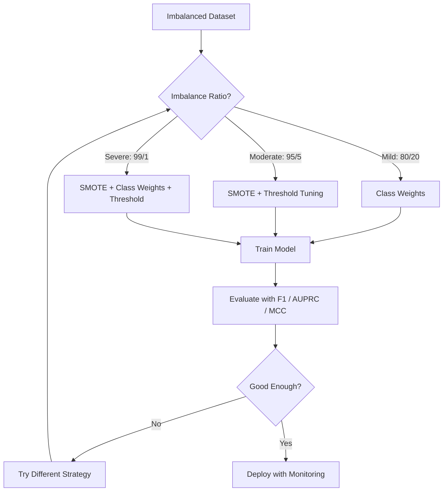
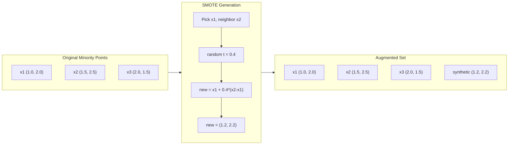
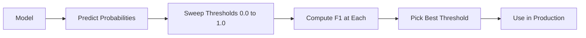
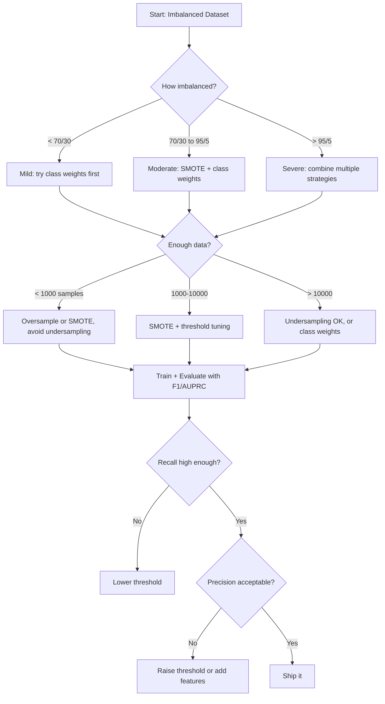

# Dengesiz Verilerle Başa Çıkma

> Verinizin %99'u "normal" olduğunda, doğruluk (accuracy) bir yalandır.

**Tür:** Build
**Dil:** Python
**Ön Koşullar:** Phase 2, Dersler 01-09 (özellikle değerlendirme metrikleri)
**Süre:** ~90 dakika

## Öğrenme Hedefleri

- SMOTE'u sıfırdan uygulamak ve sentetik oversampling'in rastgele kopyalamadan nasıl farklılaştığını açıklamak
- Dengesiz sınıflandırıcıları doğruluk (accuracy) yerine F1, AUPRC ve Matthews Correlation Coefficient ile değerlendirmek
- Class weighting, threshold ayarlama ve yeniden örnekleme (resampling) stratejilerini karşılaştırarak belirli bir dengesizlik oranı (imbalance ratio) için doğru yaklaşımı seçmek
- SMOTE, class weights ve threshold optimizasyonunu birleştiren eksiksiz bir dengesiz veri hattı (imbalanced data pipeline) oluşturmak

## Sorun

Bir dolandırıcılık tespit modeli (fraud detection model) geliştiriyorsunuz. Model %99.9 doğruluk (accuracy) alıyor. Kutlama yapıyorsunuz. Sonra her işlem için "dolandırıcılık değil" tahmini yaptığını fark ediyorsunuz.

Bu bir hata değildir. İşlemlerin yalnızca %0.1'i dolandırıcılık içeriyorsa, modelin her zaman çoğunluk sınıfını (majority class) tahmin etmesi rasyonel bir davranıştır. Model, toplam hatayı en aza indirgemeyi öğrenir. Teknik olarak doğrudur ve tamamen işe yaramazdır.

Bu durum, gerçek sınıflandırmanın önemli olduğu her yerde karşımıza çıkar. Hastalık teşhisi: %1 pozitif oranı. Ağ saldırısı tespiti: %0.01 saldırı. Üretim hataları: %0.5 kusurlu. Spam filtreleme: %20 spam. Müşteri kaybı tahmini (churn prediction): %5 kayıp. Minority class (azınlık sınıfı) ne kadar kritikse, o kadar nadir olma eğilimindedir.

Doğruluk (accuracy) başarısız olur çünkü tüm doğru tahminleri eşit değerlendirir. Meşru bir işlemi doğru etiketlemekle bir dolandırıcılığı yakalamak, accuracy açısından aynı bir puan değerindedir. Oysa dolandırıcılığı yakalamak, modelin var olma sebebidir. Modeli nadir ama önemli olan sınıfa dikkat etmeye zorlayacak metriklere, tekniklere ve eğitim stratejilerine ihtiyacımız vardır.

## Kavram

### Accuracy Neden Başarısız Olur

1000 örnekli bir veri seti düşünün: 990 negatif, 10 pozitif. Her zaman negatif tahmin eden bir model:

|  | Pozitif Tahmin | Negatif Tahmin |
|--|---|---|
| Gerçek Pozitif | 0 (TP) | 10 (FN) |
| Gerçek Negatif | 0 (FP) | 990 (TN) |

Accuracy = (0 + 990) / 1000 = %99.0

Model sıfır dolandırıcılık yakalar. Sıfır hastalık. Sıfır kusur. Ama accuracy %99 der. Bu nedenle accuracy, dengesiz problemler için tehlikelidir.

### Daha İyi Metrikler

**Precision** = TP / (TP + FP). Pozitif olarak işaretlenenlerin gerçekte ne kadarı pozitiftir? Yüksek precision, az sayıda yanlış alarm anlamına gelir.

**Recall** = TP / (TP + FN). Gerçekte pozitif olanların ne kadarını yakaladık? Yüksek recall, az sayıda gözden kaçırılmış pozitif demektir.

**F1 Skoru** = 2 * precision * recall / (precision + recall). Harmonik ortalama. Precision ve recall arasındaki aşırı dengesizliği, aritmetik ortalamadan daha fazla cezalandırır.

**F-beta Skoru** = (1 + beta^2) * precision * recall / (beta^2 * precision + recall). Beta > 1 olduğunda recall daha önemlidir. Beta < 1 olduğunda precision daha önemlidir. F2, dolandırıcılık tespitinde yaygındır (dolandırıcılığı kaçırmak, yanlış alarmdan daha kötüdür).

**AUPRC** (Area Under Precision-Recall Curve). AUC-ROC'a benzer ancak dengesiz veriler için daha bilgilendiricidir. Rastgele bir sınıflandırıcının AUPRC değeri, pozitif sınıf oranına eşittir (ROC'taki 0.5 değil). Bu sayede iyileştirmeleri görmek daha kolaydır.

**Matthews Correlation Coefficient** = (TP * TN - FP * FN) / sqrt((TP+FP)(TP+FN)(TN+FP)(TN+FN)). -1 ile +1 arasında değişir. Yalnızca model her iki sınıfta da iyi performans gösterdiğinde yüksek puan verir. Sınıflar çok farklı boyutlarda olsa bile dengelidir.

Yukarıdaki "her zaman negatif tahmin et" modeli için: precision = 0/0 (tanımsız, genellikle 0 kabul edilir), recall = 0/10 = 0, F1 = 0, MCC = 0. Bu metrikler modelin işe yaramaz olduğunu doğru bir şekilde ortaya koyar.

### Dengesiz Veri Hattı (Imbalanced Data Pipeline)



#### Açıklama
Dengesizlik oranına (imbalance ratio) göre strateji seçimi: Hafif dengesizlikte (80/20) class weights yeterlidir. Orta düzeyde (95/5) SMOTE ve threshold ayarı eklenir. Şiddetli dengesizlikte (99/1) her üç yöntem birden kullanılır. Değerlendirme her durumda F1, AUPRC ve MCC ile yapılır.

### SMOTE: Synthetic Minority Oversampling Technique

Rastgele oversampling, mevcut minority sample'ları kopyalar. Bu işe yarar ancak model aynı noktaları tekrar tekrar gördüğü için aşırı öğrenme (overfitting) riski taşır.

SMOTE, mantıklı ancak kopya olmayan yeni sentetik minority sample'lar oluşturur. Algoritma:

1. Her minority sample x için, diğer minority sample'lar arasındaki k en yakın komşuyu (k nearest neighbors) bul
2. Rastgele bir komşu seç
3. x ile bu komşu arasındaki doğru parçası üzerinde yeni bir örnek oluştur

Formül: `new_sample = x + random(0, 1) * (neighbor - x)`

Gerçek minority noktaları arasında interpolasyon yaparak, mevcut veriyi yalnızca kopyalamadan aynı özellik uzayı (feature space) bölgesinde yeni örnekler üretir.



#### Açıklama
SMOTE, minority class örnekleri arasında interpolasyon yaparak sentetik veri üretir. x1 ve onun komşusu x2 arasında rastgele bir t değeri (0.4) seçilir ve yeni bir nokta hesaplanır. Sonuçta orijinal üç noktaya ek olarak sentetik bir dördüncü nokta elde edilir.

### Örnekleme Stratejileri Karşılaştırması

**Rastgele Oversampling (Random Oversampling)**: minority sample'ları çoğunluk sayısına eşitlemek için kopyalar.
- Artıları: basit, bilgi kaybı yok
- Eksileri: birebir kopyalar aşırı öğrenmeye (overfitting) yol açar, eğitim süresini artırır

**Rastgele Undersampling (Random Undersampling)**: majority sample'ları minority sayısına eşitlemek için kaldırır.
- Artıları: hızlı eğitim, basit
- Eksileri: potansiyel olarak yararlı majority verisini atar, yüksek varyans

**SMOTE**: interpolasyon yoluyla sentetik minority sample'lar oluşturur.
- Artıları: yeni veri noktaları üretir, rastgele oversampling'e kıyasla overfitting'i azaltır
- Eksileri: karar sınırı (decision boundary) yakınında gürültülü örnekler oluşturabilir, majority class dağılımını hesaba katmaz

| Strateji | Değişen Veri | Risk | Ne Zaman Kullanılır |
|----------|-------------|------|-------------|
| Oversample | Minority kopyalanır | Overfitting | Küçük veri setleri, orta düzey dengesizlik |
| Undersample | Majority kaldırılır | Bilgi kaybı | Büyük veri setleri, hızlı eğitim isteniyorsa |
| SMOTE | Sentetik minority eklenir | Sınır gürültüsü | Orta düzey dengesizlik, k-NN için yeterli minority sample varsa |

### Class Weights

Veriyi değiştirmek yerine, modelin hataları nasıl ele aldığını değiştirin. Minority class'ı yanlış sınıflandırmanın maliyetini daha yüksek belirleyin.

950 negatif ve 50 pozitif örnekli bir ikili (binary) problem için:
- Negatif sınıf ağırlığı = n_samples / (2 * n_negative) = 1000 / (2 * 950) = 0.526
- Pozitif sınıf ağırlığı = n_samples / (2 * n_positive) = 1000 / (2 * 50) = 10.0

Pozitif sınıf 19 kat daha fazla ağırlık alır. Bir pozitif örneği yanlış sınıflandırmak, 19 negatif örneği yanlış sınıflandırmak kadar maliyetlidir. Model, minority class'a dikkat etmek zorunda kalır.

Lojistik regresyonda bu, kayıp fonksiyonunu (loss function) şu şekilde değiştirir:

```
weighted_loss = -sum(w_i * [y_i * log(p_i) + (1-y_i) * log(1-p_i)])
```

Burada w_i, i örneğinin sınıfına bağlıdır.

Class weights, matematiksel olarak beklenti (expectation) açısından oversampling'e eşdeğerdir, ancak yeni veri noktaları oluşturmaz. Bu onları daha hızlı kılar ve kopyalanmış örneklerin overfitting riskini ortadan kaldırır.

### Threshold Ayarı (Threshold Tuning)

Çoğu sınıflandırıcı bir olasılık (probability) çıktısı verir. Varsayılan threshold (eşik değeri) 0.5'tir: eğer P(pozitif) >= 0.5 ise pozitif tahmin et. Ancak 0.5 keyfidir. Sınıflar dengesiz olduğunda, optimal threshold genellikle çok daha düşüktür.

Süreç:
1. Modeli eğit
2. Doğrulama seti (validation set) üzerinde tahmin olasılıklarını al
3. Threshold'ları 0.0'dan 1.0'a tara (sweep)
4. Her threshold'da F1 (veya seçilen metrik) değerini hesapla
5. Metriği en üst düzeye çıkaran threshold'u seç



#### Açıklama
Model olasılık üretir, threshold 0.0-1.0 arasında taranır, her threshold'da F1 hesaplanır, en iyi F1'i veren threshold seçilir ve üretimde kullanılır.

Bir model, dolandırıcılık işlemi için P(fraud) = 0.15 çıktısı verebilir. Threshold 0.5'te bu "dolandırıcılık değil" olarak sınıflandırılır. Threshold 0.10'da doğru şekilde yakalanır. Olasılık kalibrasyonu (probability calibration), sıralamadan (ranking) daha az önemlidir — dolandırıcılık, dolandırıcılık olmayana göre daha yüksek olasılık aldığı sürece, onları ayıran bir threshold vardır.

### Maliyet Duyarlı Öğrenme (Cost-Sensitive Learning)

Class weights'in genelleştirilmiş halidir. Tek tip maliyetler yerine, belirli yanlış sınıflandırma maliyetleri atayın:

| | Pozitif Tahmin | Negatif Tahmin |
|--|---|---|
| Gerçek Pozitif | 0 (doğru) | C_FN = 100 |
| Gerçek Negatif | C_FP = 1 | 0 (doğru) |

Dolandırıcılık işlemini kaçırmak (FN), yanlış alarmdan (FP) 100 kat daha maliyetlidir. Model, toplam hata sayısını değil, toplam maliyeti en aza indirgemek için optimize eder.

Bu, gerçek dünya maliyetlerini tahmin edebildiğinizde en ilkeli yaklaşımdır. Gözden kaçırılmış bir kanser teşhisi ile gereksiz bir biyopsiye yol açan yanlış alarmın maliyeti çok farklıdır. Bu maliyetleri açıkça belirlemek, doğru ödünleşimleri (tradeoffs) zorunlu kılar.

### Karar Akış Şeması



#### Açıklama
Dengesizlik oranına ve veri miktarına göre strateji seçimini gösteren karar ağacı. Hafif dengesizlikte class weights, orta düzeyde SMOTE + class weights, şiddetli dengesizlikte birden çok strateji birleştirilir. Az veride undersampling'den kaçınılır, çok veride undersampling veya class weights önerilir. Recall düşükse threshold düşürülür, precision düşükse threshold yükseltilir veya yeni özellikler eklenir.

## İnşa Et

### Adım 1: Dengesiz bir veri seti oluştur

```python
import numpy as np


def make_imbalanced_data(n_majority=950, n_minority=50, seed=42):
    rng = np.random.RandomState(seed)

    X_maj = rng.randn(n_majority, 2) * 1.0 + np.array([0.0, 0.0])
    X_min = rng.randn(n_minority, 2) * 0.8 + np.array([2.5, 2.5])

    X = np.vstack([X_maj, X_min])
    y = np.concatenate([np.zeros(n_majority), np.ones(n_minority)])

    shuffle_idx = rng.permutation(len(y))
    return X[shuffle_idx], y[shuffle_idx]
```

#### Açıklama
Çoğunluk sınıfı (majority) orijin etrafında, azınlık sınıfı (minority) ise (2.5, 2.5) noktası etrafında Gauss dağılımıyla oluşturulur. Varsayılan: 950 majority, 50 minority (%5 pozitif oranı).

### Adım 2: Sıfırdan SMOTE

```python
def euclidean_distance(a, b):
    return np.sqrt(np.sum((a - b) ** 2))


def find_k_neighbors(X, idx, k):
    distances = []
    for i in range(len(X)):
        if i == idx:
            continue
        d = euclidean_distance(X[idx], X[i])
        distances.append((i, d))
    distances.sort(key=lambda x: x[1])
    return [d[0] for d in distances[:k]]


def smote(X_minority, k=5, n_synthetic=100, seed=42):
    rng = np.random.RandomState(seed)
    n_samples = len(X_minority)
    k = min(k, n_samples - 1)
    synthetic = []

    for _ in range(n_synthetic):
        idx = rng.randint(0, n_samples)
        neighbors = find_k_neighbors(X_minority, idx, k)
        neighbor_idx = neighbors[rng.randint(0, len(neighbors))]
        t = rng.random()
        new_point = X_minority[idx] + t * (X_minority[neighbor_idx] - X_minority[idx])
        synthetic.append(new_point)

    return np.array(synthetic)
```

#### Açıklama
SMOTE, minority class örnekleri arasında k-en yakın komşu (k-NN) interpolasyonu yapar. Rastgele bir minority örneği seçilir, k komşusundan biri rastgele alınır ve aralarındaki doğru parçası üzerinde yeni bir sentetik nokta oluşturulur.

### Adım 3: Rastgele oversampling ve undersampling

```python
def random_oversample(X, y, seed=42):
    rng = np.random.RandomState(seed)
    classes, counts = np.unique(y, return_counts=True)
    max_count = counts.max()

    X_resampled = list(X)
    y_resampled = list(y)

    for cls, count in zip(classes, counts):
        if count < max_count:
            cls_indices = np.where(y == cls)[0]
            n_needed = max_count - count
            chosen = rng.choice(cls_indices, size=n_needed, replace=True)
            X_resampled.extend(X[chosen])
            y_resampled.extend(y[chosen])

    X_out = np.array(X_resampled)
    y_out = np.array(y_resampled)
    shuffle = rng.permutation(len(y_out))
    return X_out[shuffle], y_out[shuffle]


def random_undersample(X, y, seed=42):
    rng = np.random.RandomState(seed)
    classes, counts = np.unique(y, return_counts=True)
    min_count = counts.min()

    X_resampled = []
    y_resampled = []

    for cls in classes:
        cls_indices = np.where(y == cls)[0]
        chosen = rng.choice(cls_indices, size=min_count, replace=False)
        X_resampled.extend(X[chosen])
        y_resampled.extend(y[chosen])

    X_out = np.array(X_resampled)
    y_out = np.array(y_resampled)
    shuffle = rng.permutation(len(y_out))
    return X_out[shuffle], y_out[shuffle]
```

#### Açıklama
Rastgele oversampling, azınlık sınıfı örneklerini kopyalayarak sınıfları dengeler (replace=True ile). Rastgele undersampling, çoğunluk sınıfı örneklerini rastgele seçip atarak sınıfları eşitler (replace=False ile). Her iki yöntem de nihai veriyi karıştırır.

### Adım 4: Class weights ile lojistik regresyon

```python
def sigmoid(z):
    return 1.0 / (1.0 + np.exp(-np.clip(z, -500, 500)))


def logistic_regression_weighted(X, y, weights, lr=0.01, epochs=200):
    n_samples, n_features = X.shape
    w = np.zeros(n_features)
    b = 0.0

    for _ in range(epochs):
        z = X @ w + b
        pred = sigmoid(z)
        error = pred - y
        weighted_error = error * weights

        gradient_w = (X.T @ weighted_error) / n_samples
        gradient_b = np.mean(weighted_error)

        w -= lr * gradient_w
        b -= lr * gradient_b

    return w, b


def compute_class_weights(y):
    classes, counts = np.unique(y, return_counts=True)
    n_samples = len(y)
    n_classes = len(classes)
    weight_map = {}
    for cls, count in zip(classes, counts):
        weight_map[cls] = n_samples / (n_classes * count)
    return np.array([weight_map[yi] for yi in y])
```

#### Açıklama
Class weights ile eğitimde, her örneğin hatası sınıf ağırlığıyla çarpılır. compute_class_weights, her sınıfa örnek sayısıyla ters orantılı ağırlık verir (az örnekli sınıf daha yüksek ağırlık alır). Gradyan inişi (gradient descent) bu ağırlıklı hatayı kullanarak güncelleme yapar.

### Adım 5: Threshold ayarı

```python
def find_optimal_threshold(y_true, y_probs, metric="f1"):
    best_threshold = 0.5
    best_score = -1.0

    for threshold in np.arange(0.05, 0.96, 0.01):
        y_pred = (y_probs >= threshold).astype(int)
        tp = np.sum((y_pred == 1) & (y_true == 1))
        fp = np.sum((y_pred == 1) & (y_true == 0))
        fn = np.sum((y_pred == 0) & (y_true == 1))

        if metric == "f1":
            precision = tp / (tp + fp) if (tp + fp) > 0 else 0.0
            recall = tp / (tp + fn) if (tp + fn) > 0 else 0.0
            score = 2 * precision * recall / (precision + recall) if (precision + recall) > 0 else 0.0
        elif metric == "recall":
            score = tp / (tp + fn) if (tp + fn) > 0 else 0.0
        elif metric == "precision":
            score = tp / (tp + fp) if (tp + fp) > 0 else 0.0

        if score > best_score:
            best_score = score
            best_threshold = threshold

    return best_threshold, best_score
```

#### Açıklama
Threshold'lar 0.05'ten 0.95'e 0.01 adımlarla taranır. Her threshold'da seçilen metrik (F1, recall veya precision) hesaplanır. En yüksek skoru veren threshold döndürülür. Bu, varsayılan 0.5'in her zaman optimal olmadığı dengesiz veri setleri için kritiktir.

### Adım 6: Değerlendirme fonksiyonları

```python
def confusion_matrix_values(y_true, y_pred):
    tp = np.sum((y_pred == 1) & (y_true == 1))
    tn = np.sum((y_pred == 0) & (y_true == 0))
    fp = np.sum((y_pred == 1) & (y_true == 0))
    fn = np.sum((y_pred == 0) & (y_true == 1))
    return tp, tn, fp, fn


def compute_metrics(y_true, y_pred):
    tp, tn, fp, fn = confusion_matrix_values(y_true, y_pred)
    accuracy = (tp + tn) / (tp + tn + fp + fn)
    precision = tp / (tp + fp) if (tp + fp) > 0 else 0.0
    recall = tp / (tp + fn) if (tp + fn) > 0 else 0.0
    f1 = 2 * precision * recall / (precision + recall) if (precision + recall) > 0 else 0.0

    denom = np.sqrt(float((tp + fp) * (tp + fn) * (tn + fp) * (tn + fn)))
    mcc = (tp * tn - fp * fn) / denom if denom > 0 else 0.0

    return {
        "accuracy": accuracy,
        "precision": precision,
        "recall": recall,
        "f1": f1,
        "mcc": mcc,
    }
```

#### Açıklama
confusion_matrix_values, TP/TN/FP/FN değerlerini hesaplar. compute_metrics, bu değerlerden accuracy, precision, recall, F1 ve MCC'yi üretir. MCC, sınıfların boyutlarından bağımsız dengeli bir metrik olduğu için dengesiz verilerde özellikle değerlidir.

### Adım 7: Tüm yaklaşımları karşılaştır

```python
X, y = make_imbalanced_data(950, 50, seed=42)
split = int(0.8 * len(y))
X_train, X_test = X[:split], X[split:]
y_train, y_test = y[:split], y[split:]

# Baseline: no treatment
w_base, b_base = logistic_regression_weighted(
    X_train, y_train, np.ones(len(y_train)), lr=0.1, epochs=300
)
probs_base = sigmoid(X_test @ w_base + b_base)
preds_base = (probs_base >= 0.5).astype(int)

# Oversampled
X_over, y_over = random_oversample(X_train, y_train)
w_over, b_over = logistic_regression_weighted(
    X_over, y_over, np.ones(len(y_over)), lr=0.1, epochs=300
)
preds_over = (sigmoid(X_test @ w_over + b_over) >= 0.5).astype(int)

# SMOTE
minority_mask = y_train == 1
X_minority = X_train[minority_mask]
synthetic = smote(X_minority, k=5, n_synthetic=len(y_train) - 2 * int(minority_mask.sum()))
X_smote = np.vstack([X_train, synthetic])
y_smote = np.concatenate([y_train, np.ones(len(synthetic))])
w_sm, b_sm = logistic_regression_weighted(
    X_smote, y_smote, np.ones(len(y_smote)), lr=0.1, epochs=300
)
preds_smote = (sigmoid(X_test @ w_sm + b_sm) >= 0.5).astype(int)

# Class weights
sample_weights = compute_class_weights(y_train)
w_cw, b_cw = logistic_regression_weighted(
    X_train, y_train, sample_weights, lr=0.1, epochs=300
)
probs_cw = sigmoid(X_test @ w_cw + b_cw)
preds_cw = (probs_cw >= 0.5).astype(int)

# Threshold tuning (tune on held-out validation set, not test set)
probs_val = sigmoid(X_val @ w_cw + b_cw)
best_thresh, best_f1 = find_optimal_threshold(y_val, probs_val, metric="f1")
preds_thresh = (probs_cw >= best_thresh).astype(int)
```

#### Açıklama
Yedi farklı yaklaşım karşılaştırılır: hiçbir işlem yapılmamış baseline, rastgele oversampling, SMOTE, class weights, class weights + threshold tuning. Her model aynı test seti üzerinde değerlendirilir. Threshold tuning için ayrı bir doğrulama seti (validation set) kullanılır — test seti asla threshold seçiminde kullanılmaz.

Kod dosyası tüm bunları tek bir betikte çalıştırır ve sonuçları yazdırır.

## Kullan

scikit-learn ve imbalanced-learn ile bu teknikler tek satırlıktır:

```python
from sklearn.linear_model import LogisticRegression
from sklearn.metrics import classification_report, f1_score
from sklearn.model_selection import train_test_split
from imblearn.over_sampling import SMOTE
from imblearn.under_sampling import RandomUnderSampler
from imblearn.pipeline import Pipeline

X_train, X_test, y_train, y_test = train_test_split(X, y, stratify=y)

model_weighted = LogisticRegression(class_weight="balanced")
model_weighted.fit(X_train, y_train)
print(classification_report(y_test, model_weighted.predict(X_test)))

smote = SMOTE(random_state=42)
X_resampled, y_resampled = smote.fit_resample(X_train, y_train)
model_smote = LogisticRegression()
model_smote.fit(X_resampled, y_resampled)
print(classification_report(y_test, model_smote.predict(X_test)))

pipeline = Pipeline([
    ("smote", SMOTE()),
    ("model", LogisticRegression(class_weight="balanced")),
])
pipeline.fit(X_train, y_train)
print(classification_report(y_test, pipeline.predict(X_test)))
```

#### Açıklama
scikit-learn'ün LogisticRegression'ı `class_weight="balanced"` parametresiyle otomatik class weight hesaplar. imbalanced-learn kütüphanesi SMOTE, RandomUnderSampler ve Pipeline desteği sunar. Pipeline, SMOTE ve modeli tek bir adımda zincirleyerek eğitim-test sızıntısını (data leakage) önler.

Sıfırdan yazılmış kodlar her tekniğin tam olarak ne yaptığını gösterir. SMOTE, minority class üzerinde k-NN interpolasyonudur. Class weights, kayıp fonksiyonunu çarpar. Threshold tuning, kesme noktaları üzerinde bir for döngüsüdür. Sihir yok.

## Çıktılar

Bu ders şunları üretir:
- `outputs/skill-imbalanced-data.md` -- dengesiz sınıflandırma problemleri için bir karar kontrol listesi (decision checklist)

## Alıştırmalar

1. **Borderline-SMOTE**: SMOTE uygulamasını, yalnızca karar sınırına (decision boundary) yakın minority noktaları (k-en yakın komşuları arasında majority class örnekleri bulunanlar) için sentetik örnek üretecek şekilde değiştirin. Sonuçları, sınıfların örtüştüğü bir veri setinde standart SMOTE ile karşılaştırın.

2. **Cost matrix optimizasyonu**: Maliyet matrisinin bir parametre olduğu cost-sensitive learning uygulayın. Bir maliyet matrisi alıp beklenen maliyeti en aza indiren optimal tahminleri döndüren bir fonksiyon yazın. Farklı maliyet oranlarıyla (1:10, 1:100, 1:1000) test edin ve precision-recall ödünleşiminin nasıl değiştiğini grafikleyin.

3. **Threshold kalibrasyonu**: Platt scaling uygulayın (modelin ham çıktıları üzerinde bir lojistik regresyon eğiterek kalibre edilmiş olasılıklar üretin). Kalibrasyon öncesi ve sonrası precision-recall eğrisini karşılaştırın. Kalibrasyonun sıralamayı (ranking) değiştirmediğini (AUC aynı kalır) ancak olasılıkları daha anlamlı hale getirdiğini gösterin.

4. **Balanced bagging ile topluluk (ensemble)**: Her biri dengeli bir bootstrap örneği (tüm minority + majority'nin rastgele alt kümesi) üzerinde eğitilmiş birden çok model eğitin. Tahminlerini ortalamasını alın. Bu yaklaşımı tek bir SMOTE'lu modelle karşılaştırın. Hem performansı hem de çalıştırmalar arası varyansı ölçün.

5. **Dengesizlik oranı deneyi (Imbalance ratio experiment)**: Dengeli bir veri seti alın ve dengesizlik oranını kademeli olarak artırın (50/50, 70/30, 90/10, 95/5, 99/1). Her oran için SMOTE'lu ve SMOTE'suz eğitim yapın. Her iki yaklaşım için F1 vs. dengesizlik oranı grafiği çizin. SMOTE hangi oranda anlamlı bir fark yaratmaya başlar?

## Anahtar Terimler

| Terim | Ne denir | Gerçekte ne anlama gelir |
|------|----------------|----------------------|
| Class imbalance | "Bir sınıfın çok daha fazla örneği var" | Sınıfların veri setindeki dağılımı önemli ölçüde çarpıktır ve modellerin majority class'ı kayırmasına neden olur |
| SMOTE | "Sentetik oversampling" | Mevcut minority örnekleri ile bunların k-en yakın minority komşuları arasında interpolasyon yaparak yeni minority örnekleri oluşturur |
| Class weights | "Nadir sınıflardaki hataları daha pahalı hale getirmek" | Kayıp fonksiyonunu sınıf bazlı ağırlıklarla çarparak modelin minority yanlış sınıflandırmasını daha ağır cezalandırmasını sağlar |
| Threshold tuning | "Karar sınırını kaydırmak" | Sınıflandırma için olasılık kesme noktasını varsayılan 0.5'ten istenen metriği optimize eden bir değere değiştirmek |
| Precision-recall tradeoff | "İkisine birden sahip olamazsınız" | Threshold'u düşürmek daha fazla pozitif yakalar (yüksek recall) ancak daha fazla yanlış pozitif işaretler (düşük precision) ve bunun tersi |
| AUPRC | "PR eğrisi altındaki alan" | Precision-recall eğrisini tek bir sayıda özetler; sınıflar aşırı dengesiz olduğunda AUC-ROC'tan daha bilgilendiricidir |
| Matthews Correlation Coefficient | "Dengeli metrik" | Tahmin edilen ve gerçek etiketler arasındaki korelasyon; yalnızca model her iki sınıfta da iyi performans gösterdiğinde yüksek puan üretir |
| Cost-sensitive learning | "Farklı hatalar farklı miktarlarda maliyet getirir" | Gerçek dünya yanlış sınıflandırma maliyetlerini eğitim hedefine dahil ederek modelin hata sayısı yerine toplam maliyeti optimize etmesini sağlar |
| Random oversampling | "Minority'yi kopyala" | Sınıf sayılarını dengelemek için minority class örneklerini tekrarlamak; basit ancak kopyalanan noktalara aşırı öğrenme riski taşır |

## Daha Fazla Okuma

- [SMOTE: Synthetic Minority Over-sampling Technique (Chawla et al., 2002)](https://arxiv.org/abs/1106.1813) -- orijinal SMOTE makalesi, dengesiz öğrenme üzerine en çok atıf alan çalışma
- [Learning from Imbalanced Data (He & Garcia, 2009)](https://ieeexplore.ieee.org/document/5128907) -- örnekleme, maliyet duyarlı ve algoritmik yaklaşımları kapsayan kapsamlı bir survey
- [imbalanced-learn documentation](https://imbalanced-learn.org/stable/) -- SMOTE varyantları, undersampling stratejileri ve pipeline entegrasyonu sunan Python kütüphanesi
- [The Precision-Recall Plot Is More Informative than the ROC Plot (Saito & Rehmsmeier, 2015)](https://journals.plos.org/plosone/article?id=10.1371/journal.pone.0118432) -- dengesiz problemlerde PR eğrilerinin ROC eğrilerine ne zaman ve neden tercih edilmesi gerektiği
