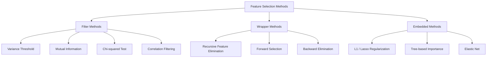
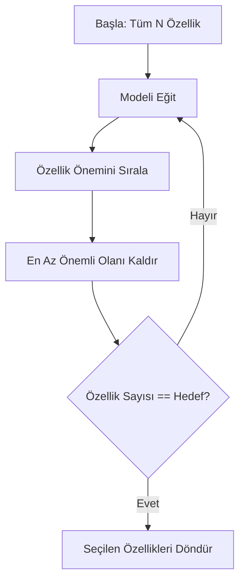
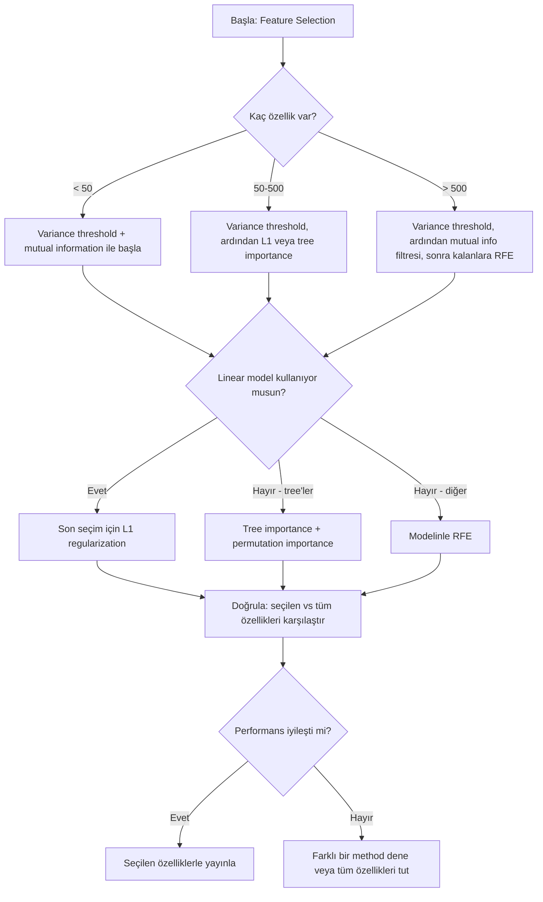

# Feature Selection (Özellik Seçimi)

> Daha fazla özellik daha iyi değildir. Doğru özellikler daha iyidir.

**Tür:** Build
**Dil:** Python
**Ön Koşullar:** Phase 2, Ders 01-09, 08 (feature engineering)
**Süre:** ~75 dakika

## Öğrenme Hedefleri

- Filter method'ları (variance threshold, mutual information, chi-squared) ve wrapper method'ları (RFE, forward selection) sıfırdan uygulamak
- Mutual information'ın, correlation'ın yakalayamadığı nonlinear (doğrusal olmayan) feature-target ilişkilerini neden yakaladığını açıklamak
- L1 regularization (embedded selection) ile RFE (wrapper selection) arasında karşılaştırma yapmak ve hesaplama maliyeti farklarını değerlendirmek
- Birden çok method'u birleştiren bir feature selection pipeline'ı kurmak ve ayrılmış test verisinde genelleme başarımının arttığını göstermek

## Problem

Elinizde 500 özellik var. Modeliniz yavaş eğitiliyor, sürekli overfit oluyor ve kimse ne öğrendiğini açıklayamıyor. Performansı artırmak için daha fazla özellik eklisiniz. Durum daha da kötüleşiyor.

Bu, boyut laneti (curse of dimensionality) dediğimiz olgudur. Özellik sayısı arttıkça, özellik uzayının hacmi katlanarak büyür. Veri noktaları seyrelir. Noktalar arasındaki uzaklıklar anlamsızlaşır. Modelin gerçek örüntüleri bulabilmesi için katlanarak daha fazla veriye ihtiyacı olur. Gürültülü özellikler (noise features), sinyal taşıyan özellikleri bastırır. Overfitting varsayılan durum haline gelir.

Feature selection (özellik seçimi) bu sorunun panzehiridir. Gürültüyü ayıklayın. Gereksiz tekrarları kaldırın. Hedef değişken hakkında gerçekten bilgi taşıyan özellikleri tutun. Sonuç: daha hızlı eğitim, daha iyi genelleme ve gerçekten açıklayabildiğiniz modeller.

Amaç mevcut tüm bilgiyi kullanmak değil, doğru bilgiyi kullanmaktır.

## Kavram

### Feature Selection'ın Üç Kategorisi

Her feature selection method'u üç kategoriden birine girer:



**Filter method'lar**, her özelliği istatistiksel bir ölçüt kullanarak bağımsızca puanlar. Bir model kullanmazlar. Hızlıdırlar ancak özellikler arası etkileşimleri gözden kaçırırlar.

**Wrapper method'lar**, özellik altkümelerini değerlendirmek için bir model eğitir. Puan olarak model performansını kullanırlar. Daha iyi sonuç verirler ancak pahalıdırlar çünkü modeli defalarca yeniden eğitirler.

**Embedded method'lar**, özellik seçimini model eğitiminin bir parçası olarak yapar. L1 regularization, ağırlıkları sıfıra iter. Decision tree'ler en kullanışlı özelliklere göre bölünür. Seçim, ayrı bir adım olarak değil, model uydurma sırasında gerçekleşir.

### Variance Threshold (Varyans Eşiği)

En basit filter. Bir özellik örneklemler arasında neredeyse hiç değişmiyorsa, neredeyse hiç bilgi taşımıyordur.

1000 örneklemden 999'unda 0.0 olan bir özellik düşünün. Varyansı sıfıra yakındır. Hiçbir model bunu sınıflar arasında ayrım yapmak için kullanamaz. Kaldırın.

```
variance(x) = mean((x - mean(x))^2)
```

Bir eşik belirleyin (ör. 0.01). Varyansı bu eşiğin altında kalan her özelliği atın. Bu, hedef değişkene hiç bakmadan sabit veya sabite yakın özellikleri temizler.

Ne zaman kullanılır: diğer method'lardan önce bir ön işleme adımı olarak. Neredeyse sıfır maliyetle bariz işe yaramaz özellikleri yakalar.

Sınırlılık: bir özellik yüksek varyansa sahip olabilir ama yine de tamamen gürültü olabilir. Variance threshold gerekli ama yeterli değildir.

### Mutual Information (Karşılıklı Bilgi)

Mutual information, X özelliğinin değerini bilmenin, Y hedefi hakkındaki belirsizliği ne kadar azalttığını ölçer.

```
I(X; Y) = sum_x sum_y p(x, y) * log(p(x, y) / (p(x) * p(y)))
```

X ve Y bağımsızsa, p(x, y) = p(x) * p(y) olur, böylece log terimi sıfır olur ve I(X; Y) = 0 olur. X size Y hakkında ne kadar çok şey söylüyorsa, mutual information o kadar yüksektir.

Correlation'a göre temel avantajı: mutual information nonlinear (doğrusal olmayan) ilişkileri yakalar. Bir özelliğin hedefle correlation'u sıfır olabilir ama mutual information'ı yüksektir çünkü ilişki kuadratik veya periyodiktir.

Sürekli özellikler için önce kutulara ayırın (histogram tabanlı kestirim). Kutu sayısı kestirimi etkiler — çok az kutu bilgi kaybettirir, çok fazla kutu gürültü ekler. Yaygın seçenekler: sqrt(n) kutu veya Sturges kuralı (1 + log2(n)).


### Recursive Feature Elimination (RFE) (Tekrarlamalı Özellik Elemesi)

RFE bir wrapper method'dur. Kendi modelinin feature importance'ını kullanarak yinelemeli olarak budama yapar:

1. Modeli tüm özelliklerle eğit
2. Özellikleri önem sırasına koy (linear modeller için katsayılar, tree'ler için impurity reduction)
3. En az önemli özelliği/özellikleri kaldır
4. İstenen özellik sayısına ulaşana kadar tekrarla



RFE, özellik etkileşimlerini dikkate alır çünkü model kalan tüm özellikleri birlikte görür. Bir özelliği kaldırmak, diğerlerinin önemini değiştirir. Bu onu filter method'lardan daha kapsamlı kılar.

Maliyeti: modeli N - hedef kez eğitirsiniz. 500 özellik ve 10 hedefiyle bu 490 eğitim anlamına gelir. Pahalı modeller için yavaştır. Her adımda birden çok özelliği kaldırarak hızlandırabilirsiniz (ör. her turda en düşük %10'u kaldırın).

### L1 (Lasso) Regularization

L1 regularization, ağırlıkların mutlak değerini kayıp fonksiyonuna ekler:

```
loss = prediction_error + alpha * sum(|w_i|)
```

Alpha parametresi, özelliklerin ne kadar agresif budanacağını kontrol eder. Daha yüksek alpha, daha fazla ağırlığın tam olarak sıfır olması anlamına gelir.

Neden tam olarak sıfır? L1 cezası, ağırlık uzayında elmas şeklinde bir kısıtlama bölgesi yaratır. Optimum çözüm, bu elmasın bir köşesine denk gelme eğilimindedir — burada bir veya daha fazla ağırlık sıfırdır. L2 regularization (ridge) dairesel bir kısıtlama yaratır; ağırlıklar küçülür ama nadiren tam sıfıra ulaşır.

Bu, embedded feature selection'dır: model eğitim sırasında hangi özellikleri yok sayacağını öğrenir. Ağırlığı sıfır olan özellikler etkin bir şekilde kaldırılmıştır.

Avantajları: tek eğitim çalıştırması, ilişkili özellikleri yönetir (birini seçer diğerlerini sıfırlar), çoğu linear model implementasyonunda yerleşiktir.

Sınırlılık: sadece linear modellerde çalışır. Nonlinear özellik önemini yakalayamaz.

### Tree-Based Feature Importance (Ağaç Tabanlı Özellik Önemi)

Decision tree'ler ve toplulukları (random forest, gradient boosting), özellikleri doğal olarak sıralar. Her bölünme impurity'yi (Gini veya entropy — sınıflandırma için; variance — regresyon için) azaltır. Daha büyük impurity azalması sağlayan özellikler daha önemlidir.

T ağaçlı bir random forest için:

```
importance(feature_j) = (1/T) * sum over all trees of
    sum over all nodes splitting on feature_j of
        (n_samples * impurity_decrease)
```

Bu, her özellik için normalize edilmiş bir önem puanı verir. Nonlinear ilişkileri ve özellik etkileşimlerini otomatik olarak yönetir.

Dikkat: tree-based importance, çok sayıda benzersiz değere sahip (yüksek kardinaliteli) özelliklere karşı yanlıdır. Rastgele bir ID sütunu, her örneklemi mükemmel şekilde böldüğü için önemli görünür. Sağlama olarak permutation importance kullanın.

### Permutation Importance (Permütasyon Önemi)

Modelden bağımsız bir method:

1. Modeli eğitin ve doğrulama verisindeki temel performansı kaydedin
2. Her özellik için: değerlerini rastgele karıştırın, performans düşüşünü ölçün
3. Düşüş ne kadar büyükse, özellik o kadar önemlidir

Bir özelliği karıştırmak performansı etkilemiyorsa, model ona bağımlı değildir. Performans çöküyorsa, o özellik kritiktir.

Permutation importance, tree-based importance'ın kardinalite yanlılığından kaçınır. Ancak yavaştır: özellik başına bir tam değerlendirme, stabilite için birden çok kez tekrarlanır.

### Karşılaştırma Tablosu

| Method | Tür | Hız | Nonlinear | Özellik Etkileşimleri |
|--------|------|-------|-----------|---------------------|
| Variance threshold | Filter | Çok hızlı | Hayır | Hayır |
| Mutual information | Filter | Hızlı | Evet | Hayır |
| Correlation filter | Filter | Hızlı | Hayır | Hayır |
| RFE | Wrapper | Yavaş | Modele bağlı | Evet |
| L1 / Lasso | Embedded | Hızlı | Hayır (linear) | Hayır |
| Tree importance | Embedded | Orta | Evet | Evet |
| Permutation importance | Model-agnostic | Yavaş | Evet | Evet |

### Karar Akış Şeması



## Build It (Uygulama)

### Adım 1: Bilinen özellik yapısına sahip sentetik veri üret

```python
import numpy as np


def make_feature_selection_data(n_samples=500, seed=42):
    rng = np.random.RandomState(seed)

    x1 = rng.randn(n_samples)
    x2 = rng.randn(n_samples)
    x3 = rng.randn(n_samples)
    x4 = x1 + 0.1 * rng.randn(n_samples)
    x5 = x2 + 0.1 * rng.randn(n_samples)

    informative = np.column_stack([x1, x2, x3, x4, x5])

    correlated = np.column_stack([
        x1 * 0.9 + 0.1 * rng.randn(n_samples),
        x2 * 0.8 + 0.2 * rng.randn(n_samples),
        x3 * 0.7 + 0.3 * rng.randn(n_samples),
        x1 * 0.5 + x2 * 0.5 + 0.1 * rng.randn(n_samples),
        x2 * 0.6 + x3 * 0.4 + 0.1 * rng.randn(n_samples),
    ])

    noise = rng.randn(n_samples, 10) * 0.5

    X = np.hstack([informative, correlated, noise])
    y = (2 * x1 - 1.5 * x2 + x3 + 0.5 * rng.randn(n_samples) > 0).astype(int)

    feature_names = (
        [f"info_{i}" for i in range(5)]
        + [f"corr_{i}" for i in range(5)]
        + [f"noise_{i}" for i in range(10)]
    )

    return X, y, feature_names
```
#### Açıklama: Bilinen yapıda sentetik veri üreten fonksiyon. 5 bilgilendirici (informative), 5 ilişkili (correlated) ve 10 gürültü (noise) özelliği içerir.

Ground truth'u biliyoruz: 0-4 arası özellikler bilgilendirici (3 ve 4, 0 ve 1'in korelasyonlu kopyaları), 5-9 arası bilgilendirici özelliklerle ilişkili, 10-19 arası tamamen gürültü. İyi bir seçim method'u 0-4'ü en yüksek, 10-19'u en düşük sıralamalıdır.

### Adım 2: Variance threshold

```python
def variance_threshold(X, threshold=0.01):
    variances = np.var(X, axis=0)
    mask = variances > threshold
    return mask, variances
```
#### Açıklama: Varyansı belirlenen eşiğin altında olan özellikleri filtreler.

### Adım 3: Mutual information (kesikli)

```python
def discretize(x, n_bins=10):
    min_val, max_val = x.min(), x.max()
    if max_val == min_val:
        return np.zeros_like(x, dtype=int)
    bin_edges = np.linspace(min_val, max_val, n_bins + 1)
    binned = np.digitize(x, bin_edges[1:-1])
    return binned


def mutual_information(X, y, n_bins=10):
    n_samples, n_features = X.shape
    mi_scores = np.zeros(n_features)

    y_vals, y_counts = np.unique(y, return_counts=True)
    p_y = y_counts / n_samples

    for f in range(n_features):
        x_binned = discretize(X[:, f], n_bins)
        x_vals, x_counts = np.unique(x_binned, return_counts=True)
        p_x = dict(zip(x_vals, x_counts / n_samples))

        mi = 0.0
        for xv in x_vals:
            for yi, yv in enumerate(y_vals):
                joint_mask = (x_binned == xv) & (y == yv)
                p_xy = np.sum(joint_mask) / n_samples
                if p_xy > 0:
                    mi += p_xy * np.log(p_xy / (p_x[xv] * p_y[yi]))
        mi_scores[f] = mi

    return mi_scores
```
#### Açıklama: Sürekli özellikleri kutuya ayırıp ortak olasılık dağılımı üzerinden mutual information hesaplar.

### Adım 4: Recursive Feature Elimination

```python
def simple_logistic_importance(X, y, lr=0.1, epochs=100):
    n_samples, n_features = X.shape
    w = np.zeros(n_features)
    b = 0.0

    for _ in range(epochs):
        z = X @ w + b
        pred = 1.0 / (1.0 + np.exp(-np.clip(z, -500, 500)))
        error = pred - y
        w -= lr * (X.T @ error) / n_samples
        b -= lr * np.mean(error)

    return w, b


def rfe(X, y, n_features_to_select=5, lr=0.1, epochs=100):
    n_total = X.shape[1]
    remaining = list(range(n_total))
    rankings = np.ones(n_total, dtype=int)
    rank = n_total

    while len(remaining) > n_features_to_select:
        X_subset = X[:, remaining]
        w, _ = simple_logistic_importance(X_subset, y, lr, epochs)
        importances = np.abs(w)

        least_idx = np.argmin(importances)
        original_idx = remaining[least_idx]
        rankings[original_idx] = rank
        rank -= 1
        remaining.pop(least_idx)

    for idx in remaining:
        rankings[idx] = 1

    selected_mask = rankings == 1
    return selected_mask, rankings
```
#### Açıklama: Lojistik regresyon kullanarak özellikleri önem sırasına koyar ve en önemsizleri tekrarlamalı olarak eler.

### Adım 5: L1 feature selection

```python
def soft_threshold(w, alpha):
    return np.sign(w) * np.maximum(np.abs(w) - alpha, 0)


def l1_feature_selection(X, y, alpha=0.1, lr=0.01, epochs=500):
    n_samples, n_features = X.shape
    w = np.zeros(n_features)
    b = 0.0

    for _ in range(epochs):
        z = X @ w + b
        pred = 1.0 / (1.0 + np.exp(-np.clip(z, -500, 500)))
        error = pred - y

        gradient_w = (X.T @ error) / n_samples
        gradient_b = np.mean(error)

        w -= lr * gradient_w
        w = soft_threshold(w, lr * alpha)
        b -= lr * gradient_b

    selected_mask = np.abs(w) > 1e-6
    return selected_mask, w
```
#### Açıklama: Gradient descent ile L1 regularization uygulayarak önemsiz özelliklerin ağırlıklarını sıfıra iter.

### Adım 6: Tree-based importance (basit decision tree)

```python
def gini_impurity(y):
    if len(y) == 0:
        return 0.0
    classes, counts = np.unique(y, return_counts=True)
    probs = counts / len(y)
    return 1.0 - np.sum(probs ** 2)


def best_split(X, y, feature_idx):
    values = np.unique(X[:, feature_idx])
    if len(values) <= 1:
        return None, -1.0

    best_threshold = None
    best_gain = -1.0
    parent_gini = gini_impurity(y)
    n = len(y)

    for i in range(len(values) - 1):
        threshold = (values[i] + values[i + 1]) / 2.0
        left_mask = X[:, feature_idx] <= threshold
        right_mask = ~left_mask

        n_left = np.sum(left_mask)
        n_right = np.sum(right_mask)

        if n_left == 0 or n_right == 0:
            continue

        gain = parent_gini - (n_left / n) * gini_impurity(y[left_mask]) - (n_right / n) * gini_impurity(y[right_mask])

        if gain > best_gain:
            best_gain = gain
            best_threshold = threshold

    return best_threshold, best_gain


def tree_importance(X, y, n_trees=50, max_depth=5, seed=42):
    rng = np.random.RandomState(seed)
    n_samples, n_features = X.shape
    importances = np.zeros(n_features)

    for _ in range(n_trees):
        sample_idx = rng.choice(n_samples, size=n_samples, replace=True)
        feature_subset = rng.choice(n_features, size=max(1, int(np.sqrt(n_features))), replace=False)

        X_boot = X[sample_idx]
        y_boot = y[sample_idx]

        tree_imp = _build_tree_importance(X_boot, y_boot, feature_subset, max_depth)
        importances += tree_imp

    total = importances.sum()
    if total > 0:
        importances /= total

    return importances


def _build_tree_importance(X, y, feature_subset, max_depth, depth=0):
    n_features = X.shape[1]
    importances = np.zeros(n_features)

    if depth >= max_depth or len(np.unique(y)) <= 1 or len(y) < 4:
        return importances

    best_feature = None
    best_threshold = None
    best_gain = -1.0

    for f in feature_subset:
        threshold, gain = best_split(X, y, f)
        if gain > best_gain:
            best_gain = gain
            best_feature = f
            best_threshold = threshold

    if best_feature is None or best_gain <= 0:
        return importances

    importances[best_feature] += best_gain * len(y)

    left_mask = X[:, best_feature] <= best_threshold
    right_mask = ~left_mask

    importances += _build_tree_importance(X[left_mask], y[left_mask], feature_subset, max_depth, depth + 1)
    importances += _build_tree_importance(X[right_mask], y[right_mask], feature_subset, max_depth, depth + 1)

    return importances
```
#### Açıklama: Random forest benzeri bir yaklaşımla, her bölünmedeki impurity azalmasını biriktirerek özellik önem skorlarını hesaplar.

### Adım 7: Tüm method'ları çalıştır ve karşılaştır

Kod dosyası, beş method'u da aynı sentetik veri kümesinde çalıştırır ve her method'un hangi özellikleri seçtiğini gösteren bir karşılaştırma tablosu yazdırır.

## Use It (Kullanım)

scikit-learn ile feature selection, pipeline'a entegre edilmiştir:

```python
from sklearn.feature_selection import (
    VarianceThreshold,
    mutual_info_classif,
    RFE,
    SelectFromModel,
)
from sklearn.linear_model import Lasso, LogisticRegression
from sklearn.ensemble import RandomForestClassifier

vt = VarianceThreshold(threshold=0.01)
X_filtered = vt.fit_transform(X)

mi_scores = mutual_info_classif(X, y)
top_k = np.argsort(mi_scores)[-10:]

rfe_selector = RFE(LogisticRegression(), n_features_to_select=10)
rfe_selector.fit(X, y)
X_rfe = rfe_selector.transform(X)

lasso_selector = SelectFromModel(Lasso(alpha=0.01))
lasso_selector.fit(X, y)
X_lasso = lasso_selector.transform(X)

rf = RandomForestClassifier(n_estimators=100)
rf.fit(X, y)
importances = rf.feature_importances_
```
#### Açıklama: scikit-learn ile variance threshold, mutual information, RFE, Lasso ve Random Forest feature importance kullanımı.

Sıfırdan yazılan uygulamalar, her method'un içinde tam olarak ne olduğunu gösterir. Variance threshold sadece `var(X, axis=0)` hesaplayıp bir maske uygulamaktır. Mutual information, bir olabilirlik tablosunda ortak ve marjinal frekansları saymaktır. RFE, eğiten, sıralayan ve budayan bir döngüdür. L1, soft-thresholding adımlı gradient descent'tir. Tree importance, bölünmeler arasındaki impurity azalmalarını biriktirir. Sihir yok — sadece istatistik ve döngüler.

sklearn versiyonları sağlamlık (ör. mutual_info_classif, kutuya ayırma yerine k-NN yoğunluk kestirimi kullanır), hız (C implementasyonları) ve pipeline entegrasyonu ekler.

## Ship It (Çıktılar)

Bu ders şunları üretir:
- `outputs/skill-feature-selector.md` — doğru feature selection method'unu seçmek için hızlı başvuru karar ağacı

## Alıştırmalar

1. **Forward selection**: RFE'nin tersini uygulayın. Sıfır özellikle başlayın. Her adımda, model performansını en çok artıran özelliği ekleyin. Yeni özellik eklemek artık yardımcı olmadığında durun. Seçilen özellikleri RFE sonuçlarıyla karşılaştırın. Hangisi daha hızlı? Hangisi daha iyi sonuç veriyor?

2. **Stability selection**: L1 feature selection'ı 50 kez çalıştırın, her seferinde verinin rastgele %80'lik bir altörneklemini ve biraz farklı alpha değerlerini kullanın. Her özelliğin kaç kez seçildiğini sayın. Çalıştırmaların > %80'inde seçilen özellikler "stabildir." Kararlı özellikleri tek çalıştırmalı L1 seçimiyle karşılaştırın. Hangisi daha güvenilir?

3. **Multicollinearity detection**: Tüm özellikler için korelasyon matrisini hesaplayın. Bir korelasyon eşiği (ör. 0.9) verildiğinde, yüksek korelasyonlu her çiftten bir özelliği kaldıran (hedefle mutual information'ı daha yüksek olanı tutan) bir fonksiyon uygulayın. Sentetik veri kümesinde test edin ve gereksiz ilişkili özellikleri kaldırdığını doğrulayın.

4. **Feature selection pipeline**: variance threshold, mutual information filtresi ve RFE'yi tek bir pipeline'da birleştirin. Önce sıfıra yakın varyanslı özellikleri kaldırın, ardından mutual information'da ilk %50'yi tutun, sonra kalanlara RFE uygulayın. Bu pipeline'ı, tüm özelliklerde tek başına RFE çalıştırmakla karşılaştırın. Pipeline daha hızlı mı? Eşit doğrulukta mı?

5. **Permutation importance from scratch**: permutation importance'ı sıfırdan uygulayın. Her özellik için, değerlerini 10 kez karıştırın, F1 skorundaki ortalama düşüşü ölçün. Sıralamayı tree-based importance ile karşılaştırın. Farklı oldukları durumları bulun ve nedenini açıklayın (ipucu: ilişkili özellikler).

## Anahtar Terimler

| Terim | Ne denir | Gerçek anlamı |
|------|----------------|----------------------|
| Filter method | "Özellikleri bağımsızca puanla" | Bir model eğitmeden, istatistiksel bir ölçüt kullanarak özellikleri sıralayan, her özelliği tek başına değerlendiren bir yaklaşım |
| Wrapper method | "Özellikleri seçmek için model kullan" | Bir model eğiterek ve performansını seçim kriteri olarak kullanarak özellik altkümelerini değerlendiren yaklaşım |
| Embedded method | "Model eğitim sırasında özellikleri seçer" | L1 regularization'ın ağırlıkları sıfıra itmesi gibi, model uydurmanın bir parçası olarak gerçekleşen özellik seçimi |
| Mutual information | "Bir değişkenin size diğeri hakkında ne kadar bilgi verdiği" | X'in bilgisi verildiğinde Y'deki belirsizliğin azalmasını ölçen, hem linear hem nonlinear bağımlılıkları yakalayan bir ölçüt |
| Recursive Feature Elimination | "Eğit, sırala, buda, tekrarla" | Bir model eğiten, en az önemli özelliği/özellikleri kaldıran ve hedef sayıya ulaşana kadar tekrarlayan yinelemeli wrapper method |
| L1 / Lasso regularization | "Özellikleri öldüren ceza" | Kayıp fonksiyonuna mutlak ağırlık değerlerinin toplamını ekleyerek önemsiz özellik ağırlıklarını tam sıfıra iten yöntem |
| Variance threshold | "Sabit özellikleri kaldır" | Varyansı belirtilen eşiğin altında kalan özellikleri atarak bilgi taşımayan özellikleri filtreleme |
| Feature importance | "Hangi özellikler en önemli" | Her özelliğin model tahminlerine ne kadar katkıda bulunduğunu gösteren, bölünme kazançları (tree'ler) veya katsayı büyüklüklerinden (linear) hesaplanan skor |
| Permutation importance | "Karıştır ve hasarı ölç" | Her özelliğin değerlerini rastgele karıştırarak model performansındaki düşüşü ölçen özellik önemi değerlendirme yöntemi |
| Curse of dimensionality | "Çok fazla özellik, yeterli veri yok" | Özellik ekledikçe özellik uzayının hacminin katlanarak artması, veriyi seyreltmesi ve uzaklıkları anlamsız kılması olgusu |

## İleri Okuma

- [An Introduction to Variable and Feature Selection (Guyon & Elisseeff, 2003)](https://jmlr.org/papers/v3/guyon03a.html) — feature selection method'ları üzerine temel referans, halen yaygın olarak atıf alır
- [scikit-learn Feature Selection Guide](https://scikit-learn.org/stable/modules/feature_selection.html) — filter, wrapper ve embedded method'lar için kod örnekleriyle pratik referans
- [Stability Selection (Meinshausen & Buhlmann, 2010)](https://arxiv.org/abs/0809.2932) — sağlam, tekrarlanabilir sonuçlar için altörneklemeyi feature selection ile birleştirir
- [Beware Default Random Forest Importances (Strobl et al., 2007)](https://bmcbioinformatics.biomedcentral.com/articles/10.1186/1471-2105-8-25) — tree-based importance'daki kardinalite yanlılığını gösterir ve alternatif olarak koşullu önemi önerir
