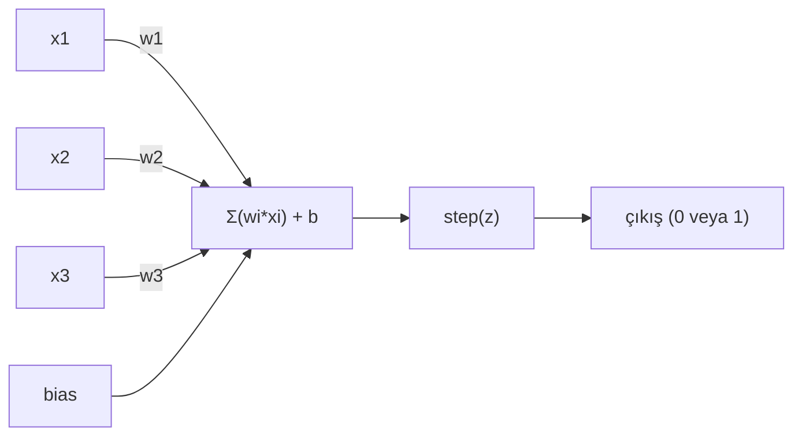

> **Orijinal İçerik:** [docs/en.md](https://github.com/rohitg00/ai-engineering-from-scratch/blob/main/phases/03-deep-learning-core/01-the-perceptron/docs/en.md)

# Algılayıcı (Perceptron)

> Algılayıcı, sinir ağlarının atomudur. Onu ikiye bölün, ağırlıklar, bir bias ve bir karar bulursunuz.

**Tür:** Uygulama
**Diller:** Python
**Ön Koşullar:** Faz 1 (Doğrusal Cebir Sezgisi)
**Süre:** ~60 dakika

## Öğrenme Hedefleri

- Python ile sıfırdan bir algılayıcı uygulayın (ağırlık güncelleme kuralı ve basamak aktivasyon fonksiyonu dahil)
- Neden tek bir algılayıcı yalnızca doğrusal olarak ayrılabilir sorunları çözebildiğini açıklayın ve XOR başarısızlık durumunu gösterin
- OR, NAND ve AND kapaklarını birleştirerek XOR'u çözmek için çok katmanlı bir algılayıcı oluşturun
- XOR'u otomatik olarak öğrenmek için sigmoid aktivasyon ve geri yayılım ile iki katmanlı bir ağ eğitin

## Sorun

Vektörleri ve iç çarpımları biliyorsunuz. Bir matrisin girdileri çıktılara nasıl dönüştürdüğünü biliyorsunuz. Ama bir makine hangi dönüşümü *kullanacağını* nasıl *öğrenir*?

Algılayıcı bunu yanıtlar. Olası en basit öğrenme makinesidir: bazı girdiler alın, ağırlıklarla çarpın, bir bias ekleyin ve ikili bir karar verin. Sonra ayarlayın. Hepsi bu kadar. Şimdiye kadar inşa edilen her sinir ağı, bu fikrin üst üste istiflenmesidir.

Algılayıcıyı anlamak, kodda "öğrenmenin" gerçekte ne anlama geldiğini anlamaktır: çıktının gerçeğe uyması için sayıları ayarlamak.

## Kavram

### Tek Nöron, Tek Karar

Bir algılayıcı n girdi alır, her birini bir ağırlıkla çarpar, toplar, bir bias ekler ve sonucu bir aktivasyon fonksiyonundan geçirir.



Basamak fonksiyonu acımasızdır: ağırlıklı toplam artı bias >= 0 ise, 1 çıktısı verir. Aksi halde, 0 çıktısı verir.

```
step(z) = 1  eğer z >= 0
           0  eğer z < 0
```

Bu bir doğrusal sınıflandırıcıdır. Ağırlıklar ve bias, girdi uzayını iki bölgeye ayıran bir çizgiyi (veya yüksek boyutlarda hiperdüzlemi) tanımlar.

### Karar Sınırı

İki girdi için, algılayıcı 2B uzayda bir çizgi çizer:

```
  x2
  ┤
  │  Sınıf 1        /
  │    (0)          /
  │                /
  │               / w1·x1 + w2·x2 + b = 0
  │              /
  │             /     Sınıf 2
  │            /        (1)
  ┼───────────/──────────── x1
```

Çizginin bir tarafındaki her şey 0 çıktısı verir. Diğer tarafındaki her şey 1 çıktısı verir. Eğitim, sınıfları doğru bir şekilde ayırene kadar bu çizgiyi hareket ettirir.

### Öğrenme Kuralı

Algılayıcı öğrenme kuralı basittir:

```
Her eğitim örneği (x, y_gercek) için:
    y_tahmin = predict(x)
    hata = y_gercek - y_tahmin

    Her ağırlık için:
        w_i = w_i + ogrenme_hizi * hata * x_i
    bias = bias + ogrenme_hizi * hata
```

Tahmin doğruysa, hata = 0, hiçbir şey değişmez. 0 tahmin etmesi gerekirken 1 tahmin ederse, ağırlıklar artar. 1 tahmin etmesi gerekirken 0 tahmin ederse, ağırlıklar azalır. Öğrenme hızı her ayarlamamanın ne kadar büyük olduğunu kontrol eder.

### XOR Sorunu

İşte burada bozulur. Bu mantık kapılarına bakın:

```
AND kapısı:           OR kapısı:            XOR kapısı:
x1  x2  çıktı         x1  x2  çıktı         x1  x2  çıktı
0   0   0           0   0   0           0   0   0
0   1   0           0   1   1           0   1   1
1   0   0           1   0   1           1   0   1
1   1   1           1   1   1           1   1   0
```

AND ve OR doğrusal olarak ayrılabilir: 0'lardan 1'leri ayırmak için tek bir çizgi çizebilirsiniz. XOR değildir. [0,1] ve [1,0] noktalarını [0,0] ve [1,1]'den ayıran tek bir çizgi çizilemez.

Bu, basit bir sinir ağının yapamayacağı şeydir. Ama iki tane algılayıcıyı birleştirirseniz çözebilirsiniz.

### Çok Katmanlı Algılayıcı

XOR'u çözmek için iki katmanlı bir ağ kullanın:
- 1. katman: AND ve OR kapılarını uygulayın
- 2. katman: Bu kapıların çıktılarını birleştirin

```python
# XOR'u çözen iki katmanlı ağ
def xor_network(x1, x2):
    # 1. katman
    and_gate = 1 if (x1 == 1 and x2 == 1) else 0
    or_gate = 1 if (x1 == 1 or x2 == 1) else 0
    
    # 2. katman
    # XOR = OR AND (NOT AND)
    nand_gate = 1 if and_gate == 0 else 0
    xor = 1 if (or_gate == 1 and nand_gate == 1) else 0
    
    return xor
```

### Sigmoid Aktivasyon ile Eğitim

Basamak fonksiyonunun türevi alınamaz (0 veya 1). Sigmoid kullanın:

```
sigmoid(z) = 1 / (1 + e^(-z))
```

Türevi vardır: sigmoid'(z) = sigmoid(z) × (1 - sigmoid(z))

Bu, gradyan inişini mümkün kılar. Geri yayılım (backpropagation) ile ağırlıklar otomatik olarak güncellenir.

## Alıştırmalar

1. Sıfırdan bir algılayıcı uygulayın
2. XOR sorununu iki katmanlı ağ ile çözün
3. Sigmoid aktivasyonlu ağı eğitin ve sonuçları görselleştirin

## Temel Terimler

| Terim | İnsanların söylediği | Gerçekte ne anlama geldiği |
|-------|---------------------|--------------------------|
| Algılayıcı | "Tek nöron" | Tek bir ağırlıklı toplam + aktivasyon ile karar veren ünite |
| Bias | "Önyargı" | Karar sınırını kaydıran ek terim |
| Ağırlık | "Önem" | Her girdinin çıktıyı ne kadar etkilediğini gösteren sayı |
| Aktivasyon fonksiyonu | "Dönüşüm fonksiyonu" | Doğrusal çıktıyı doğrusal olmayan的形式a sokan fonksiyon |
| Karar sınırı | "Sınır çizgisi" | Sınıfları ayıran çizgi veya hiperdüzlem |
| XOR | "Özel VEYA" | Doğrusal olarak ayrılabilir olmayan mantık kapısı |
| Geri yayılım | "Hata yayılımı" | Hata türevlerini ağırlıklara doğru geriye yayma |
| Sigmoid | "S-eğrisi" | Sayıları 0-1 arasına sıkıştıran aktivasyon fonksiyonu |
