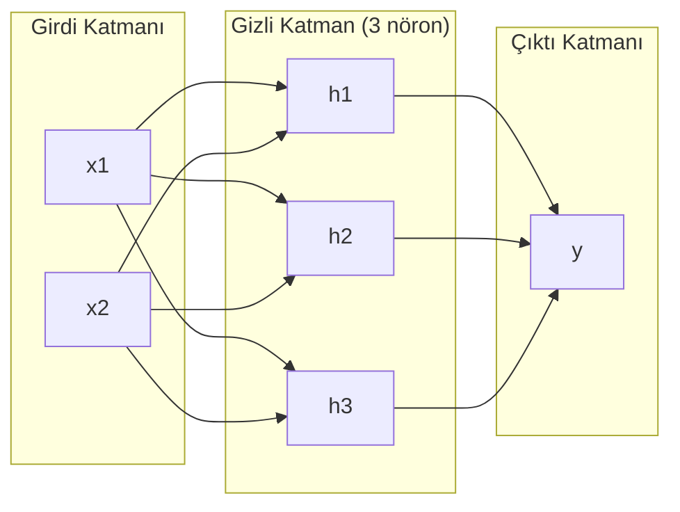
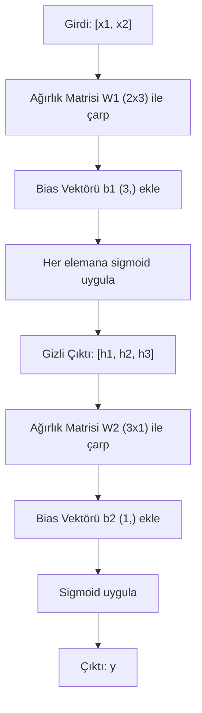

> **Orijinal İçerik:** [docs/en.md](https://github.com/rohitg00/ai-engineering-from-scratch/blob/main/phases/03-deep-learning-core/02-multi-layer-networks/docs/en.md)

# Çok Katmanlı Ağlar ve İleri Besleme

> Tek bir nöron bir çizgi çizer. Onları istiflerseniz, her şeyi çizebilirsiniz.

**Tür:** Uygulama
**Diller:** Python
**Ön Koşullar:** Faz 1 (Matematik Temelleri), Ders 03.01 (Algılayıcı)
**Süre:** ~90 dakika

## Öğrenme Hedefleri

- Katman ve Ağ sınıfları kullanarak sıfırdan çok katmanlı bir ağ oluşturun ve tam bir ileri besleme gerçekleştirin
- Bir ağın her katmanı boyunca matris boyutlarını takip edin ve şekil uyumsuzluklarını belirleyin
- Neden doğrusal olmayan aktivasyonların istiflenmesinin eğri karar sınırlarını öğrenmeyi mümkün kıldığını açıklayın
- 2-2-1 mimarisi ile elle ayarlanmış sigmoid ağırlıkları kullanarak XOR sorununu çözün

## Sorun

Tek bir nöron bir çizgi çizerici. Hepsi bu kadar. Verinizden tek bir düz çizgi. Yapay zekadaki her gerçek sorun — görüntü tanıma, dil anlama, Go oynamak — eğriler gerektirir. Nöronları katmanlar halinde istiflemek eğri elde etmenin yoludur.

1969'da Minsky ve Papert bu sınırlamanın ölümcül olduğunu kanıtladı: tek katmanlı bir ağ XOR'u öğrenemez. "Öğrenmek için mücadele ediyor" değil — matematiksel olarak yapamaz. XOR doğruluk tablosu [0,1] ve [1,0]'u bir tarafa, [0,0] ve [1,1]'i diğer tarafa yerleştirir. Tek bir çizgi bunları ayıramaz.

Bu, sinir ağı finansmanını on yıldan fazla süreyle öldürdü. Düzeltme geriye dönüp bakıldığında açıktı: tek katman kullanmayı bırakın. Nöronları katmanlar halinde istifleyin. Birinci katmanın girdi uzayını yeni özelliklere ayırmasına izin verin ve ikinci katmanın bu özellikleri tek bir çizginin yapamayacağı kararlara dönüştürmesine izin verin.

Bu istif, çok katmanlı ağdır. Bugün üretimdeki her derin öğrenme modelinin temelidir. İleri besleme — verinin gizli katmanlardan geçerek çıktiya akması — başka her şeyin çalışmasından önce oluşturmanız gereken ilk şeydir.

## Kavram

### Katmanlar: Girdi, Gizli, Çıktı

Çok katmanlı ağın üç katman türü vardır:

**Girdi katmanı** — aslında bir katman değildir. Ham verinizi tutar. İki özellik, iki girdi düğümü demektir. Hesaplama yapılmaz.

**Gizli katmanlar** — çalışmanın gerçekleştiği yer. Her nöron bir önceki katmanın tüm çıktılarını alır, ağırlıklar ve bir bias uygular, sonra sonucu bir aktivasyon fonksiyonundan geçirir. "Gizli" çünkü bu değerleri eğitim verisinde doğrudan görmüyorsunuz.

**Çıktı katmanı** — nihai cevap. İkili sınıflandırma için, sigmoid ile tek bir nöron. Çoklu sınıf için, her sınıf için bir nöron.



Bu bir 2-3-1 ağıdır. İki girdi, üç gizli nöron, bir çıktı. Her bağlantı bir ağırlık taşır. Her nöron (girdi hariç) bir bias taşır.

Her katman, gizli durum adı verilen bir sayı vektörü üretir. Metin için, gizli durumlar boyutluluğu artırır — bir kelimeyi anlamsal anlamı yakalamak için 768 sayı olarak kodlar. Görüntüler için boyutluğu azaltır — milyonlarca pikseli yönetilebilir bir temsile sıkıştırır. Gizli durum, öğrenmenin yaşadığı yerdir.

### Nöronlar ve Aktivasyonlar

Her nöron üç şey yapar:

1. Her girdiyi ilgili ağırlığıyla çarpar
2. Tüm çarpımları toplar ve bir bias ekler
3. Toplamı bir aktivasyon fonksiyonundan geçirir

Şimdilik aktivasyon sigmoid'dir:

```
sigmoid(z) = 1 / (1 + e^(-z))
```

Sigmoid herhangi bir sayıyı (0, 1) aralığına sıkıştırır. Büyük pozitif girdiler 1'e doğru itilir. Büyük negatif girdiler 0'a doğru itilir. Sıfır, 0.5'e eşlenir. Bu pürüzsüz eğri, öğrenmeyi mümkün kılar — algılayıcının sert basamağının aksine, sigmoid'in her yerde gradyanı vardır.

### İleri Besleme: Veri Nasıl Akar

İleri besleme, girdi verisini ağa katman katman iterek çıktiya ulaştırır. İleri besleme sırasında öğrenme gerçekleşmez. Saf bir hesaplamadır: çarp, ekle, aktive et, tekrarla.



Her katmanda, üç işlem sırayla gerçekleşir:

```
z = W * girdi + b       (doğrusal dönüşüm)
a = sigmoid(z)           (aktivasyon)
```

Bir katmanın çıktısı bir sonrakinin girdisi olur. Tüm ileri besleme budur.

### Matris Boyutları

Boyutları takip etmek, derin öğrenmedeki en önemli hata ayıklama becerisidir. 2-3-1 ağı:

| Adım | İşlem | Boyutlar | Sonuç Şekli |
|------|-------|----------|-------------|
| Girdi | x | -- | (2,) |
| Gizli doğrusal | W1 * x + b1 | W1: (3, 2), b1: (3,) | (3,) |
| Gizli aktivasyon | sigmoid(z1) | -- | (3,) |
| Çıktı doğrusal | W2 * h + b2 | W2: (1, 3), b2: (1,) | (1,) |
| Çıktı aktivasyonu | sigmoid(z2) | -- | (1,) |

**Kural:** İç boyutlar eşleşmelidir. W1'in sütun sayısı girdi boyutuna (2) eşittir. W1'in satır sayısı gizli boyuta (3) eşittir. W2'nin sütun sayısı gizli boyuta (3) eşittir.

### XOR'u Çözmek

2-2-1 mimarisi ile XOR'u çözelim:

```python
import numpy as np

def sigmoid(z):
    return 1 / (1 + np.exp(-z))

# XOR verisi
X = np.array([[0, 0], [0, 1], [1, 0], [1, 1]])
y = np.array([[0], [1], [1], [0]])

# Elle ayarlanmış ağırlıklar (2-2-1)
W1 = np.array([[1, 1], [1, 1]])   # 2x2
b1 = np.array([[-0.5, -1.5]])      # 1x2
W2 = np.array([[1], [-2]])          # 2x1
b2 = np.array([[-0.5]])             # 1x1

# İleri besleme
z1 = X @ W1 + b1
a1 = sigmoid(z1)
z2 = a1 @ W2 + b2
a2 = sigmoid(z2)

print("XOR Tahminleri:", a2.round().astype(int).flatten())
# Çıktı: [0, 1, 1, 0] - XOR başarıyla çözüldü!
```

## Alıştırmalar

1. 2-3-1 ağını sıfırdan oluşturun ve XOR'u çözün
2. Farklı ağırlık değerleriyle deneyler yapın
3. Matris boyutlarını adım adım takip edin

## Temel Terimler

| Terim | İnsanların söylediği | Gerçekte ne anlama geldiği |
|-------|---------------------|--------------------------|
| Çok katmanlı ağ | "Derin sinir ağı" | Birden fazla gizli katmanı olan sinir ağı |
| İleri besleme | "Ön taraftan arka tarafa akış" | Verinin girdiden çıktiya doğru akması |
| Gizli katman | "Ara katman" | Girdi ile çıktı arasında hesaplama yapan katman |
| Gizli durum | "Öğrenilen temsil" | Bir katmanın ürettiği sayısal vektör |
| Aktivasyon | "Dönüşüm" | Doğrusal çıktıyı doğrusal olmayan forma sokan fonksiyon |
| Bias | "Sapma" | Karar sınırını kaydıran ek terim |
