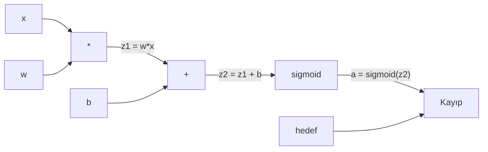
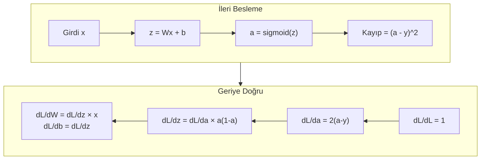
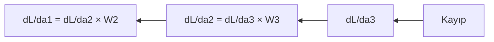

> **Orijinal İçerik:** [docs/en.md](https://github.com/rohitg00/ai-engineering-from-scratch/blob/main/phases/03-deep-learning-core/03-backpropagation/docs/en.md)

# Sıfırdan Geri Yayılım (Backpropagation)

> Geri yayılım, öğrenmeyi mümkün kılan algoritmadır. Onun olmadan, sinir ağları sadece pahalı rastgele sayı üreteçleridir.

**Tür:** Uygulama
**Diller:** Python
**Ön Koşullar:** Ders 03.02 (Çok Katmanlı Ağlar)
**Süre:** ~120 dakika

## Öğrenme Hedefleri

- Topolojik sıralama ile bir hesaplama grafiği oluşturan ve gradyanları hesaplayan Value tabanlı bir otomatik gradyan motoru uygulayın
- Toplama, çarpma ve sigmoid için zincir kuralını kullanarak geriye doğru geçişi türetin
- Sadece sıfırdan yazılmış geri yayılım motorunuzu kullanarak XOR ve daire sınıflandırması üzerinde çok katmanlı bir ağ eğitin
- Derin sigmoid ağlarında kaybolan gradyan sorununu belirleyin ve gradyanların neden üstel olarak küçüldüğünü açıklayın

## Sorun

Ağınızın 768 girdi ve 3072 çıktısı olan tek bir gizli katmanı var. Bu 2.359.296 ağırlık demektir. Yanlış bir tahmin yaptı. Hangi ağırlıklar hataya neden oldu? Her ağırlığı tek tek test etmek 2.3 milyon ileri besleme demektir. Geri yayılım, tek bir geriye doğru geçişte tüm 2.3 milyon gradyanı hesaplar. Bu bir optimizasyon değildir. Bu, eğitilebilir ile imkansız arasındaki farktır.

Saf yaklaşım: bir ağırlık alın, çok az bir miktar kaydırın, ileri beslemeyi tekrar çalıştırın, kaybın artıp azaldığını ölçün. Bu size o ağırlığın gradyanını verir. Şimdi bunu ağdaki her ağırlık için yapın. Binlerce eğitim adımı ve milyonlarla veri noktası ile çarpın. Herhangi bir yararlı şeyi eğitmek için jeolojik zamana ihtiyacınız olur.

Geri yayılım bunu çözer. Tek ileri besleme, tek geriye doğru geçiş, tüm gradyanlar hesaplandı. Hile, calculus'taki zincir kuralının hesaplama grafiğine sistematik olarak uygulanmasıdır. Bu, derin öğrenmeyi pratik kılan algoritmadır. Onun olmadan, hala oyuncak sorunlarda takılı kalırdık.

## Kavram

### Zincir Kuralının Ağlara Uygulanması

Zincir kuralını Faz 01, Ders 05'te gördünüz. Hızlı tekrar: eğer y = f(g(x)) ise, o zaman dy/dx = f'(g(x)) × g'(x). Zincir boyunca türevleri çarparsınız.

Bir sinir ağında, "zincir" girdiden kayıpla kadar olan işlemler dizisidir. Her katman ağırlıklar uygular, bias'lar ekler, bir aktivasyon fonksiyonundan geçirir. Kayıp fonksiyonu nihai çıktıyı hedefle karşılaştırır. Geri yayılım bu zinciri geriye doğru takip eder, her işlemin hataya nasıl katkıda bulunduğunu hesaplar.

### Hesaplama Grafikleri

Her ileri besleme bir grafik oluşturur. Her düğüm bir işlemdir (çarpma, toplama, sigmoid). Her kenar bir değeri ileriye ve bir gradyanı geriye taşır.

İleri besleme: değerler soldan sağa akar. x ve w, z1 = w*x üretir. b ekleyerek z2'yi elde eder. Sigmoid aktivasyonu a verir. Kayıp fonksiyonu ile a'yı hedef y ile karşılaştır.

Geriye doğru geçiş: gradyanlar sağdan sola akar. dL/da ile başlayın (aktivasyonun kaybı nasıl değiştirdiği). da/dz2 ile çarpın (türev). Bu dL/dz2'yi verir. dL/db (z2 = z1 + b olduğundan dL/dz2'ye eşittir) ve dL/dz1'e bölün. Sonra dL/dw = dL/dz1 × x ve dL/dx = dL/dz1 × w.

Grafikteki her düğümün geriye doğru geçişte bir görevi vardır: yukarıdan gelen gradyanı alır, kendi yerel türeviyle çarpar ve aşağıya aktarır.

### İleriye vs Geriye Doğru

İleri besleme her ara değeri depolar: z, a, her katmanın girdileri. Geriye doğru geçiş gradyan hesaplamak için bu depolanan değerlere ihtiyaç duyar. Bu, geri yayılımın kalbindeki bellek-hesaplama takasıdır. Belleği (aktivasyonları depolama) hız için (milyonlarca yerine tek geçiş) takas edersiniz.

### Ağ Boyunca Gradyan Akışı

3 katmanlı bir ağ için, gradyanlar her katman boyunca zincirlenir:

Her katman, gradyanı bir önceki katmana iletir. Ağırlıklar ne kadar derinse, gradyan o kadar çok çarpılır ve küçülür.

### Kaybolan Gradyan Sorunu

Derin sigmoid ağlarında gradyanlar üstel olarak küçülür. Sigmoid'in türevi maksimum 0.25'tir. Her katmanda gradyan en az 4 kat küçülür. 10 katmanlı bir ağda gradyan 0.25^10 ≌ 0.0000000000001 olur. Eğitim neredeyse hiç gerçekleşmez.

**Çözümler:**
- ReLU kullanın (türev 0 veya 1'dir)
- Batch normalization ekleyin
- Gradient clipping uygulayın
- İlk ağırlıkları dikkatli seçin

## Alıştırmalar

1. Sıfırdan geri yayılım motoru oluşturun
2. XOR'u sadece kendi motorunuzla eğitin
3. 3 katmanlı bir ağda gradyan akışını görselleştirin

## Temel Terimler

| Terim | İnsanların söylediği | Gerçekte ne anlama geldiği |
|-------|---------------------|--------------------------|
| Geri yayılım | "Hata geriye yayılımı" | Gradyanları hesaplama algoritması |
| Zincir kuralı | "türev çarpma" | Bileşik fonksiyonların türevini hesaplama kuralı |
| Hesaplama grafiği | "İşlem diyagramı" | İşlemleri düğüm olarak gösteren yönlü graf |
| Kaybolan gradyan | "Gradyan küçülme" | Derin ağlarda gradyanların üstel olarak küçülmesi |
| İleri besleme | "Ön taraftan arka tarafa akış" | Verinin girdiden çıktiya doğru akması |
| Geriye doğru geçiş | "Ters geçiş" | Gradyanları hesaplama süreci |
