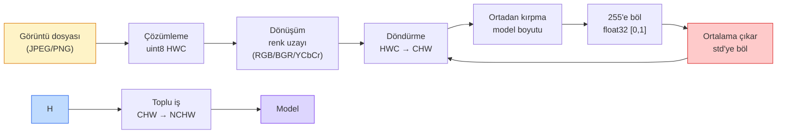

> **Orijinal İçerik:** [docs/en.md](https://github.com/rohitg00/ai-engineering-from-scratch/blob/main/phases/04-computer-vision/01-image-fundamentals/docs/en.md)

# Görüntü Temelleri — Pikseller, Kanallar, Renk Uzayları

> Bir görüntü, ışık örneklerinden oluşan bir tensördür. Kullanacağınız her görüntü modeli bu tek gerçeğden başlar.

**Tür:** Uygulama
**Diller:** Python
**Ön Koşullar:** Faz 1 Ders 12 (Tensör İşlemleri), Faz 3 Ders 11 (PyTorch'a Giriş)
**Süre:** ~45 dakika

## Öğrenme Hedefleri

- Sürekli bir sahnenin piksellere nasıl ayrıştırıldığını ve örnekleme/nicelleştirme kararlarının tüm aşağı akış modellerinin tavanını nasıl belirlediğini açıklayın
- Görüntüleri NumPy dizileri olarak okuyun, dilimleyin ve inceleyin; HWC ve CHW düzenleri arasında sorunsuz geçiş yapın
- RGB, gri tonlama, HSV ve YCbCr arasında dönüştürün ve her renk uzayının neden var olduğunu açıklayın
- Piksel düzeyinde ön işlemeyi (normalleştir, standardlaştır, yeniden boyutlandır, kanal-öncelikli) torchvision'un beklediği şekilde uygulayın

## Sorun

Okuyacağınız her makale, indireceğiniz her önceden eğitilmiş ağırlık, çağıracağınız her görüntü API'si belirli bir girdi kodlaması varsayar. Modelin `float32` istediği yerde `uint8` görüntü geçirirseniz hala çalışır — ve sessizce çöp üretir. RGB ile eğitilmiş bir ağa BGR beslerseniz doğruluk on puan düşer. Kanal-öncelikli bekleyen bir modele kanal-sonraki girdi verirseniz, ilk evrişim katmanı yüksekliği bir özellik kanalı olarak ele alır. Hiçbiri hata fırlatmaz. Sadece metriklerinizi bozar ve dosyayı nasıl yüklediğinizde yaşayan bir hatayı bulmak için bir hafta harcarsınız.

Bir evrişimin neyin üzerinde kaydığını bir kez anladığınızda karmaşık değildir. Zor kısım, "bir görüntünün" kamera, JPEG çözümleyici, PIL, OpenCV, torchvision ve bir CUDA çekirdeği için farklı şeyler ifade etmesidir. Her yığının kendi eksen sırası, bayt aralığı ve kanal kuralı vardır. Bunları düzgün tutamayan bir görüntü mühendisi, bozuk hatlar gönderir.

Bu ders temeli düzeltir ki geri kalan faz üzerine inşa edebilsin. Dersin sonunda pikselin ne olduğunu, piksel başına neden bir yerine üç sayı olduğunu, "ImageNet istatistikleriyle normalleştir"ın gerçekte ne yaptığını ve bu fazdaki diğer her dersin varsayacağı iki veya üç düzen arasında nasıl geçiş yapılacağını bileceksiniz.

## Kavram

### Tam ön işleme hattına bir bakış

Her üretim görüntü sistemi, aynı tersine çevrilebilir dönüşümler dizisidir. Bir adımı yanlış yaparsanız, model eğitim gördüğü farklı bir girdi görür.



Kırmızı ve mavi kutular, sessiz başarısızlıkların %80'inin yaşadığı yerlerdir: eksik standardlaştırma ve yanlış düzen.

### Piksel bir örnek, kare değil

Bir kamera sensörü, küçük dedektörlerin ızgarasına düşen fotonları sayar. Her dedektör bir saniyenin kesri kadar ışığı bütünleştirir ve çarpan foton sayısına orantılı bir voltaj yayar. Sensör sonra bu voltajı bir tamsayıya ayrıştırır. Bir dedektör bir piksel olur.

```
Sürekli sahne                 Sensör ızgarası                   Dijital görüntü
(Sonsuz ayrıntı)              (H x W dedektör)                  (H x W tamsayı)

    ~~~~~                        +--+--+--+--+--+                 210 198 180 155 120
   ~   ~   ~                     |  |  |  |  |  |                 205 195 178 152 118
  ~ ışık  ~      ---->           +--+--+--+--+--+     ---->       200 190 175 150 115
   ~~~~~                         |  |  |  |  |  |                 195 185 170 148 112
                                 +--+--+--+--+--+                 188 180 165 145 108
```

Bu adımda iki seçim yapılır ve bunlar aşağıdakilerin hepsinin tavanını belirler:

- **Uzaysal örnekleme**, sahnenin her derecesi başına kaç dedektör olacağını belirler. Çok azsa, kenarlar pürüzlü hale gelir (aliasing). Çok fazlaysa, depolama ve hesaplama patlar.
- **Yoğunluk nicelleştirmesi**, voltajın ne kadar ince kovalara ayrılacağını belirler. 8 bit 256 seviye verir ve görüntü için standarttır. 10, 12, 16 bit daha pürüzsüz gradyanlar verir ve tıbbi görüntüleme, HDR ve ham sensör hatları için önemlidir.

Piksel, alanı olan renkli bir kare değildir. Tek bir ölçümdür. Yeniden boyutlandırdığınızda veya döndürdüğünüzde, o ölçüme ızgarasını yeniden örnekliyorsunuz.

### Neden üç kanal

Bir dedektör tüm görünür spektrum boyunca fotonları sayar — bu gri tonlamadır. Renk elde etmek için sensör ızgarayı kırmızı, yeşil ve mavi filtrelerin bir mozaikleriyle kaplar. Mozaik çözümleme之后, her uzamsal konumda üç tamsayı bulunur: kırmızı filtreli dedektörün yanıtı, yeşil filtreli ve mavi filtreli yakınınki. Bu üç tamsayı, bir pikselin RGB üçlüsüdür.

```
Bellekte tek bir piksel:

    (R, G, B) = (210, 140, 30)   <- kırmızımsı-turuncu

Bir H x W RGB görüntüsü:

    şekil (H, W, 3)     şu şekilde depolanır   H satır, W piksel, her birinde 3 değer
                                              her biri uint8 için [0, 255] aralığında
```

Üç sihirli bir sayı değildir. Derinlik kameraları bir Z kanalı ekler. Uydular kızılötesi ve morötesi bantlar ekler. Tıbbi taramalar genellikle bir kanallıdır (röntgen, BT) veya birçok (hiperspektral). Kanal sayısı son eksendir; evrişim katmanları onun karışımını öğrenir.

### İki düzen kuralı: HWC ve CHW

Aynı tensör, iki sıralama. Her kütüphane birini seçer.

```
HWC (yükseklik, genişlik, kanallar)       CHW (kanallar, yükseklik, genişlik)

   Genişlik ->                              Yükseklik ->
  +-----+-----+-----+                     +-----+-----+
Y |R G B|R G B|R G B|                   K |R R R R R R|
  | +-----+-----+-----+                   | +-----+-----+
  | |R G B|R G B|R G B|                   | |G G G G G G|
  | +-----+-----+-----+                   | +-----+-----+
  | |R G B|R G B|R G B|                   | |B B B B B B|
  +-----+-----+-----+                     +-----+-----+
```

**PyTorch, torchvision ve çoğu derin öğrenme çerçevesi CHW bekler.**
**OpenCV ve PIL varsayılan olarak HWC kullanır.**

Geçiş:
```python
import numpy as np

# HWC'den CHW'ye
hwc = np.array(...)  # şekil: (H, W, 3)
chw = hwc.transpose(2, 0, 1)  # şekil: (3, H, W)

# CHW'den HWC'ye
hwc_geri = chw.transpose(1, 2, 0)  # şekil: (H, W, 3)
```

### Renk Uzayları

| Uzay | Kanallar | Kullanım | Not |
|------|----------|----------|-----|
| RGB | 3 (Kırmızı, Yeşil, Mavi) | Görüntüleme, web | En yaygın |
| Gri tonlama | 1 | Belirleme, kenar tespiti | Basit |
| HSV | 3 (Ton, Doygunluk, Değer) | Renk tabanlı işleme | Renkten bağımsız |
| YCbCr | 3 | Video sıkıştırma | JPEG/MPEG standardı |

### Normalleştirme

Eğitimden önce pikselleri normalleştirmek kritiktir:

```python
# Temel normalleştirme: [0, 255] → [0, 1]
img_float = img.astype(np.float32) / 255.0

# ImageNet standardlaştırma
mean = np.array([0.485, 0.456, 0.406])
std = np.array([0.229, 0.224, 0.225])
img_normalized = (img_float - mean) / std
```

Neden ImageNet? Çoğu görüntü modeli ImageNet üzerinde eğitilmiştir. Aynı normalleştirmeyi kullanmazsanız, model farklı bir girdi dağılımı görür ve performans düşer.

## Alıştırmalar

1. Bir görüntüyü NumPy olarak yükleyin ve şeklini (H, W, C) kontrol edin
2. HWC'den CHW'ye ve geriye dönüştürün
3. RGB'den gri tonlamaya ve HSV'ye dönüştürün
4. ImageNet normalleştirmesini uygulayın ve sonuçları görselleştirin

## Temel Terimler

| Terim | İnsanların söylediği | Gerçekte ne anlama geldiği |
|-------|---------------------|--------------------------|
| Piksel | "Renkli nokta" | Tek bir ışık ölçümü |
| Kanal | "Renk bileşeni" | Görüntüdeki bir renk bileşeni (R, G veya B) |
| HWC | "Yükseklik-genişlik-kanal" | Görüntü depolama düzeni |
| CHW | "Kanal-yükseklik-genişlik" | Derin öğrenme için standart düzen |
| Normalleştirme | "Değerleri küçültme" | Piksel değerlerini standart aralığa getirme |
| Örnekleme | "Yeniden oluşturma" | Görüntü boyutunu değiştirme |
| Nicelleştirme | "Sayıya dönüştürme" | Sürekli değerleri ayrık sayılara dönüştürme |
