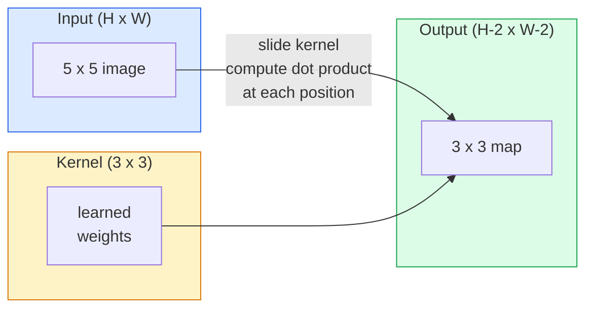
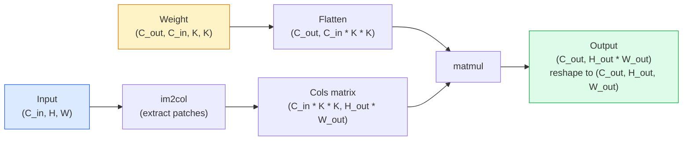

> **Orijinal İçerik:** [docs/en.md](https://github.com/rohitg00/ai-engineering-from-scratch/blob/main/phases/04-computer-vision/02-convolutions-from-scratch/docs/en.md)

# Sıfırdan Convolution (Convolutions from Scratch)

> Convolution, bir görüntü üzerinde kaydırdığınız, her konumda aynı ağırlıkları paylaşan küçük bir yoğun (dense) katmandır.

**Tür:** Build
**Diller:** Python
**Ön Koşullar:** Phase 3 (Deep Learning Core), Phase 4 Ders 01 (Image Fundamentals)
**Süre:** ~75 dakika

## Öğrenme Hedefleri

- Yalnızca NumPy kullanarak 2D convolution'ı sıfırdan uygulamak (iç içe döngülü sürüm ve vektörleştirilmiş `im2col` sürümü dahil)
- Herhangi bir girdi boyutu, kernel boyutu, padding ve stride kombinasyonu için çıktı uzaysal boyutunu hesaplamak ve `(H - K + 2P) / S + 1` formülünü gerekçelendirmek
- El ile kernel tasarlamak (kenar, bulanıklaştırma, keskinleştirme, Sobel) ve her birinin neden oluşturduğu aktivasyon desenini ürettiğini açıklamak
- Convolution'ları bir feature extractor (özellik çıkarıcı) olarak istiflemek ve istif derinliğini receptive field (alıcı alan) boyutuyla ilişkilendirmek

## Problem

Tam bağlı (fully connected) bir katmanın 224x224 RGB görüntü üzerinde nöron başına 224 * 224 * 3 = 150.528 girdi ağırlığına ihtiyacı vardır. 1.000 birimlik tek bir gizli katman, henüz hiçbir şey öğrenmeden önce 150 milyon parametre demektir. Daha da kötüsü, bu katman sol üst köşedeki bir köpekle sağ alt köşedeki bir köpeğin aynı desen olduğunu bilmez. Her piksel konumunu bağımsız ele alır; bu da görüntüler için tamamen yanlıştır: bir kediyi üç piksel ötelemek, ağın kavramı yeniden öğrenmesine zorlamamalıdır.

Bir görüntü modelinin ihtiyaç duyduğu iki özellik **translation equivariance** (girdi kaydığında çıktının da kayması) ve **parameter sharing** (parametre paylaşımıdır) (aynı özellik dedektörü her yerde çalışır). Yoğun katmanlar bunların hiçbirini sağlamaz. Convolution ise ikisini de ücretsiz verir.

Convolution derin öğrenme için icat edilmemiştir. JPEG sıkıştırmayı, Photoshop'taki Gauss bulanıklaştırmayı, endüstriyel görüşteki kenar tespitini ve şimdiye kadar üretilmiş her ses filtresini çalıştıran aynı işlemdir. CNN'lerin 2012'den 2020'ye kadar ImageNet'e hakim olmasının nedeni, convolution'ın yakın değerlerin ilişkili olduğu ve aynı desenin her yerde görülebildiği veriler için doğru önsel (prior) olmasıdır.

## Kavram

### Tek kernel, kaydırma

2D convolution, kernel (veya filter) adı verilen küçük bir ağırlık matrisini alır, girdi üzerinde kaydırır ve her konumda eleman bazlı çarpımların toplamını hesaplar. Bu toplam bir çıktı pikseli olur.



#### Açıklama
Convolution işleminin şeması: Kernel, girdi görüntü üzerinde kaydırılır ve her pozisyonda nokta çarpımı hesaplanarak çıktı haritası oluşturulur.

5x5 girdi üzerinde somut bir 3x3 örneği (padding yok, stride 1):

```text
Input X (5 x 5):                Kernel W (3 x 3):

  1  2  0  1  2                   1  0 -1
  0  1  3  1  0                   2  0 -2
  2  1  0  2  1                   1  0 -1
  1  0  2  1  3
  2  1  1  0  1

The kernel slides across every valid 3 x 3 window. Output Y is 3 x 3:

 Y[0,0] = sum( W * X[0:3, 0:3] )
 Y[0,1] = sum( W * X[0:3, 1:4] )
 Y[0,2] = sum( W * X[0:3, 2:5] )
 Y[1,0] = sum( W * X[1:4, 0:3] )
 ... and so on
```

#### Açıklama
Kernel 3x3'lük bir pencere olarak görüntü üzerinde kayar. Her konumda kernel ile pencere arasında eleman bazlı çarpma ve toplama yapılır.

Bu tek formül — **paylaşılan ağırlıklar, yerelellik (locality), kayan pencere** — tüm fikrin ta kendisidir. Gerisi sadece defter tutmadır.

### Çıktı boyutu formülü

Uzaysal girdi boyutu `H`, kernel boyutu `K`, padding `P`, stride `S` olmak üzere:

```text
H_out = floor( (H - K + 2P) / S ) + 1
```

#### Açıklama
Bu formül, convolution sonrası çıktı feature map'inin uzaysal boyutunu verir.

Bunu ezberleyin. Her mimaride düzinelerce kez hesaplayacaksınız.

| Senaryo | H | K | P | S | H_out |
|----------|---|---|---|---|-------|
| Valid conv, padding yok | 32 | 3 | 0 | 1 | 30 |
| Same conv (boyutu korur) | 32 | 3 | 1 | 1 | 32 |
| 2 kat aşağı örnekleme | 32 | 3 | 1 | 2 | 16 |
| Pool 2x2 | 32 | 2 | 0 | 2 | 16 |
| Geniş receptive field | 32 | 7 | 3 | 2 | 16 |

"Same padding", S == 1 iken H_out == H olacak şekilde P seçmektir. Tek K için bu, P = (K - 1) / 2'dir. Bu nedenle 3x3 kernel'ler baskındır — merkezi olan en küçük tek kernel'dir.

### Padding

Padding olmadan, her convolution feature map'i küçültür. 20 tanesini istifleyin ve 224x224 görüntünüz 184x184 olur; bu da sınırda hesaplama israfına ve uyumlu boyutlara ihtiyaç duyan artık bağlantıları (residual connections) zorlaştırır.

```text
Zero padding (P = 1) on a 5 x 5 input:

  0  0  0  0  0  0  0
  0  1  2  0  1  2  0
  0  0  1  3  1  0  0
  0  2  1  0  2  1  0       Now the kernel can centre on pixel
  0  1  0  2  1  3  0       (0, 0) and still have three rows and
  0  2  1  1  0  1  0       three columns of values to multiply.
  0  0  0  0  0  0  0
```

#### Açıklama
Sıfır padding, girdinin etrafına sıfır değerler ekleyerek kernel'in kenar piksellerde de merkezlenebilmesini sağlar.

Pratikte karşılaştığınız modlar: `zero` (en yaygın), `reflect` (kenarı yansıtır, üretken modellerde sert sınırlardan kaçınır), `replicate` (kenarı kopyalar), `circular` (sarar, toroidal problemlerde kullanılır).

### Stride

Stride, kaydırmanın adım boyutudur. `stride=1` varsayılandır. `stride=2` uzaysal boyutları yarıya indirir ve ayrı bir pooling katmanı olmadan bir CNN içinde aşağı örneklemenin klasik yoludur — her modern mimari (ResNet, ConvNeXt, MobileNet) bir yerlerde max-pooling yerine strided conv kullanır.

```text
Stride 1 on a 5 x 5 input, 3 x 3 kernel:

  starts: (0,0) (0,1) (0,2)        -> output row 0
          (1,0) (1,1) (1,2)        -> output row 1
          (2,0) (2,1) (2,2)        -> output row 2

  Output: 3 x 3

Stride 2 on the same input:

  starts: (0,0) (0,2)              -> output row 0
          (2,0) (2,2)              -> output row 1

  Output: 2 x 2
```

#### Açıklama
Stride değeri kernel'in her adımda kaç piksel atlayacağını belirler. Stride 2, çıktı boyutunu yaklaşık yarıya indirir.

### Çoklu girdi kanalı

Gerçek görüntülerin üç kanalı vardır. RGB girdi üzerinde 3x3 convolution aslında 3x3x3'lük bir hacimdir: her girdi kanalı için bir adet 3x3 dilim. Her uzaysal pozisyonda, üç dilim boyunca çarpma ve toplama yapılır ve bir bias eklenir.

```text
Input:   (C_in,  H,  W)        3 x 5 x 5
Kernel:  (C_in,  K,  K)        3 x 3 x 3 (one kernel)
Output:  (1,     H', W')       2D map

For a layer that produces C_out output channels, you stack C_out kernels:

Weight:  (C_out, C_in, K, K)   e.g. 64 x 3 x 3 x 3
Output:  (C_out, H', W')       64 x 3 x 3

Parameter count: C_out * C_in * K * K + C_out   (the + C_out is biases)
```

#### Açıklama
Çok kanallı convolution: her çıktı kanalı için ayrı bir kernel yığını vardır ve tüm girdi kanalları üzerinde toplama yapılır.

Son satır, bir model planlarken hesaplayacağınız şeydir. 3 kanallı girdide 64 kanallı 3x3 conv, `64 * 3 * 3 * 3 + 64 = 1.792` parametreye sahiptir. Ucuz.

### im2col hilesi

İç içe döngüler okuması kolay ama yavaştır. GPU'lar büyük matris çarpımları ister. İşin püf noktası: girdideki her receptive field penceresini büyük bir matrisin bir sütununa düzleştirin, kernel'i bir satıra düzleştirin ve convolution tek bir matmul (matris çarpımı) haline gelsin.



#### Açıklama
im2col, her bir receptive field penceresini ayrı bir sütuna yerleştirerek convolution'ı büyük bir matris çarpımına dönüştürür.

Her üretim convolution uygulaması, bunun artı önbellek-döşeme (cache-tiling) hilelerinin (direct conv, Winograd, büyük kernel'ler için FFT conv) bir varyantıdır. im2col'u anlayın ve temeli anlamış olursunuz.

### Receptive field (Alıcı Alan)

Tek bir 3x3 conv, 9 girdi pikseline bakar. İki 3x3 conv istifleyin ve ikinci katmandaki bir nöron 5x5 girdi pikseline bakar. Üç 3x3 conv, 7x7 verir. Genel olarak:

```text
RF after L stacked K x K convs (stride 1) = 1 + L * (K - 1)

With strides:   RF grows multiplicatively with stride along each layer.
```

#### Açıklama
Receptive field, bir çıktı nöronunun girdide gördüğü bölgenin boyutudur. Katman derinliği arttıkça büyür.

"3x3 her yerde" (VGG, ResNet, ConvNeXt) yaklaşımının tüm nedeni, iki 3x3 conv'in bir 5x5 conv ile aynı girdi alanını görmesi ancak daha az parametreye ve arada ek bir non-lineerliğe sahip olmasıdır.

## İnşa Et

### Adım 1: Bir diziyi pad'leme

En küçük temel ögeyle başlayın: bir H x W dizinin etrafına sıfır ekleyen bir fonksiyon.

```python
import numpy as np

def pad2d(x, p):
    if p == 0:
        return x
    h, w = x.shape[-2:]
    out = np.zeros(x.shape[:-2] + (h + 2 * p, w + 2 * p), dtype=x.dtype)
    out[..., p:p + h, p:p + w] = x
    return out

x = np.arange(9).reshape(3, 3)
print(x)
print()
print(pad2d(x, 1))
```

#### Açıklama
Bu fonksiyon, bir dizinin etrafına sıfırlardan oluşan bir kenarlık ekler. Sondaki eksen hilesi `x.shape[:-2]`, aynı fonksiyonun `(H, W)`, `(C, H, W)` veya `(N, C, H, W)` üzerinde değişiklik yapılmadan çalışmasını sağlar.

### Adım 2: İç içe döngülerle 2D convolution

Referans uygulama — yavaş ama net. `torch.nn.functional.conv2d` prensipte bunu yapar.

```python
def conv2d_naive(x, w, b=None, stride=1, padding=0):
    c_in, h, w_in = x.shape
    c_out, c_in_w, kh, kw = w.shape
    assert c_in == c_in_w

    x_pad = pad2d(x, padding)
    h_out = (h + 2 * padding - kh) // stride + 1
    w_out = (w_in + 2 * padding - kw) // stride + 1

    out = np.zeros((c_out, h_out, w_out), dtype=np.float32)
    for oc in range(c_out):
        for i in range(h_out):
            for j in range(w_out):
                hs = i * stride
                ws = j * stride
                patch = x_pad[:, hs:hs + kh, ws:ws + kw]
                out[oc, i, j] = np.sum(patch * w[oc])
        if b is not None:
            out[oc] += b[oc]
    return out
```

#### Açıklama
Dört iç içe döngü (çıktı kanalı, satır, sütun, artı C_in, kh, kw üzerindeki örtük toplam). Bu, daha hızlı her uygulamayı kontrol edeceğiniz temel gerçektir.

### Adım 3: El ile tasarlanmış bir kernel ile doğrulama

Dikey bir Sobel kernel oluşturun, sentetik bir basamak görüntüsüne uygulayın ve dikey kenarın parlamasını izleyin.

```python
def synthetic_step_image():
    img = np.zeros((1, 16, 16), dtype=np.float32)
    img[:, :, 8:] = 1.0
    return img

sobel_x = np.array([
    [[-1, 0, 1],
     [-2, 0, 2],
     [-1, 0, 1]]
], dtype=np.float32)[None]

x = synthetic_step_image()
y = conv2d_naive(x, sobel_x, padding=1)
print(y[0].round(1))
```

#### Açıklama
Sobel-x kernel, dikey kenarları tespit eder. 7. sütunda büyük pozitif değerler (soldan sağa parlaklık artışı) ve diğer her yerde sıfır beklenir. Bu tek çıktı, matematiğin doğru olduğuna dair sağlamanızdır.

### Adım 4: im2col

Girdideki her kernel boyutundaki pencereyi bir matrisin sütununa dönüştürün. `C_in=3, K=3` için her sütun 27 sayıdır.

```python
def im2col(x, kh, kw, stride=1, padding=0):
    c_in, h, w = x.shape
    x_pad = pad2d(x, padding)
    h_out = (h + 2 * padding - kh) // stride + 1
    w_out = (w + 2 * padding - kw) // stride + 1

    cols = np.zeros((c_in * kh * kw, h_out * w_out), dtype=x.dtype)
    col = 0
    for i in range(h_out):
        for j in range(w_out):
            hs = i * stride
            ws = j * stride
            patch = x_pad[:, hs:hs + kh, ws:ws + kw]
            cols[:, col] = patch.reshape(-1)
            col += 1
    return cols, h_out, w_out
```

#### Açıklama
Her bir kernel-pencereyi bir sütuna düzleştirir. Hâlâ bir Python döngüsüdür, ancak ağır iş artık tek bir vektörleştirilmiş matmul olacaktır.

### Adım 5: im2col + matmul ile hızlı conv

Dörtlü döngüyü tek bir matris çarpımıyla değiştirin.

```python
def conv2d_im2col(x, w, b=None, stride=1, padding=0):
    c_out, c_in, kh, kw = w.shape
    cols, h_out, w_out = im2col(x, kh, kw, stride, padding)
    w_flat = w.reshape(c_out, -1)
    out = w_flat @ cols
    if b is not None:
        out += b[:, None]
    return out.reshape(c_out, h_out, w_out)
```

#### Açıklama
im2col ile çıkarılan sütunlar, düzleştirilmiş ağırlıklarla tek bir matris çarpımında birleştirilir. Bu, üretim convolution uygulamalarının temelini oluşturur.

Doğruluk kontrolü: iki uygulamayı da çalıştırın ve karşılaştırın.

```python
rng = np.random.default_rng(0)
x = rng.normal(0, 1, (3, 16, 16)).astype(np.float32)
w = rng.normal(0, 1, (8, 3, 3, 3)).astype(np.float32)
b = rng.normal(0, 1, (8,)).astype(np.float32)

y_naive = conv2d_naive(x, w, b, padding=1)
y_im2col = conv2d_im2col(x, w, b, padding=1)

print(f"max abs diff: {np.max(np.abs(y_naive - y_im2col)):.2e}")
```

#### Açıklama
`max abs diff` yaklaşık `1e-5` olmalıdır — fark kayan nokta birikim sırasından kaynaklanır, bir hata değil.

### Adım 6: El ile tasarlanmış kernel havuzu

Herhangi bir eğitim öncesinde tek bir conv katmanının neler ifade edebileceğini gösteren beş filter.

```python
KERNELS = {
    "identity": np.array([[0, 0, 0], [0, 1, 0], [0, 0, 0]], dtype=np.float32),
    "blur_3x3": np.ones((3, 3), dtype=np.float32) / 9.0,
    "sharpen": np.array([[0, -1, 0], [-1, 5, -1], [0, -1, 0]], dtype=np.float32),
    "sobel_x": np.array([[-1, 0, 1], [-2, 0, 2], [-1, 0, 1]], dtype=np.float32),
    "sobel_y": np.array([[-1, -2, -1], [0, 0, 0], [1, 2, 1]], dtype=np.float32),
}

def apply_kernel(img2d, kernel):
    x = img2d[None].astype(np.float32)
    w = kernel[None, None]
    return conv2d_im2col(x, w, padding=1)[0]
```

#### Açıklama
Herhangi bir gri tonlamalı görüntüye uygulandığında, blur yumuşatır, sharpen kenarları keskinleştirir, Sobel-x dikey kenarları, Sobel-y yatay kenarları belirginleştirir. Bunlar, AlexNet ve VGG'deki eğitilmiş ilk conv katmanının öğrendiği desenlerin aynısıdır — çünkü iyi bir görüntü modeli, daha sonra hangi görev gelirse gelsin, kenar ve leke dedektörlerine ihtiyaç duyar.

## Kullan

PyTorch'un `nn.Conv2d`'si aynı işlemi autograd, CUDA kernel'leri ve cuDNN optimizasyonuyla sarar. Şekil semantikleri aynıdır.

```python
import torch
import torch.nn as nn

conv = nn.Conv2d(in_channels=3, out_channels=64, kernel_size=3, stride=1, padding=1)
print(conv)
print(f"weight shape: {tuple(conv.weight.shape)}   # (C_out, C_in, K, K)")
print(f"bias shape:   {tuple(conv.bias.shape)}")
print(f"param count:  {sum(p.numel() for p in conv.parameters())}")

x = torch.randn(8, 3, 224, 224)
y = conv(x)
print(f"\ninput  shape: {tuple(x.shape)}")
print(f"output shape: {tuple(y.shape)}")
```

#### Açıklama
PyTorch'ta `nn.Conv2d` kullanımı. `padding=1` ile çıktı 224x224, `padding=0` ile 222x222, `stride=2` ile 112x112 olur.

`padding=1` yerine `padding=0` koyun ve çıktı 222x222'ye düşer. `stride=1` yerine `stride=2` koyun ve 112x112'ye düşer. Yukarıda ezberlediğiniz formülün aynısı.

## Çıktılar

Bu ders şunları üretir:

- `outputs/prompt-cnn-architect.md` — girdi boyutu, parametre bütçesi ve hedef receptive field verildiğinde, her adımda doğru K/S/P ile `Conv2d` katmanlarından oluşan bir yığın tasarlayan bir prompt.
- `outputs/skill-conv-shape-calculator.md` — bir network spesifikasyonunu katman katman inceleyip her blok için çıktı şekli, receptive field ve parametre sayısını döndüren bir skill.

## Alıştırmalar

1. **(Kolay)** 128x128 gri tonlamalı bir girdi ve `[Conv3x3(s=1,p=1), Conv3x3(s=2,p=1), Conv3x3(s=1,p=1), Conv3x3(s=2,p=1)]` yığını verildiğinde, her katmandaki çıktı uzaysal boyutunu ve receptive field'i elle hesaplayın. PyTorch `nn.Sequential` ile sahte conv'ler kullanarak doğrulayın.
2. **(Orta)** `conv2d_naive` ve `conv2d_im2col` fonksiyonlarını bir `groups` argümanı kabul edecek şekilde genişletin. `groups=C_in=C_out` durumunun bir depthwise convolution ürettiğini ve parametre sayısının `C * C * K * K` yerine `C * K * K` olduğunu gösterin.
3. **(Zor)** `conv2d_im2col`'un geriye geçişini elle uygulayın: çıktının gradient'i verildiğinde, `x` ve `w`'nin gradient'ini hesaplayın. Aynı girdi ve ağırlıklar üzerinde `torch.autograd.grad` ile doğrulayın. İşin püf noktası: im2col'un gradient'i `col2im`'dir ve örtüşen pencereleri biriktirmesi gerekir.

## Anahtar Terimler

| Terim | İnsanların dediği | Gerçekte anlamı |
|------|----------------|----------------------|
| Convolution | "Filter kaydırma" | Her uzaysal konumda paylaşılan ağırlıklarla uygulanan öğrenilebilir bir nokta çarpımı; matematiksel olarak cross-correlation'dır, ancak herkes convolution der |
| Kernel / filter | "Özellik dedektörü" | Şekli (C_in, K, K) olan, girdi penceresiyle nokta çarpımı bir çıktı pikseli üreten küçük ağırlık tensörü |
| Stride | "Ne kadar zıpladığın" | Ardışık kernel yerleşimleri arasındaki adım boyutu; stride 2 her uzaysal boyutu yarıya indirir |
| Padding | "Kenarlarda sıfırlar" | Kernel'in kenar piksellerde merkezlenebilmesi için girdinin etrafına eklenen değerler; `same` padding çıktı boyutunu girdi boyutuna eşit tutar |
| Receptive field | "Nöronun ne kadar gördüğü" | Belirli bir çıktı aktivasyonunun bağlı olduğu orijinal girdi parçası; derinlik ve stride ile büyür |
| im2col | "GEMM hilesi" | Her receptive field penceresini sütunlara yeniden düzenleyerek convolution'ı tek bir büyük matris çarpımına dönüştürür — her hızlı conv kernel'inin temeli |
| Depthwise conv | "Kanal başına bir kernel" | `groups == C_in` olan, her çıktı kanalını yalnızca eşleşen girdi kanalından hesaplayan conv; MobileNet ve ConvNeXt'in omurgası |
| Translation equivariance | "Kaydır gir, kaydır çık" | Girdiyi k piksel kaydırmanın çıktıyı da k piksel kaydırması özelliği; paylaşılan ağırlıklarla ücretsiz gelir |

## Daha Fazla Okuma

- [A guide to convolution arithmetic for deep learning (Dumoulin & Visin, 2016)](https://arxiv.org/abs/1603.07285) — padding/stride/dilation'ın her dersin sessizce kopyaladığı kesin diyagramları
- [CS231n: Convolutional Neural Networks for Visual Recognition](https://cs231n.github.io/convolutional-networks/) — orijinal im2col açıklamasını içeren kanonik ders notları
- [The Annotated ConvNet (fast.ai)](https://nbviewer.org/github/fastai/fastbook/blob/master/13_convolutions.ipynb) — manuel convolution'dan eğitilmiş bir rakam sınıflandırıcıya kadar adım adım ilerleyen bir notebook
- [Receptive Field Arithmetic for CNNs (Dang Ha The Hien)](https://distill.pub/2019/computing-receptive-fields/) — receptive field hesaplamalarının interaktif açıklaması
