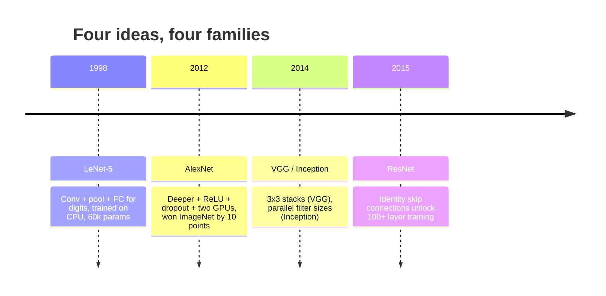
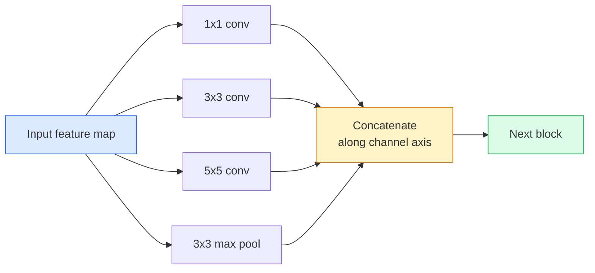
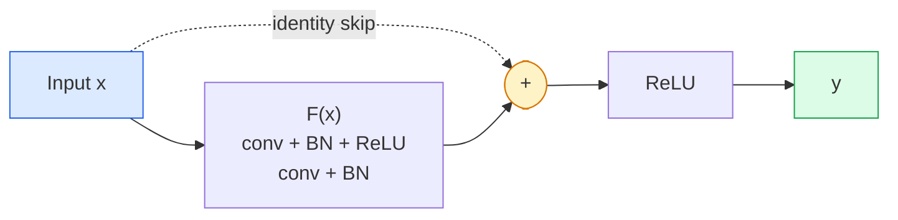

> **Orijinal İçerik:** [docs/en.md](https://github.com/rohitg00/ai-engineering-from-scratch/blob/main/phases/04-computer-vision/03-cnns-lenet-to-resnet/docs/en.md)

# CNN'ler — LeNet'ten ResNet'e

> Son otuz yılın her büyük CNN'i, üzerine yeni bir fikir eklenmiş aynı conv–nonlinearity–downsample tarifidir. Fikirleri sırayla öğrenin.

**Tür:** Learn + Build
**Diller:** Python
**Ön Koşullar:** Phase 3 Ders 11 (PyTorch), Phase 4 Ders 01 (Image Fundamentals), Phase 4 Ders 02 (Convolutions from Scratch)
**Süre:** ~75 dakika

## Öğrenme Hedefleri

- LeNet-5 -> AlexNet -> VGG -> Inception -> ResNet mimari soyunu izlemek ve her ailenin kattığı tek yeni fikri belirtmek
- LeNet-5, VGG tarzı bir blok ve ResNet BasicBlock'u PyTorch'ta, her biri 40 satırın altında olacak şekilde uygulamak
- Artık bağlantıların (residual connections) 1.000 katmanlı bir ağı eğitilemezden son teknolojiye nasıl dönüştürdüğünü açıklamak
- Modern bir backbone'u (ResNet-18, ResNet-50) okuyup kaynağa bakmadan çıktı şeklini, receptive field'ını ve parametre sayısını tahmin etmek

## Problem

2011'de en iyi ImageNet sınıflandırıcısı yaklaşık %74 top-5 doğruluk puanı alıyordu. 2012'de AlexNet %85'e ulaştı. 2015'te ResNet %96'ya çıktı. Yeni veri yok. Yeni GPU nesli yok. Kazanımlar mimari fikirlerden geldi. Çalışan bir görüş mühendisi, hangi fikrin hangi makaleden geldiğini bilmek zorundadır çünkü 2026'da göndereceğiniz her üretim backbone'u aynı parçaların bir yeniden birleşimidir — ve fikirler aktarılmaya devam etmektedir: gruplandırılmış convolution'lar CNN'lerden transformer'lara gitti, artık bağlantılar ResNet'ten var olan her LLM'e geçti, batch normalisation difüzyon modellerinde yaşıyor.

Bu ağları sırayla çalışmak sizi yaygın bir hatadan da korur: mevcut en büyük modele uzanmak, oysa LeNet boyutunda bir ağ problemi çözerdi. MNIST bir ResNet gerektirmez. Her ailenin ölçeklenme eğrisini bilmek, nerede duracağınızı söyler.

## Kavram

### Görüşü değiştiren dört fikir



#### Açıklama
Dört büyük CNN ailesinin zaman çizelgesi: LeNet-5, AlexNet, VGG/Inception ve ResNet.

Klasik görüş alanında bu dört sıçrama kadar önemli başka bir şey olmadı.

### LeNet-5 (1998)

Yann LeCun'un rakam tanıyıcısı. 60.000 parametre. İki conv-pool bloğu, iki tam bağlı katman, tanh aktivasyonları. Her CNN'in miras aldığı şablonu tanımlamıştır:

```text
input (1, 32, 32)
  conv 5x5 -> (6, 28, 28)
  avg pool 2x2 -> (6, 14, 14)
  conv 5x5 -> (16, 10, 10)
  avg pool 2x2 -> (16, 5, 5)
  flatten -> 400
  dense -> 120
  dense -> 84
  dense -> 10
```

#### Açıklama
LeNet-5 mimarisi. İki convolution ve aşağı örnekleme bloğunu takiben üç yoğun (dense) katman.

Modern dünyanın CNN dediği her şey — dönüşümlü convolution'lar ve küçük bir sınıflandırıcı kafa (classifier head) besleyen aşağı örnekleme — daha fazla katman, daha büyük kanallar ve daha iyi aktivasyonlarla LeNet'tir.

### AlexNet (2012)

Birlikte ImageNet'i kıran üç değişiklik:

1. **ReLU** tanh yerine. Gradyanlar kaybolmayı durdurur. Eğitim altı kat hızlanır.
2. **Dropout** tam bağlı kafada. Regularizasyon bir katman haline gelir, bir hile değil.
3. **Derinlik ve genişlik**. Beş conv katmanı, üç yoğun katman, 60M parametre, model iki GPU'ya bölünerek eğitilmiş.

Makalenin Şekil 2'si hâlâ GPU bölünmesini iki paralel akış olarak gösterir. Bu paralellik bir donanım geçici çözümüydü, mimari bir içgörü değil — ancak yukarıdaki üç fikir kullandığınız her modelde hâlâ mevcuttur.

### VGG (2014)

VGG şunu sordu: ya sadece 3x3 convolution'lar kullanırsanız ve derine inerseniz?

```text
stack:   conv 3x3 -> conv 3x3 -> pool 2x2
repeat:  16 or 19 conv layers
```

#### Açıklama
VGG mimarisi: her biri iki 3x3 conv ve bir max-pooling'den oluşan blokların tekrarlanması.

İki 3x3 conv, bir 5x5 conv ile aynı 5x5 girdi alanını görür ancak daha az parametreyle (2*9*C^2 = 18C^2 vs 25*C^2) ve arada ek bir ReLU ile. VGG bu gözlemi bütün bir mimariye dönüştürdü. Basitlik — tek blok tipi, tekrarlanan — onu sonraki her şey için referans noktası yaptı.

Maliyet: 138M parametre, eğitimi yavaş, çıkarımı pahalı.

### Inception (2014, aynı yıl)

Google'ın "hangi kernel boyutunu kullanmalıyım?" sorusuna yanıtı: hepsini, paralel olarak.



#### Açıklama
Inception modülü: farklı kernel boyutları paralel olarak uygulanır ve kanal ekseninde birleştirilir.

Her dal uzmanlaşır — 1x1 kanal karıştırma için, 3x3 yerel doku için, 5x5 daha büyük desenler için, pooling kayma-değişmez özellikler için — ve concat, sonraki katmanın hangi dalın yararlı olduğunu seçmesine izin verir. Inception v1, parametre sayılarını makul tutmak için her dalın içinde 1x1 convolution'ları bottleneck olarak kullanmıştır.

### Bozunma problemi (Degradation Problem)

2015 itibarıyla VGG-19 çalışıyordu ve VGG-32 çalışmıyordu. Derinliğin yardımcı olması gerekiyordu, ancak yaklaşık 20 katmandan sonra hem eğitim hem test kaybı kötüleşti. Bu aşırı uyum (overfitting) değil. Optimizasyon aracının yararlı ağırlıklar bulamaması çünkü gradyanlar her katmanda çarpımsal olarak küçülüyor.

```text
Plain deep network:
  y = f_L( f_{L-1}( ... f_1(x) ... ) )

Gradient wrt early layer:
  dL/dW_1 = dL/dy * df_L/df_{L-1} * ... * df_2/df_1 * df_1/dW_1

Each multiplicative term has magnitude roughly (weight magnitude) * (activation gain).
Stack 100 of them with gains < 1 and the gradient is effectively zero.
```

#### Açıklama
Derin ağlarda gradyan kaybolması problemi: her çarpımsal terimle gradyan giderek küçülür ve erken katmanlara ulaşamaz.

VGG, batch norm (eş zamanlı yayınlanan) aktivasyonları iyi ölçeklendirdiği için 19 katmanda çalıştı. Ancak batch norm bile derinliği yaklaşık 30 katmanın ötesine taşıyamadı.

### ResNet (2015)

He, Zhang, Ren, Sun her şeyi düzelten tek bir değişiklik önerdi:

```
standard block:   y = F(x)
residual block:   y = F(x) + x
```

`+ x`, katmanın `F(x)`'i sıfıra sürerek her zaman hiçbir şey yapmamayı seçebileceği anlamına gelir. 1.000 katmanlı bir ResNet artık en kötü ihtimalle 1 katmanlı bir ağ kadar kötüdür, çünkü her ekstra bloğun önemsiz bir kaçış kapağı vardır. Bu garantiyle, optimizasyon aracı her bloğu *biraz* yararlı hale getirmeye isteklidir — ve biraz yararlı, 100 kez istiflendiğinde, son teknolojidir.



#### Açıklama
ResNet'in temel bloğu: girdi x, iki convolution katmanından geçer ve çıktıya eklenir (skip connection). Bu, gradyanın doğrudan akmasını sağlar.

Bloğun her yerde karşımıza çıkan iki varyantı vardır:

- **BasicBlock** (ResNet-18, ResNet-34): iki 3x3 conv, skip her ikisinin etrafında.
- **Bottleneck** (ResNet-50, -101, -152): 1x1 aşağı, 3x3 orta, 1x1 yukarı, skip üçlünün etrafında. Kanal sayıları yüksek olduğunda daha ucuzdur.

Skip'in bir aşağı örneklemeyi (stride=2) geçmesi gerektiğinde, kimlik yolu şekilleri eşleştirmek için 1x1 stride=2 conv ile değiştirilir.

### Artık bağlantıların görüşün ötesinde önemi

Bu fikir aslında görüntü sınıflandırmasıyla ilgili değildi. Derin ağları "parmakları çaprazla ve gradyanların hayatta kalmasını um" dan güvenilir, ölçeklenebilir bir mühendislik aracına dönüştürmekle ilgiliydi. Bir sonraki fazda okuyacağınız her transformer'ın her bloğunda aynı skip connection vardır. ResNet olmasaydı, GPT olmazdı.

## İnşa Et

### Adım 1: LeNet-5

Minimal, sadık bir LeNet. Tanh aktivasyonları, average pooling. Moderniteye tek taviz, orijinal Gaussian bağlantıları yerine aşağı akışta `nn.CrossEntropyLoss` kullanmamızdır.

```python
import torch
import torch.nn as nn
import torch.nn.functional as F

class LeNet5(nn.Module):
    def __init__(self, num_classes=10):
        super().__init__()
        self.conv1 = nn.Conv2d(1, 6, kernel_size=5)
        self.conv2 = nn.Conv2d(6, 16, kernel_size=5)
        self.pool = nn.AvgPool2d(2)
        self.fc1 = nn.Linear(16 * 5 * 5, 120)
        self.fc2 = nn.Linear(120, 84)
        self.fc3 = nn.Linear(84, num_classes)

    def forward(self, x):
        x = self.pool(torch.tanh(self.conv1(x)))
        x = self.pool(torch.tanh(self.conv2(x)))
        x = torch.flatten(x, 1)
        x = torch.tanh(self.fc1(x))
        x = torch.tanh(self.fc2(x))
        return self.fc3(x)

net = LeNet5()
x = torch.randn(1, 1, 32, 32)
print(f"output: {net(x).shape}")
print(f"params: {sum(p.numel() for p in net.parameters()):,}")
```

#### Açıklama
LeNet-5'in PyTorch uygulaması: iki convolution katmanı, average pooling, üç tam bağlı katman. ~61 bin parametre.

Beklenen çıktı: `output: torch.Size([1, 10])`, `params: 61,706`. Modern görüşü başlatan rakam sınıflandırıcının tamamı budur.

### Adım 2: Bir VGG bloğu

Tek bir yeniden kullanılabilir blok: iki 3x3 conv, ReLU, batch norm, max pool.

```python
class VGGBlock(nn.Module):
    def __init__(self, in_c, out_c):
        super().__init__()
        self.conv1 = nn.Conv2d(in_c, out_c, kernel_size=3, padding=1)
        self.bn1 = nn.BatchNorm2d(out_c)
        self.conv2 = nn.Conv2d(out_c, out_c, kernel_size=3, padding=1)
        self.bn2 = nn.BatchNorm2d(out_c)
        self.pool = nn.MaxPool2d(2)

    def forward(self, x):
        x = F.relu(self.bn1(self.conv1(x)))
        x = F.relu(self.bn2(self.conv2(x)))
        return self.pool(x)

class MiniVGG(nn.Module):
    def __init__(self, num_classes=10):
        super().__init__()
        self.stack = nn.Sequential(
            VGGBlock(3, 32),
            VGGBlock(32, 64),
            VGGBlock(64, 128),
        )
        self.head = nn.Sequential(
            nn.AdaptiveAvgPool2d(1),
            nn.Flatten(),
            nn.Linear(128, num_classes),
        )

    def forward(self, x):
        return self.head(self.stack(x))

net = MiniVGG()
x = torch.randn(1, 3, 32, 32)
print(f"output: {net(x).shape}")
print(f"params: {sum(p.numel() for p in net.parameters()):,}")
```

#### Açıklama
MiniVGG: üç VGG bloğu, adaptive pooling ve tek bir linear katmandan oluşan sınıflandırıcı kafa. ~290 bin parametre.

CIFAR boyutlu girdide üç VGG bloğu, adaptive pool, tek linear katman. ~290k parametre. CIFAR-10 için yeterli.

### Adım 3: Bir ResNet BasicBlock

ResNet-18 ve ResNet-34'un temel yapı taşı.

```python
class BasicBlock(nn.Module):
    def __init__(self, in_c, out_c, stride=1):
        super().__init__()
        self.conv1 = nn.Conv2d(in_c, out_c, kernel_size=3, stride=stride, padding=1, bias=False)
        self.bn1 = nn.BatchNorm2d(out_c)
        self.conv2 = nn.Conv2d(out_c, out_c, kernel_size=3, stride=1, padding=1, bias=False)
        self.bn2 = nn.BatchNorm2d(out_c)
        if stride != 1 or in_c != out_c:
            self.shortcut = nn.Sequential(
                nn.Conv2d(in_c, out_c, kernel_size=1, stride=stride, bias=False),
                nn.BatchNorm2d(out_c),
            )
        else:
            self.shortcut = nn.Identity()

    def forward(self, x):
        out = F.relu(self.bn1(self.conv1(x)))
        out = self.bn2(self.conv2(out))
        out = out + self.shortcut(x)
        return F.relu(out)
```

#### Açıklama
ResNet BasicBlock: iki 3x3 convolution, batch norm ve bir skip connection. Stride veya kanal sayısı değiştiğinde shortcut 1x1 convolution kullanır.

Conv katmanlarında `bias=False`, batch-norm geleneğidir — BN'nin beta parametresi bias'ı zaten işler, bu nedenle conv bias'ını da taşımak israftır. `shortcut` yalnızca stride veya kanal sayısı değiştiğinde gerçek bir conv'a ihtiyaç duyar; aksi halde no-op identity'dir.

### Adım 4: Küçük bir ResNet

CIFAR boyutlu girdiler için çalışan bir ResNet elde etmek üzere dört grup BasicBlock istifleyin.

```python
class TinyResNet(nn.Module):
    def __init__(self, num_classes=10):
        super().__init__()
        self.stem = nn.Sequential(
            nn.Conv2d(3, 32, kernel_size=3, stride=1, padding=1, bias=False),
            nn.BatchNorm2d(32),
            nn.ReLU(inplace=True),
        )
        self.layer1 = self._make_group(32, 32, num_blocks=2, stride=1)
        self.layer2 = self._make_group(32, 64, num_blocks=2, stride=2)
        self.layer3 = self._make_group(64, 128, num_blocks=2, stride=2)
        self.layer4 = self._make_group(128, 256, num_blocks=2, stride=2)
        self.head = nn.Sequential(
            nn.AdaptiveAvgPool2d(1),
            nn.Flatten(),
            nn.Linear(256, num_classes),
        )

    def _make_group(self, in_c, out_c, num_blocks, stride):
        blocks = [BasicBlock(in_c, out_c, stride=stride)]
        for _ in range(num_blocks - 1):
            blocks.append(BasicBlock(out_c, out_c, stride=1))
        return nn.Sequential(*blocks)

    def forward(self, x):
        x = self.stem(x)
        x = self.layer1(x)
        x = self.layer2(x)
        x = self.layer3(x)
        x = self.layer4(x)
        return self.head(x)

net = TinyResNet()
x = torch.randn(1, 3, 32, 32)
print(f"output: {net(x).shape}")
print(f"params: {sum(p.numel() for p in net.parameters()):,}")
```

#### Açıklama
TinyResNet: bir stem katmanı, dört grup BasicBlock (her grupta 2 blok) ve bir sınıflandırıcı kafa. Kanal sayısı her aşağı örneklemede ikiye katlanır. Yaklaşık 2.8M parametre.

Her biri iki bloktan oluşan dört grup. Grup 2, 3 ve 4'ün başında Stride 2. Her aşağı örneklemede kanal sayısı ikiye katlanır. Yaklaşık 2.8M parametre. Bu, ResNet-152'ye kadar temizce ölçeklenen standart tariftir.

### Adım 5: Parametre-özellik verimliliğini karşılaştırma

Aynı girdiyi üç ağ üzerinden de geçirin ve parametre sayılarını karşılaştırın.

```python
def summary(name, net, x):
    y = net(x)
    params = sum(p.numel() for p in net.parameters())
    print(f"{name:12s}  input {tuple(x.shape)} -> output {tuple(y.shape)}  params {params:>10,}")

x = torch.randn(1, 3, 32, 32)
summary("LeNet5",     LeNet5(),       torch.randn(1, 1, 32, 32))
summary("MiniVGG",    MiniVGG(),      x)
summary("TinyResNet", TinyResNet(),   x)
```

#### Açıklama
Üç model, üç dönem, parametre sayısında üç büyüklük sırası. CIFAR-10 doğruluğu için kabaca: LeNet %60, MiniVGG %89, TinyResNet birkaç epoch eğitimden sonra %93.

## Kullan

`torchvision.models` size yukarıdakilerin hepsinin önceden eğitilmiş (pretrained) sürümlerini verir. Çağrı imzası aileler arasında aynıdır; bu da tam olarak backbone soyutlamasının amacıdır.

```python
from torchvision.models import resnet18, ResNet18_Weights, vgg16, VGG16_Weights

r18 = resnet18(weights=ResNet18_Weights.IMAGENET1K_V1)
r18.eval()

print(f"ResNet-18 params: {sum(p.numel() for p in r18.parameters()):,}")
print(r18.layer1[0])
print()

v16 = vgg16(weights=VGG16_Weights.IMAGENET1K_V1)
v16.eval()
print(f"VGG-16   params: {sum(p.numel() for p in v16.parameters()):,}")
```

#### Açıklama
PyTorch'tan önceden eğitilmiş modelleri yükleme. ResNet-18 11.7M, VGG-16 ise 138M parametreye sahiptir.

ResNet-18 11.7M parametreye sahiptir. VGG-16 138M parametreye sahiptir. Benzer ImageNet top-1 doğruluğu (%69.8'e karşı %71.6). Artık bağlantılar size 12 kat parametre verimliliği kazandırır. Bu nedenle ResNet varyantları 2016'dan ViT'nin 2021'de gelişine kadar baskın kaldı — ve hâlâ hesaplamanın kısıt olduğu gerçek dünya dağıtımlarında baskındır.

Transfer learning (aktarma öğrenme) için tarif her zaman aynıdır: önceden eğitilmişi yükle, backbone'u dondur, sınıflandırıcı kafasını değiştir.

```python
for p in r18.parameters():
    p.requires_grad = False
r18.fc = nn.Linear(r18.fc.in_features, 10)
```

#### Açıklama
Transfer learning için standart tarif: backbone katmanları dondurulur, sadece sınıflandırıcı kafa (fc) değiştirilir.

Üç satır. Artık ImageNet'in ödediği temsilleri miras alan 10 sınıflı bir CIFAR sınıflandırıcınız var.

## Çıktılar

Bu ders şunları üretir:

- `outputs/prompt-backbone-selector.md` — görev, veri kümesi boyutu ve hesaplama bütçesi verildiğinde doğru CNN ailesini (LeNet/VGG/ResNet/MobileNet/ConvNeXt) seçen bir prompt.
- `outputs/skill-residual-block-reviewer.md` — bir PyTorch modülünü okuyup skip-connection hatalarını (stride değişikliğinde eksik shortcut, shortcut aktivasyon sırası, toplamaya göre BN yerleşimi) işaretleyen bir skill.

## Alıştırmalar

1. **(Kolay)** `TinyResNet` için katman katman elle parametre sayısını hesaplayın. `sum(p.numel() for p in net.parameters())` ile karşılaştırın. Parametre bütçesinin çoğunluğu nereye gidiyor — conv'ler, BN mi yoksa sınıflandırıcı kafa mı?
2. **(Orta)** Bottleneck bloğunu (1x1 -> 3x3 -> 1x1 skip ile) uygulayın ve CIFAR için ResNet-50 tarzı bir ağ oluşturmak için kullanın. Parametreleri `TinyResNet` ile karşılaştırın.
3. **(Zor)** `BasicBlock`'tan skip connection'ı kaldırın, 34 bloklu bir "plain" ağ ve 34 bloklu bir ResNet'i CIFAR-10'da 10 epoch eğitin. Her ikisi için eğitim kaybını epoch'a karşı çizin. Düz derin ağın daha sığ ikizinden daha yüksek kayba yakınsadığı He et al. Şekil 1 sonucunu yeniden üretin.

## Anahtar Terimler

| Terim | İnsanların dediği | Gerçekte anlamı |
|------|----------------|----------------------|
| Backbone | "Model" | Görev kafasını besleyen feature map'i üreten convolution blokları yığını |
| Residual connection | "Skip connection" | `y = F(x) + x`; F'yi sıfıra ayarlayarak optimizasyon aracının identity öğrenmesini sağlar, keyfi derinliği eğitilebilir kılar |
| BasicBlock | "Skip'li iki 3x3 conv" | ResNet-18/34 yapı taşı: conv-BN-ReLU-conv-BN-add-ReLU |
| Bottleneck | "1x1 aşağı, 3x3, 1x1 yukarı" | ResNet-50/101/152 bloğu; yüksek kanal sayılarında ucuzdur çünkü 3x3 indirgenmiş genişlikte çalışır |
| Degradation problem | "Daha derin daha kötü" | Yaklaşık 20 düz conv katmanından sonra hem eğitim hem test hatası artar; daha fazla veriyle değil, artık bağlantılarla çözülür |
| Stem | "İlk katman" | 3 kanallı girdiyi temel özellik genişliğine dönüştüren ilk conv; ImageNet için genelde 7x7 stride 2, CIFAR için 3x3 stride 1 |
| Head | "Sınıflandırıcı" | Son backbone bloğundan sonraki katmanlar: adaptive pool, flatten, linear(lar) |
| Transfer learning | "Önceden eğitilmiş ağırlıklar" | ImageNet'te eğitilmiş bir backbone'u yükleyip yalnızca kafayı kendi görevinizde ince ayar yapmak |

## Daha Fazla Okuma

- [Deep Residual Learning for Image Recognition (He et al., 2015)](https://arxiv.org/abs/1512.03385) — ResNet makalesi; her şekil çalışmaya değer
- [Very Deep Convolutional Networks (Simonyan & Zisserman, 2014)](https://arxiv.org/abs/1409.1556) — VGG makalesi; hâlâ "neden 3x3" için en iyi referans
- [ImageNet Classification with Deep CNNs (Krizhevsky et al., 2012)](https://papers.nips.cc/paper_files/paper/2012/hash/c399862d3b9d6b76c8436e924a68c45b-Abstract.html) — AlexNet; el yapımı özellik dönemini bitiren makale
- [Going Deeper with Convolutions (Szegedy et al., 2014)](https://arxiv.org/abs/1409.4842) — Inception v1; görüş transformer'larında hâlâ görülen paralel-filter fikri
