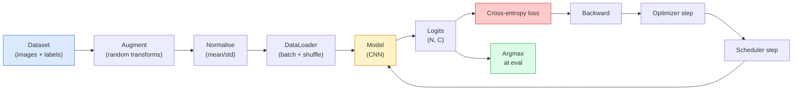

> **Orijinal İçerik:** [docs/en.md](https://github.com/rohitg00/ai-engineering-from-scratch/blob/main/phases/04-computer-vision/04-image-classification/docs/en.md)

# Görüntü Sınıflandırma (Image Classification)

> Bir sınıflandırıcı, piksellerden sınıflar üzerinde bir olasılık dağılımına giden bir fonksiyondur. Gerisi tesisattır.

**Tür:** Build
**Diller:** Python
**Ön Koşullar:** Phase 2 Ders 09 (Model Evaluation), Phase 3 Ders 10 (Mini Framework), Phase 4 Ders 03 (CNNs)
**Süre:** ~75 dakika

## Öğrenme Hedefleri

- CIFAR-10 üzerinde uçtan uca bir görüntü sınıflandırma pipeline'ı (veri kümesi, augmentation, model, eğitim döngüsü, değerlendirme) inşa etmek
- Her bileşenin (dataloader, loss, optimizer, scheduler, augmentation) rolünü açıklamak ve herhangi birini bozmanın loss eğrisinde nasıl kendini göstereceğini tahmin etmek
- Mixup, cutout ve label smoothing'i sıfırdan uygulamak ve her birinin ne zaman eklenmeye değer olduğunu gerekçelendirmek
- Bir confusion matrix ve sınıf başına precision/recall tablosu okuyarak toplam doğruluğun ötesindeki veri kümesi ve model hatalarını teşhis etmek

## Problem

Gönderilen her görüş görevi bir düzeyde görüntü sınıflandırmaya indirgenir. Detection, bölgeleri sınıflandırır. Segmentation, pikselleri sınıflandırır. Retrieval, sınıf merkezlerine benzerlikle sıralar. Sınıflandırmayı doğru yapmak — veri kümesi döngüsü, augmentation politikası, loss, değerlendirme — fazdaki diğer her göreve aktarılan beceridir.

Çoğu sınıflandırma hatası modelde değildir. Pipeline'da yaşarlar: bozuk bir normalizasyon, karıştırılmamış bir eğitim seti, etiketleri bozan augmentation, eğitim verisiyle kontamine olmuş bir doğrulama bölmesi, 30. epoch'tan sonra sessizce ıraksayan bir öğrenme oranı. Doğru kurulumla CIFAR-10'da %93'e ulaşacak bir CNN, bozuk bir kurulumla genellikle %70-75 puan alır ve loss eğrisi tüm süre boyunca makul görünür.

Bu ders, her parçanın incelenebilir olması için tüm pipeline'ı elle kurar. Bir hatayı gizleyebilecek `torchvision.datasets`'ten hiçbir şey kullanmayacaksınız.

## Kavram

### Sınıflandırma pipeline'ı



#### Açıklama
Sınıflandırma pipeline'ının tam akış şeması: veri kümesinden augmentation, normalizasyon, DataLoader, model, loss, geri yayılım ve optimizasyon.

Bu döngüdeki her satır, bir hatanın yaşayabileceği yerdir. Cross-entropy ham logit'leri alır, softmax çıktılarını değil, bu nedenle loss'tan önce herhangi bir `model(x).softmax()` sessizce yanlış gradient hesaplar. Augmentasyonlar yalnızca girdilere uygulanır, etiketlere değil — mixup hariç, ikisini de karıştırır. `optimizer.zero_grad()` her adımda bir kez olmalıdır; atlamak gradient'leri biriktirir ve çılgınca kararsız bir öğrenme oranı gibi görünür. Bu hataların her biri hata vermeden öğrenme eğrisini düzleştirir.

### Cross-entropy, logits ve softmax

Bir sınıflandırıcı, görüntü başına `C` sayı üretir; bunlara logits denir. Softmax uygulamak bunları bir olasılık dağılımına dönüştürür:

```text
softmax(z)_i = exp(z_i) / sum_j exp(z_j)
```

Cross-entropy, doğru sınıfın negatif log olasılığını ölçer:

```
CE(z, y) = -log( softmax(z)_y )
        = -z_y + log( sum_j exp(z_j) )
```

Sağdaki form sayısal olarak kararlı olandır (log-sum-exp). PyTorch'un `nn.CrossEntropyLoss`'u softmax + NLL'yi tek bir işlemde birleştirir ve doğrudan ham logit'leri alır. Önce kendiniz softmax uygulamak neredeyse her zaman bir hatadır — log(softmax(softmax(z))) gibi anlamsız bir miktar hesaplarsınız.

### Augmentation neden işe yarar

Bir CNN, öteleme için içsel bir yanlılığa (weight sharing'den) sahiptir, ancak kırpma, çevirme, renk jitter'ı veya tıkanmaya karşı yerleşik bir değişmezliği yoktur. Bu değişmezlikleri öğretmenin tek yolu, onları çalıştıran pikselleri göstermektir. Eğitim sırasındaki her rastgele dönüşüm şunu söylemenin bir yoludur: "bu iki görüntü aynı etikete sahip; farkı görmezden gelen özellikleri öğren."

```
Original crop:  "dog facing left"
Flip:           "dog facing right"       <- same label, different pixels
Rotate(+15):    "dog, slight tilt"
Colour jitter:  "dog in warmer light"
RandomErasing:  "dog with patch missing"
```

Kural: augmentation etiketi korumalıdır. Bir rakamda cutout ve döndürme "6"yı "9"a çevirebilir; bu veri kümesi için daha küçük döndürme aralıkları kullanır ve rakama özgü değişmezliklere saygı gösteren augmentasyonlar seçersiniz.

### Mixup ve cutmix

Sıradan augmentation pikselleri dönüştürür ancak etiketleri one-hot tutar. **Mixup** ve **cutmix** ikisini de enterpole ederek bunu kırar.

```text
Mixup:
  lambda ~ Beta(a, a)
  x = lambda * x_i + (1 - lambda) * x_j
  y = lambda * y_i + (1 - lambda) * y_j

Cutmix:
  paste a random rectangle of x_j into x_i
  y = area-weighted mix of y_i and y_j
```

Neden yardımcı olur: model sivri one-hot hedefleri ezberlemeyi bırakır ve sınıflar arasında yumuşak enterpolasyonlar yapmayı öğrenir. Eğitim kaybı artar, test doğruluğu artar. Herhangi bir sınıflandırıcı için en ucuz sağlamlık (robustness) yükseltmesidir.

### Label smoothing

Mixup'un bir kuzeni. `[0, 0, 1, 0, 0]` yerine küçük bir `eps` (0.1 gibi) için `[eps/C, eps/C, 1-eps, eps/C, eps/C]` ile eğitin. Modelin keyfi olarak keskin logit'ler üretmesini engeller ve neredeyse hiçbir maliyet olmadan kalibrasyonu iyileştirir. PyTorch 1.10'dan beri `nn.CrossEntropyLoss(label_smoothing=0.1)` ile yerleşiktir.

### Doğruluğun ötesinde değerlendirme

Toplam doğruluk dengesizliği gizler. Her zaman çoğunluk sınıfını tahmin eden bir %90-10 ikili sınıflandırıcı %90 puan alır. Gerçekte neler olduğunu söyleyen araçlar:

- **Sınıf başına doğruluk (Per-class accuracy)** — sınıf başına bir sayı; düşük performans gösteren kategorileri hemen ortaya çıkarır.
- **Confusion matrix** — C x C tablosu, satır i sütun j = gerçek sınıf i'nin sınıf j olarak tahmin edilme sayısı; köşegen doğrudur, köşegen dışı modelinizin yaşadığı yerdir.
- **Top-1 / Top-5** — doğru sınıfın ilk 1 veya ilk 5 tahminde olup olmadığı; Top-5, "Norwich terrier" vs "Norfolk terrier" gibi sınıflar gerçekten belirsiz olduğu için ImageNet için önemlidir.
- **Kalibrasyon (ECE)** — 0.8 güvenli bir tahmin, zamanın %80'inde doğru mu? Modern ağlar sistematik olarak aşırı güvenlidir; temperature scaling veya label smoothing ile düzeltin.

## İnşa Et

### Adım 1: Belirlenimci (deterministic) sentetik veri kümesi

CIFAR-10 diskte yaşar. Bu dersi tekrarlanabilir ve hızlı kılmak için CIFAR'a benzeyen — modelin öğrenmesi gereken sınıfa özgü yapıya sahip 32x32 RGB görüntüler — sentetik bir veri kümesi oluşturuyoruz. Aynı pipeline, gerçek CIFAR-10'da değişiklik yapılmadan çalışır.

```python
import numpy as np
import torch
from torch.utils.data import Dataset


def synthetic_cifar(num_per_class=1000, num_classes=10, seed=0):
    rng = np.random.default_rng(seed)
    X = []
    Y = []
    for c in range(num_classes):
        centre = rng.uniform(0, 1, (3,))
        freq = 2 + c
        for _ in range(num_per_class):
            yy, xx = np.meshgrid(np.linspace(0, 1, 32), np.linspace(0, 1, 32), indexing="ij")
            r = np.sin(xx * freq) * 0.5 + centre[0]
            g = np.cos(yy * freq) * 0.5 + centre[1]
            b = (xx + yy) * 0.5 * centre[2]
            img = np.stack([r, g, b], axis=-1)
            img += rng.normal(0, 0.08, img.shape)
            img = np.clip(img, 0, 1)
            X.append(img.astype(np.float32))
            Y.append(c)
    X = np.stack(X)
    Y = np.array(Y)
    idx = rng.permutation(len(X))
    return X[idx], Y[idx]


class ArrayDataset(Dataset):
    def __init__(self, X, Y, transform=None):
        self.X = X
        self.Y = Y
        self.transform = transform

    def __len__(self):
        return len(self.X)

    def __getitem__(self, i):
        img = self.X[i]
        if self.transform is not None:
            img = self.transform(img)
        img = torch.from_numpy(img).permute(2, 0, 1)
        return img, int(self.Y[i])
```

#### Açıklama
Sentetik CIFAR veri kümesi: her sınıfın kendi renk paleti ve frekans deseni vardır. Gaussian gürültü, modelin pikselleri ezberlemek yerine sinyali öğrenmesini sağlar. On sınıf, her biri bin görüntü, karıştırılmış.

### Adım 2: Normalizasyon ve augmentation

Her görüş pipeline'ının sahip olduğu iki dönüşüm.

```python
def standardize(mean, std):
    mean = np.array(mean, dtype=np.float32)
    std = np.array(std, dtype=np.float32)
    def _fn(img):
        return (img - mean) / std
    return _fn


def random_hflip(p=0.5):
    def _fn(img):
        if np.random.random() < p:
            return img[:, ::-1, :].copy()
        return img
    return _fn


def random_crop(pad=4):
    def _fn(img):
        h, w = img.shape[:2]
        padded = np.pad(img, ((pad, pad), (pad, pad), (0, 0)), mode="reflect")
        y = np.random.randint(0, 2 * pad)
        x = np.random.randint(0, 2 * pad)
        return padded[y:y + h, x:x + w, :]
    return _fn


def compose(*fns):
    def _fn(img):
        for fn in fns:
            img = fn(img)
        return img
    return _fn
```

#### Açıklama
Standart görüntü ön işleme fonksiyonları: standartlaştırma (mean/std), rastgele yatay çevirme ve rastgele kırpma (reflect-pad ile).

Kırpmadan önce reflect-pad, zero-pad değil, çünkü siyah kenarlıklar modelin yararsız bir şekilde görmezden gelmeyi öğreneceği bir sinyaldir.

### Adım 3: Mixup

Eğitim adımı içinde iki görüntüyü ve iki etiketi karıştırır. Veri kümesi yerine forward pass'ın yanında yaşaması için bir batch dönüşümü olarak uygulanır.

```python
def mixup_batch(x, y, num_classes, alpha=0.2):
    if alpha <= 0:
        return x, torch.nn.functional.one_hot(y, num_classes).float()
    lam = float(np.random.beta(alpha, alpha))
    idx = torch.randperm(x.size(0), device=x.device)
    x_mixed = lam * x + (1 - lam) * x[idx]
    y_onehot = torch.nn.functional.one_hot(y, num_classes).float()
    y_mixed = lam * y_onehot + (1 - lam) * y_onehot[idx]
    return x_mixed, y_mixed


def soft_cross_entropy(logits, soft_targets):
    log_probs = torch.log_softmax(logits, dim=-1)
    return -(soft_targets * log_probs).sum(dim=-1).mean()
```

#### Açıklama
Mixup: iki görüntü ve etiket, Beta dağılımından örneklenen bir lambda ile enterpole edilir. `soft_cross_entropy`, yumuşak etiket dağılımlarına karşı cross-entropy'dir.

`soft_cross_entropy`, yumuşak etiket dağılımına karşı cross-entropy'dir. Hedef tam olarak one-hot olduğunda olağan one-hot durumuna indirgenir.

### Adım 4: Eğitim döngüsü

Tam tarif: veri üzerinde bir geçiş, adım başına bir kez gradient, epoch başına bir kez scheduler adımı.

```python
import torch
import torch.nn as nn
from torch.utils.data import DataLoader
from torch.optim import SGD
from torch.optim.lr_scheduler import CosineAnnealingLR

def train_one_epoch(model, loader, optimizer, device, num_classes, use_mixup=True):
    model.train()
    total, correct, loss_sum = 0, 0, 0.0
    for x, y in loader:
        x, y = x.to(device), y.to(device)
        if use_mixup:
            x_m, y_soft = mixup_batch(x, y, num_classes)
            logits = model(x_m)
            loss = soft_cross_entropy(logits, y_soft)
        else:
            logits = model(x)
            loss = nn.functional.cross_entropy(logits, y, label_smoothing=0.1)
        optimizer.zero_grad()
        loss.backward()
        optimizer.step()
        loss_sum += loss.item() * x.size(0)
        total += x.size(0)
        # Training accuracy vs the un-mixed labels `y` is only an approximation
        # when mixup is on (the model saw soft targets, not y). Treat it as a
        # rough progress signal; rely on val accuracy for real performance.
        with torch.no_grad():
            pred = logits.argmax(dim=-1)
            correct += (pred == y).sum().item()
    return loss_sum / total, correct / total


@torch.no_grad()
def evaluate(model, loader, device, num_classes):
    model.eval()
    total, correct = 0, 0
    loss_sum = 0.0
    cm = torch.zeros(num_classes, num_classes, dtype=torch.long)
    for x, y in loader:
        x, y = x.to(device), y.to(device)
        logits = model(x)
        loss = nn.functional.cross_entropy(logits, y)
        pred = logits.argmax(dim=-1)
        for t, p in zip(y.cpu(), pred.cpu()):
            cm[t, p] += 1
        loss_sum += loss.item() * x.size(0)
        total += x.size(0)
        correct += (pred == y).sum().item()
    return loss_sum / total, correct / total, cm
```

#### Açıklama
Eğitim ve değerlendirme döngüleri. Eğitim döngüsü her adımda gradient sıfırlama, geri yayılım ve optimizasyon içerir. Değerlendirme döngüsü confusion matrix de dahil metrikleri hesaplar.

Her eğitim döngüsü yazdığınızda kontrol ettiğiniz beş değişmez:

1. Eğitimden önce `model.train()`, değerlendirmeden önce `model.eval()` — dropout ve batchnorm davranışını değiştirir.
2. `.backward()`'tan önce `.zero_grad()`.
3. Metrikleri biriktirirken `.item()` kullanın, böylece hiçbir şey hesaplama grafiğini canlı tutmaz.
4. Değerlendirme sırasında `@torch.no_grad()` — bellek ve zaman kazandırır, ince kazaları önler.
5. Ham logit'lere karşı Argmax, softmax'a değil — aynı sonuç, bir işlem eksik.

### Adım 5: Bir araya getirme

Önceki dersten `TinyResNet`'i kullanın, birkaç epoch eğitin, değerlendirin.

```python
from main import synthetic_cifar, ArrayDataset
from main import standardize, random_hflip, random_crop, compose
from main import mixup_batch, soft_cross_entropy
from main import train_one_epoch, evaluate
# TinyResNet comes from the previous lesson (03-cnns-lenet-to-resnet).
# Adjust the import path to wherever you stored the previous lesson's code.
from cnns_lenet_to_resnet import TinyResNet  # example placeholder

X, Y = synthetic_cifar(num_per_class=500)
split = int(0.9 * len(X))
X_train, Y_train = X[:split], Y[:split]
X_val, Y_val = X[split:], Y[split:]

mean = [0.5, 0.5, 0.5]
std = [0.25, 0.25, 0.25]
train_tf = compose(random_hflip(), random_crop(pad=4), standardize(mean, std))
eval_tf = standardize(mean, std)

train_ds = ArrayDataset(X_train, Y_train, transform=train_tf)
val_ds = ArrayDataset(X_val, Y_val, transform=eval_tf)

train_loader = DataLoader(train_ds, batch_size=128, shuffle=True, num_workers=0)
val_loader = DataLoader(val_ds, batch_size=256, shuffle=False, num_workers=0)

device = "cuda" if torch.cuda.is_available() else "cpu"
model = TinyResNet(num_classes=10).to(device)
optimizer = SGD(model.parameters(), lr=0.1, momentum=0.9, weight_decay=5e-4, nesterov=True)
scheduler = CosineAnnealingLR(optimizer, T_max=10)

for epoch in range(10):
    tr_loss, tr_acc = train_one_epoch(model, train_loader, optimizer, device, 10, use_mixup=True)
    va_loss, va_acc, _ = evaluate(model, val_loader, device, 10)
    scheduler.step()
    print(f"epoch {epoch:2d}  lr {scheduler.get_last_lr()[0]:.4f}  "
          f"train {tr_loss:.3f}/{tr_acc:.3f}  val {va_loss:.3f}/{va_acc:.3f}")
```

#### Açıklama
Tüm pipeline'ı bir araya getiren tam eğitim betiği. Sentetik veri kümesiyle beş epoch içinde neredeyse mükemmel doğrulama doğruluğuna ulaşır.

Sentetik veri kümesinde bu, beş epoch içinde neredeyse mükemmel doğrulama doğruluğuna ulaşır; amaç da budur: pipeline doğrudur, model öğrenilebilir olanı öğrenebilir. Veri kümesini gerçek CIFAR-10 ile değiştirin ve aynı döngü değişiklik yapılmadan ~%90'a kadar eğitilir.

### Adım 6: Confusion matrix okuma

Doğruluk tek başına modelin nerede başarısız olduğunu asla söylemez. Confusion matrix söyler.

```python
def print_confusion(cm, labels=None):
    c = cm.shape[0]
    labels = labels or [str(i) for i in range(c)]
    print(f"{'':>6}" + "".join(f"{l:>5}" for l in labels))
    for i in range(c):
        row = cm[i].tolist()
        print(f"{labels[i]:>6}" + "".join(f"{v:>5}" for v in row))
    print()
    tp = cm.diag().float()
    fp = cm.sum(dim=0).float() - tp
    fn = cm.sum(dim=1).float() - tp
    prec = tp / (tp + fp).clamp_min(1)
    rec = tp / (tp + fn).clamp_min(1)
    f1 = 2 * prec * rec / (prec + rec).clamp_min(1e-9)
    for i in range(c):
        print(f"{labels[i]:>6}  prec {prec[i]:.3f}  rec {rec[i]:.3f}  f1 {f1[i]:.3f}")

_, _, cm = evaluate(model, val_loader, device, 10)
print_confusion(cm)
```

#### Açıklama
Confusion matrix yazdırma fonksiyonu. Satırlar gerçek sınıflar, sütunlar tahminlerdir. Her sınıf için precision, recall ve F1 puanlarını da hesaplar.

Satırlar gerçek sınıflar, sütunlar tahminlerdir. Sınıf 3 ve 5 arasındaki bir köşegen dışı sayı kümesi, modelin bu ikisini karıştırdığı anlamına gelir ve size hedefli veri toplama veya sınıfa özgü bir augmentation için bir başlangıç noktası verir.

## Kullan

`torchvision` yukarıdaki her şeyi deyimsel bileşenlere sarar. Gerçek CIFAR-10 için tam pipeline, bir eğitim döngüsü artı dört satırdır.

```python
from torchvision.datasets import CIFAR10
from torchvision.transforms import Compose, RandomCrop, RandomHorizontalFlip, ToTensor, Normalize

mean = (0.4914, 0.4822, 0.4465)
std = (0.2470, 0.2435, 0.2616)
train_tf = Compose([
    RandomCrop(32, padding=4, padding_mode="reflect"),
    RandomHorizontalFlip(),
    ToTensor(),
    Normalize(mean, std),
])
eval_tf = Compose([ToTensor(), Normalize(mean, std)])

train_ds = CIFAR10(root="./data", train=True,  download=True, transform=train_tf)
val_ds   = CIFAR10(root="./data", train=False, download=True, transform=eval_tf)
```

#### Açıklama
`torchvision` ile CIFAR-10 pipeline'ı. Dikkat edilmesi gereken iki şey: mean/std **veri kümesine özgüdür** — ImageNet'te değil, CIFAR-10 eğitim setinde hesaplanır — ve reflect pad, topluluğun varsayılan kırpma politikasıdır. Buraya ImageNet istatistiklerini kopyala-yapıştır yapmak, kimse modeli profillemeyene kadar kimsenin yakalamadığı ~%1'lik bir doğruluk sızıntısıdır.

## Çıktılar

Bu ders şunları üretir:

- `outputs/prompt-classifier-pipeline-auditor.md` — bir eğitim betiğini yukarıdaki beş değişmez için denetleyen ve ilk ihlali yüzeye çıkaran bir prompt.
- `outputs/skill-classification-diagnostics.md` — bir confusion matrix ve sınıf adları listesi verildiğinde, sınıf başına başarısızlıkları özetleyen ve en etkili tek düzeltmeyi öneren bir skill.

## Alıştırmalar

1. **(Kolay)** Aynı modeli sentetik veri kümesinde mixup ile ve mixup olmadan beş epoch eğitin. Her ikisi için eğitim ve doğrulama kaybını çizin. Mixup ile eğitim kaybının neden daha yüksek olduğunu ancak doğrulama doğruluğunun benzer veya daha iyi olduğunu açıklayın.
2. **(Orta)** Cutout'u uygulayın — her eğitim görüntüsünde rastgele 8x8'lik bir kareyi sıfırlayın — ve augmentation yok, hflip+crop, hflip+crop+cutout, hflip+crop+mixup arasında bir ablasyon çalıştırın. Her biri için doğrulama doğruluğunu raporlayın.
3. **(Zor)** Bir CIFAR-100 pipeline'ı (100 sınıf, aynı girdi boyutu) oluşturun ve bir ResNet-34 eğitimini yayınlanmış doğruluğun %1'i içinde yeniden üretin. Ekstralar: üç öğrenme oranı ve iki weight decay'i tarayın, yerel bir CSV'ye kaydedin, nihai confusion-matrix-en-karışık-sınıflar tablosunu üretin.

## Anahtar Terimler

| Terim | İnsanların dediği | Gerçekte anlamı |
|------|----------------|----------------------|
| Logits | "Ham çıktılar" | Görüntü başına C sayıdan oluşan softmax öncesi vektör; cross-entropy bunları bekler, softmax'lanmış değerleri değil |
| Cross-entropy | "Loss" | Doğru sınıfın negatif log-olasılığı; log-softmax ve NLL'yi tek bir kararlı işlemde birleştirir |
| DataLoader | "Batch'leyici" | Bir veri kümesini karıştırma, batch'leme ve (isteğe bağlı) çoklu işçi yükleme ile saran yapı; eğitim hatalarının yarısından sorumlu tutulur |
| Augmentation | "Rastgele dönüşümler" | Eğitim zamanında etiketi koruyan herhangi bir piksel düzeyinde dönüşüm; CNN'in doğal olarak sahip olmadığı değişmezlikleri öğretir |
| Mixup / Cutmix | "İki görüntüyü karıştır" | Sınıflandırıcının kesin sınırlar yerine yumuşak enterpolasyonlar öğrenmesi için hem girdileri hem de etiketleri karıştırır |
| Label smoothing | "Daha yumuşak hedefler" | One-hot'u (1-eps, eps/(C-1), ...) ile değiştirir; kalibrasyonu iyileştirir ve doğruluğu hafifçe artırır |
| Top-k accuracy | "Top-5" | Doğru sınıf en yüksek olasılıklı k tahmin içindedir; gerçekten belirsiz sınıfları olan veri kümelerinde kullanılır |
| Confusion matrix | "Hataların yaşadığı yer" | (i, j) girişinin gerçek sınıf i'nin j olarak tahmin edilen görüntülerini saydığı C x C tablosu; köşegen doğru, köşegen dışı size neyi düzelteceğinizi söyler |

## Daha Fazla Okuma

- [CS231n: Training Neural Networks](https://cs231n.github.io/neural-networks-3/) — eğitim pipeline'ının tek sayfadaki en net turu
- [Bag of Tricks for Image Classification (He et al., 2019)](https://arxiv.org/abs/1812.01187) — ImageNet'te ResNet doğruluğuna toplamda %3-4 ekleyen her küçük hile
- [mixup: Beyond Empirical Risk Minimization (Zhang et al., 2017)](https://arxiv.org/abs/1710.09412) — orijinal mixup makalesi; üç sayfa teori artı ikna edici deneyler
- [Why temperature scaling matters (Guo et al., 2017)](https://arxiv.org/abs/1706.04599) — modern ağların yanlış kalibre edildiğini kanıtlayan ve bunu tek bir skaler parametreyle düzelten makale
