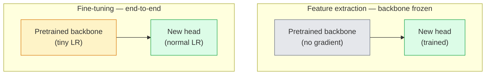

> **Orijinal İçerik:** [docs/en.md](https://github.com/rohitg00/ai-engineering-from-scratch/blob/main/phases/04-computer-vision/05-transfer-learning/docs/en.md)

# Transfer Learning ve İnce Ayar (Transfer Learning & Fine-Tuning)

> Bir başkası, bir ağa kenarların, dokuların ve nesne parçalarının neye benzediğini öğretmek için bir milyon GPU saati harcadı. Kendinizinkini eğitmeden önce bu özellikleri ödünç almalısınız.

**Tür:** Build
**Diller:** Python
**Ön Koşullar:** Phase 4 Ders 03 (CNNs), Phase 4 Ders 04 (Image Classification)
**Süre:** ~75 dakika

## Öğrenme Hedefleri

- Feature extraction (özellik çıkarımı) ile fine-tuning (ince ayar) arasında ayrım yapmak ve veri kümesi boyutu, alan uzaklığı ve hesaplama bütçesine göre doğru olanı seçmek
- Önceden eğitilmiş bir backbone yüklemek, sınıflandırıcı kafasını değiştirmek ve yalnızca kafayı 20 satırın altında çalışan bir taban çizgisine eğitmek
- Ayırt edici öğrenme oranları (discriminative learning rates) ile katmanları aşamalı olarak çözmek (progressive unfreezing), böylece erken genel özelliklerin geç göreve özgü olanlardan daha küçük güncellemeler almasını sağlamak
- Üç yaygın başarısızlığı teşhis etmek: çözülmüş bloklarda çok yüksek LR'dan kaynaklanan özellik kayması (feature drift), küçük veri kümelerinde BN istatistiklerinin çökmesi ve felaketle unutma (catastrophic forgetting)

## Problem

Bir ResNet-50'yi ImageNet'te eğitmek yaklaşık 2.000 GPU-saatine mal olur. Çok az ekip, gönderdikleri her görev için bu bütçeye sahiptir. Hemen hemen her ekibin fiilen gönderdiği şey, birkaç yüz veya birkaç bin göreve özgü görüntü üzerinde eğitilmiş yeni bir kafa ile önceden eğitilmiş bir backbone'dur.

Bu bir kestirme yol değildir. ImageNet'te eğitilmiş herhangi bir CNN'in ilk conv bloğu kenarları ve Gabor benzeri filtreleri öğrenir. Sonraki birkaç blok dokuları ve basit motifleri öğrenir. Orta bloklar nesne parçalarını öğrenir. Son bloklar, 1.000 ImageNet kategorisine benzemeye başlayan kombinasyonları öğrenir. Bu hiyerarşinin ilk %90'ı, tıbbi görüntüleme, endüstriyel denetim, uydu verileri ve diğer her görüş görevine neredeyse değişmeden aktarılır — çünkü doğanın sınırlı sayıda kenar ve doku sözlüğü vardır. Son %10, asıl eğittiğiniz şeydir.

Transfer'i doğru yapmanın sizi bekleyen üç hatası vardır: çok yüksek bir öğrenme oranıyla önceden eğitilmiş özellikleri yok etmek, çok fazla dondurarak modeli bilgiden mahrum bırakmak ve BatchNorm'un çalışan istatistiklerinin, ağın geri kalanının hiç öğrenmediği küçük bir veri kümesine doğru kaymasına izin vermek. Bu ders, her birini bilerek adım adım işler.

## Kavram

### Feature extraction ve fine-tuning

Önceden eğitilmiş özelliklere ne kadar güvendiğinize ve ne kadar veriniz olduğuna göre seçilen iki rejim.



#### Açıklama
Feature extraction: backbone dondurulur, yalnızca yeni kafa eğitilir. Fine-tuning: backbone çok küçük LR ile, yeni kafa normal LR ile uçtan uca eğitilir.

Pratik kurallar:

| Veri kümesi boyutu | Alan uzaklığı | Tarif |
|--------------|-----------------|--------|
| < 1k görüntü | ImageNet'e yakın | Backbone'u dondur, yalnızca kafayı eğit |
| 1k-10k | yakın | İlk 2-3 aşamayı dondur, geri kalanı fine-tune et |
| 10k-100k | herhangi | Ayırt edici LR ile uçtan uca fine-tune |
| 100k+ | uzak | Her şeyi fine-tune et; alan yeterince uzaksa sıfırdan eğitmeyi düşün |

"ImageNet'e yakın" kabaca nesne benzeri içeriğe sahip doğal RGB fotoğraflar anlamına gelir. Tıbbi BT taramaları, yüksek çözünürlüklü uydu görüntüleri ve mikroskopi uzak alanlardır — özellikler hâlâ yardımcı olur, ancak daha fazla katmanın uyum sağlamasına izin vermeniz gerekecektir.

### Dondurma neden işe yarar

Bir CNN'in öğrendiği ImageNet özellikleri 1.000 kategoriye özelleşmemiştir. Doğal görüntülerin istatistiklerine özelleşmişlerdir: belirli yönelimlerde kenarlar, dokular, kontrast desenleri, şekil temelleri. Bu istatistikler, bir insanın adlandırabileceği hemen hemen her görsel alanda kararlıdır. Bu nedenle, ImageNet'te eğitilmiş ve yalnızca yeni bir linear kafa ile (backbone'da hiç fine-tuning yapılmadan) CIFAR-10'da sıfır atışla (zero-shot) değerlendirilen bir model %80+ doğruluğa ulaşır. Kafa, hâlihazırda öğrenilmiş özelliklerden hangilerini bu görev için ağırlıklandıracağını öğrenmektedir.

### Ayırt edici öğrenme oranları (Discriminative Learning Rates)

Çözdüğünüzde, erken katmanlar geç katmanlardan daha yavaş eğitilmelidir. Erken katmanlar korumak istediğiniz genel özellikleri kodlar; geç katmanlar çok fazla hareket ettirmeniz gereken göreve özgü yapıyı kodlar.

```text
Typical recipe:

  stage 0 (stem + first group): lr = base_lr / 100    (mostly fixed)
  stage 1:                       lr = base_lr / 10
  stage 2:                       lr = base_lr / 3
  stage 3 (last backbone group): lr = base_lr
  head:                          lr = base_lr  (or slightly higher)
```

PyTorch'ta bu, optimizer'a iletilen bir parametre grubu listesidir. Bir model, beş öğrenme oranı, sıfır ekstra kod.

### BatchNorm problemi

BN katmanları, ImageNet'te hesaplanmış `running_mean` ve `running_var` tamponlarını tutar. Görevinizin farklı bir piksel dağılımı varsa — farklı aydınlatma, farklı sensör, farklı renk uzayı — bu tamponlar yanlıştır. Tercih sırasına göre üç seçenek:

1. **BN'yi train modunda fine-tune et.** BN'nin çalışan istatistiklerini her şeyle birlikte güncellemesine izin ver. Görev veri kümesi orta büyüklükteyse (>= 5k örnek) varsayılan seçim.
2. **BN'yi eval modunda dondur.** ImageNet istatistiklerini koru ve yalnızca ağırlıkları eğit. Veri kümeniz, BN'nin hareketli ortalamasının gürültülü olacağı kadar küçük olduğunda doğrudur.
3. **BN'yi GroupNorm ile değiştir.** Hareketli ortalama sorununu tamamen ortadan kaldırır. GPU başına batch boyutunun çok küçük olduğu detection ve segmentation backbone'larında kullanılır.

Bunu yanlış yapmak doğruluğu sessizce %5-15 düşürür.

### Kafa tasarımı

Sınıflandırıcı kafa (head), 1-3 linear katman artı isteğe bağlı bir dropout'tur. Her torchvision backbone, değiştirdiğiniz varsayılan bir kafayla gelir:

```
backbone.fc = nn.Linear(backbone.fc.in_features, num_classes)          # ResNet
backbone.classifier[1] = nn.Linear(..., num_classes)                    # EfficientNet, MobileNet
backbone.heads.head = nn.Linear(..., num_classes)                       # torchvision ViT
```

Küçük veri kümeleri için tek bir linear katman genellikle yeterlidir. Görev dağılımı backbone'un eğitim dağılımından daha uzak olduğunda, gizli bir katman (Linear -> ReLU -> Dropout -> Linear) eklemek yardımcı olur.

### Katman bazlı LR azalması (Layer-wise LR Decay)

Modern fine-tuning'de (BEiT, DINOv2, ViT-B fine-tuneları) kullanılan ayırt edici LR'nin daha yumuşak bir sürümü. Katmanları aşamalara gruplamak yerine, her katmana üstündekinden biraz daha küçük bir LR verin:

```text
lr_layer_k = base_lr * decay^(L - k)
```

decay = 0.75 ve L = 12 transformer bloğu ile ilk blok, kafanın LR'sinin `0.75^11 ≈ 0.04x`'inde eğitilir. Transformer fine-tuneları için CNN'lerden daha önemlidir; CNN'lerde aşama gruplu LR'ler genellikle yeterlidir.

### Ne değerlendirilmeli

Transfer-learning çalıştırmalarının, sıfırdan eğitimde izlemeyeceğiniz iki sayıya ihtiyacı vardır:

- **Yalnızca önceden eğitilmiş doğruluk** — backbone donmuş haldeyken kafanın doğruluğu. Bu sizin tabanınızdır.
- **Fine-tune edilmiş doğruluk** — uçtan uca eğitimden sonra aynı model. Bu sizin tavanınızdır.

Fine-tune edilmiş, yalnızca önceden eğitilmişten düşükse, bir öğrenme oranı veya BN hatanız var demektir. Her ikisini de her zaman yazdırın.

## İnşa Et

### Adım 1: Önceden eğitilmiş bir backbone yükleme ve inceleme

```python
import torch
import torch.nn as nn
from torchvision.models import resnet18, ResNet18_Weights

backbone = resnet18(weights=ResNet18_Weights.IMAGENET1K_V1)
print(backbone)
print()
print("classifier head:", backbone.fc)
print("feature dim:", backbone.fc.in_features)
```

#### Açıklama
`torchvision.models` ile önceden eğitilmiş ResNet-18 yükleme. Backbone dört aşama (`layer1..layer4`), bir stem ve bir `fc` kafasından oluşur.

`ResNet18` dört aşamaya (`layer1..layer4`) artı bir stem ve `fc` kafasına sahiptir. Her torchvision sınıflandırma backbone'unun benzer bir yapısı vardır.

### Adım 2: Feature extraction — her şeyi dondur, kafayı değiştir

```python
def make_feature_extractor(num_classes=10):
    model = resnet18(weights=ResNet18_Weights.IMAGENET1K_V1)
    for p in model.parameters():
        p.requires_grad = False
    model.fc = nn.Linear(model.fc.in_features, num_classes)
    return model

model = make_feature_extractor(num_classes=10)
trainable = sum(p.numel() for p in model.parameters() if p.requires_grad)
frozen = sum(p.numel() for p in model.parameters() if not p.requires_grad)
print(f"trainable: {trainable:>10,}")
print(f"frozen:    {frozen:>10,}")
```

#### Açıklama
Feature extraction: tüm parametreler dondurulur (`requires_grad = False`), yalnızca yeni eklenen `fc` katmanı eğitilebilir.

Yalnızca `model.fc` eğitilebilir. Backbone donmuş bir feature extractor'dır.

### Adım 3: Ayırt edici fine-tuning

Aşamaya özgü öğrenme oranlarıyla parametre grupları oluşturan bir yardımcı.

```python
def discriminative_param_groups(model, base_lr=1e-3, decay=0.3):
    stages = [
        ["conv1", "bn1"],
        ["layer1"],
        ["layer2"],
        ["layer3"],
        ["layer4"],
        ["fc"],
    ]
    groups = []
    for i, names in enumerate(stages):
        lr = base_lr * (decay ** (len(stages) - 1 - i))
        params = [p for n, p in model.named_parameters()
                  if any(n.startswith(k) for k in names)]
        if params:
            groups.append({"params": params, "lr": lr, "name": "_".join(names)})
    return groups

model = resnet18(weights=ResNet18_Weights.IMAGENET1K_V1)
model.fc = nn.Linear(model.fc.in_features, 10)
for p in model.parameters():
    p.requires_grad = True

groups = discriminative_param_groups(model)
for g in groups:
    print(f"{g['name']:>10s}  lr={g['lr']:.2e}  params={sum(p.numel() for p in g['params']):>8,}")
```

#### Açıklama
Ayırt edici öğrenme oranları: her aşama, bir sonrakinin oranının `decay` katı kadar LR alır. `fc` `base_lr` alır, `layer4` `0.3 * base_lr`, `conv1` `0.3^5 * base_lr ≈ 0.00243 * base_lr` alır.

`decay=0.3`, her aşamanın bir sonrakinin oranının %30'unda eğitildiği anlamına gelir. `fc` `base_lr` alır, `layer4` `0.3 * base_lr` alır, `conv1` `0.3^5 * base_lr ≈ 0.00243 * base_lr` alır. Aşırı gibi görünüyor; ampirik olarak işe yarar.

### Adım 4: BatchNorm yönetimi

BN çalışan istatistiklerini ağırlıklarını dondurmadan dondurmak için yardımcı.

```python
def freeze_bn_stats(model):
    for m in model.modules():
        if isinstance(m, (nn.BatchNorm1d, nn.BatchNorm2d, nn.BatchNorm3d)):
            m.eval()
            for p in m.parameters():
                p.requires_grad = False
    return model
```

#### Açıklama
BatchNorm istatistiklerini dondurma: BN katmanları eval moduna alınır ve parametrelerinin gradient alması engellenir.

Her epoch başında `model.train()` ayarladıktan sonra çağırın. `model.train()` her şeyi eğitim moduna alır; bu, yalnızca BN katmanları için tersine çevirir.

### Adım 5: Minimal uçtan uca fine-tuning döngüsü

```python
from torch.optim import SGD
from torch.utils.data import DataLoader
from torch.optim.lr_scheduler import CosineAnnealingLR
import torch.nn.functional as F

def fine_tune(model, train_loader, val_loader, device, epochs=5, base_lr=1e-3, freeze_bn=False):
    model = model.to(device)
    groups = discriminative_param_groups(model, base_lr=base_lr)
    optimizer = SGD(groups, momentum=0.9, weight_decay=1e-4, nesterov=True)
    scheduler = CosineAnnealingLR(optimizer, T_max=epochs)

    for epoch in range(epochs):
        model.train()
        if freeze_bn:
            freeze_bn_stats(model)
        tr_loss, tr_correct, tr_total = 0.0, 0, 0
        for x, y in train_loader:
            x, y = x.to(device), y.to(device)
            logits = model(x)
            loss = F.cross_entropy(logits, y, label_smoothing=0.1)
            optimizer.zero_grad()
            loss.backward()
            optimizer.step()
            tr_loss += loss.item() * x.size(0)
            tr_total += x.size(0)
            tr_correct += (logits.argmax(-1) == y).sum().item()
        scheduler.step()

        model.eval()
        va_total, va_correct = 0, 0
        with torch.no_grad():
            for x, y in val_loader:
                x, y = x.to(device), y.to(device)
                pred = model(x).argmax(-1)
                va_total += x.size(0)
                va_correct += (pred == y).sum().item()
        print(f"epoch {epoch}  train {tr_loss/tr_total:.3f}/{tr_correct/tr_total:.3f}  "
              f"val {va_correct/va_total:.3f}")
    return model
```

#### Açıklama
Uçtan uca fine-tuning döngüsü. Ayırt edici LR'ler, CosineAnnealing scheduler, isteğe bağlı BN dondurma ve label smoothing içerir.

CIFAR-10'da yukarıdaki tarifle beş epoch, `ResNet18-IMAGENET1K_V1`'i ~%70 sıfır atışlı linear-probe doğruluğundan ~%93 fine-tune doğruluğuna çıkarır. Tek başına kafa, backbone'a asla dokunmadan yaklaşık %86'da platoya ulaşırdı.

### Adım 6: Aşamalı çözme (Progressive Unfreezing)

Her epoch'ta sondan başa doğru bir aşamayı çözen bir program. Özellik kaymasını azaltır, ancak birkaç ek epoch pahasına.

```python
def progressive_unfreeze_schedule(model):
    stages = ["layer4", "layer3", "layer2", "layer1"]
    yielded = set()

    def start():
        for p in model.parameters():
            p.requires_grad = False
        for p in model.fc.parameters():
            p.requires_grad = True

    def unfreeze(epoch):
        if epoch < len(stages):
            name = stages[epoch]
            yielded.add(name)
            for n, p in model.named_parameters():
                if n.startswith(name):
                    p.requires_grad = True
            return name
        return None

    return start, unfreeze
```

#### Açıklama
Aşamalı çözme: her epoch'ta bir aşama (sondan başa doğru) çözülür. `start()` ilk epoch'tan önce, `unfreeze(epoch)` her epoch'un başında çağrılır.

İlk epoch'tan önce bir kez `start()` çağırın. Her epoch'un başında `unfreeze(epoch)` çağırın. Eğitilebilir parametreler kümesi her değiştiğinde optimizer'ı yeniden oluşturun, aksi halde donmuş parametreler hâlâ onu karıştıran önbelleğe alınmış anlar tutar.

## Kullan

Çoğu gerçek görev için `torchvision.models` + üç satır yeterlidir. Yukarıdaki daha ağır mekanizma, kitaplık varsayılanlarının düzeltemeyeceği sorunlarla karşılaştığınızda önem kazanır.

```python
from torchvision.models import resnet50, ResNet50_Weights

model = resnet50(weights=ResNet50_Weights.IMAGENET1K_V2)
model.fc = nn.Linear(model.fc.in_features, num_classes)
optimizer = torch.optim.AdamW(model.parameters(), lr=1e-4, weight_decay=1e-4)
```

Diğer iki üretim kalitesi varsayılanı:

- `timm`, tutarlı bir API ile yaklaşık 800 önceden eğitilmiş görüş backbone'u sunar (`timm.create_model("resnet50", pretrained=True, num_classes=10)`). Torchvision hayvanat bahçesinin ötesindeki herhangi bir fine-tune için standarttır.
- Transformer'lar için `transformers.AutoModelForImageClassification.from_pretrained(name, num_labels=N)`, size metin modelleriyle aynı yükleme semantiğiyle ViT / BEiT / DeiT verir.

## Çıktılar

Bu ders şunları üretir:

- `outputs/prompt-fine-tune-planner.md` — veri kümesi boyutu, alan uzaklığı ve hesaplama bütçesine göre feature extraction, aşamalı veya uçtan uca fine-tuning seçen bir prompt.
- `outputs/skill-freeze-inspector.md` — bir PyTorch modeli verildiğinde, hangi parametrelerin eğitilebilir olduğunu, hangi BatchNorm katmanlarının eval modunda olduğunu ve optimizer'ın gerçekten eğitilebilir parametrelerle beslenip beslenmediğini raporlayan bir skill.

## Alıştırmalar

1. **(Kolay)** Aynı sentetik-CIFAR veri kümesinde bir `ResNet18`'i linear probe (backbone donmuş) ve tam fine-tune olarak eğitin. Her iki doğruluğu yan yana raporlayın. Hangi farkın özelliklerin iyi aktarıldığını ve hangisinin aktarmadığını söylediğini açıklayın.
2. **(Orta)** Bilerek bir hata ekleyin: kafa yerine backbone aşamasında `base_lr = 1e-1` ayarlayın. Eğitim kaybının patladığını, ardından `discriminative_param_groups` yardımcısını uygulayarak düzeldiğini gösterin. Her aşamanın ıraksamaya başladığı LR'yi kaydedin.
3. **(Zor)** Bir tıbbi görüntüleme veri kümesi (örn. CheXpert-small, PatchCamelyon veya HAM10000) alın ve üç rejimi karşılaştırın: (a) ImageNet'te önceden eğitilmiş donmuş backbone + linear kafa; (b) ImageNet'te önceden eğitilmiş uçtan uca fine-tune; (c) sıfırdan eğitim. Her biri için doğruluk ve hesaplama maliyetini raporlayın. Hangi veri kümesi boyutunda sıfırdan eğitim rekabetçi hale gelir?

## Anahtar Terimler

| Terim | İnsanların dediği | Gerçekte anlamı |
|------|----------------|----------------------|
| Feature extraction | "Dondur ve kafayı eğit" | Backbone parametreleri donmuş, yalnızca yeni sınıflandırıcı kafa gradient alır |
| Fine-tuning | "Uçtan uca yeniden eğit" | Tüm parametreler eğitilebilir, genellikle sıfırdan eğitimden çok daha küçük LR ile |
| Discriminative LR | "Erken katmanlar için daha küçük LR" | Erken aşama LR'sinin geç aşama LR'sinin bir kesri olduğu optimizer parametre grupları |
| Layer-wise LR decay | "Yumuşak LR gradyanı" | Katman başına LR'nin decay^(L - k) ile çarpılması; transformer fine-tunelarında yaygın |
| Catastrophic forgetting | "Model ImageNet'i kaybetti" | Çok yüksek bir LR, yeni görev sinyali öğrenilmeden önce önceden eğitilmiş özelliklerin üzerine yazar |
| BN statistics drift | "Running mean yanlış" | BatchNorm running_mean/var'ın geçerli görevden farklı bir dağılımda hesaplanması, sessizce doğruluğu düşürür |
| Linear probe | "Donmuş backbone + linear kafa" | Önceden eğitilmiş özelliklerin değerlendirilmesi — donmuş temsilin üzerindeki en iyi linear sınıflandırıcının doğruluğu |
| Catastrophic collapse | "Her şey bir sınıfı tahmin ediyor" | Fine-tuning'de, kafadan gelen gradyanlar stabilize olmadan önce özellikleri yok edecek kadar yüksek bir LR ile oluşur |

## Daha Fazla Okuma

- [How transferable are features in deep neural networks? (Yosinski et al., 2014)](https://arxiv.org/abs/1411.1792) — özellik aktarılabilirliğini katmanlar arasında ölçen makale
- [Universal Language Model Fine-tuning (ULMFiT, Howard & Ruder, 2018)](https://arxiv.org/abs/1801.06146) — orijinal ayırt edici LR / aşamalı çözme tarifi; fikirler doğrudan görüşe aktarılır
- [timm documentation](https://huggingface.co/docs/timm) — modern görüş backbone'ları ve eğitildikleri kesin fine-tune varsayılanları için referans
- [A Simple Framework for Linear-Probe Evaluation (Kornblith et al., 2019)](https://arxiv.org/abs/1805.08974) — linear-probe doğruluğunun neden önemli olduğu ve nasıl doğru raporlanacağı
