# Object Detection — YOLO from Scratch

> Detection (nesne tespiti), sınıflandırma (classification) ile regresyonun birleşimidir; bir feature map üzerinde her konumda çalıştırılır ve non-maximum suppression ile temizlenir.

**Tür:** Build
**Diller:** Python
**Ön Koşullar:** Phase 4 Lesson 03 (CNNs), Phase 4 Lesson 04 (Image Classification), Phase 4 Lesson 05 (Transfer Learning)
**Süre:** ~75 dakika

## Öğrenme Hedefleri

- Grid ve anchor tasarımını açıklayarak tespitin yoğun tahmin (dense prediction) problemine nasıl dönüştüğünü anlamak ve çıktı tensorundaki her sayının ne anlama geldiğini belirlemek
- Kutular arasında Intersection-over-Unio (IoU) hesaplamak ve sıfırdan non-maximum suppression (NMS) uygulamak
- Önceden eğitilmiş bir backbone üzerinde sınıflandırma, objectness ve kutu regresyon kayıplarını içeren minimal bir YOLO tarzı head inşa etmek
- Bir tespit metriği satırını (precision@0.5, recall, mAP@0.5, mAP@0.5:0.95) okuyup hangi ayarı değiştirmek gerektiğine karar vermek

## Problem

Sınıflandırma (classification) "bu görüntü bir köpektir" der. Tespit (detection) ise "piksel (112, 40, 280, 210) konumunda bir köpek vardır, (400, 180, 560, 310) konumunda bir kedi vardır ve çerçevede başka bir şey yoktur" der. Bu tek yapısal değişiklik — görüntü başına tek bir etiket yerine değişken sayıda etiketlenmiş kutu tahmin etmek — tüm otonom sistemlerin, güvenlik ürünlerinin, belge düzeni ayrıştırıcılarının ve fabrika görüş hatlarının bel bağladığı şeydir.

Tespit aynı zamanda görüntü işlemedeki her mühendislik ödünleşiminin aynı anda ortaya çıktığı yerdir. Doğru kutular istersiniz (regresyon head), her kutu için doğru sınıf istersiniz (sınıflandırma head), modelin tespit edilecek bir şey olmadığını bilmesini istersiniz (objectness skoru) ve her gerçek nesne için tam olarak bir tahmin istersiniz (non-maximum suppression). Bunlardan herhangi biri eksik olursa pipeline ya nesneleri kaçırır, ya hayalet kutular raporlar ya da aynı nesneyi on beş kez farklı konumlarda tahmin eder.

YOLO (You Only Look Once, Redmon ve ark. 2016), tüm bunları tek bir ileri geçişte (forward pass) yaparak gerçek zamanlı çalışmayı mümkün kılan tasarımdı ve aynı yapısal kararlar modern dedektörlerin (YOLOv8, YOLOv9, YOLO-NAS, RT-DETR) de belkemiğini oluşturur. Özü öğrenin, her varyant aynı parçaların yeniden düzenlenmesinden ibarettir.

## Kavram

### Yoğun tahmin olarak tespit

Bir sınıflandırıcı görüntü başına C sayı üretir. Bir YOLO tarzı dedektör görüntü başına `(S x S x (5 + C))` sayı üretir; burada S uzamsal grid (uzamsal ızgara) boyutudur.

```mermaid
flowchart LR
    IMG["Input 416x416 RGB"] --> BB["Backbone<br/>(ResNet, DarkNet, ...)"]
    BB --> FM["Feature map<br/>(C_feat, 13, 13)"]
    FM --> HEAD["Detection head<br/>(1x1 convs)"]
    HEAD --> OUT["Output tensor<br/>(13, 13, B * (5 + C))"]
    OUT --> DEC["Decode<br/>(grid + sigmoid + exp)"]
    DEC --> NMS["Non-max suppression"]
    NMS --> RESULT["Final boxes"]

    style IMG fill:#dbeafe,stroke:#2563eb
    style HEAD fill:#fef3c7,stroke:#d97706
    style NMS fill:#fecaca,stroke:#dc2626
    style RESULT fill:#dcfce7,stroke:#16a34a
```



`S * S` grid hücresinin her biri `B` kutu tahmin eder. Her kutu için:

- 4 sayı geometriyi tanımlar: `tx, ty, tw, th`.
- 1 sayı objectness skorudur: "bu hücrenin merkezinde bir nesne var mı?"
- C sayı sınıf olasılıklarıdır.

Hücre başına toplam: `B * (5 + C)`. VOC için `S=13, B=2, C=20` ile hücre başına 50 sayı.

### Neden grid ve anchor

Düz regresyon her nesne için mutlak koordinat olarak `(x, y, w, h)` tahmin ederdi. Bu bir evrişimli ağ (conv network) için zordur çünkü görüntüyü ötelemek tüm tahminleri aynı miktarda kaydırmamalıdır — her nesne uzamsal olarak konumlanmıştır. Grid bu sorunu, her ground-truth kutusunu merkezinin düştüğü grid hücresine atayarak çözer; yalnızca o hücre o nesneden sorumludur.

Anchor (çapa) ikinci bir sorunu ele alır. 3x3 bir conv, 16 piksellik bir receptive field feature hücresinden 500 piksel genişliğinde bir kutuya kolayca regresyon yapamaz. Bunun yerine, hücre başına `B` adet önceden tanımlanmış önsel kutu şekli (anchor) belirleriz ve her anchordan küçük delta değişiklikleri tahmin ederiz. Model doğru anchor'u seçmeyi ve onu hafifçe düzeltmeyi öğrenir, sıfırdan regresyon yapmak yerine.

```
Anchor kutu önsel değerleri (416x416 girdi örneği):

  küçük:   (30,  60)
  orta:    (75,  170)
  büyük:   (200, 380)

Her grid hücresinde, her anchor (tx, ty, tw, th, obj, c_1, ..., c_C) üretir.
```

Modern dedektörler genellikle FPN kullanarak çözünürlük başına farklı anchor setleri kullanır — sığ yüksek çözünürlüklü haritalarda küçük anchor, derin düşük çözünürlüklü haritalarda büyük anchor. Aynı fikir, daha fazla ölçek.

### Tahminlerin kodunu çözme (decoding)

Ham `tx, ty, tw, th` kutu koordinatları değildir; görselleştirmeden önce dönüştürülmesi gereken regresyon hedefleridir:

```
merkez x  = (sigmoid(tx) + cell_x) * stride
merkez y  = (sigmoid(ty) + cell_y) * stride
genişlik  = anchor_w * exp(tw)
yükseklik = anchor_h * exp(th)
```

`sigmoid` merkez kaymalarını hücre içinde tutar. `exp`, genişliğin anchordan serbestçe ölçeklenmesini sağlar (işaret değişimi olmadan). `stride`, grid koordinatlarını tekrar piksele ölçekler. Bu decode (kod çözme) adımı, v2'den beri her YOLO sürümünde aynıdır.

### IoU

Tespitte iki kutu arasındaki evrensel benzerlik metriği:

```
IoU(A, B) = alan(A ∩ B) / alan(A ∪ B)
```

IoU = 1 aynı anlamına gelir; IoU = 0 hiç örtüşme olmadığı anlamına gelir. Tahmin ile ground-truth kutusu arasındaki IoU, bir tahminin doğru pozitif (true positive) sayılıp sayılmayacağını belirler (tipik olarak IoU >= 0.5). İki tahmin arasındaki IoU ise NMS'nin yineleneleri (deduplicate) ayıklamak için kullandığı değerdir.

### Non-maximum suppression

Bitişik anchor'larla eğitilmiş bir evrişimli ağ, aynı nesne için sıklıkla örtüşen kutular tahmin eder. NMS, en yüksek güvenilirlikli tahmini tutar ve IoU değeri bir eşiğin üzerinde olan diğer tüm tahminleri siler.

```
NMS(kutular, skorlar, iou_threshold):
    kutuları skora göre azalan sırala
    keep = []
    while kutular boş değil:
        en yüksek skorlu kutuyu al, keep'e ekle
        seçilen kutuyla IoU > iou_threshold olan her kutuyu kaldır
    return keep
```

Tipik eşik: nesne tespiti için 0.45. Güncel dedektörler standart NMS yerine `soft-NMS`, `DIoU-NMS` kullanır veya baskılamayı doğrudan öğrenir (RT-DETR), ancak yapısal amaç aynıdır.

### Kayıp (loss) fonksiyonu

YOLO kaybı, ağırlıklarla toplanan üç kayıptan oluşur:

```
L = lambda_coord * L_box(tahmin, hedef, obj=1 olduğunda)
  + lambda_obj   * L_obj(tahmin, 1,     obj=1 olduğunda)
  + lambda_noobj * L_obj(tahmin, 0,     obj=0 olduğunda)
  + lambda_cls   * L_cls(tahmin, hedef, obj=1 olduğunda)
```

Yalnızca nesne içeren hücreler kutu regresyonu ve sınıflandırma kayıplarına katkıda bulunur. Nesne içermeyen hücreler yalnızca objectness kaybına katkıda bulunur (modele sessiz kalmayı öğretir). `lambda_noobj` genellikle küçüktür (~0.5) çünkü hücrelerin büyük çoğunluğu boştur ve aksi halde toplam kayba hâkim olurlar.

Modern varyantlar MSE kutu kaybını CIoU / DIoU ile değiştirir (IoU'yu doğrudan optimize eder), sınıf dengesizliği için focal loss kullanır ve objectness'i quality focal loss ile dengeler. Üç bileşenli yapı değişmemiştir.

### Tespit metrikleri

Doğruluk (accuracy) tespit için geçerli değildir. İşe yarayan dört sayı:

- **Precision@IoU=0.5** — pozitif sayılan tahminlerin gerçekten kaçı doğru.
- **Recall@IoU=0.5** — gerçek nesnelerin kaçını bulduk.
- **AP@0.5** — IoU eşiği 0.5'teki precision-recall eğrisi altındaki alan; sınıf başına tek sayı.
- **mAP@0.5:0.95** — IoU eşikleri 0.5, 0.55, ..., 0.95 üzerinden AP'nin ortalaması. COCO metriği; en katı ve en bilgilendirici olanı.

Dördünü de raporlayın. mAP@0.5'te güçlü ama mAP@0.5:0.95'te zayıf olan bir dedektör kabaca lokalize ediyordur ama sıkı değildir; daha iyi kutu regresyon kaybı ile düzeltin. Precision'ı yüksek recall'ı düşük olan bir dedektör çok tutucudur; güven eşiğini düşürün veya objectness ağırlığını artırın.

## İnşa Et

### Adım 1: IoU

Tüm dersin işgücü. `(x1, y1, x2, y2)` formatındaki iki kutu dizisi üzerinde çalışır.

```python
import numpy as np

def box_iou(boxes_a, boxes_b):
    ax1, ay1, ax2, ay2 = boxes_a[:, 0], boxes_a[:, 1], boxes_a[:, 2], boxes_a[:, 3]
    bx1, by1, bx2, by2 = boxes_b[:, 0], boxes_b[:, 1], boxes_b[:, 2], boxes_b[:, 3]

    inter_x1 = np.maximum(ax1[:, None], bx1[None, :])
    inter_y1 = np.maximum(ay1[:, None], by1[None, :])
    inter_x2 = np.minimum(ax2[:, None], bx2[None, :])
    inter_y2 = np.minimum(ay2[:, None], by2[None, :])

    inter_w = np.clip(inter_x2 - inter_x1, 0, None)
    inter_h = np.clip(inter_y2 - inter_y1, 0, None)
    inter = inter_w * inter_h

    area_a = (ax2 - ax1) * (ay2 - ay1)
    area_b = (bx2 - bx1) * (by2 - by1)
    union = area_a[:, None] + area_b[None, :] - inter
    return inter / np.clip(union, 1e-8, None)
```

#### Açıklama
`(N_a, N_b)` boyutunda bir ikili IoU matrisi döndürür. Dizilerden birini `(1, 4)` şekline getirerek tek bir ground-truth kutusuna karşı kullanın.

### Adım 2: Non-max suppression

```python
def nms(boxes, scores, iou_threshold=0.45):
    order = np.argsort(-scores)
    keep = []
    while len(order) > 0:
        i = order[0]
        keep.append(i)
        if len(order) == 1:
            break
        rest = order[1:]
        ious = box_iou(boxes[[i]], boxes[rest])[0]
        order = rest[ious <= iou_threshold]
    return np.array(keep, dtype=np.int64)
```

#### Açıklama
Deterministik, sıralamadan dolayı `O(N log N)` karmaşıklığında ve aynı girdilerde `torchvision.ops.nms` ile aynı davranışı gösterir.

### Adım 3: Kutu kodlama ve kod çözme

Piksel koordinatları ile ağın gerçekte regresyon yaptığı `(tx, ty, tw, th)` hedefleri arasında dönüşüm yapar.

```python
def encode(box_xyxy, cell_x, cell_y, stride, anchor_wh):
    x1, y1, x2, y2 = box_xyxy
    cx = 0.5 * (x1 + x2)
    cy = 0.5 * (y1 + y2)
    w = x2 - x1
    h = y2 - y1
    tx = cx / stride - cell_x
    ty = cy / stride - cell_y
    tw = np.log(w / anchor_wh[0] + 1e-8)
    th = np.log(h / anchor_wh[1] + 1e-8)
    return np.array([tx, ty, tw, th])


def decode(tx_ty_tw_th, cell_x, cell_y, stride, anchor_wh):
    tx, ty, tw, th = tx_ty_tw_th
    cx = (sigmoid(tx) + cell_x) * stride
    cy = (sigmoid(ty) + cell_y) * stride
    w = anchor_wh[0] * np.exp(tw)
    h = anchor_wh[1] * np.exp(th)
    return np.array([cx - w / 2, cy - h / 2, cx + w / 2, cy + h / 2])


def sigmoid(x):
    return 1.0 / (1.0 + np.exp(-x))
```

#### Açıklama
Test: bir kutuyu encode edip ardından decode edin — `tx` sigmoid sonrası aralıkta olmadığında sigmoid tersinin tam tersinir olmaması dışında orijinale çok yakın bir değer almalısınız.

### Adım 4: Minimal bir YOLO head

Feature map üzerinde tek bir 1x1 conv, `(B, S, S, num_anchors, 5 + C)` şekline yeniden şekillendirme.

```python
import torch
import torch.nn as nn

class YOLOHead(nn.Module):
    def __init__(self, in_c, num_anchors, num_classes):
        super().__init__()
        self.num_anchors = num_anchors
        self.num_classes = num_classes
        self.conv = nn.Conv2d(in_c, num_anchors * (5 + num_classes), kernel_size=1)

    def forward(self, x):
        n, _, h, w = x.shape
        y = self.conv(x)
        y = y.view(n, self.num_anchors, 5 + self.num_classes, h, w)
        y = y.permute(0, 3, 4, 1, 2).contiguous()
        return y
```

#### Açıklama
Çıktı şekli: `(N, H, W, num_anchors, 5 + C)`. Son boyut `[tx, ty, tw, th, obj, cls_0, ..., cls_{C-1}]` değerlerini tutar.

### Adım 5: Ground-truth ataması

Her ground-truth kutusu için hangi `(cell, anchor)` çiftinin sorumlu olduğuna karar verir.

```python
def assign_targets(boxes_xyxy, classes, anchors, stride, grid_size, num_classes):
    num_anchors = len(anchors)
    target = np.zeros((grid_size, grid_size, num_anchors, 5 + num_classes), dtype=np.float32)
    has_obj = np.zeros((grid_size, grid_size, num_anchors), dtype=bool)

    for box, cls in zip(boxes_xyxy, classes):
        x1, y1, x2, y2 = box
        cx, cy = 0.5 * (x1 + x2), 0.5 * (y1 + y2)
        gx, gy = int(cx / stride), int(cy / stride)
        bw, bh = x2 - x1, y2 - y1

        ious = np.array([
            (min(bw, aw) * min(bh, ah)) / (bw * bh + aw * ah - min(bw, aw) * min(bh, ah))
            for aw, ah in anchors
        ])
        best = int(np.argmax(ious))
        aw, ah = anchors[best]

        target[gy, gx, best, 0] = cx / stride - gx
        target[gy, gx, best, 1] = cy / stride - gy
        target[gy, gx, best, 2] = np.log(bw / aw + 1e-8)
        target[gy, gx, best, 3] = np.log(bh / ah + 1e-8)
        target[gy, gx, best, 4] = 1.0
        target[gy, gx, best, 5 + cls] = 1.0
        has_obj[gy, gx, best] = True
    return target, has_obj
```

#### Açıklama
Anchor seçimi, "ground truth ile en iyi şekil IoU'su"dur — YOLOv2/v3 atamasını yansıtan ucuz bir vekil. v5 ve sonrası aynı fikri iyileştiren daha sofistike stratejiler (task-aligned matching, dynamic k) kullanır.

### Adım 6: Üç kayıp fonksiyonu

```python
def yolo_loss(pred, target, has_obj, lambda_coord=5.0, lambda_obj=1.0, lambda_noobj=0.5, lambda_cls=1.0):
    has_obj_t = torch.from_numpy(has_obj).bool()
    target_t = torch.from_numpy(target).float()

    # box-regression loss: yalnızca nesne olan hücrelerde
    box_pred = pred[..., :4][has_obj_t]
    box_true = target_t[..., :4][has_obj_t]
    loss_box = torch.nn.functional.mse_loss(box_pred, box_true, reduction="sum")

    # objectness loss
    obj_pred = pred[..., 4]
    obj_true = target_t[..., 4]
    loss_obj_pos = torch.nn.functional.binary_cross_entropy_with_logits(
        obj_pred[has_obj_t], obj_true[has_obj_t], reduction="sum")
    loss_obj_neg = torch.nn.functional.binary_cross_entropy_with_logits(
        obj_pred[~has_obj_t], obj_true[~has_obj_t], reduction="sum")

    # classification loss: yalnızca nesne olan hücrelerde
    cls_pred = pred[..., 5:][has_obj_t]
    cls_true = target_t[..., 5:][has_obj_t]
    loss_cls = torch.nn.functional.binary_cross_entropy_with_logits(
        cls_pred, cls_true, reduction="sum")

    total = (lambda_coord * loss_box
             + lambda_obj * loss_obj_pos
             + lambda_noobj * loss_obj_neg
             + lambda_cls * loss_cls)
    return total, {"box": loss_box.item(), "obj_pos": loss_obj_pos.item(),
                   "obj_neg": loss_obj_neg.item(), "cls": loss_cls.item()}
```

#### Açıklama
Her YOLO eğitiminin ya sabit kodladığı ya da taradığı beş hiper-parametre. Oranlar önemlidir: `lambda_coord=5, lambda_noobj=0.5` orijinal YOLOv1 makalesini yansıtır ve hâlâ makul bir varsayılan olarak çalışır.

### Adım 7: Çıkarım (inference) pipeline

Ham head çıktısını decode et, sigmoid/exp uygula, objectness üzerinden eşikle ve NMS uygula.

```python
def postprocess(pred_tensor, anchors, stride, img_size, conf_threshold=0.25, iou_threshold=0.45):
    pred = pred_tensor.detach().cpu().numpy()
    grid_h, grid_w = pred.shape[1], pred.shape[2]
    num_anchors = len(anchors)

    boxes, scores, classes = [], [], []
    for gy in range(grid_h):
        for gx in range(grid_w):
            for a in range(num_anchors):
                tx, ty, tw, th, obj, *cls = pred[0, gy, gx, a]
                score = sigmoid(obj) * sigmoid(np.array(cls)).max()
                if score < conf_threshold:
                    continue
                cls_idx = int(np.argmax(cls))
                cx = (sigmoid(tx) + gx) * stride
                cy = (sigmoid(ty) + gy) * stride
                w = anchors[a][0] * np.exp(tw)
                h = anchors[a][1] * np.exp(th)
                boxes.append([cx - w / 2, cy - h / 2, cx + w / 2, cy + h / 2])
                scores.append(float(score))
                classes.append(cls_idx)

    if not boxes:
        return np.zeros((0, 4)), np.zeros((0,)), np.zeros((0,), dtype=int)
    boxes = np.array(boxes)
    scores = np.array(scores)
    classes = np.array(classes)
    keep = nms(boxes, scores, iou_threshold)
    return boxes[keep], scores[keep], classes[keep]
```

#### Açıklama
Tam değerlendirme (eval) yolu: head -> decode -> eşikleme -> NMS.

## Kullan

`torchvision.models.detection` aynı kavramsal yapıya sahip üretim dedektörleri sunar. Önceden eğitilmiş bir model yüklemek üç satır alır.

```python
import torch
from torchvision.models.detection import fasterrcnn_resnet50_fpn_v2

model = fasterrcnn_resnet50_fpn_v2(weights="DEFAULT")
model.eval()
with torch.no_grad():
    predictions = model([torch.randn(3, 400, 600)])
print(predictions[0].keys())
print(f"boxes:  {predictions[0]['boxes'].shape}")
print(f"scores: {predictions[0]['scores'].shape}")
print(f"labels: {predictions[0]['labels'].shape}")
```

#### Açıklama
Gerçek zamanlı çıkarım pipeline'ları için `ultralytics` (YOLOv8/v9) standarttır: `from ultralytics import YOLO; model = YOLO('yolov8n.pt'); model(img)`. Model, decode ve NMS'yi dahili olarak halleder ve yukarıda oluşturduğunuz `boxes / scores / labels` üçlüsünü döndürür.

## Çıktılar

Bu ders şunları üretir:

- `outputs/prompt-detection-metric-reader.md` — bir `precision, recall, AP, mAP@0.5:0.95` satırını tek cümlelik bir tanıya ve en yararlı sonraki deneye dönüştüren bir prompt.
- `outputs/skill-anchor-designer.md` — ground-truth kutularından oluşan bir veri kümesi verildiğinde, `(w, h)` üzerinde k-means çalıştıran ve FPN seviyesi başına anchor setleri ile doğru anchor sayısını seçmek için gereken kapsam istatistiklerini döndüren bir skill.

## Alıştırmalar

1. **(Kolay)** `box_iou`'yu uygulayın ve 1.000 rastgele kutu çiftinde `torchvision.ops.box_iou` ile karşılaştırın. Maksimum mutlak farkın `1e-6`'nın altında olduğunu doğrulayın.
2. **(Orta)** `yolo_loss`'u MSE yerine `CIoU` kutu kaybı kullanan bir sürüme dönüştürün. 100 görüntülük sentetik bir veri kümesinde CIoU'nun aynı epoch sayısında MSE'den daha iyi bir nihai mAP@0.5:0.95'e yakınsadığını gösterin.
3. **(Zor)** Çok ölçekli çıkarım uygulayın: aynı görüntüyü üç farklı çözünürlükte modelden geçirin, kutu tahminlerini birleştirin ve sonunda tek bir NMS çalıştırın. Ayrılmış bir test setinde tek ölçekli çıkarıma kıyasla mAP artışını ölçün.

## Anahtar Terimler

| Terim | Ne denir | Gerçek anlamı |
|-------|----------|---------------|
| Anchor | "Kutu önseli" | Her grid hücresinde önceden tanımlanmış bir kutu şekli; ağ bunun yerine mutlak koordinatlar yerine delta değişiklikleri tahmin eder |
| IoU | "Örtüşme" | İki kutunun kesişim-birleşim oranı; tespitteki evrensel benzerlik ölçüsü |
| NMS | "Yineleneleri temizle" | En yüksek skorlu tahminleri tutan ve bir eşiğin üzerinde örtüşenleri kaldıran açgözlü algoritma |
| Objectness | "Burada bir şey var mı" | Anchor ve hücre başına, o hücrenin merkezinde bir nesne olup olmadığını tahmin eden skaler |
| Grid stride | "Altörnekleme faktörü" | Grid hücresi başına piksel; 13-grid head ile 416-piksel girdinin stride değeri 32'dir |
| mAP | "Ortalama ortalama precision" | Precision-recall eğrisi altındaki alanın ortalaması, sınıflar ve (COCO için) IoU eşikleri üzerinden ortalanmış |
| AP@0.5 | "PASCAL VOC AP" | IoU eşiği 0.5 ile ortalama precision; metriğin toleranslı versiyonu |
| mAP@0.5:0.95 | "COCO AP" | IoU eşikleri 0.5..0.95 adım 0.05 üzerinden ortalama; katı versiyon ve güncel topluluk standardı |

## Daha Fazla Okuma

- [YOLOv1: You Only Look Once (Redmon et al., 2016)](https://arxiv.org/abs/1506.02640) — kurucu makale; sonraki her YOLO bu yapının bir iyileştirmesidir
- [YOLOv3 (Redmon & Farhadi, 2018)](https://arxiv.org/abs/1804.02767) — çok ölçekli FPN tarzı head'leri tanıtan makale; hâlâ en net diyagram
- [Ultralytics YOLOv8 docs](https://docs.ultralytics.com) — güncel üretim referansı; veri kümesi formatları, veri artırma (augmentation), eğitim tarifleri
- [The Illustrated Guide to Object Detection (Jonathan Hui)](https://jonathan-hui.medium.com/object-detection-series-24d03a12f904) — tüm dedektör hayvanat bahçesinin en iyi sade İngilizce turu; DETR, RetinaNet, FCOS ve YOLO'nun nasıl ilişkili olduğunu anlamak için paha biçilmez
