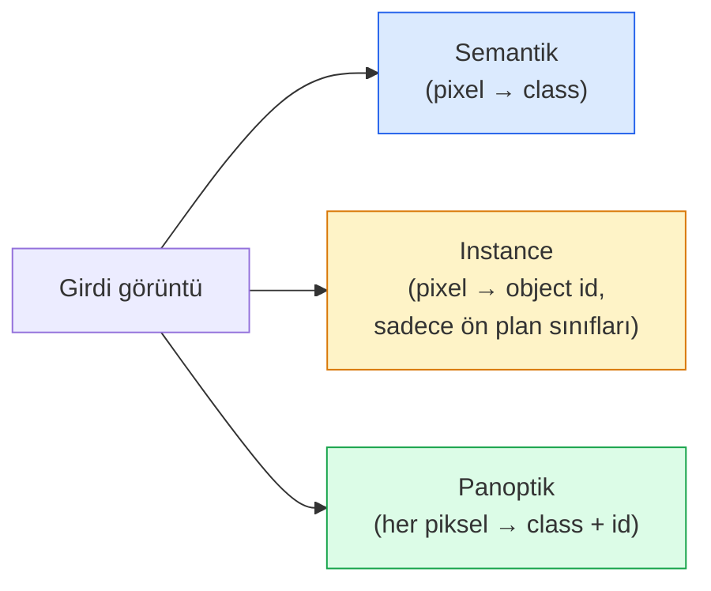
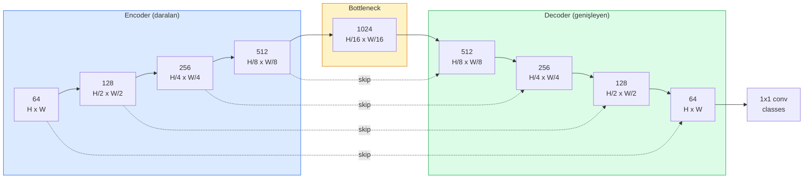

# Semantic Segmentation — U-Net

> Segmentation (bölütleme), her pikselde sınıflandırmadır. U-Net, bir altörnekleyici encoder (kodlayıcı) ile bir üstörnekleyici decoder (kod çözücü) eşleştirip aralarına skip connection (atlamalı bağlantı) ekleyerek bunu çalıştırır.

**Tür:** Build
**Diller:** Python
**Ön Koşullar:** Phase 4 Lesson 03 (CNNs), Phase 4 Lesson 04 (Image Classification)
**Süre:** ~75 dakika

## Öğrenme Hedefleri

- Semantik, instance ve panoptik segmentasyon arasındaki farkı ayırt etmek ve belirli bir problem için doğru görevi seçmek
- PyTorch'da encoder blokları, bir bottleneck (darboğaz), transpose convolution ile decoder ve skip connection'lardan oluşan bir U-Net'i sıfırdan inşa etmek
- Piksel bazlı cross-entropy, Dice loss (zar kaybı) ve bunların birleşiminden oluşan güncel medikal ve endüstriyel segmentasyon kaybını uygulamak
- Her sınıf için IoU ve Dice metriklerini okuyup kötü bir skorun küçük nesne hatırlamasından, sınır doğruluğundan mı yoksa sınıf dengesizliğinden mi kaynaklandığını teşhis etmek

## Problem

Sınıflandırma görüntü başına tek bir etiket üretir. Tespit, görüntü başına bir avuç kutu üretir. Segmentasyon ise piksel başına tek bir etiket üretir. `H x W` boyutundaki bir girdi için çıktı, `H x W` (semantik) veya `H x W x N_instances` (instance) şeklinde bir tensordur. Bu, görüntü başına bir değil milyonlarca tahmin demektir.

Segmentasyonun yapısı, onu neredeyse tüm yoğun tahmin (dense prediction) görüntü işleme ürünlerinin gücü haline getirir: tıbbi görüntüleme (tümör maskeleri), otonom sürüş (yol, şerit, engel), uydu görüntüleri (bina ayak izleri, mahsul sınırları), belge ayrıştırma (düzen bölgeleri), robotik (tutulabilir bölgeler). Bu görevlerin hiçbiri nesnenin etrafına bir kutu koyarak çözülemez; tam silüete ihtiyaç vardır.

Mimari problem ifade etmesi basit ama çözmesi basit değildir: ağın aynı anda görüntünün küresel bağlamını (bu nasıl bir sahne) ve yerel piksel ayrıntısını (hangi piksel yol, hangisi kaldırım) görmesi gerekir. Standart bir CNN, bağlam kazanmak için uzamsal olarak sıkıştırma yapar, bu da ayrıntıyı kaybeder. U-Net, ikisini de elde eden tasarımdı.

## Kavram

### Semantik vs instance vs panoptik



- **Semantik** "bu piksel yol, şu piksel araba" der. Yan yana iki araba tek bir leke halinde birleşir.
- **Instance** "bu piksel araba #3, şu piksel araba #5" der. Arka plan ögelerini ("stuff" = gökyüzü, yol, çimen) yok sayar.
- **Panoptik** ikisini birleştirir: her piksel bir sınıf etiketi alır, her örnek (instance) benzersiz bir id alır; "stuff" ve "things" (nesneler) birlikte segmentlenir.

Bu ders semantik segmentasyonu kapsar. Sonraki ders (Mask R-CNN) instance segmentasyonu kapsar.

### U-Net şekli



Encoder, uzamsal çözünürlüğü dört kez yarıya indirir ve kanal sayısını iki katına çıkarır. Decoder bunu tersine çevirir: uzamsal çözünürlüğü dört kez iki katına çıkarır ve kanalları yarıya indirir. Skip connection'lar, eşleşen encoder özelliklerini her çözünürlükte decoder özellikleriyle birleştirir (concat). Son 1x1 conv, `64 -> num_classes` dönüşümünü tam çözünürlükte yapar.

Skip connection'lar neden gereklidir: decoder, piksel seviyesinde tahmin üretmeye çalıştığında yalnızca küçük feature map'ler görmüştür. Skip'ler olmadan kenarları doğru lokalize edemez çünkü bu bilgi encoder'da sıkıştırılıp atılmıştır. Skip connection'lar, decoder'a encoder'ın aşağı inerken hesapladığı yüksek çözünürlüklü feature map'leri verir.

### Transpose convolution vs bilinear upsample

Decoder'ın uzamsal boyutları genişletmesi gerekir. İki seçenek:

- **Transpose convolution** (`nn.ConvTranspose2d`) — öğrenilebilir üstörnekleme (upsample). Tarihsel U-Net varsayılanı. Stride ve kernel boyutu eşit bölünmezse satranç tahtası (checkerboard) yapaylıkları üretebilir.
- **Bilinear upsample + 3x3 conv** — pürüzsüz üstörnekleme ardından bir conv. Daha az yapaylık, daha az parametre, artık modern varsayılan.

İkisi de kullanımda. İlk U-Net için bilinear daha güvenlidir.

### Piksel gridinde cross-entropy

C sınıflı semantik segmentasyonda model çıktısı `(N, C, H, W)` şeklindedir. Hedef (target) ise tamsayı sınıf ID'leriyle `(N, H, W)` şeklindedir. Cross-entropy, sınıflandırmadakiyle aynıdır, sadece her uzamsal konumda uygulanır:

```
Loss = (n, h, w) üzerinden ortalama -log( softmax(logits[n, :, h, w])[target[n, h, w]] )
```

PyTorch'taki `F.cross_entropy` bu şekli doğal olarak işler. Yeniden şekillendirme (reshape) gerekmez.

### Dice loss ve neden ihtiyacınız var

Cross-entropy her piksele eşit davranır. Bu, bir sınıf çerçeveye hâkim olduğunda yanlıştır (tıbbi görüntüleme: %99 arka plan, %1 tümör). Ağ her yere arka plan tahmin ederek %99 doğruluk alabilir ve yine de işe yaramaz olabilir.

Dice loss, tahmin edilen ve gerçek maske arasındaki örtüşmeyi doğrudan optimize ederek bunu çözer:

```
Dice(p, y) = 2 * sum(p * y) / (sum(p) + sum(y) + epsilon)
Dice_loss = 1 - Dice
```

burada `p` bir sınıf için sigmoid/softmax olasılık haritası ve `y` ikili ground-truth maskesidir. Kayıp yalnızca örtüşme mükemmel olduğunda sıfırdır. Oran tabanlı olduğu için sınıf dengesizliği önemsizdir.

Pratikte **birleşik kayıt** (combined loss) kullanılır:

```
L = L_cross_entropy + lambda * L_dice       (lambda ~ 1)
```

Cross-entropy eğitimin başlarında kararlı gradyanlar sağlar; Dice eğitimin son aşamalarını maske şeklini gerçekten eşleştirmeye odaklar. Bu kombinasyon tıbbi görüntüleme varsayılanıdır ve sınıf dengesizliği olan her veri kümesinde yenilmesi zordur.

### Değerlendirme metrikleri

- **Piksel doğruluğu (pixel accuracy)** — doğru tahmin edilen piksellerin yüzdesi. Ucuz. Dengesiz veride sınıflandırmadaki accuracy ile aynı nedenle bozuktur.
- **Sınıf başına IoU** — her sınıfın maskesi için kesişim-birleşim; sınıflar arası ortalama = mIoU.
- **Dice (piksel üzerinde F1)** — IoU'ya benzer; `Dice = 2 * IoU / (1 + IoU)`. Tıbbi görüntüleme Dice'ı tercih eder, sürüş topluluğu IoU'yu tercih eder; monotonik olarak ilişkilidirler.
- **Boundary F1** — tahmin edilen sınırların ground-truth sınırlarına ne kadar yakın olduğunu ölçer, küçük kaymaları bile cezalandırır. Yarı iletken denetimi gibi yüksek hassasiyetli görevler için önemlidir.

Yalnızca mIoU değil, sınıf başına IoU raporlayın. Ortalama IoU, dokuz sınıf %85'teyken bir sınıfın %15'te olmasını gizler.

### Girdi çözünürlüğü ödünleşimi

U-Net'in encoder'ı çözünürlüğü dört kez yarıya indirir, bu nedenle girdi 16'ya bölünebilir olmalıdır. Tıbbi görüntüler genellikle 512x512 veya 1024x1024'tür. Otonom sürüş kırpıntıları 2048x1024'tür. U-Net'in bellek maliyeti `H * W * C_max` ile ölçeklenir ve 1024x1024'te 1024 bottleneck kanalıyla ileri geçiş zaten gigabaytlarca VRAM kullanır.

İki standart geçici çözüm:
1. Girdiyi döşemelere böl (tile) — 256x256 döşemeleri örtüşmeyle işle ve birleştir.
2. Bottleneck'i, uzamsal çözünürlüğü daha yüksek tutan ancak receptive field'ı genişleten dilated convolution ile değiştir (DeepLab ailesi).

İlk model için, 64-kanal tabanlı bir U-Net ile 256x256 girdi, 8 GB VRAM'de rahatça eğitilir.

## İnşa Et

### Adım 1: Encoder bloğu

Batch norm ve ReLU ile iki adet 3x3 conv. İlk conv kanal sayısını değiştirir; ikincisi aynı tutar.

```python
import torch
import torch.nn as nn
import torch.nn.functional as F

class DoubleConv(nn.Module):
    def __init__(self, in_c, out_c):
        super().__init__()
        self.net = nn.Sequential(
            nn.Conv2d(in_c, out_c, kernel_size=3, padding=1, bias=False),
            nn.BatchNorm2d(out_c),
            nn.ReLU(inplace=True),
            nn.Conv2d(out_c, out_c, kernel_size=3, padding=1, bias=False),
            nn.BatchNorm2d(out_c),
            nn.ReLU(inplace=True),
        )

    def forward(self, x):
        return self.net(x)
```

#### Açıklama
Bu blok her yerde yeniden kullanılır. `bias=False` çünkü BN'nin beta parametresi bias'ı halleder.

### Adım 2: Aşağı ve yukarı blokları

```python
class Down(nn.Module):
    def __init__(self, in_c, out_c):
        super().__init__()
        self.net = nn.Sequential(
            nn.MaxPool2d(2),
            DoubleConv(in_c, out_c),
        )

    def forward(self, x):
        return self.net(x)


class Up(nn.Module):
    def __init__(self, in_c, out_c):
        super().__init__()
        self.up = nn.Upsample(scale_factor=2, mode="bilinear", align_corners=False)
        self.conv = DoubleConv(in_c, out_c)

    def forward(self, x, skip):
        x = self.up(x)
        if x.shape[-2:] != skip.shape[-2:]:
            x = F.interpolate(x, size=skip.shape[-2:], mode="bilinear", align_corners=False)
        x = torch.cat([skip, x], dim=1)
        return self.conv(x)
```

#### Açıklama
Uzamsal şekil kontrolü (`shape[-2:]`), boyutları 16'ya tam bölünmeyen girdileri işler; güvenli bir `F.interpolate`, birleştirmeden önce tensörü hizalar. Tam şekil karşılaştırması kanal sayısı farklılıklarını da tetiklerdi ki bu sessiz bir interpolate değil, yüksek sesli bir hata olmalıdır.

### Adım 3: U-Net

```python
class UNet(nn.Module):
    def __init__(self, in_channels=3, num_classes=2, base=64):
        super().__init__()
        self.inc = DoubleConv(in_channels, base)
        self.d1 = Down(base, base * 2)
        self.d2 = Down(base * 2, base * 4)
        self.d3 = Down(base * 4, base * 8)
        self.d4 = Down(base * 8, base * 16)
        self.u1 = Up(base * 16 + base * 8, base * 8)
        self.u2 = Up(base * 8 + base * 4, base * 4)
        self.u3 = Up(base * 4 + base * 2, base * 2)
        self.u4 = Up(base * 2 + base, base)
        self.outc = nn.Conv2d(base, num_classes, kernel_size=1)

    def forward(self, x):
        x1 = self.inc(x)
        x2 = self.d1(x1)
        x3 = self.d2(x2)
        x4 = self.d3(x3)
        x5 = self.d4(x4)
        x = self.u1(x5, x4)
        x = self.u2(x, x3)
        x = self.u3(x, x2)
        x = self.u4(x, x1)
        return self.outc(x)

net = UNet(in_channels=3, num_classes=2, base=32)
x = torch.randn(1, 3, 256, 256)
print(f"output: {net(x).shape}")
print(f"params: {sum(p.numel() for p in net.parameters()):,}")
```

#### Açıklama
Çıktı şekli `(1, 2, 256, 256)` — girdi ile aynı uzamsal boyut, `num_classes` kanal. `base=32` ile yaklaşık 7.7M parametre.

### Adım 4: Kayıp fonksiyonları

```python
def dice_loss(logits, targets, num_classes, eps=1e-6):
    probs = F.softmax(logits, dim=1)
    targets_one_hot = F.one_hot(targets, num_classes).permute(0, 3, 1, 2).float()
    dims = (0, 2, 3)
    intersection = (probs * targets_one_hot).sum(dim=dims)
    denom = probs.sum(dim=dims) + targets_one_hot.sum(dim=dims)
    dice = (2 * intersection + eps) / (denom + eps)
    return 1 - dice.mean()


def combined_loss(logits, targets, num_classes, lam=1.0):
    ce = F.cross_entropy(logits, targets)
    dc = dice_loss(logits, targets, num_classes)
    return ce + lam * dc, {"ce": ce.item(), "dice": dc.item()}
```

#### Açıklama
Dice her sınıf için ayrı hesaplanır ve ortalaması alınır (macro Dice). `eps`, grupta (batch) bulunmayan sınıflarda sıfıra bölmeyi önler.

### Adım 5: IoU metriği

```python
@torch.no_grad()
def iou_per_class(logits, targets, num_classes):
    preds = logits.argmax(dim=1)
    ious = torch.zeros(num_classes)
    for c in range(num_classes):
        pred_c = (preds == c)
        true_c = (targets == c)
        inter = (pred_c & true_c).sum().float()
        union = (pred_c | true_c).sum().float()
        ious[c] = (inter / union) if union > 0 else torch.tensor(float("nan"))
    return ious
```

#### Açıklama
Uzunluğu C olan bir vektör döndürür. `nan`, grupta bulunmayan sınıfları işaretler — mIoU hesaplarken bunların üzerinden ortalama almayın.

### Adım 6: Uçtan uca doğrulama için sentetik veri kümesi

Ağın piksel rengini değil şekli öğrenmesi için renkli arka planlarda şekiller oluşturun.

```python
import numpy as np
from torch.utils.data import Dataset, DataLoader

def synthetic_segmentation(num_samples=200, size=64, seed=0):
    rng = np.random.default_rng(seed)
    images = np.zeros((num_samples, size, size, 3), dtype=np.float32)
    masks = np.zeros((num_samples, size, size), dtype=np.int64)
    for i in range(num_samples):
        bg = rng.uniform(0, 1, (3,))
        images[i] = bg
        masks[i] = 0
        num_shapes = rng.integers(1, 4)
        for _ in range(num_shapes):
            cls = int(rng.integers(1, 3))
            color = rng.uniform(0, 1, (3,))
            cx, cy = rng.integers(10, size - 10, size=2)
            r = int(rng.integers(4, 12))
            yy, xx = np.meshgrid(np.arange(size), np.arange(size), indexing="ij")
            if cls == 1:
                mask = (xx - cx) ** 2 + (yy - cy) ** 2 < r ** 2
            else:
                mask = (np.abs(xx - cx) < r) & (np.abs(yy - cy) < r)
            images[i][mask] = color
            masks[i][mask] = cls
        images[i] += rng.normal(0, 0.02, images[i].shape)
        images[i] = np.clip(images[i], 0, 1)
    return images, masks


class SegDataset(Dataset):
    def __init__(self, images, masks):
        self.images = images
        self.masks = masks

    def __len__(self):
        return len(self.images)

    def __getitem__(self, i):
        img = torch.from_numpy(self.images[i]).permute(2, 0, 1).float()
        mask = torch.from_numpy(self.masks[i]).long()
        return img, mask
```

#### Açıklama
Üç sınıf: arka plan (0), daireler (1), kareler (2). Ağ şekilleri ayırt etmeyi öğrenmelidir.

### Adım 7: Eğitim döngüsü

```python
def train_one_epoch(model, loader, optimizer, device, num_classes):
    model.train()
    loss_sum, total = 0.0, 0
    iou_sum = torch.zeros(num_classes)
    for x, y in loader:
        x, y = x.to(device), y.to(device)
        logits = model(x)
        loss, _ = combined_loss(logits, y, num_classes)
        optimizer.zero_grad()
        loss.backward()
        optimizer.step()
        loss_sum += loss.item() * x.size(0)
        total += x.size(0)
        iou_sum += iou_per_class(logits, y, num_classes).nan_to_num(0)
    return loss_sum / total, iou_sum / len(loader)
```

#### Açıklama
Sentetik veri kümesinde 10-30 epoch çalıştırın ve şekil sınıfları için mIoU'nun 0.9'un üzerine çıktığını izleyin. `nan_to_num(0)` grupta olmayan sınıfları sıfır olarak işler; doğru sınıf başına IoU için, varlığa göre maskeleyin ve burada ortalama almak yerine değerlendirme zamanında gruplar arasında `torch.nanmean` kullanın.

## Kullan

Üretim için `segmentation_models_pytorch` ("smp"), her standart segmentasyon mimarisini herhangi bir torchvision veya timm backbone ile sarar. Üç satır:

```python
import segmentation_models_pytorch as smp

model = smp.Unet(
    encoder_name="resnet34",
    encoder_weights="imagenet",
    in_channels=3,
    classes=3,
)
```

#### Açıklama
Gerçek işlerde bilinmesi gereken diğer mimariler:
- **DeepLabV3+** maks-pool tabanlı altörneklemeyi dilated conv ile değiştirir, böylece bottleneck çözünürlüğü korur; uydu ve sürüş verilerinde daha hızlı sınırlar.
- **SegFormer** conv encoder'ı hiyerarşik bir transformer ile değiştirir; birçok benchmark'ta güncel SOTA.
- **Mask2Former** / **OneFormer** semantik, instance ve panoptik segmentasyonu tek bir mimaride birleştirir.

Üçü de `smp` veya `transformers` içinde aynı veri yükleyiciyle değiştirilebilir.

## Çıktılar

Bu ders şunları üretir:

- `outputs/prompt-segmentation-task-picker.md` — belirli bir görev için semantik, instance ve panoptik segmentasyon arasında seçim yapan ve mimariyi belirleyen bir prompt.
- `outputs/skill-segmentation-mask-inspector.md` — sınıf dağılımını, tahmin edilen maske istatistiklerini ve az tahmin edilen veya sınırları bulanık olan sınıfları raporlayan bir skill.

## Alıştırmalar

1. **(Kolay)** İkili segmentasyon görevi (ön plan vs arka plan) için `bce_dice_loss` uygulayın. Sentetik iki sınıflı bir veri kümesinde, ön plan piksel oranı %5 olduğunda birleşik kaybın tek başına BCE'den daha hızlı yakınsadığını doğrulayın.
2. **(Orta)** `nn.Upsample + conv` yukarı bloğunu `nn.ConvTranspose2d` yukarı bloğu ile değiştirin. İkisini de sentetik veri kümesinde eğitin ve mIoU'yu karşılaştırın. Transpose conv versiyonunda satranç tahtası yapaylıklarının nerede göründüğünü gözlemleyin.
3. **(Zor)** Gerçek bir segmentasyon veri kümesi alın (Oxford-IIIT Pets, Cityscapes mini split veya bir tıbbi alt küme) ve U-Net'i `smp.Unet` referansının 2 IoU puanı yakınına kadar eğitin. Sınıf başına IoU raporlayın ve hangi sınıfların Dice kaybını eklemekten en çok fayda gördüğünü belirleyin.

## Anahtar Terimler

| Terim | Ne denir | Gerçek anlamı |
|-------|----------|---------------|
| Semantic segmentation | "Her pikseli etiketle" | C sınıfa piksel bazlı sınıflandırma; aynı sınıfın örnekleri birleşir |
| Instance segmentation | "Her nesneyi etiketle" | Aynı sınıfın farklı örneklerini ayırır; yalnızca ön plan |
| Panoptic segmentation | "Semantik + instance" | Her piksel bir sınıf alır; her şey/nesne örneği benzersiz bir id alır |
| Skip connection | "U-Net köprüsü" | Encoder özelliklerinin eşleşen çözünürlükteki decoder özellikleriyle birleştirilmesi; yüksek frekanslı ayrıntıyı korur |
| Transposed conv | "Deconvolution" | Öğrenilebilir üstörnekleme; satranç tahtası yapaylıkları üretebilir |
| Dice loss | "Örtüşme kaybı" | 1 - 2|A ∩ B| / (|A| + |B|); maske örtüşmesini doğrudan optimize eder ve sınıf dengesizliğine karşı dayanıklıdır |
| mIoU | "Ortalama kesişim-birleşim" | Sınıflar arasında ortalama IoU; segmentasyon için topluluk standardı metrik |
| Boundary F1 | "Sınır doğruluğu" | Yalnızca sınır piksellerinde hesaplanan F1 skoru; hassasiyet kritik görevler için önemlidir |

## Daha Fazla Okuma

- [U-Net: Convolutional Networks for Biomedical Image Segmentation (Ronneberger et al., 2015)](https://arxiv.org/abs/1505.04597) — orijinal makale; herkesin kopyaladığı şekil sayfa 2'de
- [Fully Convolutional Networks (Long et al., 2015)](https://arxiv.org/abs/1411.4038) — segmentasyonu ilk kez uçtan uca bir conv problemi haline getiren makale
- [segmentation_models_pytorch](https://github.com/qubvel/segmentation_models.pytorch) — üretim segmentasyonu için referans; her standart mimari artı her standart kayıp
- [Lessons learned from training SOTA segmentation (kaggle.com competitions)](https://www.kaggle.com/code/iafoss/carvana-unet-pytorch) — gerçek veride TTA, pseudo-labeling ve sınıf ağırlıklarının neden önemli olduğuna dair bir rehber
