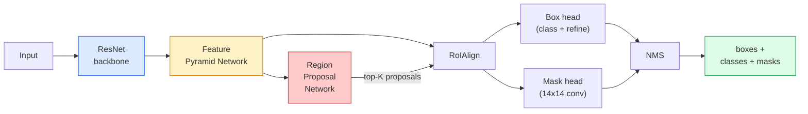

# Instance Segmentation — Mask R-CNN

> Bir Faster R-CNN dedektörüne küçük bir mask branch (maske dalı) ekleyin, instance segmentation (örnek bölütleme) elde edin. Zor kısım RoIAlign'tir ve göründüğünden daha zordur.

**Tür:** Build + Learn
**Diller:** Python
**Ön Koşullar:** Phase 4 Lesson 06 (YOLO), Phase 4 Lesson 07 (U-Net)
**Süre:** ~75 dakika

## Öğrenme Hedefleri

- Mask R-CNN mimarisini uçtan uca izlemek: backbone, FPN, RPN, RoIAlign, box head, mask head
- RoIAlign'i sıfırdan uygulamak ve RoIPool'ün neden artık kullanılmadığını açıklamak
- Torchvision'un `maskrcnn_resnet50_fpn_v2` önceden eğitilmiş modelini üretim kalitesinde instance maskeleri için kullanmak ve çıktı formatını doğru okumak
- Küçük özel bir veri kümesinde, box ve mask head'leri değiştirip backbone'u donuk (frozen) tutarak Mask R-CNN'i ince ayar (fine-tune) yapmak

## Problem

Semantik segmentasyon size sınıf başına tek bir maske verir. Instance segmentasyon size nesne başına bir maske verir — iki nesne aynı sınıfı paylaştığında bile. Bireyleri saymak, kareler arasında takip etmek ve ölçüm yapmak (bir duvardaki her tuğlanın sınırlayıcı kutusu, mikroskop görüntüsündeki her hücre) instance segmentasyon gerektirir.

Mask R-CNN (He ve ark., 2017), instance segmentasyonu tespit-artı-maske (detection-plus-a-mask) olarak yeniden çerçeveleyerek bu sorunu çözdü. Tasarım o kadar temizdi ki sonraki beş yıl boyunca neredeyse her instance segmentasyon makalesi bir Mask R-CNN varyantıydı ve torchvision uygulaması, küçük ve orta boy veri kümeleri için hâlâ üretim varsayılanıdır.

Zor mühendislik problemi örneklemedir (sampling): köşeleri piksel sınırlarıyla hizalanmayan bir öneri kutusundan (proposal box) sabit boyutlu bir feature bölgesini nasıl kırparsınız? Bunu yanlış yapmak her yerde bir mAP noktasının onda birine mal olur. RoIAlign cevaptır.

## Kavram

### Mimari



Anlaşılması gereken beş parça:

1. **Backbone** — ImageNet'te eğitilmiş ResNet-50 veya ResNet-101. 4, 8, 16, 32 stride'larında hiyerarşik feature map'ler üretir.
2. **FPN (Feature Pyramid Network)** — yukarıdan aşağı (top-down) + yanal (lateral) bağlantılar; her seviyeye C kanal semantik açıdan zengin özellik verir. Tespit, nesne boyutuyla eşleşen FPN seviyesini sorgular.
3. **RPN (Region Proposal Network)** — her anchor konumunda "burada bir nesne var mı?" ve "kutuyu nasıl iyileştiririm?" tahminini yapan küçük bir conv head. Görüntü başına ~1000 öneri üretir.
4. **RoIAlign** — herhangi bir kutudan herhangi bir FPN seviyesinde sabit boyutlu (örn. 7x7) bir feature yaması örnekler. Bilineer örnekleme, nicemleme (quantisation) yok.
5. **Head'ler** — kutuyu iyileştiren ve sınıf seçen iki katmanlı box head; artı her öneri için `28x28` ikili maske üreten küçük bir conv head.

### Neden RoIAlign, RoIPool değil

Orijinal Fast R-CNN, RoIPool kullanıyordu: bir öneri kutusunu bir ızgaraya böler, her hücredeki maksimum özelliği alır ve tüm koordinatları tam sayıya yuvarlar. Bu yuvarlama, feature map ile girdi piksel koordinatları arasında bir tam feature map pikseline kadar kaymaya neden olur — 224x224 görüntüde küçük, feature map stride 32 olduğunda felaket.

```
RoIPool:
  kutu (34.7, 51.3, 98.2, 142.9)
  yuvarla -> (34, 51, 98, 142)
  ızgarayı böl -> her hücre sınırını yuvarla
  hizalama hatası her adımda birikir

RoIAlign:
  kutu (34.7, 51.3, 98.2, 142.9)
  bilineer interpolasyon kullanarak tam ondalık koordinatlarda örnekle
  hiçbir yerde yuvarlama yok
```

RoIAlign, COCO'da maske AP'sini bedavaya 3-4 puan yükseltir. Lokalizasyonu önemseyen her dedektör artık bunu kullanır — YOLOv7 seg, RT-DETR, Mask2Former hepsi aynı.

### RPN tek paragrafta

Bir feature map'in her konumuna, farklı boyut ve şekillerde K anchor kutusu yerleştirin. Her anchor için bir objectness skoru ve anchor'u daha iyi oturan bir kutuya dönüştürmek için bir regresyon farkı (offset) tahmin edin. Skora göre en iyi ~1.000 kutuyu tutun, IoU 0.7'de NMS uygulayın ve sağ kalanları head'lere verin. RPN, kendi mini kaybıyla eğitilir — Ders 6'daki YOLO kaybıyla aynı yapı, sadece iki sınıflı (nesne / nesne yok).

### Mask head

Her öneri için (RoIAlign sonrası) mask head, küçük bir FCN'dir: dört adet 3x3 conv, bir adet 2x deconv, `28x28` çözünürlükte `num_classes` çıktı kanalı üreten son bir 1x1 conv. Yalnızca tahmin edilen sınıfa karşılık gelen kanal tutulur; diğerleri yok sayılır. Bu, maske tahminini sınıflandırmadan ayırır (decouple).

28x28 maskeyi, önerinin orijinal piksel boyutuna üst örnekleyerek nihai ikili maskeyi üretin.

### Kayıplar

Mask R-CNN'nin birlikte toplanan dört kaybı vardır:

```
L = L_rpn_cls + L_rpn_box + L_box_cls + L_box_reg + L_mask
```

- `L_rpn_cls`, `L_rpn_box` — RPN önerileri için objectness + kutu regresyonu.
- `L_box_cls` — head'in sınıflandırıcısının (C+1) sınıf (arka plan dahil) üzerinden cross-entropy'si.
- `L_box_reg` — head'in kutu iyileştirmesi için smooth L1.
- `L_mask` — 28x28 maske çıktısında piksel başına ikili cross-entropy.

Her kaybın kendi varsayılan ağırlığı vardır; torchvision uygulaması bunları constructor argümanları olarak sunar.

### Çıktı formatı

`torchvision.models.detection.maskrcnn_resnet50_fpn_v2`, görüntü başına bir tane olmak üzere sözlüklerden oluşan bir liste döndürür:

```
{
    "boxes":  (N, 4) piksel koordinatlarında (x1, y1, x2, y2),
    "labels": (N,) sınıf ID'leri, 0 = arka plan, indeksler 1-tabanlı,
    "scores": (N,) güven skorları,
    "masks":  (N, 1, H, W) [0, 1] aralığında ondalık maskeler — ikili için 0.5 eşiği,
}
```

Maske zaten tam görüntü çözünürlüğündedir. 28x28 head çıktısı dahili olarak üstörneklenmiştir.

## İnşa Et

### Adım 1: Sıfırdan RoIAlign

Bu, Mask R-CNN'nin kod olarak anlaşılması düz yazıdan daha kolay olan bileşenidir.

```python
import torch
import torch.nn.functional as F

def roi_align_single(feature, box, output_size=7, spatial_scale=1 / 16.0):
    """
    feature: (C, H, W) tek görüntülü feature map
    box: orijinal görüntü piksel koordinatlarında (x1, y1, x2, y2)
    output_size: çıktı ızgarasının kenar uzunluğu (box head için 7, mask head için 14)
    spatial_scale: feature map stride'ının tersi
    """
    C, H, W = feature.shape
    x1, y1, x2, y2 = [c * spatial_scale - 0.5 for c in box]
    bin_w = (x2 - x1) / output_size
    bin_h = (y2 - y1) / output_size

    grid_y = torch.linspace(y1 + bin_h / 2, y2 - bin_h / 2, output_size)
    grid_x = torch.linspace(x1 + bin_w / 2, x2 - bin_w / 2, output_size)
    yy, xx = torch.meshgrid(grid_y, grid_x, indexing="ij")

    gx = 2 * (xx + 0.5) / W - 1
    gy = 2 * (yy + 0.5) / H - 1
    grid = torch.stack([gx, gy], dim=-1).unsqueeze(0)
    sampled = F.grid_sample(feature.unsqueeze(0), grid, mode="bilinear",
                            align_corners=False)
    return sampled.squeeze(0)
```

#### Açıklama
Her sayı, bilineer olarak örneklenmiş bir konumdadır. Yuvarlama, nicemleme veya düşen gradyan (dropped gradient) yok.

### Adım 2: Torchvision'un RoIAlign'i ile karşılaştırma

```python
from torchvision.ops import roi_align

feature = torch.randn(1, 16, 50, 50)
boxes = torch.tensor([[0, 10, 20, 100, 90]], dtype=torch.float32)  # (batch_idx, x1, y1, x2, y2)

ours = roi_align_single(feature[0], boxes[0, 1:].tolist(), output_size=7, spatial_scale=1/4)
theirs = roi_align(feature, boxes, output_size=(7, 7), spatial_scale=1/4, sampling_ratio=1, aligned=True)[0]

print(f"shape ours:   {tuple(ours.shape)}")
print(f"shape theirs: {tuple(theirs.shape)}")
print(f"max|diff|:    {(ours - theirs).abs().max().item():.3e}")
```

#### Açıklama
`sampling_ratio=1` ve `aligned=True` ile ikisi `1e-5` hassasiyetinde eşleşir.

### Adım 3: Önceden eğitilmiş bir Mask R-CNN yükleme

```python
import torch
from torchvision.models.detection import maskrcnn_resnet50_fpn_v2, MaskRCNN_ResNet50_FPN_V2_Weights

model = maskrcnn_resnet50_fpn_v2(weights=MaskRCNN_ResNet50_FPN_V2_Weights.DEFAULT)
model.eval()
print(f"params: {sum(p.numel() for p in model.parameters()):,}")
print(f"classes (including background): {len(model.roi_heads.box_predictor.cls_score.out_features * [0])}")
```

#### Açıklama
46M parametre, 91 sınıf (COCO). İlk sınıf (id 0) arka plandır; modelin gerçekten tespit ettiği her şey id 1'den başlar.

### Adım 4: Çıkarım çalıştırma

```python
with torch.no_grad():
    x = torch.randn(3, 400, 600)
    predictions = model([x])
p = predictions[0]
print(f"boxes:  {tuple(p['boxes'].shape)}")
print(f"labels: {tuple(p['labels'].shape)}")
print(f"scores: {tuple(p['scores'].shape)}")
print(f"masks:  {tuple(p['masks'].shape)}")
```

#### Açıklama
Maske tensoru `(N, 1, H, W)` şeklindedir. Nesne başına ikili maske elde etmek için 0.5 eşiği:

```python
binary_masks = (p['masks'] > 0.5).squeeze(1)  # (N, H, W) boolean
```

### Adım 5: Özel sınıf sayısı için head'leri değiştirme

Yaygın ince ayar tarifi: backbone, FPN ve RPN'yi yeniden kullan; iki sınıflandırıcı head'i değiştir.

```python
from torchvision.models.detection.faster_rcnn import FastRCNNPredictor
from torchvision.models.detection.mask_rcnn import MaskRCNNPredictor

def build_custom_maskrcnn(num_classes):
    model = maskrcnn_resnet50_fpn_v2(weights=MaskRCNN_ResNet50_FPN_V2_Weights.DEFAULT)
    in_features = model.roi_heads.box_predictor.cls_score.in_features
    model.roi_heads.box_predictor = FastRCNNPredictor(in_features, num_classes)
    in_features_mask = model.roi_heads.mask_predictor.conv5_mask.in_channels
    hidden_layer = 256
    model.roi_heads.mask_predictor = MaskRCNNPredictor(in_features_mask, hidden_layer, num_classes)
    return model

custom = build_custom_maskrcnn(num_classes=5)
print(f"custom cls_score.out_features: {custom.roi_heads.box_predictor.cls_score.out_features}")
```

#### Açıklama
`num_classes` arka plan sınıfını da içermelidir; yani 4 nesne sınıfı olan bir veri kümesi `num_classes=5` kullanır.

### Adım 6: Eğitilmesi gerekmeyenleri dondurma

Küçük veri kümelerinde backbone ve FPN'yi dondurun. Yalnızca RPN objectness + regresyonu ve iki head öğrenir.

```python
def freeze_backbone_and_fpn(model):
    # torchvision Mask R-CNN, FPN'yi `model.backbone` içinde barındırır
    # (`model.backbone.fpn` olarak), bu nedenle `model.backbone.parameters()` üzerinde
    # döngü yapmak hem ResNet özellik katmanlarını hem de FPN yanal/çıktı conv'lerini kapsar.
    for p in model.backbone.parameters():
        p.requires_grad = False
    return model

custom = freeze_backbone_and_fpn(custom)
trainable = sum(p.numel() for p in custom.parameters() if p.requires_grad)
print(f"trainable after freeze: {trainable:,}")
```

#### Açıklama
500 görüntülük veri kümelerinde bu, yakınsama ile aşırı öğrenme (overfitting) arasındaki farktır.

## Kullan

Torchvision'da Mask R-CNN için tam eğitim döngüsü 40 satırdır ve görevler arasında anlamlı şekilde değişmez — veri kümesini değiştirin ve çalıştırın.

```python
def train_step(model, images, targets, optimizer):
    model.train()
    loss_dict = model(images, targets)
    losses = sum(loss for loss in loss_dict.values())
    optimizer.zero_grad()
    losses.backward()
    optimizer.step()
    return {k: v.item() for k, v in loss_dict.items()}
```

#### Açıklama
`targets` listesi, görüntü başına `boxes`, `labels` ve `masks` (sayısal değer olarak `(num_instances, H, W)` ikili tensorlar) içeren sözlükler içermelidir. Model, eğitim sırasında dört kaybı olan bir sözlük ve değerlendirme sırasında `model.training` anahtarına göre bir tahmin listesi döndürür.

`pycocotools` değerlendiricisi, hem kutular hem de maskeler için mAP@IoU=0.5:0.95 üretir; box head'in mi yoksa mask head'in mi darboğaz olduğunu bilmek için her iki sayıya da ihtiyacınız vardır.

## Çıktılar

Bu ders şunları üretir:

- `outputs/prompt-instance-vs-semantic-router.md` — üç soru soran ve instance vs semantic vs panoptik arasında seçim yapıp başlanacak tam modeli belirleyen bir prompt.
- `outputs/skill-mask-rcnn-head-swapper.md` — yeni `num_classes` verildiğinde, herhangi bir torchvision tespit modelinde head'leri değiştirmek için gereken 10 satır kodu üreten bir skill.

## Alıştırmalar

1. **(Kolay)** RoIAlign'inizi 100 rastgele kutuda `torchvision.ops.roi_align` ile doğrulayın. Maksimum mutlak farkı raporlayın. Ayrıca RoIPool'ü (2017 öncesi davranış) çalıştırın ve sınıra yakın kutularda ~1-2 feature map pikseli kadar saptığını gösterin.
2. **(Orta)** `maskrcnn_resnet50_fpn_v2`'yi 50 görüntülük özel bir veri kümesinde (herhangi iki sınıf: balon, balık, çukur, logo) ince ayar yapın. Backbone'u dondurun, 20 epoch eğitin, mask AP@0.5 raporlayın.
3. **(Zor)** Mask R-CNN'in mask head'ini 28x28 yerine 56x56 tahmin edecek şekilde değiştirin. mAP@IoU=0.75'i öncesi ve sonrası ölçün. Kazancın (veya kazanç olmamasının) beklenen sınır hassasiyeti / bellek ödünleşimiyle neden eşleştiğini açıklayın.

## Anahtar Terimler

| Terim | Ne denir | Gerçek anlamı |
|-------|----------|---------------|
| Mask R-CNN | "Tespit artı maskeler" | Faster R-CNN + her öneri ve sınıf için 28x28 maske tahmin eden küçük bir FCN head |
| FPN | "Özellik piramidi" | Her stride seviyesine C kanal semantik zengin özellik veren yukarıdan aşağı + yanal bağlantılar |
| RPN | "Bölge önericisi" | Görüntü başına ~1000 nesne/nesne-yok önerisi üreten küçük bir conv head |
| RoIAlign | "Yuvarlamasız kırpma" | Herhangi bir ondalık koordinatlı kutudan sabit boyutlu bir feature ızgarasını bilineer örnekleyen yöntem |
| RoIPool | "2017 öncesi kırpma" | RoIAlign ile aynı amaç ancak kutu koordinatlarını yuvarlar; günümüzde kullanılmaz |
| Mask AP | "Instance mAP" | Kutu IoU yerine maske IoU ile hesaplanan ortalama precision; COCO instance segmentasyon metriği |
| Binary mask head | "Sınıf başına maske" | Her öneri için sınıf başına bir ikili maske tahmin eder; yalnızca tahmin edilen sınıfın kanalı tutulur |
| Background class | "Sınıf 0" | "Nesne yok" yakalayıcı sınıf; gerçek sınıfların indeksleri 1'den başlar |

## Daha Fazla Okuma

- [Mask R-CNN (He et al., 2017)](https://arxiv.org/abs/1703.06870) — makale; RoIAlign ile ilgili 3. bölüm kritik okumadır
- [FPN: Feature Pyramid Networks (Lin et al., 2017)](https://arxiv.org/abs/1612.03144) — FPN makalesi; her modern dedektör bunu kullanır
- [torchvision Mask R-CNN tutorial](https://pytorch.org/tutorials/intermediate/torchvision_tutorial.html) — ince ayar döngüsü için referans
- [Detectron2 model zoo](https://github.com/facebookresearch/detectron2/blob/main/MODEL_ZOO.md) — neredeyse her tespit ve segmentasyon varyantı için eğitilmiş ağırlıklarla üretim uygulamaları
