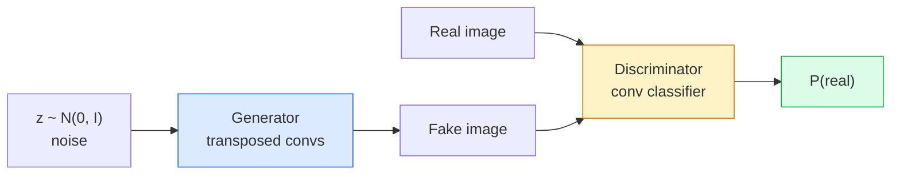
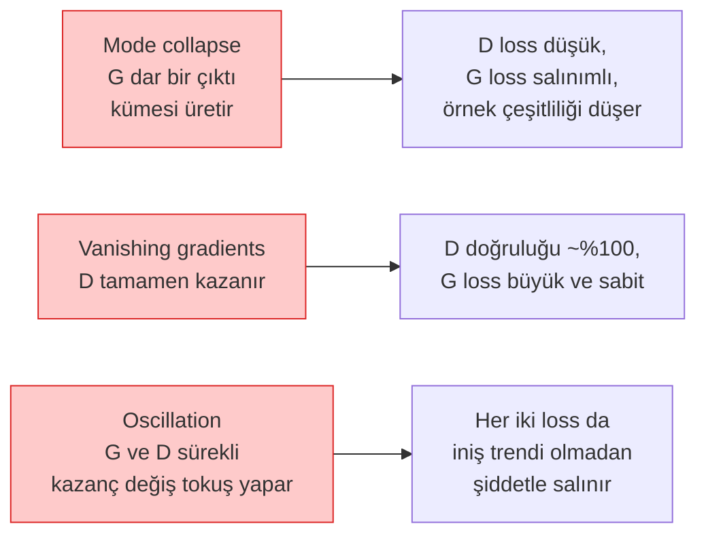

# Image Generation — GANs

> Bir GAN, sabit bir oyundaki iki sinir ağıdır. Biri çizer, biri eleştirir. Çizimler eleştirmeni kandırana kadar birlikte gelişirler.

**Tür:** Build
**Diller:** Python
**Ön Koşullar:** Phase 4 Lesson 03 (CNNs), Phase 3 Lesson 06 (Optimizers), Phase 3 Lesson 07 (Regularization)
**Süre:** ~75 dakika

## Öğrenme Hedefleri

- Generator (üretici) ve discriminator (ayırt edici) arasındaki minimax oyununu ve dengenin neden p_model = p_data'ya karşılık geldiğini açıklamak
- PyTorch'da bir DCGAN uygulamak ve 60 satırın altında tutarlı 32x32 sentetik görüntüler üretmesini sağlamak
- GAN eğitimini üç standart teknikle stabilize etmek: non-saturating loss, spectral norm, TTUR (two-timescale update rule)
- Sağlıklı yakınsamayı mode collapse (kip çökmesi), salınım (oscillation) ve discriminator-kesin-kazanır durumlarından ayırt eden eğitim eğrilerini okumak

## Problem

Sınıflandırma bir ağa görüntüleri etiketlere eşlemeyi öğretir. Üretim (generation) sorunu tersine çevirir: aynı dağılımdan gelmiş gibi görünen yeni görüntüler örnekle. Fark alabileceğiniz "doğru" bir çıktı yoktur; yalnızca taklit etmek istediğiniz bir dağılım vardır.

Standart kayıp fonksiyonları (MSE, cross-entropy) "bu örnek gerçek dağılımdan mı geldi" sorusunu ölçemez. Piksel bazında hata enküçüklemek gerçekçi örnekler değil, bulanık ortalamalar üretir. Çığır açan fikir, kaybı öğrenmekti: gerçeği sahteden ayırmakla görevli ikinci bir ağ eğitin ve generator'u itmek için onun yargısını kullanın.

GAN'lar (Goodfellow ve ark., 2014) bu çerçeveyi tanımladı. 2018'de StyleGAN, fotoğraflardan ayırt edilemeyen 1024x1024 yüzler üretiyordu. Diffusion modelleri o zamandan beri kalite ve kontrol edilebilirlik açısından tahtı devraldı, ancak diffusion'ı pratik kılan her numara — normalizasyon seçimleri, latent space (gizli uzay), feature loss'ları — ilk olarak GAN'larda anlaşıldı.

## Kavram

### İki ağ



**Generator** G, bir gürültü (noise) vektörü `z` alır ve bir görüntü üretir. **Discriminator** D, bir görüntü alır ve tek bir skaler çıktı üretir: görüntünün gerçek olma olasılığı.

### Oyun

G, D'nin yanılmasını ister. D ise doğru olmayı ister. Biçimsel olarak:

```
min_G max_D  E_x[log D(x)] + E_z[log(1 - D(G(z)))]
```

Sağdan sola okuyun: D, gerçek (`log D(gerçek)`) ve sahte (`log (1 - D(sahte))`) görüntülerdeki doğruluğu maksimize ediyor. G, sahtelerde D'nin doğruluğunu minimize ediyor — `D(G(z))`'nin yüksek olmasını istiyor.

Goodfellow, bu minimax oyununun `p_G = p_data` olduğu, D'nin her yerde 0.5 verdiği ve üretilen ile gerçek dağılımlar arasındaki Jensen-Shannon ıraksamasının (divergence) sıfır olduğu küresel bir denge noktasına sahip olduğunu kanıtladı. Zor kısım oraya ulaşmaktır.

### Non-saturating loss

Yukarıdaki form sayısal olarak kararsızdır. Eğitimin başlarında, her sahte için `D(G(z))` sıfıra yakındır, bu nedenle `log(1 - D(G(z)))` G'ye göre sönümlenen gradyanlara (vanishing gradients) sahiptir. Çözüm: G'nin kaybını tersine çevirin.

```
L_D = -E_x[log D(x)] - E_z[log(1 - D(G(z)))]
L_G = -E_z[log D(G(z))]                          # non-saturating
```

Şimdi `D(G(z))` sıfıra yakın olduğunda, G'nin kaybı büyüktür ve gradyanı bilgilendiricidir. Her modern GAN bu varyantla eğitilir.

### DCGAN mimari kuralları

Radford, Metz, Chintala (2015), yıllarca süren başarısız deneyleri GAN eğitimini kararlı kılan beş kuralda damıttı:

1. Havuzlamayı (pooling) stride'lı conv'lerle değiştirin (her iki ağda).
2. Her iki ağda da batch norm kullanın, ancak G'nin çıktısı ve D'nin girdisi hariç.
3. Daha derin mimarilerde tam bağlı (fully connected) katmanları kaldırın.
4. G, çıktı hariç tüm katmanlarda ReLU kullanır (çıktıda [-1, 1] için tanh).
5. D, tüm katmanlarda LeakyReLU (negative_slope=0.2) kullanır.

Her modern conv tabanlı GAN (StyleGAN, BigGAN, GigaGAN) hâlâ bu kurallardan başlar ve parçaları tek tek değiştirir.

### Başarısızlık modları ve işaretleri



- **Mode collapse (kip çökmesi)**: G, D'yi kandıran bir görüntü bulur ve yalnızca onu üretir. Çözüm: minibatch discrimination, spectral norm veya label-conditioning ekleyin.
- **Discriminator kazanır**: D çok hızlı çok güçlü hale gelir, G'nin gradyanları kaybolur. Çözüm: daha küçük D, daha düşük D öğrenme oranı veya gerçek etiketlerde label smoothing uygulayın.
- **Oscillation (salınım)**: İki ağ dengeye hiç yaklaşmadan kazanç değiş tokuşu yapar. Çözüm: TTUR (D, G'den 2-4 kat daha hızlı öğrenir) veya Wasserstein loss'a geçin.

### Değerlendirme

GAN'ların ground truth'u yoktur, peki çalıştıklarını nasıl anlarsınız?

- **Örnek incelemesi** — her epok sonunda 64 örneğe bakın. Pazarlık konusu değil.
- **FID (Fréchet Inception Distance)** — Inception-v3 özellik dağılımlarının gerçek ve üretilen kümeler arasındaki mesafesi. Düşük daha iyidir. Topluluk standardı.
- **Inception Score** — daha eski, daha kırılgan; FID tercih edilir.
- **Üretici modeller için Precision/Recall** — kaliteyi (precision) ve kapsamı (recall) ayrı ayrı ölçer. Tek başına FID'den daha bilgilendiricidir.

Küçük bir sentetik veri çalıştırması için örnek incelemesi yeterlidir.

## İnşa Et

### Adım 1: Generator

64 boyutlu gürültü alan ve 32x32 görüntü üreten küçük bir DCGAN generator'u.

```python
import torch
import torch.nn as nn

class Generator(nn.Module):
    def __init__(self, z_dim=64, img_channels=3, feat=64):
        super().__init__()
        self.net = nn.Sequential(
            nn.ConvTranspose2d(z_dim, feat * 4, kernel_size=4, stride=1, padding=0, bias=False),
            nn.BatchNorm2d(feat * 4),
            nn.ReLU(inplace=True),
            nn.ConvTranspose2d(feat * 4, feat * 2, kernel_size=4, stride=2, padding=1, bias=False),
            nn.BatchNorm2d(feat * 2),
            nn.ReLU(inplace=True),
            nn.ConvTranspose2d(feat * 2, feat, kernel_size=4, stride=2, padding=1, bias=False),
            nn.BatchNorm2d(feat),
            nn.ReLU(inplace=True),
            nn.ConvTranspose2d(feat, img_channels, kernel_size=4, stride=2, padding=1, bias=False),
            nn.Tanh(),
        )

    def forward(self, z):
        return self.net(z.view(z.size(0), -1, 1, 1))
```

#### Açıklama
Her biri `kernel_size=4, stride=2, padding=1` ile dört transpose convolution; bu sayede uzamsal boyutu temizce iki katına çıkarırlar. Tanh ile [-1, 1] aralığında çıktı aktivasyonları.

### Adım 2: Discriminator

Generator'un ayna görüntüsü. LeakyReLU, stride'lı conv'ler, sonunda skaler bir logit.

```python
class Discriminator(nn.Module):
    def __init__(self, img_channels=3, feat=64):
        super().__init__()
        self.net = nn.Sequential(
            nn.Conv2d(img_channels, feat, kernel_size=4, stride=2, padding=1),
            nn.LeakyReLU(0.2, inplace=True),
            nn.Conv2d(feat, feat * 2, kernel_size=4, stride=2, padding=1, bias=False),
            nn.BatchNorm2d(feat * 2),
            nn.LeakyReLU(0.2, inplace=True),
            nn.Conv2d(feat * 2, feat * 4, kernel_size=4, stride=2, padding=1, bias=False),
            nn.BatchNorm2d(feat * 4),
            nn.LeakyReLU(0.2, inplace=True),
            nn.Conv2d(feat * 4, 1, kernel_size=4, stride=1, padding=0),
        )

    def forward(self, x):
        return self.net(x).view(-1)
```

#### Açıklama
Son conv, `4x4` feature map'i `1x1`'e indirger. Çıktı, görüntü başına tek bir skalerdir; sigmoid yalnızca kayıp hesaplaması sırasında uygulanır.

### Adım 3: Eğitim adımı

Dönüşümlü: her grupta önce D'yi, sonra G'yi güncelle.

```python
import torch.nn.functional as F

def train_step(G, D, real, z, opt_g, opt_d, device):
    real = real.to(device)
    bs = real.size(0)

    # D adımı
    opt_d.zero_grad()
    d_real = D(real)
    d_fake = D(G(z).detach())
    loss_d = (F.binary_cross_entropy_with_logits(d_real, torch.ones_like(d_real))
              + F.binary_cross_entropy_with_logits(d_fake, torch.zeros_like(d_fake)))
    loss_d.backward()
    opt_d.step()

    # G adımı
    opt_g.zero_grad()
    d_fake = D(G(z))
    loss_g = F.binary_cross_entropy_with_logits(d_fake, torch.ones_like(d_fake))
    loss_g.backward()
    opt_g.step()

    return loss_d.item(), loss_g.item()
```

#### Açıklama
D adımında `G(z).detach()` kritiktir: G'nin güncellemesi sırasında gradyanların G'ye akmamasını isteriz. Bunu unutmak klasik başlangıç hatasıdır.

### Adım 4: Sentetik şekillerde tam eğitim döngüsü

```python
from torch.utils.data import DataLoader, TensorDataset
import numpy as np

def synthetic_images(num=2000, size=32, seed=0):
    rng = np.random.default_rng(seed)
    imgs = np.zeros((num, 3, size, size), dtype=np.float32) - 1.0
    for i in range(num):
        r = rng.uniform(6, 12)
        cx, cy = rng.uniform(r, size - r, size=2)
        yy, xx = np.meshgrid(np.arange(size), np.arange(size), indexing="ij")
        mask = (xx - cx) ** 2 + (yy - cy) ** 2 < r ** 2
        color = rng.uniform(-0.5, 1.0, size=3)
        for c in range(3):
            imgs[i, c][mask] = color[c]
    return torch.from_numpy(imgs)

device = "cuda" if torch.cuda.is_available() else "cpu"
data = synthetic_images()
loader = DataLoader(TensorDataset(data), batch_size=64, shuffle=True)

G = Generator(z_dim=64, img_channels=3, feat=32).to(device)
D = Discriminator(img_channels=3, feat=32).to(device)
opt_g = torch.optim.Adam(G.parameters(), lr=2e-4, betas=(0.5, 0.999))
opt_d = torch.optim.Adam(D.parameters(), lr=2e-4, betas=(0.5, 0.999))

for epoch in range(10):
    for (batch,) in loader:
        z = torch.randn(batch.size(0), 64, device=device)
        ld, lg = train_step(G, D, batch, z, opt_g, opt_d, device)
    print(f"epoch {epoch}  D {ld:.3f}  G {lg:.3f}")
```

#### Açıklama
`Adam(lr=2e-4, betas=(0.5, 0.999))` DCGAN varsayılanıdır — düşük beta1, momentum teriminin adversarial oyunu çok fazla stabilize etmesini engeller.

### Adım 5: Örnekleme

```python
@torch.no_grad()
def sample(G, n=16, z_dim=64, device="cpu"):
    G.eval()
    z = torch.randn(n, z_dim, device=device)
    imgs = G(z)
    imgs = (imgs + 1) / 2
    return imgs.clamp(0, 1)
```

#### Açıklama
Örneklemeden önce her zaman eval moduna geçin. DCGAN için bu önemlidir çünkü batch norm çalışan istatistikleri (running stats), grubun istatistikleri yerine kullanılır.

### Adım 6: Spectral normalizasyon

Discriminator'da BN'nin değiştirilebilir bir alternatifi; ağın 1-Lipschitz olmasını garanti eder. Çoğu "D çok zor kazanır" hatasını düzeltir.

```python
from torch.nn.utils import spectral_norm

def build_sn_discriminator(img_channels=3, feat=64):
    return nn.Sequential(
        spectral_norm(nn.Conv2d(img_channels, feat, 4, 2, 1)),
        nn.LeakyReLU(0.2, inplace=True),
        spectral_norm(nn.Conv2d(feat, feat * 2, 4, 2, 1)),
        nn.LeakyReLU(0.2, inplace=True),
        spectral_norm(nn.Conv2d(feat * 2, feat * 4, 4, 2, 1)),
        nn.LeakyReLU(0.2, inplace=True),
        spectral_norm(nn.Conv2d(feat * 4, 1, 4, 1, 0)),
    )
```

#### Açıklama
`Discriminator` yerine `build_sn_discriminator()` kullanın ve genellikle TTUR numarasına ihtiyacınız kalmaz. Spectral norm, uygulayabileceğiniz en kolay tek sağlamlık iyileştirmesidir.

## Kullan

Ciddi üretim için önceden eğitilmiş ağırlıklar kullanın veya diffusion'a geçin. İki standart kütüphane:

- `torch_fidelity`, özel değerlendirme kodu yazmadan generator'unuzda FID / IS hesaplar.
- `pytorch-gan-zoo` (eski) ve `StudioGAN`, DCGAN, WGAN-GP, SN-GAN, StyleGAN ve BigGAN'in test edilmiş uygulamalarını sunar.

2026'da GAN'ler hâlâ şunlar için en iyi seçimdir: gerçek zamanlı görüntü üretimi (gecikme <10 ms), stil aktarımı (style transfer), hassas kontrollü görüntüden görüntüye çeviri (Pix2Pix, CycleGAN). Diffusion, fotogerçekçilik (photorealism) ve metin koşullandırmada (text conditioning) üstündür.

## Çıktılar

Bu ders şunları üretir:

- `outputs/prompt-gan-training-triage.md` — bir eğitim eğrisi tanımını okuyan ve başarısızlık modunu (mode collapse, D-kazanır, oscillation) artı önerilen tek düzeltmeyi seçen bir prompt.
- `outputs/skill-dcgan-scaffold.md` — `z_dim`, hedef `image_size` ve `num_channels` verildiğinde, eğitim döngüsü ve örnek kaydedici dahil bir DCGAN iskeleti yazan bir skill.

## Alıştırmalar

1. **(Kolay)** Yukarıdaki DCGAN'ı sentetik daire veri kümesinde eğitin ve her epok sonunda 16 örnekten oluşan bir ızgarayı kaydedin. Hangi epokta üretilen daireler belirgin şekilde dairesel hale geliyor?
2. **(Orta)** Discriminator'daki batch norm'u spectral norm ile değiştirin. Her iki sürümü yan yana eğitin. Hangisi daha hızlı yakınsar? Hangisi üç tohum (seed) üzerinde daha düşük varyansa sahiptir?
3. **(Zor)** Koşullu bir DCGAN (conditional DCGAN) uygulayın: sınıf etiketini hem G'ye hem de D'ye besleyin (G'de gürültüye one-hot birleştirme, D'de sınıf gömme kanalı birleştirme). Ders 7'deki sentetik "daireler vs kareler" veri kümesinde eğitin ve belirli etiketlerle örnekleme yaparak sınıf koşullandırmanın çalıştığını gösterin.

## Anahtar Terimler

| Terim | Ne denir | Gerçek anlamı |
|-------|----------|---------------|
| Generator (G) | "Çizen ağ" | Gürültüyü görüntülere eşler; discriminator'u kandırmak için eğitilir |
| Discriminator (D) | "Eleştirmen" | İkili sınıflandırıcı; gerçek ile üretilen görüntüleri ayırt etmek için eğitilir |
| Minimax | "Oyun" | G üzerinden min, D üzerinden max ile adversarial loss; denge p_G = p_data |
| Non-saturating loss | "Sayısal olarak sağlıklı sürüm" | G'nin kaybı, eğitim başında sönümlenen gradyanlardan kaçınmak için log(1 - D(G(z))) yerine -log(D(G(z)))'dir |
| Mode collapse | "Generator tek şey üretir" | G, veri dağılımının yalnızca küçük bir alt kümesini üretir; SN, minibatch discrimination veya daha büyük batch ile düzeltilir |
| TTUR | "İki öğrenme oranı" | D, G'den daha hızlı öğrenir, tipik olarak 2-4 kat; eğitimi stabilize eder |
| Spectral norm | "1-Lipschitz katmanı" | Her katmanın Lipschitz sabitini sınırlayan bir ağırlık normalizasyonu; D'nin keyfi olarak dikleşmesini engeller |
| FID | "Fréchet Inception Distance" | Inception-v3 özellik dağılımlarının gerçek ve üretilen kümeler arasındaki mesafesi; standart değerlendirme metriği |

## Daha Fazla Okuma

- [Generative Adversarial Networks (Goodfellow et al., 2014)](https://arxiv.org/abs/1406.2661) — her şeyi başlatan makale
- [DCGAN (Radford, Metz, Chintala, 2015)](https://arxiv.org/abs/1511.06434) — GAN'leri eğitilebilir kılan mimari kuralları
- [Spectral Normalization for GANs (Miyato et al., 2018)](https://arxiv.org/abs/1802.05957) — en kullanışlı tek stabilizasyon numarası
- [StyleGAN3 (Karras et al., 2021)](https://arxiv.org/abs/2106.12423) — SOTA GAN; son on yıldaki her numaranın en iyiler albümü gibi okunur
