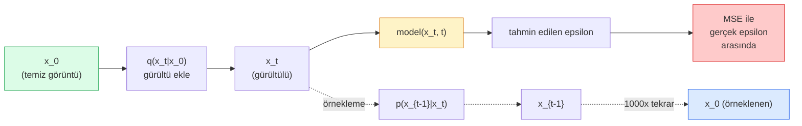

# Görüntü Üretimi — Diffusion Modelleri

> Bir diffusion modeli, gürültü gidermeyi (denoising) öğrenir. Onu, gürültülü bir görüntüden küçük bir gürültüyü çıkarmak için eğitin, bunu bin adım geriye doğru tekrarlayın ve elinizde bir görüntü üreteci olsun.

**Tür:** Build (İnşa)
**Diller:** Python
**Ön Koşullar:** Faz 4 Ders 07 (U-Net), Faz 1 Ders 06 (Olasılık), Faz 3 Ders 06 (Optimizasyon Algoritmaları)
**Süre:** ~75 dakika

## Öğrenim Hedefleri

- İleriye doğru gürültü ekleme sürecini (forward noising process) `x_0 -> x_1 -> ... -> x_T` türetmek ve `q(x_t | x_0)` kapalı formunun (closed-form) herhangi bir t için neden geçerli olduğunu açıklamak
- Her adımda eklenen gürültüyü tahmin eden bir DDPM tarzı eğitim hedefi (training objective) ve saf gürültüden bir görüntüye geri yürüyen bir örnekleyici (sampler) uygulamak
- Herhangi bir zaman adımı için gürültüyü tahmin eden, CPU'da eğitilebilecek kadar küçük, zaman koşullu bir U-Net (time-conditioned U-Net) inşa etmek
- DDPM ve DDIM örnekleme arasındaki farkı ve her birinin ne zaman uygun olduğunu açıklamak (Ders 23, flow matching ve rectified flow'u derinlemesine ele alır)

## Problem

GAN'lar tek seferde üretir: gürültü girer, görüntü çıkar, tek bir ileri geçiş (forward pass). Hızlıdırlar ama eğitilmeleri zordur. Diffusion modelleri yinelemeli olarak üretir: saf gürültüden başlayın, küçük adımlarla gürültüyü giderin, görüntü ortaya çıkar. Yavaştırlar ama eğitilmeleri kolaydır. Son beş yıldır ikinci özellik baskın çıkmıştır: herhangi bir küçük ekip bir diffusion modeli eğitip makul örnekler alabilir; GAN eğitimi ise yıllarca süren başarısız denemelerle öğrenilen bir zanaattır.

Eğitim kararlılığının ötesinde, diffusion'ın yinelemeli yapısı, modern görüntü üretiminin yaptığı her şeyin anahtarıdır: metin koşullandırması (text conditioning), görüntü içini tamamlama (inpainting), görüntü düzenleme, süper çözünürlük (super-resolution), kontrol edilebilir stil. Örnekleme döngüsünün her adımı, yeni bir kısıtlama eklemek için bir kancadır. Bu kanca sayesinde Stable Diffusion, Imagen, DALL-E 3, Midjourney ve kullanacağınız her kontrol edilebilir görüntü modeli diffusion tabanlıdır.

Bu ders, minimum DDPM'yi inşa eder: ileri gürültü ekleme (forward noising), geri gürültü giderme (backward denoising), eğitim döngüsü. Sonraki ders (Stable Diffusion), bunu bir VAE, metin kodlayıcı (text encoder) ve sınıflandırıcısız yönlendirme (classifier-free guidance) ile üretim sistemine bağlar.

## Kavram

### İleri süreç (Forward process)

Bir `x_0` görüntüsü alın. `x_1` elde etmek için çok küçük bir Gauss gürültüsü ekleyin. `x_2` elde etmek için biraz daha ekleyin. `x_T` saf Gauss gürültüsünden neredeyse ayırt edilemez hale gelene kadar T adım boyunca devam edin.

```
q(x_t | x_{t-1}) = N(x_t; sqrt(1 - beta_t) * x_{t-1},  beta_t * I)
```

`beta_t`, genellikle T=1000 adım boyunca 0.0001'den 0.02'ye doğrusal (linear) olan küçük bir varyans çizelgesidir (variance schedule). Her adım, sinyali hafifçe küçültür ve yeni gürültü enjekte eder.

### Kapalı form sıçraması (Closed-form jump)

Her seferinde bir adım gürültü eklemek bir Markov zinciridir (Markov chain), ancak matematik bunu katlar: `x_t`'yi `x_0`'dan tek adımda doğrudan örnekleyebilirsiniz.

```
alpha_t = 1 - beta_t olarak tanımla
alpha_bar_t = prod_{s=1..t} alpha_s olarak tanımla

O halde:
  q(x_t | x_0) = N(x_t; sqrt(alpha_bar_t) * x_0,  (1 - alpha_bar_t) * I)

Veya eşdeğer olarak:
  x_t = sqrt(alpha_bar_t) * x_0 + sqrt(1 - alpha_bar_t) * epsilon
  burada epsilon ~ N(0, I)
```

Bu tek denklem, diffusion'ı pratik kılan şeydir. Eğitim sırasında rastgele bir `t` seçer, `x_t`'yi doğrudan `x_0`'dan örnekler ve tek adımda eğitim yaparsınız — tam Markov zincirini simüle etmeye gerek yoktur.

### Geri süreç (Reverse process)

İleri süreç sabittir. Geri süreç `p(x_{t-1} | x_t)`, sinir ağının öğrendiği şeydir. Diffusion modelleri `x_{t-1}`'i doğrudan tahmin etmez; t adımında eklenen gürültü `epsilon`'u tahmin ederler ve matematik `x_{t-1}`'i bundan türetir.



### Eğitim kaybı (Training loss)

Her eğitim adımında:

1. Gerçek bir `x_0` görüntüsü örnekle.
2. `[1, T]` aralığından düzgün dağılımla bir `t` zaman adımı örnekle.
3. `epsilon ~ N(0, I)` gürültüsü örnekle.
4. `x_t = sqrt(alpha_bar_t) * x_0 + sqrt(1 - alpha_bar_t) * epsilon` hesapla.
5. Ağ ile `epsilon_theta(x_t, t)` tahmin et.
6. `|| epsilon - epsilon_theta(x_t, t) ||^2`'yi minimize et.

İşte bu kadar. Sinir ağı, herhangi bir zaman adımındaki gürültüyü tahmin etmeyi öğrenir. Kayıf MSE'dir. Hiçbir adversarial oyun, çökme (collapse) veya salınım (oscillation) yoktur.

### Örnekleyici — DDPM

Üretmek için: `x_T ~ N(0, I)`'den başlayın ve her seferinde bir adım geriye yürüyün.

```
for t = T, T-1, ..., 1:
    eps = model(x_t, t)
    x_{t-1} = (1 / sqrt(alpha_t)) * (x_t - (beta_t / sqrt(1 - alpha_bar_t)) * eps) + sqrt(beta_t) * z
    burada z ~ N(0, I) eğer t > 1, değilse 0
return x_0
```

Anahtar nokta, ters koşullunun (reverse conditional) genelde kapalı formda bilinmemesine rağmen, bu özel Gauss ileri süreci için bilinmesidir. Karmaşık görünen katsayılar, Bayes kuralının size verdiği şeydir.

### Neden 1000 adım

İleri gürültü çizelgesi (noise schedule), her adımın ters adımın neredeyse Gauss olmasına yetecek kadar gürültü ekleyeceği şekilde seçilir. Çok az adım olursa ters adım Gauss olmaktan uzaklaşır ve ağ bunu iyi modelleyemez. Çok fazla adım olursa örnekleme, azalan getiriyle pahalı hale gelir. T=1000, doğrusal çizelge ile DDPM varsayılanıdır.

### DDIM: 20 kat daha hızlı örnekleme

Eğitim aynıdır. Örnekleme değişir. DDIM (Song ve ark., 2020), yeniden eğitim gerektirmeden zaman adımlarını atlayan deterministik bir ters süreç tanımlar. DDIM ile 50 adımda örnekleme, 1000 adımlı DDPM kalitesine yakın sonuç verir. Her üretim sistemi DDIM veya daha hızlı bir varyant (DPM-Solver, Euler ancestral) kullanır.

### Zaman koşullandırması (Time conditioning)

Ağ `epsilon_theta(x_t, t)`, hangi zaman adımında gürültü giderdiğini bilmelidir. Modern diffusion modelleri, `t`'yi sinüzoidal zaman gömmeleri (sinusoidal time embeddings) ile enjekte eder — transformatörlerdeki konumsal kodlama (positional encoding) ile aynı fikir — ve bunlar her U-Net seviyesindeki öznitelik haritalarına (feature maps) eklenir.

```
t_embedding = sinusoidal(t)
feature_map += MLP(t_embedding)
```

Zaman koşullandırması olmadan ağ, gürültü seviyesini görüntünün kendisinden tahmin etmek zorundadır; bu işe yarar ancak çok daha az örnek verimlidir.

## İnşa Et

### Adım 1: Gürültü çizelgesi (Noise schedule)

```python
import torch

def linear_beta_schedule(T=1000, beta_start=1e-4, beta_end=2e-2):
    return torch.linspace(beta_start, beta_end, T)


def precompute_schedule(betas):
    alphas = 1.0 - betas
    alphas_cumprod = torch.cumprod(alphas, dim=0)
    return {
        "betas": betas,
        "alphas": alphas,
        "alphas_cumprod": alphas_cumprod,
        "sqrt_alphas_cumprod": torch.sqrt(alphas_cumprod),
        "sqrt_one_minus_alphas_cumprod": torch.sqrt(1.0 - alphas_cumprod),
        "sqrt_recip_alphas": torch.sqrt(1.0 / alphas),
    }

schedule = precompute_schedule(linear_beta_schedule(T=1000))
```

#### Açıklama
Önceden bir kez hesapla, eğitim ve örnekleme sırasında indekse göre al.

### Adım 2: İleri difüzyon (q_sample)

```python
def q_sample(x0, t, noise, schedule):
    sqrt_a = schedule["sqrt_alphas_cumprod"][t].view(-1, 1, 1, 1)
    sqrt_one_minus_a = schedule["sqrt_one_minus_alphas_cumprod"][t].view(-1, 1, 1, 1)
    return sqrt_a * x0 + sqrt_one_minus_a * noise
```

#### Açıklama
Tek satırlık kapalı form. `t`, bir grup zaman adımıdır (batch of timesteps), gruptaki her görüntü için bir tane.

### Adım 3: Küçük bir zaman koşullu U-Net

```python
import torch.nn as nn
import torch.nn.functional as F
import math

def timestep_embedding(t, dim=64):
    half = dim // 2
    freqs = torch.exp(-math.log(10000) * torch.arange(half, device=t.device) / half)
    args = t[:, None].float() * freqs[None]
    emb = torch.cat([args.sin(), args.cos()], dim=-1)
    return emb


class TinyUNet(nn.Module):
    def __init__(self, img_channels=3, base=32, t_dim=64):
        super().__init__()
        self.t_mlp = nn.Sequential(
            nn.Linear(t_dim, base * 4),
            nn.SiLU(),
            nn.Linear(base * 4, base * 4),
        )
        self.t_dim = t_dim
        self.enc1 = nn.Conv2d(img_channels, base, 3, padding=1)
        self.enc2 = nn.Conv2d(base, base * 2, 4, stride=2, padding=1)
        self.mid = nn.Conv2d(base * 2, base * 2, 3, padding=1)
        self.dec1 = nn.ConvTranspose2d(base * 2, base, 4, stride=2, padding=1)
        self.dec2 = nn.Conv2d(base * 2, img_channels, 3, padding=1)
        self.time_proj = nn.Linear(base * 4, base * 2)

    def forward(self, x, t):
        t_emb = timestep_embedding(t, self.t_dim)
        t_emb = self.t_mlp(t_emb)
        t_proj = self.time_proj(t_emb)[:, :, None, None]

        h1 = F.silu(self.enc1(x))
        h2 = F.silu(self.enc2(h1)) + t_proj
        h3 = F.silu(self.mid(h2))
        d1 = F.silu(self.dec1(h3))
        d2 = torch.cat([d1, h1], dim=1)
        return self.dec2(d2)
```

#### Açıklama
Darboğazda (bottleneck) zaman koşullandırması enjekte edilen iki seviyeli U-Net. Gerçek görüntüler için derinlik ve genişliği artırın.

### Adım 4: Eğitim döngüsü

```python
def train_step(model, x0, schedule, optimizer, device, T=1000):
    model.train()
    x0 = x0.to(device)
    bs = x0.size(0)
    t = torch.randint(0, T, (bs,), device=device)
    noise = torch.randn_like(x0)
    x_t = q_sample(x0, t, noise, schedule)
    pred = model(x_t, t)
    loss = F.mse_loss(pred, noise)
    optimizer.zero_grad()
    loss.backward()
    optimizer.step()
    return loss.item()
```

#### Açıklama
Tüm eğitim döngüsü budur. GAN oyunu yok, özelleşmiş kayıf yok, tek bir MSE çağrısı.

### Adım 5: Örnekleyici — DDPM

```python
@torch.no_grad()
def sample(model, schedule, shape, T=1000, device="cpu"):
    model.eval()
    x = torch.randn(shape, device=device)
    betas = schedule["betas"].to(device)
    sqrt_one_minus_a = schedule["sqrt_one_minus_alphas_cumprod"].to(device)
    sqrt_recip_alphas = schedule["sqrt_recip_alphas"].to(device)

    for t in reversed(range(T)):
        t_batch = torch.full((shape[0],), t, dtype=torch.long, device=device)
        eps = model(x, t_batch)
        coef = betas[t] / sqrt_one_minus_a[t]
        mean = sqrt_recip_alphas[t] * (x - coef * eps)
        if t > 0:
            x = mean + torch.sqrt(betas[t]) * torch.randn_like(x)
        else:
            x = mean
    return x
```

#### Açıklama
Bir grup örnek üretmek için 1000 ileri geçiş. Gerçek kodda bunu DDIM 50 adımlı örnekleyici ile değiştirirsiniz.

### Adım 6: DDIM örnekleyici (deterministik, ~20 kat daha hızlı)

```python
@torch.no_grad()
def sample_ddim(model, schedule, shape, steps=50, T=1000, device="cpu", eta=0.0):
    model.eval()
    x = torch.randn(shape, device=device)
    alphas_cumprod = schedule["alphas_cumprod"].to(device)

    ts = torch.linspace(T - 1, 0, steps + 1).long()
    for i in range(steps):
        t = ts[i]
        t_prev = ts[i + 1]
        t_batch = torch.full((shape[0],), t, dtype=torch.long, device=device)
        eps = model(x, t_batch)
        a_t = alphas_cumprod[t]
        a_prev = alphas_cumprod[t_prev] if t_prev >= 0 else torch.tensor(1.0, device=device)
        x0_pred = (x - torch.sqrt(1 - a_t) * eps) / torch.sqrt(a_t)
        sigma = eta * torch.sqrt((1 - a_prev) / (1 - a_t) * (1 - a_t / a_prev))
        dir_xt = torch.sqrt(1 - a_prev - sigma ** 2) * eps
        noise = sigma * torch.randn_like(x) if eta > 0 else 0
        x = torch.sqrt(a_prev) * x0_pred + dir_xt + noise
    return x
```

#### Açıklama
`eta=0` tamamen deterministiktir (aynı gürültü girdisi her zaman aynı çıktıyı üretir). `eta=1`, DDPM'yi kurtarır.

## Kullan

Üretim çalışmaları için `diffusers` kullanın:

```python
from diffusers import DDPMScheduler, UNet2DModel

unet = UNet2DModel(sample_size=32, in_channels=3, out_channels=3, layers_per_block=2)
scheduler = DDPMScheduler(num_train_timesteps=1000)
```

#### Açıklama
Kütüphane, hazır scheduler'lar (DDPM, DDIM, DPM-Solver, Euler, Heun), yapılandırılabilir U-Net'ler, metinden-görüntüye ve görüntüden-görüntüye pipeline'lar ve LoRA ince ayar yardımcıları içerir.

Araştırma için `k-diffusion` (Katherine Crowson) en sadık referans uygulamalarına ve en iyi örnekleme varyantlarına sahiptir.

## Çıktılar

Bu ders şunları üretir:

- `outputs/prompt-diffusion-sampler-picker.md` — kalite hedefine, gecikme bütçesine ve koşullandırma türüne göre DDPM / DDIM / DPM-Solver / Euler arasında seçim yapan bir prompt.
- `outputs/skill-noise-schedule-designer.md` — T ve hedef bozulma seviyesi verildiğinde doğrusal, kosinüs veya sigmoid beta çizelgesi ile sinyal-gürültü oranının zaman içindeki tanı grafiklerini üreten bir beceri.

## Alıştırmalar

1. **(Kolay)** İleri süreci görselleştirin: bir görüntü alın ve `t in [0, 100, 250, 500, 750, 1000]` için `x_t`'yi çizin. `x_1000`'in saf Gauss gürültüsü gibi göründüğünü doğrulayın.
2. **(Orta)** TinyUNet'i sentetik daireler veri kümesinde 20 epoch eğitin ve 16 daire örnekleyin. DDPM (1000 adım) ve DDIM (50 adım) örneklemesini karşılaştırın — aynı gürültü tohumundan benzer görüntüler üretiyorlar mı?
3. **(Zor)** Bir kosinüs gürültü çizelgesi (Nichol & Dhariwal, 2021) uygulayın: `alpha_bar_t = cos^2((t/T + s) / (1 + s) * pi / 2)`. Aynı modeli doğrusal ve kosinüs çizelgeleriyle eğitin ve kosinüsün düşük adım sayılarında daha iyi örnekler verdiğini gösterin.

## Anahtar Terimler

| Terim | Ne denir | Gerçek anlamı |
|-------|----------|---------------|
| Forward process (İleri süreç) | "Zamanla gürültü ekle" | Bir görüntüyü T adımda Gauss gürültüsüne bozan sabit Markov zinciri |
| Reverse process (Geri süreç) | "Adım adım gürültü gider" | Gürültüden görüntüye geri yürüyen öğrenilmiş dağılım |
| Epsilon prediction | "Gürültüyü tahmin et" | Eğitim hedefi: `epsilon_theta(x_t, t)`, t adımında eklenen gürültüyü tahmin eder |
| Beta schedule (Beta çizelgesi) | "Gürültü miktarları" | Adım başına ne kadar gürültü girdiğini tanımlayan T küçük varyans dizisi |
| alpha_bar_t | "Kümülatif koruma faktörü" | t zamanına kadar (1 - beta_s) çarpımı; büyük t, daha az sinyal kaldığı anlamına gelir |
| DDPM sampler | "Atasal, stokastik" | Her x_{t-1}'i koşullu Gauss dağılımından örnekler; 1000 adım |
| DDIM sampler | "Deterministik, hızlı" | Örneklemeyi deterministik bir ODE olarak yeniden yazar; benzer kalitede 20-100 adım |
| Time conditioning (Zaman koşullandırması) | "Modele hangi t olduğunu söyle" | U-Net'e enjekte edilen t'nin sinüzoidal gömmesi, böylece gürültü seviyesini bilir |

## Daha Fazla Okuma

- [Denoising Diffusion Probabilistic Models (Ho ve ark., 2020)](https://arxiv.org/abs/2006.11239) — diffusion'ı pratik hale getiren ve GAN'ları FID'de yenen makale
- [Improved DDPM (Nichol & Dhariwal, 2021)](https://arxiv.org/abs/2102.09672) — kosinüs çizelgesi ve v-parametrelendirmesi
- [DDIM (Song, Meng, Ermon, 2020)](https://arxiv.org/abs/2010.02502) — gerçek zamanlı çıkarımı mümkün kılan deterministik örnekleyici
- [Elucidating the Design Space of Diffusion (Karras ve ark., 2022)](https://arxiv.org/abs/2206.00364) — her diffusion tasarım seçeneğinin birleşik görünümü; güncel en iyi referans
