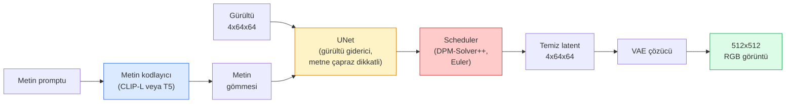

# Stable Diffusion — Mimari ve İnce Ayar

> Stable Diffusion, önceden eğitilmiş bir VAE'nin latent uzayında (latent space) çalışan, çapraz dikkat (cross-attention) ile metinle koşullandırılmış, hızlı bir deterministik ODE çözücü ile örneklenen ve sınıflandırıcısız yönlendirme (classifier-free guidance) ile yönlendirilen bir DDPM'dir.

**Tür:** Learn + Use (Öğren + Kullan)
**Diller:** Python
**Ön Koşullar:** Faz 4 Ders 10 (Diffusion), Faz 7 Ders 02 (Self-Attention)
**Süre:** ~75 dakika

## Öğrenim Hedefleri

- Bir Stable Diffusion pipeline'ının beş parçasını izlemek: VAE, metin kodlayıcı (text encoder), U-Net, scheduler (zamanlayıcı), güvenlik denetleyicisi — ve her birinin gerçekte ne yaptığı
- Latent diffusion'ı ve 3x512x512 yerine 4x64x64 latent uzayında eğitimin, kalite kaybı olmadan hesaplamayı neden 48 kat azalttığını açıklamak
- `diffusers` kullanarak görüntü üretmek, görüntüden-görüntüye (image-to-image), görüntü içini tamamlama (inpainting) ve ControlNet yönlendirmeli üretim yapmak
- Stable Diffusion'ı küçük bir özel veri kümesinde LoRA ile ince ayar yapmak ve LoRA adaptörünü çıkarımda yüklemek

## Problem

Bir DDPM'yi doğrudan 512x512 RGB görüntüler üzerinde eğitmek pahalıdır. Her eğitim adımı, 3x512x512 = 786.432 girdi değeri gören bir U-Net üzerinden geri yayılım (backprop) yapar ve örnekleme, aynı U-Net üzerinden 50'den fazla ileri geçiş (forward pass) gerektirir. Stable Diffusion 1.5 (2022'de yayınlandı) kalite seviyesinde, piksel-uzayı diffusion yaklaşık 256 GPU-aylık eğitim ve tüketici GPU'sunda görüntü başına 10-30 saniye gerektirirdi.

Açık ağırlıklı metinden-görüntüye üretimi pratik hale getiren numara **latent diffusion**'dır (Rombach ve ark., CVPR 2022). 3x512x512'lik bir görüntüyü 4x64x64'lük bir latent tensöre ve geriye haritalayan bir VAE eğitin, ardından diffusion'ı bu latent uzayda yapın. Hesaplama `(3*512*512)/(4*64*64) = 48` kat düşer. Örnekleme, aynı GPU'da saniyelerden iki saniyenin altına düşer.

Neredeyse tüm modern görüntü üretim modelleri — SDXL, SD3, FLUX, HunyuanDiT, Wan-Video — otokodlayıcı, gürültü giderici (U-Net veya DiT) ve metin koşullandırmasında varyasyonlar olan latent diffusion modelleridir. Stable Diffusion'ı öğrenin, şablonu öğrenmiş olursunuz.

## Kavram

### Pipeline



- **VAE** — dondurulmuş otokodlayıcı. Kodlayıcı (encoder) görüntüyü latentlere dönüştürür (img2img ve eğitim için kullanılır). Çözücü (decoder) latentleri tekrar görüntüye dönüştürür.
- **Metin kodlayıcı (Text encoder)** — CLIP metin kodlayıcı (SD 1.x/2.x), CLIP-L + CLIP-G (SDXL) veya T5-XXL (SD3/FLUX). Bir dizi token gömmesi (token embedding) üretir.
- **U-Net** — gürültü giderici (denoiser). Her çözünürlük seviyesinde latentlerden metin gömmesine dikkat eden çapraz dikkat (cross-attention) katmanlarına sahiptir.
- **Scheduler** — örnekleme algoritması (DDIM, Euler, DPM-Solver++). Sigma'ları seçer, tahmin edilen gürültüyü latente geri karıştırır.
- **Güvenlik denetleyicisi (Safety checker)** — çıktı görüntüsünde isteğe bağlı NSFW / yasadışı içerik filtresi.

### Sınıflandırıcısız yönlendirme — CFG

Düz metin koşullandırması, her prompt `c` için `epsilon_theta(x_t, t, c)` öğrenir. CFG (Classifier-Free Guidance), aynı ağı `c`'nin %10 oranında düşürülmesiyle (boş bir gömmeyle değiştirilerek) eğiterek, tek bir modelin hem koşullu hem de koşulsuz gürültüyü tahmin etmesini sağlar. Çıkarımda:

```
eps = eps_uncond + w * (eps_cond - eps_uncond)
```

`w` yönlendirme ölçeğidir (guidance scale). `w=0` koşulsuz, `w=1` düz koşullu, `w>1` çıktıyı "prompta daha bağımlı" hale getirir, çeşitlilik pahasına. SD varsayılanı `w=7.5`'tir.

CFG, metinden-görüntüye üretimin üretim kalitesinde çalışmasının nedenidir. Onsuz, promptlar çıktıyı zayıf yönlendirir; onunla, promptlar baskın hale gelir.

### Latent uzay geometrisi (Latent space geometry)

VAE'nin 4 kanallı latenti sadece sıkıştırılmış bir görüntü değildir. Aritmetiğin kabaca anlamsal düzenlemelere karşılık geldiği (prompt mühendisliği ve interpolasyon burada yaşar) ve diffusion U-Net'inin tüm modelleme bütçesini harcamak üzere eğitildiği bir manifolddur. Rastgele bir 4x64x64 latentin kodunu çözmek, rastgele görünümlü bir görüntü üretmez — anlamsız çıktı üretir, çünkü yalnızca belirli bir latent altmanifoldu geçerli görüntülere dönüşür.

İki sonuç:

1. **Img2img** = görüntüyü latente kodla, kısmi gürültü ekle, gürültü gidericiyi çalıştır, kodu çöz. Kodlama neredeyse tersine çevrilebilir olduğu için görüntü yapısı korunur; içerik prompta göre değişir.
2. **Inpainting** = img2img ile aynıdır ancak gürültü giderici yalnızca maskelenmiş bölgeleri günceller; maskelenmemiş bölgeler kodlanmış latentte tutulur.

### U-Net mimarisi

SD U-Net, Ders 10'daki TinyUNet'in üç eklemeyle büyütülmüş halidir:

- Her uzamsal çözünürlükte, metin gömmesine öz-dikkat (self-attention) + çapraz dikkat (cross-attention) içeren **Transformer blokları**.
- Sinüzoidal kodlama üzerinde MLP ile **zaman gömmesi (Time embedding)**.
- Eşleşen çözünürlüklerde kodlayıcı ve çözücü arasında **skip connections**.

SD 1.5'te toplam parametre: ~860M. SDXL: ~2.6B. FLUX: ~12B. Parametre artışı çoğunlukla dikkat katmanlarındadır.

### LoRA ince ayarı

Stable Diffusion'ın tam ince ayarı 20+ GB VRAM gerektirir ve 860M parametreyi günceller. LoRA (Low-Rank Adaptation — Düşük Dereceli Adaptasyon), temel modeli dondurulmuş tutar ve dikkat katmanlarına küçük derece-ayrışım matrisleri (rank-decomposition matrices) enjekte eder. SD için bir LoRA adaptörü tipik olarak 10-50 MB'tır, tek bir tüketici GPU'sunda 10-60 dakikada eğitilir ve çıkarım zamanında anında değiştirilebilir bir modifikasyon olarak yüklenir.

```
Orijinal: W_q : (d_in, d_out)   dondurulmuş
LoRA:     W_q + alpha * (A @ B)   burada A : (d_in, r), B : (r, d_out)

r tipik olarak 4-32'dir.
```

LoRA, neredeyse tüm topluluk ince ayarlarının dağıtılma şeklidir. CivitAI ve Hugging Face milyonlarcasına ev sahipliği yapar.

### Göreceğiniz Scheduler'lar

- **DDIM** — deterministik, ~50 adım, basit.
- **Euler ancestral** — stokastik, 30-50 adım, biraz daha yaratıcı örnekler.
- **DPM-Solver++ 2M Karras** — deterministik, 20-30 adım, üretim varsayılanı.
- **LCM / TCD / Turbo** — consistency modelleri ve damıtılmış varyantlar; kaliteden ödün vererek 1-4 adım.

Scheduler'ları değiştirmek `diffusers`'ta tek satırlık bir değişikliktir ve bazen yeniden eğitim gerektirmeden örnekleme sorunlarını çözer.

## İnşa Et

Bu ders, Stable Diffusion'ı sıfırdan yeniden inşa etmek yerine uçtan uca `diffusers` kullanır. Yeniden inşa etmeniz gereken parçalar (VAE, metin kodlayıcı, U-Net, scheduler) kendi derslerinin konularıdır; burada amaç, üretim API'sinde akıcılık kazanmaktır.

### Adım 1: Metinden-görüntüye (Text-to-image)

```python
import torch
from diffusers import StableDiffusionPipeline

pipe = StableDiffusionPipeline.from_pretrained(
    "runwayml/stable-diffusion-v1-5",
    torch_dtype=torch.float16,
).to("cuda")

image = pipe(
    prompt="bir köpek Tokyo'da kaykay sürüyor, Studio Ghibli stili",
    guidance_scale=7.5,
    num_inference_steps=25,
    generator=torch.Generator("cuda").manual_seed(42),
).images[0]
image.save("kopek.png")
```

#### Açıklama
`float16`, görünür kalite kaybı olmadan VRAM'i yarıya indirir. Varsayılan DPM-Solver++ ile `num_inference_steps=25`, DDIM ile `num_inference_steps=50`'ye eşdeğerdir.

### Adım 2: Scheduler'ı değiştir

```python
from diffusers import DPMSolverMultistepScheduler, EulerAncestralDiscreteScheduler

pipe.scheduler = DPMSolverMultistepScheduler.from_config(pipe.scheduler.config)
pipe.scheduler = EulerAncestralDiscreteScheduler.from_config(pipe.scheduler.config)
```

#### Açıklama
Scheduler durumu, U-Net ağırlıklarından ayrıştırılmıştır. DDPM ile eğitip herhangi bir scheduler ile örnekleyebilirsiniz.

### Adım 3: Görüntüden-görüntüye (Image-to-image)

```python
from diffusers import StableDiffusionImg2ImgPipeline
from PIL import Image

img2img = StableDiffusionImg2ImgPipeline.from_pretrained(
    "runwayml/stable-diffusion-v1-5",
    torch_dtype=torch.float16,
).to("cuda")

init_image = Image.open("kopek.png").convert("RGB").resize((512, 512))
out = img2img(
    prompt="kaykay süren bir köpek, yağlı boya",
    image=init_image,
    strength=0.6,
    guidance_scale=7.5,
).images[0]
```

#### Açıklama
`strength`, gürültü gidermeden önce ne kadar gürültü ekleneceğidir (0.0 = değişmemiş, 1.0 = tam yeniden üretim). 0.5-0.7, stil transferi için standart aralıktır.

### Adım 4: Görüntü içini tamamlama (Inpainting)

```python
from diffusers import StableDiffusionInpaintPipeline

inpaint = StableDiffusionInpaintPipeline.from_pretrained(
    "runwayml/stable-diffusion-inpainting",
    torch_dtype=torch.float16,
).to("cuda")

image = Image.open("kopek.png").convert("RGB").resize((512, 512))
mask = Image.open("kopek_maske.png").convert("L").resize((512, 512))

out = inpaint(
    prompt="bir kedi",
    image=image,
    mask_image=mask,
    guidance_scale=7.5,
).images[0]
```

#### Açıklama
Maskede beyaz pikseller yenilenecek alandır. Siyah pikseller korunur.

### Adım 5: LoRA yükleme

```python
pipe.load_lora_weights("sayakpaul/sd-lora-ghibli")
pipe.fuse_lora(lora_scale=0.8)

image = pipe(prompt="ghibli stilinde bir köy meydanı").images[0]
```

#### Açıklama
`lora_scale` gücü kontrol eder; 0.0 = etkisiz, 1.0 = tam etki. `fuse_lora`, adaptörü hız için ağırlıklara kalıcı olarak yerleştirir ancak değiştirmeyi engeller. Farklı bir adaptör yüklemeden önce `pipe.unfuse_lora()` çağrın.

### Adım 6: LoRA eğitimi (taslak)

Gerçek LoRA eğitimi `peft` veya `diffusers.training` içinde yaşar. Ana hat:

```python
# Sözde kod
for step, batch in enumerate(dataloader):
    images, prompts = batch
    latents = vae.encode(images).latent_dist.sample() * 0.18215

    t = torch.randint(0, num_train_timesteps, (batch_size,))
    noise = torch.randn_like(latents)
    noisy_latents = scheduler.add_noise(latents, noise, t)

    text_emb = text_encoder(tokenizer(prompts))

    pred_noise = unet(noisy_latents, t, text_emb)  # LoRA ağırlıkları burada enjekte edilir

    loss = F.mse_loss(pred_noise, noise)
    loss.backward()
    optimizer.step()
```

#### Açıklama
Yalnızca LoRA matrisleri gradyan alır; temel U-Net, VAE ve metin kodlayıcı donmuştur. Batch boyutu 1 ve gradient checkpointing ile bu, 8 GB VRAM'e sığar.

## Kullan

Üretimde gerçekten yaptığınız kararlar:

- **Model ailesi**: Açık kaynak topluluk ince ayarları için SD 1.5, daha yüksek kalite için SDXL, en son teknoloji ve katı lisanslama gereksinimleri için SD3 / FLUX.
- **Scheduler**: 20-30 adım için DPM-Solver++ 2M Karras, gecikme 1 saniyenin altındayken LCM-LoRA.
- **Hassasiyet**: 4080/4090'da `float16`, A100 ve daha yenilerde `bfloat16`, VRAM daraldığında `int8` (`bitsandbytes` veya `compel` ile).
- **Koşullandırma**: düz metin işe yarar; daha güçlü kontrol için temel pipeline'ın üstüne ControlNet (canny, depth, pose) ekleyin.

Toplu üretim için `AUTO1111` / `ComfyUI` topluluk araçlarıdır; üretim API'leri için `diffusers` + `accelerate` veya TensorRT derlemesiyle `optimum-nvidia`.

## Çıktılar

Bu ders şunları üretir:

- `outputs/prompt-sd-pipeline-planner.md` — gecikme bütçesi, kalite hedefi ve lisanslama kısıtı verildiğinde SD 1.5 / SDXL / SD3 / FLUX artı scheduler ve hassasiyeti seçen bir prompt.
- `outputs/skill-lora-training-setup.md` — altyazılar, rank, batch boyutu ve öğrenme oranı dahil özel bir veri kümesi için tam bir LoRA eğitim yapılandırması yazan bir beceri.

## Alıştırmalar

1. **(Kolay)** Aynı promptu `[1, 3, 5, 7.5, 10, 15]` aralığındaki `guidance_scale` değerleriyle üretin. Görüntünün nasıl değiştiğini açıklayın. Hangi yönlendirme değerinde yapaylıklar (artefacts) ortaya çıkıyor?
2. **(Orta)** Herhangi bir gerçek fotoğrafı alın, `StableDiffusionImg2ImgPipeline` ile `strength` değerlerinde `[0.2, 0.4, 0.6, 0.8, 1.0]` çalıştırın. Hangi güç, stili değiştirirken kompozisyonu korur? 1.0 neden girdiyi tamamen yok sayar?
3. **(Zor)** Tek bir konunun (bir evcil hayvan, bir logo, bir karakter) 10-20 görüntüsü üzerinde bir LoRA eğitin ve bu konuyla yeni sahneler üretin. En iyi kimlik korumasını aşırı uyuma (overfitting) girmeden sağlayan LoRA rank ve eğitim adımlarını raporlayın.

## Anahtar Terimler

| Terim | Ne denir | Gerçek anlamı |
|-------|----------|---------------|
| Latent diffusion | "Latentlerde difüzyon yap" | Tüm DDPM'yi piksel uzayı (3x512x512) yerine VAE latent uzayında (4x64x64) çalıştır; 48 kat hesaplama tasarrufu |
| VAE scale factor | "0.18215" | VAE'nin ham latentini yaklaşık birim varyansa ölçekleyen sabit; her SD pipeline'ında sabit kodlanmış |
| Classifier-free guidance | "CFG" | Koşullu ve koşulsuz gürültü tahminlerini karıştır; en etkili tek çıkarım düğmesi |
| Scheduler | "Örnekleyici" | Gürültü ve model tahminlerini gürültüsüz bir latent yörüngesine dönüştüren algoritma |
| LoRA | "Düşük dereceli adaptör" | Temel ağırlıklara dokunmadan dikkat katmanlarında ince ayar yapan küçük derece-ayrışım matrisleri |
| Cross-attention (Çapraz dikkat) | "Metin-görüntü dikkati" | Latent token'lardan metin token'larına dikkat; her U-Net seviyesinde prompt bilgisini enjekte eder |
| ControlNet | "Yapı koşullandırması" | SD'yi ek bir girdiyle (canny, depth, pose, segmentation) yönlendiren ayrıca eğitilmiş bir adaptör |
| DPM-Solver++ | "Varsayılan scheduler" | İkinci derece deterministik ODE çözücü; 2026'da düşük adım sayılarında (20-30) en iyi kalite |

## Daha Fazla Okuma

- [High-Resolution Image Synthesis with Latent Diffusion (Rombach ve ark., 2022)](https://arxiv.org/abs/2112.10752) — Stable Diffusion makalesi; tasarımı haklı çıkaran tüm abasyonları (ablations) içerir
- [Classifier-Free Diffusion Guidance (Ho & Salimans, 2022)](https://arxiv.org/abs/2207.12598) — CFG makalesi
- [LoRA: Low-Rank Adaptation of Large Language Models (Hu ve ark., 2021)](https://arxiv.org/abs/2106.09685) — LoRA önce NLP'deydi; neredeyse hiç değişiklik olmadan SD'ye aktarıldı
- [diffusers documentation](https://huggingface.co/docs/diffusers) — her SD / SDXL / SD3 / FLUX pipeline'ı için referans
