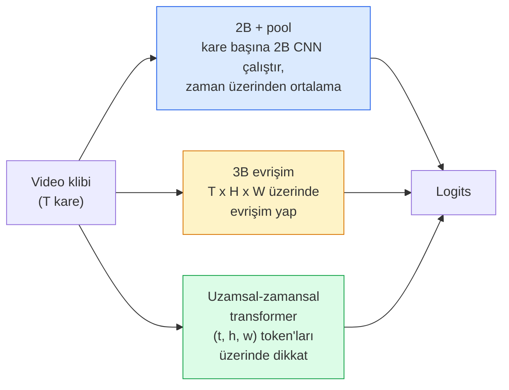

# Video Anlama — Zamansal Modelleme

> Bir video, görüntülerin bir dizisi artı onları birbirine bağlayan fiziktir. Her video modeli ya zamanı ek bir eksen olarak (3B evrişim), üzerinde dikkat edilecek bir dizi olarak (transformer) ya da bir kez çıkarılıp havuzlanacak bir öznitelik olarak (2B+pool) ele alır.

**Tür:** Learn + Build (Öğren + İnşa)
**Diller:** Python
**Ön Koşullar:** Faz 4 Ders 03 (CNN'ler), Faz 4 Ders 04 (Görüntü Sınıflandırma)
**Süre:** ~45 dakika

## Öğrenim Hedefleri

- Üç ana video modelleme yaklaşımını (2B+pool, 3B evrişim, uzamsal-zamansal transformer) ayırt etmek ve maliyet ile doğruluk ödünleşimlerini tahmin etmek
- PyTorch'ta kare örnekleme (frame sampling), zamansal havuzlama (temporal pooling) ve 2B+pool taban sınıflandırıcı uygulamak
- I3D'nin "şişirilmiş" (inflated) 3B kernel'lerinin ImageNet ağırlıklarından neden iyi transfer olduğunu ve faktörize (2+1)B evrişimin neyi farklı yaptığını açıklamak
- Standart aksiyon tanıma veri kümelerini ve metriklerini okumak: Kinetics-400/600, UCF101, Something-Something V2; klip ve video seviyesinde ilk-1 doğruluğu

## Problem

30 fps'lik 30 saniyelik bir video 900 karedir. Basitçe, video sınıflandırması 900 kez çalıştırılan görüntü sınıflandırması ve ardından bir tür toplama işlemidir. Bu, aksiyon neredeyse her karede görünür olduğunda (spor, yemek yapma, egzersiz videoları) işe yarar ve aksiyon hareketin kendisi tarafından tanımlandığında ciddi şekilde başarısız olur: "bir şeyi soldan sağa itmek" her karede iki durağan nesne gibi görünür.

Her video mimarisi için temel soru şudur: zamansal yapı ne zaman ve nasıl modellenir? Cevap, hesaplama maliyeti, ön eğitim stratejisi, ImageNet ağırlıklarını yeniden kullanıp kullanamayacağınız ve modelin hangi veri kümelerinde eğitildiği dahil her şeyi belirler.

Bu ders, kasıtlı olarak durağan görüntü derslerinden daha kısadır. Temel görüntü mekanizması zaten yerindedir ve video anlama çoğunlukla zamansal hikaye ile ilgilidir: örnekleme, modelleme ve toplama.

## Kavram

### Üç mimari aile



### 2B + pool

Bir 2B CNN (ResNet, EfficientNet, ViT) alın. Her örneklenen karede bağımsız olarak çalıştırın. Kare başına gömmeleri (per-frame embeddings) ortalayın (veya max-pool, veya attention-pool). Havuzlanmış vektörü bir sınıflandırıcıya besleyin.

Artıları:
- ImageNet ön eğitimi doğrudan transfer olur.
- Uygulaması en basit.
- Ucuz: T kare * tek görüntü çıkarım maliyeti.

Eksileri:
- Hareketi modelleyemez. Aksiyon = görünümlerin toplamı.
- Zamansal havuzlama sıra-değişmezdir; "kapıyı aç" ve "kapıyı kapat" aynı görünür.

Ne zaman kullanılır: görünüm ağırlıklı görevler, küçük video veri kümelerinde transfer öğrenimi, ilk taban çizgileri (baselines).

### 3B evrişimler (3D convolutions)

2B (H, W) kernel'lerini 3B (T, H, W) kernel'leriyle değiştirin. Ağ, hem uzam hem de zaman üzerinde evrişim yapar. Erken aile: C3D, I3D, SlowFast.

I3D numarası: önceden eğitilmiş bir 2B ImageNet modeli alın, her 2B kernel'i yeni bir zaman ekseni boyunca kopyalayarak "şişirin" (inflate). 3x3'lük bir 2B evrişim, 3x3x3'lük bir 3B evrişim olur. Bu, 3B modele sıfırdan eğitim yerine güçlü önceden eğitilmiş ağırlıklar verir.

Artıları:
- Hareketi doğrudan modeller.
- I3D şişirme, ücretsiz transfer öğrenimi sağlar.

Eksileri:
- 2B muadilinden T/8 kat daha fazla FLOP (3 kez üst üste 3'lük zamansal kernel için).
- Zamansal kernel'ler küçüktür; uzun menzilli hareket için bir piramit veya çift akışlı yaklaşım gerekir.

Ne zaman kullanılır: hareketin sinyal olduğu aksiyon tanıma (Something-Something V2, hareket ağırlıklı sınıflara sahip Kinetics).

### Uzamsal-zamansal transformer'lar (Spatio-temporal transformers)

Videoyu bir uzay-zaman yamaları (space-time patches) ızgarasına tokenize edin ve tümü üzerinde dikkat uygulayın. TimeSformer, ViViT, Video Swin, VideoMAE.

Önemli dikkat desenleri:
- **Joint (Birleşik)** — (t, h, w) üzerinde tek bir büyük dikkat. `T*H*W`'de ikinci dereceden; pahalı.
- **Divided (Bölünmüş)** — blok başına iki dikkat: biri zaman, biri uzam üzerinde. Doğrusala yakın ölçekleme.
- **Factorised (Faktörize)** — zaman dikkati ve uzam dikkati bloklar arasında dönüşümlü olarak çalışır.

Artıları:
- Her büyük kıyaslamada (benchmark) SOTA doğruluğu.
- Yama şişirme (patch inflation) yoluyla görüntü transformer'larından (ViT) transfer olur.
- Seyrek dikkat (sparse attention) ile uzun bağlamlı videoyu destekler.

Eksileri:
- Hesaplama açısından yoğundur.
- Dikkat deseni seçimi dikkatli yapılmazsa çalışma süresi şişer.

Ne zaman kullanılır: büyük veri kümeleri, yüksek kaliteli video anlama, çok kipli (multi-modal) video+metin görevleri.

### Kare örnekleme (Frame sampling)

30 fps'de 10 saniyelik bir klip 300 karedir; 300'ünü de herhangi bir modele beslemek israftır. Standart stratejiler:

- **Düzgün örnekleme (Uniform sampling)** — T kareyi klip boyunca eşit aralıklarla seç. 2B+pool için varsayılan.
- **Yoğun örnekleme (Dense sampling)** — Rastgele bitişik T-kare penceresi. 3B evrişimler için yaygındır çünkü hareket komşu kareler gerektirir.
- **Çoklu klip (Multi-clip)** — Aynı videodan birden çok T-kare penceresi örnekle, her birini sınıflandır, test zamanında tahminlerin ortalamasını al.

T genellikle 8, 16, 32 veya 64'tür. Daha yüksek T = daha fazla hesaplama karşılığında daha fazla zamansal sinyal.

### Değerlendirme

İki seviye:
- **Klip seviyesinde doğruluk (Clip-level accuracy)** — model bir T-kare klip görür, ilk-k (top-k) bildirir.
- **Video seviyesinde doğruluk (Video-level accuracy)** — video başına birden çok klip arasında klip seviyesi tahminlerinin ortalaması; daha yüksek ve daha kararlı.

Her ikisini de bildirin. %78 klip / %82 video puanı alan bir model, test-zamanı ortalamasına yoğun şekilde güveniyordur; %80 / %81 puanı alan bir model klip başına daha sağlamdır.

### Tanışacağınız veri kümeleri

- **Kinetics-400 / 600 / 700** — genel amaçlı aksiyon veri kümesi. 400 bin klip; YouTube URL'leri (çoğu artık ölü).
- **Something-Something V2** — hareketle tanımlanan aksiyonlar ("X'i soldan sağa hareket ettir"). 2B+pool ile çözülemez.
- **UCF-101**, **HMDB-51** — daha eski, daha küçük, hâlâ raporlanıyor.
- **AVA** — uzam ve zamanda aksiyon *konumlandırması* (localisation); sınıflandırmadan daha zordur.

## İnşa Et

### Adım 1: Kare örnekleyici (Frame sampler)

Kare listesi (veya video tensörü) üzerinde çalışan düzgün ve yoğun örnekleyiciler.

```python
import numpy as np

def sample_uniform(num_frames_total, T):
    if num_frames_total <= T:
        return list(range(num_frames_total)) + [num_frames_total - 1] * (T - num_frames_total)
    step = num_frames_total / T
    return [int(i * step) for i in range(T)]


def sample_dense(num_frames_total, T, rng=None):
    rng = rng or np.random.default_rng()
    if num_frames_total <= T:
        return list(range(num_frames_total)) + [num_frames_total - 1] * (T - num_frames_total)
    start = int(rng.integers(0, num_frames_total - T + 1))
    return list(range(start, start + T))
```

#### Açıklama
Her ikisi de video tensörünü dilimlemek için kullandığınız `T` indeksini döndürür.

### Adım 2: 2B+pool taban çizgisi

Her kare üzerinde 2B ResNet-18 çalıştır, öznitelikleri ortalama-havuzla, sınıflandır.

```python
import torch
import torch.nn as nn
from torchvision.models import resnet18, ResNet18_Weights

class FramePool(nn.Module):
    def __init__(self, num_classes=400, pretrained=True):
        super().__init__()
        weights = ResNet18_Weights.IMAGENET1K_V1 if pretrained else None
        backbone = resnet18(weights=weights)
        self.features = nn.Sequential(*(list(backbone.children())[:-1]))  # global avg pool korunur
        self.head = nn.Linear(512, num_classes)

    def forward(self, x):
        # x: (N, T, 3, H, W)
        N, T = x.shape[:2]
        x = x.view(N * T, *x.shape[2:])
        feats = self.features(x).view(N, T, -1)
        pooled = feats.mean(dim=1)
        return self.head(pooled)

model = FramePool(num_classes=10)
x = torch.randn(2, 8, 3, 224, 224)
print(f"çıktı: {model(x).shape}")
print(f"parametre: {sum(p.numel() for p in model.parameters()):,}")
```

#### Açıklama
On bir milyon parametre, ImageNet ön eğitimli, kare başına çalışır, ortalama alır, sınıflandırır. Bu taban çizgisi, görünüm ağırlıklı görevlerde genellikle gerçek 3B modellerin 5-10 puan yakınındadır — bazen daha iyidir, çünkü daha güçlü bir ImageNet omurgasını (backbone) yeniden kullanır.

### Adım 3: I3D tarzı şişirilmiş 3B evrişim

Tek bir 2B evrişimi, ağırlıkları yeni bir zaman ekseni boyunca tekrarlayarak 3B evrişime dönüştürün.

```python
def inflate_2d_to_3d(conv2d, time_kernel=3):
    out_c, in_c, kh, kw = conv2d.weight.shape
    weight_3d = conv2d.weight.data.unsqueeze(2)  # (out, in, 1, kh, kw)
    weight_3d = weight_3d.repeat(1, 1, time_kernel, 1, 1) / time_kernel
    conv3d = nn.Conv3d(in_c, out_c, kernel_size=(time_kernel, kh, kw),
                        padding=(time_kernel // 2, conv2d.padding[0], conv2d.padding[1]),
                        stride=(1, conv2d.stride[0], conv2d.stride[1]),
                        bias=False)
    conv3d.weight.data = weight_3d
    return conv3d

conv2d = nn.Conv2d(3, 64, kernel_size=3, padding=1, bias=False)
conv3d = inflate_2d_to_3d(conv2d, time_kernel=3)
print(f"2B ağırlık şekli:  {tuple(conv2d.weight.shape)}")
print(f"3B ağırlık şekli:  {tuple(conv3d.weight.shape)}")
x = torch.randn(1, 3, 8, 56, 56)
print(f"3B çıktı şekli:  {tuple(conv3d(x).shape)}")
```

#### Açıklama
`time_kernel`'e bölme, aktivasyon büyüklüklerini kabaca sabit tutar — ilk geçişte batch-norm istatistiklerini bozmamak için önemlidir.

### Adım 4: Faktörize (2+1)B evrişim

Bir 3B evrişimi, 2B (uzamsal) ve 1B (zamansal) evrişime ayırın. Aynı alıcı alan (receptive field), daha az parametre, bazı kıyaslamalarda daha iyi doğruluk.

```python
class Conv2Plus1D(nn.Module):
    def __init__(self, in_c, out_c, kernel_size=3):
        super().__init__()
        mid_c = (in_c * out_c * kernel_size * kernel_size * kernel_size) \
                // (in_c * kernel_size * kernel_size + out_c * kernel_size)
        self.spatial = nn.Conv3d(in_c, mid_c, kernel_size=(1, kernel_size, kernel_size),
                                 padding=(0, kernel_size // 2, kernel_size // 2), bias=False)
        self.bn = nn.BatchNorm3d(mid_c)
        self.act = nn.ReLU(inplace=True)
        self.temporal = nn.Conv3d(mid_c, out_c, kernel_size=(kernel_size, 1, 1),
                                  padding=(kernel_size // 2, 0, 0), bias=False)

    def forward(self, x):
        return self.temporal(self.act(self.bn(self.spatial(x))))

c = Conv2Plus1D(3, 64)
x = torch.randn(1, 3, 8, 56, 56)
print(f"(2+1)B çıktı: {tuple(c(x).shape)}")
```

#### Açıklama
Tam bir R(2+1)D ağı, her 3x3 evrişimin `Conv2Plus1D` ile değiştirildiği bir ResNet-18 ile aynıdır.

## Kullan

İki kütüphane üretim video çalışmalarını kapsar:

- `torchvision.models.video` — önceden eğitilmiş Kinetics ağırlıkları ile R(2+1)D, MViT, Swin3D. Görüntü modelleriyle aynı API.
- `pytorchvideo` (Meta) — model hayvanat bahçesi, Kinetics / SSv2 / AVA için veri yükleyiciler, standart dönüşümler.

Görüntü-Dil video modelleri (video altyazılama, video soru-cevap) için `transformers` (`VideoMAE`, `VideoLLaMA`, `InternVideo`) kullanın.

## Çıktılar

Bu ders şunları üretir:

- `outputs/prompt-video-architecture-picker.md` — görünüm-vs-hareket, veri kümesi boyutu ve hesaplama bütçesine göre 2B+pool / I3D / (2+1)D / transformer seçen bir prompt.
- `outputs/skill-frame-sampler-auditor.md` — bir video pipeline'ının örnekleyicisini inceleyen ve yaygın hataları (bir-eksik indeks, `num_frames < T` olduğunda dengesiz örnekleme, en-boy oranını koruyan kırpma eksikliği vb.) işaretleyen bir beceri.

## Alıştırmalar

1. **(Kolay)** T=8 ile FramePool ile T=8 ile I3D tarzı 3B ResNet için FLOP'ları (yaklaşık) hesaplayın. 2B+pool'un neden 3-5 kat daha ucuz olduğunu gerekçelendirin.
2. **(Orta)** Sentetik bir video veri kümesi oluşturun: rastgele yönlerde hareket eden rastgele toplar, hareket yönüne göre etiketlenmiş ("soldan-sağa", "sağdan-sola", "çapraz-yukarı"). FramePool'u bunun üzerinde eğitin. Neredeyse şans seviyesinde doğruluk elde ettiğini gösterin; bu, hareket görevleri için yalnızca görünümün yetersiz olduğunu kanıtlar.
3. **(Zor)** Bir ResNet-18'deki her Conv2d'yi `Conv2Plus1D` ile değiştirerek bir R(2+1)D-18 inşa edin. İlk evrişimin ağırlıklarını ImageNet ön eğitimli bir ResNet-18'den şişirin. Alıştırma 2'deki hareket veri kümesinde eğitin ve FramePool'u geçin.

## Anahtar Terimler

| Terim | Ne denir | Gerçek anlamı |
|-------|----------|---------------|
| 2B + pool | "Kare başına sınıflandırıcı" | Her örneklenen karede 2B CNN çalıştır, öznitelikleri zaman üzerinde ortalama havuzla, sınıflandır |
| 3B convolution (3B evrişim) | "Uzamsal-zamansal kernel" | (T, H, W) üzerinde evrişim yapan kernel; hareketi doğal olarak modelleyebilir |
| Inflation (Şişirme) | "2B ağırlıkları 3B'ye yükselt" | 2B evrişimin ağırlıklarını yeni zaman ekseninde tekrarlayarak 3B evrişim ağırlıklarını başlat, ardından aktivasyon ölçeğini korumak için kernel_T'ye böl |
| (2+1)D | "Faktörize evrişim" | 3B'yi 2B uzamsal + 1B zamansal olarak ayır; daha az parametre, aralarında ek doğrusal olmama |
| Divided attention (Bölünmüş dikkat) | "Önce zaman sonra uzam" | Katman başına iki dikkat: aynı karedeki token'lara ve aynı konumdaki token'lara |
| Clip (Klip) | "T-kare penceresi" | T kareden oluşan örneklenmiş bir alt dizi; video modelinin tükettiği birim |
| Clip vs video accuracy | "İki değerlendirme ayarı" | Klip = video başına bir örnek, video = birden çok örneklenmiş klipin ortalaması |
| Kinetics | "Videonun ImageNet'i" | 400-700 aksiyon sınıfı, 300 bin+ YouTube klibi, standart video ön eğitim derlemi |

## Daha Fazla Okuma

- [I3D: Quo Vadis, Action Recognition (Carreira & Zisserman, 2017)](https://arxiv.org/abs/1705.07750) — şişirme ve Kinetics veri kümesini tanıtır
- [R(2+1)D: A Closer Look at Spatiotemporal Convolutions (Tran ve ark., 2018)](https://arxiv.org/abs/1711.11248) — faktörize evrişim, hâlâ güçlü bir taban çizgisi
- [TimeSformer: Is Space-Time Attention All You Need? (Bertasius ve ark., 2021)](https://arxiv.org/abs/2102.05095) — ilk güçlü video transformer'ı
- [VideoMAE (Tong ve ark., 2022)](https://arxiv.org/abs/2203.12602) — video için maskelenmiş otokodlayıcı ön eğitimi; mevcut baskın ön eğitim tarifi
