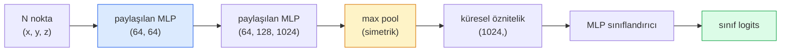

# 3B Görüş — Nokta Bulutları ve NeRF'ler

> 3B görüş iki türde gelir. Nokta bulutları (point clouds), sensörün ham çıktısıdır. NeRF'ler ise öğrenilmiş hacimsel alanlardır (volumetric fields). İkisi de "uzayda ne nerede" sorusunu yanıtlar.

**Tür:** Learn + Build (Öğren + İnşa)
**Diller:** Python
**Ön Koşullar:** Faz 4 Ders 03 (CNN'ler), Faz 1 Ders 12 (Tensor İşlemleri)
**Süre:** ~45 dakika

## Öğrenim Hedefleri

- Açık (nokta bulutu, mesh, voxel) ve örtük (signed distance field, NeRF) 3B temsillerini ve her birinin ne zaman kullanıldığını ayırt etmek
- PointNet'in simetrik fonksiyon numarasını (symmetric-function trick) anlamak: bir sinir ağını sırasız bir nokta kümesi üzerinde permütasyon-değişmez (permutation-invariant) yapan şey
- Bir NeRF ileri geçişini izlemek: ışın atma (ray casting), hacimsel işleme (volumetric rendering), konumsal kodlama (positional encoding), MLP yoğunluk+renk başı (MLP density+colour head)
- Küçük bir pozlandırılmış görüntü kümesinden önceden eğitilmiş 3B yeniden yapılandırma için `nerfstudio` veya `instant-ngp` kullanmak

## Problem

Bir kamera 2B görüntü üretir. Bir LIDAR, sıralamasız bir 3B nokta kümesi üretir. Bir structure-from-motion pipeline'ı, seyrek bir 3B anahtar nokta bulutu üretir. Bir NeRF, bir avuç pozlandırılmış görüntüden tüm bir 3B sahneyi yeniden yapılandırır. Bunların hepsi "görüş"tür ancak hiçbiri bir CNN'in istediği yoğun tensöre benzemez.

3B görüş önemlidir çünkü neredeyse her yüksek değerli robot görevi 3B'de çalışır: tutma (grasping), engelden kaçınma, navigasyon, AR tıkama (occlusion), 3B içerik yakalama. Yalnızca 2B görüntüleri anlayan bir görüş mühendisi, alanın en hızlı büyüyen diliminin dışında kalır (AR/VR içerik, robotik, otonom sürüş sistemleri, emlak veya inşaat için NeRF tabanlı 3B yeniden yapılandırma).

İki temsil farklı nedenlerle baskındır. Nokta bulutları, sensörlerin size ücretsiz olarak verdiği şeydir. NeRF'ler ve ardılları (3B Gaussian splatting, neural SDF'ler), bir sinir ağından bir sahneyi öğrenmesini istediğinizde elde ettiğiniz şeydir.

## Kavram

### Nokta bulutları (Point clouds)

Bir nokta bulutu, R^3 içinde N noktadan oluşan sırasız bir kümedir, isteğe bağlı olarak her noktanın öznitelikleri (renk, yoğunluk, normal) vardır.

```
cloud = [
  (x1, y1, z1, r1, g1, b1),
  (x2, y2, z2, r2, g2, b2),
  ...
  (xN, yN, zN, rN, gN, bN),
]
```

Izgara yok, bağlantılılık yok. İki özellik bunu sinir ağları için zorlaştırır:

- **Permütasyon değişmezliği (Permutation invariance)** — çıktı, nokta sırasına bağlı olmamalıdır.
- **Değişken N** — tek bir model, farklı boyutlardaki bulutları işleyebilmelidir.

PointNet (Qi ve ark., 2017), ikisini de tek bir fikirle çözdü: her noktaya paylaşılan bir MLP uygula, ardından simetrik bir fonksiyonla (max pool) topla. Sonuç, sıraya bağlı olmayan sabit boyutlu bir vektördür.

```
f(P) = max_{p in P} MLP(p)
```

PointNet'in tüm özü budur. Daha derin varyantlar (PointNet++, Point Transformer) hiyerarşik örnekleme ve yerel toplama ekler ancak simetrik fonksiyon numarası değişmez.

### PointNet mimarisi



"Paylaşılan MLP", aynı MLP'nin her noktada bağımsız olarak çalıştığı anlamına gelir. Verimlilik için nokta boyutu üzerinde 1x1 evrişim olarak uygulanır.

### Sinirsel Işın Alanları — NeRF'ler

NeRF'ler (Mildenhall ve ark., 2020), "N fotoğraftan bir 3B sahneyi yeniden yapılandırabilir miyiz?" sorusunu aldı ve sahnenin kendisi olan bir sinir ağı ile yanıtladı. Ağ, `(x, y, z, bakış_yönü)` -> `(yoğunluk, renk)` haritalamasını yapar. Yeni bir görünüm işlemek (rendering), bu ağ üzerinde bir ışın atma döngüsüdür.

```
NeRF MLP:  (x, y, z, theta, phi) -> (sigma, r, g, b)

Yeni bir görünümün pikselini (u, v) işlemek için:
  1. Kameradan piksel (u, v) boyunca bir ışın (ray) at
  2. Işın boyunca t_1, t_2, ..., t_N mesafelerinde noktalar örnekle
  3. Her noktada MLP'yi sorgula
  4. Renkleri (1 - exp(-sigma * dt)) ile ağırlıklandırarak birleştir
  5. Toplam, işlenen piksel rengidir
```

Bir kayıf (loss), işlenen pikseli eğitim fotoğraflarındaki gerçek pikselle karşılaştırır. İşleme adımı boyunca geri yayılım (backprop), MLP'yi günceller. 3B gerçeklik yok, açık geometri yok — sahne MLP ağırlıklarında saklanır.

### NeRF'te konumsal kodlama (Positional encoding)

Sade bir MLP, `(x, y, z)` üzerinde yüksek frekanslı detayları temsil edemez çünkü MLP'ler spektral olarak düşük frekanslara yanlıdır. NeRF bunu, her koordinatı MLP'den önce bir Fourier öznitelik vektörüne kodlayarak çözer:

```
gamma(p) = (sin(2^0 pi p), cos(2^0 pi p), sin(2^1 pi p), cos(2^1 pi p), ...)
```

L=10 frekans seviyesine kadar. Bu, transformer'ların konumlar için kullandığı numaranın aynısıdır ve Ders 10'daki diffusion zaman koşullandırmasında tekrar görünür. Onsuz, NeRF'ler bulanık görünür.

### Hacimsel işleme (Volumetric rendering)

```
C(r) = sum_i T_i * (1 - exp(-sigma_i * delta_i)) * c_i

T_i  = exp(- sum_{j<i} sigma_j * delta_j)
delta_i = t_{i+1} - t_i
```

`T_i` geçirgenliktir (transmittance) — i noktasına ne kadar ışık ulaştığı. `(1 - exp(-sigma_i * delta_i))`, i noktasındaki opaklıktır. `c_i` renktir. Son piksel, ışın boyunca ağırlıklı bir toplamdır.

### NeRF'lerin yerini alanlar

Saf NeRF'ler eğitimi yavaş (saatler) ve işlemeyi yavaştır (saniyeler). O zamandan beri gelenler:

- **Instant-NGP** (2022) — hash-grid kodlaması, MLP'nin konum girdisini değiştirir; saniyeler içinde eğitilir.
- **Mip-NeRF 360** — sınırsız sahneleri ve kenar yumuşatmayı (anti-aliasing) işler.
- **3B Gaussian Splatting** (2023) — hacimsel alanı milyonlarca 3B Gaussian ile değiştirir; dakikalar içinde eğitilir, gerçek zamanlı işlenir. Mevcut üretim varsayılanı.

2026'da neredeyse her gerçek NeRF ürünü aslında 3B Gaussian splatting'dir. Zihinsel model hâlâ NeRF'tir.

### Veri kümeleri ve kıyaslamalar

- **ShapeNet** — 3B CAD modellerinin nokta bulutu olarak sınıflandırılması ve bölütlenmesi (segmentation).
- **ScanNet** — bölütleme için gerçek iç mekan taramaları.
- **KITTI** — otonom sürüş için dış mekan LIDAR nokta bulutları.
- **NeRF Synthetic** / **Blended MVS** — görünüm sentezi (view synthesis) için pozlandırılmış görüntü veri kümeleri.
- **Mip-NeRF 360** veri kümesi — sınırsız gerçek sahneler.

## İnşa Et

### Adım 1: PointNet sınıflandırıcı

```python
import torch
import torch.nn as nn

class PointNet(nn.Module):
    def __init__(self, num_classes=10):
        super().__init__()
        self.mlp1 = nn.Sequential(
            nn.Conv1d(3, 64, 1),    nn.BatchNorm1d(64),   nn.ReLU(inplace=True),
            nn.Conv1d(64, 64, 1),   nn.BatchNorm1d(64),   nn.ReLU(inplace=True),
        )
        self.mlp2 = nn.Sequential(
            nn.Conv1d(64, 128, 1),  nn.BatchNorm1d(128),  nn.ReLU(inplace=True),
            nn.Conv1d(128, 1024, 1), nn.BatchNorm1d(1024), nn.ReLU(inplace=True),
        )
        self.head = nn.Sequential(
            nn.Linear(1024, 512),   nn.BatchNorm1d(512),  nn.ReLU(inplace=True),
            nn.Dropout(0.3),
            nn.Linear(512, 256),    nn.BatchNorm1d(256),  nn.ReLU(inplace=True),
            nn.Dropout(0.3),
            nn.Linear(256, num_classes),
        )

    def forward(self, x):
        # x: (N, 3, num_points) — Conv1d için transpoze edilmiş
        x = self.mlp1(x)
        x = self.mlp2(x)
        x = torch.max(x, dim=-1)[0]       # (N, 1024)
        return self.head(x)

pts = torch.randn(4, 3, 1024)
net = PointNet(num_classes=10)
print(f"çıktı: {net(pts).shape}")
print(f"parametre: {sum(p.numel() for p in net.parameters()):,}")
```

#### Açıklama
Yaklaşık 1.6 milyon parametre. Bulut başına 1.024 nokta üzerinde çalışır.

### Adım 2: Konumsal kodlama

```python
def positional_encoding(x, L=10):
    """
    x: (..., D) -> (..., D * 2 * L)
    """
    freqs = 2.0 ** torch.arange(L, dtype=x.dtype, device=x.device)
    args = x.unsqueeze(-1) * freqs * 3.141592653589793
    sinc = torch.cat([args.sin(), args.cos()], dim=-1)
    return sinc.reshape(*x.shape[:-1], -1)

x = torch.randn(5, 3)
y = positional_encoding(x, L=10)
print(f"girdi:  {x.shape}")
print(f"kodlanmış: {y.shape}     # (5, 60)")
```

#### Açıklama
`2^l * pi` ile çarpmak, giderek artan frekanslar verir.

### Adım 3: Küçük NeRF MLP

```python
class TinyNeRF(nn.Module):
    def __init__(self, L_pos=10, L_dir=4, hidden=128):
        super().__init__()
        self.L_pos = L_pos
        self.L_dir = L_dir
        pos_dim = 3 * 2 * L_pos
        dir_dim = 3 * 2 * L_dir
        self.trunk = nn.Sequential(
            nn.Linear(pos_dim, hidden), nn.ReLU(inplace=True),
            nn.Linear(hidden, hidden),  nn.ReLU(inplace=True),
            nn.Linear(hidden, hidden),  nn.ReLU(inplace=True),
            nn.Linear(hidden, hidden),  nn.ReLU(inplace=True),
        )
        self.sigma = nn.Linear(hidden, 1)
        self.color = nn.Sequential(
            nn.Linear(hidden + dir_dim, hidden // 2), nn.ReLU(inplace=True),
            nn.Linear(hidden // 2, 3), nn.Sigmoid(),
        )

    def forward(self, x, d):
        x_enc = positional_encoding(x, self.L_pos)
        d_enc = positional_encoding(d, self.L_dir)
        h = self.trunk(x_enc)
        sigma = torch.relu(self.sigma(h)).squeeze(-1)
        rgb = self.color(torch.cat([h, d_enc], dim=-1))
        return sigma, rgb

nerf = TinyNeRF()
x = torch.randn(128, 3)
d = torch.randn(128, 3)
s, c = nerf(x, d)
print(f"sigma: {s.shape}   rgb: {c.shape}")
```

#### Açıklama
Orijinal NeRF'e (derinlik 8 olan 2 MLP gövdesi vardır) kıyasla küçük. Mimarı göstermek için yeterlidir.

### Adım 4: Bir ışın boyunca hacimsel işleme

```python
def volumetric_render(sigma, rgb, t_vals):
    """
    sigma: (..., N_samples)
    rgb:   (..., N_samples, 3)
    t_vals: (N_samples,) ışın boyunca mesafeler
    """
    delta = torch.cat([t_vals[1:] - t_vals[:-1], torch.full_like(t_vals[:1], 1e10)])
    alpha = 1.0 - torch.exp(-sigma * delta)
    trans = torch.cumprod(torch.cat([torch.ones_like(alpha[..., :1]), 1.0 - alpha + 1e-10], dim=-1), dim=-1)[..., :-1]
    weights = alpha * trans
    rendered = (weights.unsqueeze(-1) * rgb).sum(dim=-2)
    depth = (weights * t_vals).sum(dim=-1)
    return rendered, depth, weights


N = 64
t_vals = torch.linspace(2.0, 6.0, N)
sigma = torch.rand(N) * 0.5
rgb = torch.rand(N, 3)
rendered, depth, weights = volumetric_render(sigma, rgb, t_vals)
print(f"işlenen renk: {rendered.tolist()}")
print(f"derinlik:     {depth.item():.2f}")
```

#### Açıklama
Bir ışın, 64 örnek, tek bir RGB piksel ve bir derinlik değerine birleştirilir.

## Kullan

Gerçek işler için:

- `nerfstudio` (Tancik ve ark.) — NeRF / Instant-NGP / Gaussian Splatting için mevcut referans kütüphane. Komut satırı artı bir web görüntüleyici.
- `pytorch3d` (Meta) — türevlenebilir işleme (differentiable rendering), nokta bulutu yardımcıları, mesh işlemleri.
- `open3d` — nokta bulutu işleme, kayıt (registration), görselleştirme.

Dağıtım için, 3B Gaussian splatting saf NeRF'lerin yerini büyük ölçüde almıştır çünkü 100 kat daha hızlı işler. Yeniden yapılandırma kalitesi karşılaştırılabilir düzeydedir.

## Çıktılar

Bu ders şunları üretir:

- `outputs/prompt-3d-task-router.md` — görev ve girdi verisine dayanarak doğru 3B temsiline (nokta bulutu, mesh, voxel, NeRF, Gaussian splat) yönlendiren bir prompt.
- `outputs/skill-point-cloud-loader.md` — .ply / .pcd / .xyz dosyaları için doğru normalizasyon, merkezleme ve nokta örneklemesi ile bir PyTorch `Dataset` yazan bir beceri.

## Alıştırmalar

1. **(Kolay)** PointNet'in permütasyon-değişmez olduğunu gösterin: aynı bulutu iki kez çalıştırın, birinde noktalar karıştırılmış olsun. Çıktıların kayan nokta gürültüsüne kadar aynı olduğunu doğrulayın.
2. **(Orta)** Kamera iç parametreleri (intrinsics) ve pozu (pose) verildiğinde, H x W boyutundaki bir görüntünün her pikseli için ışın başlangıç noktaları ve yönleri üreten minimal bir ışın oluşturma fonksiyonu uygulayın.
3. **(Zor)** Renkli bir küpün işlenmiş görünümlerinden oluşan sentetik bir veri kümesinde (türevlenebilir işleme veya basit bir ışın izleyici ile oluşturulmuş) bir TinyNeRF eğitin. Epoch 1, 10 ve 100'deki işleme kaybını raporlayın. Model hangi epoch'ta tanınabilir görünümler üretmeye başlar?

## Anahtar Terimler

| Terim | Ne denir | Gerçek anlamı |
|-------|----------|---------------|
| Point cloud (Nokta bulutu) | "LIDAR'dan 3B noktalar" | Nokta başına (x, y, z) + isteğe bağlı özniteliklerden oluşan sırasız küme |
| PointNet | "Nokta bulutlarındaki ilk sinir ağı" | Nokta başına paylaşımlı MLP + simetrik (max) pool; yapısı gereği permütasyon-değişmez |
| NeRF | "Sahnenin kendisi olan MLP" | (x, y, z, yön)'ü (yoğunluk, renk)'e haritalayan ağ; ışın atarak işlenir |
| Positional encoding (Konumsal kodlama) | "Fourier öznitelikleri" | MLP düşük-frekans yanlılığını aşmak için her koordinatı çoklu frekanslarda sin/cos ile kodlama |
| Volumetric rendering (Hacimsel işleme) | "Işın entegrasyonu" | Bir ışın boyunca örnekleri geçirgenlik ve alfa kullanarak tek bir pikselde birleştirme |
| Instant-NGP | "Hash-grid NeRF" | NeRF'in koordinat MLP'sini çoklu çözünürlüklü hash grid ile değiştirir; 100-1000 kat daha hızlı |
| 3D Gaussian splatting | "Milyonlarca Gaussian" | Sahne = 3B Gaussian koleksiyonu; gerçek zamanlı işlenir, dakikalarda eğitilir |
| SDF (Signed distance field) | "İşaretli mesafe alanı" | En yakın yüzeye işaretli mesafeyi döndüren fonksiyon; başka bir örtük temsil |

## Daha Fazla Okuma

- [PointNet (Qi ve ark., 2017)](https://arxiv.org/abs/1612.00593) — permütasyon-değişmez sınıflandırıcı
- [NeRF (Mildenhall ve ark., 2020)](https://arxiv.org/abs/2003.08934) — fotoğraflardan 3B yeniden yapılandırmayı bir sinir ağı problemi haline getiren makale
- [Instant-NGP (Müller ve ark., 2022)](https://arxiv.org/abs/2201.05989) — hash grid'ler, 1000 kat hızlanma
- [3D Gaussian Splatting (Kerbl ve ark., 2023)](https://arxiv.org/abs/2308.04079) — NeRF'lerin yerini üretimde alan mimari
