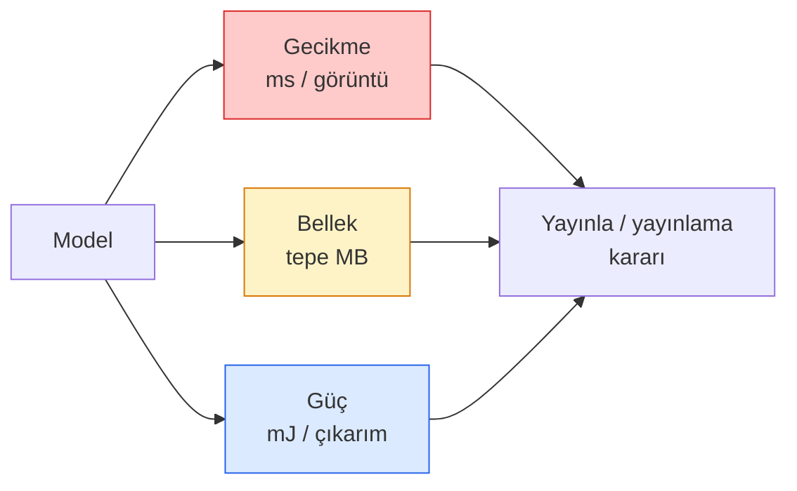

# Gerçek Zamanlı Görüntü İşleme — Edge Dağıtımı (Real-Time Vision — Edge Deployment)

> Edge çıkarımı (edge inference), 90 doğruluklu bir modeli 2 GB RAM'li bir cihazda 30 fps'de çalıştırma disiplinidir. Her yüzdelik doğruluk puanı, milisaniyelik gecikme (latency) karşılığında takas edilir.

**Tür:** Learn + Build
**Diller:** Python
**Ön Koşullar:** Phase 4 Lesson 04 (Image Classification), Phase 10 Lesson 11 (Quantization)
**Süre:** ~75 dakika

## Öğrenme Hedefleri

- Herhangi bir PyTorch modeli için çıkarım gecikmesi (inference latency), tepe bellek (peak memory) ve iş hacmini (throughput) ölçmek ve FLOPs / parametre / gecikme ödünleşimini okumak
- PyTorch'un eğitim sonrası nicelemesi (post-training quantisation) ile bir görüntü modelini INT8'e niceleyip doğruluk kaybını %1'in altında doğrulamak
- ONNX'e aktarıp (export) ONNX Runtime veya TensorRT ile derlemek; en yaygın üç aktarma hatasını ve çözümlerini saymak
- Bir edge kısıtı için MobileNetV3, EfficientNet-Lite, ConvNeXt-Tiny veya MobileViT arasından ne zaman hangisini seçeceğini açıklamak

## Problem

Eğitim anındaki bir görüntü modeli, kayan noktalı (floating-point) bir canavardır. 100M parametre, ileri geçiş başına 10 GFLOPs, 2 GB VRAM. Bunların hiçbiri bir telefona, arabanın eğlence sistemine, endüstriyel kameraya veya drona sığmaz. Bir görüntü işleme sistemi yayınlamak, aynı tahminleri 100 kat daha küçük bir bütçeye sığdırmak anlamına gelir.

İşin çoğunu üç kol (knob) halleder: model seçimi (aynı reçeteyle daha küçük bir mimari), niceleme (quantisation — FP32 yerine INT8) ve çıkarım çalışma zamanı (inference runtime — ONNX Runtime, TensorRT, Core ML, TFLite). Bunları doğru yapmak, bir iş istasyonunda çalışan demo ile 30 dolarlık bir kamera modülünde çalışan ürün arasındaki farktır.

Bu ders önce ölçüm disiplinini kurar (ölçemediğiniz şeyi optimize edemezsiniz), ardından üç kolu adım adım işler. Amaç her edge çalışma zamanını öğrenmek değil, hangi kolların var olduğunu ve her birinin beklendiği gibi çalıştığını nasıl doğrulayacağınızı bilmektir.

## Konsept

### Üç bütçe



- **Gecikme (Latency)**: p50, p95, p99. Sadece p50'nin ortalamasını almak, gerçek zamanlı sistemler için önemli olan kuyruk davranışını (tail behaviour) gizler.
- **Tepe bellek (Peak memory)**: cihazın gördüğü maksimum değer, kararlı durum ortalaması değil. Gömülü (embedded) hedeflerde OOM'ler ölümcül olduğu için önemlidir.
- **Güç / enerji (Power / energy)**: pil ile çalışan bir cihazda çıkarım başına milijoule. Genellikle CPU/GPU kullanımı * süre ile temsil edilir.

Bir edge kararı, (model, gecikme, bellek, doğruluk) tablosundan verilir. Her hücre, iş istasyonunda değil, hedef cihazda ölçülür.

### Ölçüm disiplini

Her edge profilinin izlemesi gereken üç kural:

1. **Isınma (Warm up)**: Ölçümden önce modeli 5-10 kukla ileri geçişle ısıtın. Soğuk önbellekler ve JIT derlemesi temsilci olmayan ilk sayılar üretir.
2. **Senkronize et**: GPU iş yüklerini `torch.cuda.synchronize()` ile zamanlanmış bloğun öncesinde ve sonrasında senkronize edin. Bunu yapmazsanız çekirdek yürütme süresini değil, çekirdek gönderme süresini ölçersiniz.
3. **Girdi boyutlarını sabitle**: Üretim çözünürlüğüne sabitleyin. 224x224'teki gecikme, 512x512'deki gecikme değildir.

### FLOPs bir vekil olarak

FLOPs (çıkarım başına kayan nokta işlemi), gecikme için ucuz, cihazdan bağımsız bir vekildir (proxy). Mimari karşılaştırması için kullanışlı, mutlak duvar saati olarak yanıltıcıdır. %10 daha fazla FLOP'lu bir model, pratikte 2 kat daha hızlı olabilir çünkü donanım dostu operatörler (depthwise conv'ler iyi derlenir, büyük 7x7 conv'ler derlenmez) kullanır.

Kural: mimari araması için FLOPs kullanın, dağıtım kararları için cihaz üstü gecikmeyi kullanın.

### Niceme (Quantisation) tek paragrafta

FP32 ağırlıkları ve aktivasyonları INT8 ile değiştirin. Model boyutu 4 kat düşer, bellek bant genişliği 4 kat düşer, INT8 çekirdeklerine sahip donanımda (her modern mobil SoC, Tensor Cores'lu her NVIDIA GPU) hesaplama 2-4 kat düşer. Görüntü işleme görevlerinde doğruluk kaybı, eğitim sonrası statik niceleme (post-training static quantisation) ile tipik olarak %0.1-1 puan arasındadır.

Türleri:

- **Dinamik (Dynamic)** — ağırlıkları INT8'e nicele, aktivasyonlar FP'de hesaplanır. Kolay, küçük hızlanma.
- **Statik (eğitim sonrası) (Static / post-training)** — ağırlıkları nicele + aktivasyon aralıklarını küçük bir kalibrasyon kümesinde kalibre et. Dinamikten çok daha hızlı.
- **Nicemleme farkındalıklı eğitim (Quantisation-aware training / QAT)** — eğitim sırasında nicelemeyi simüle et, böylece model buna göre öğrenir. En iyi doğruluk, etiketli veri gerektirir.

Görüntü işleme için, eğitim sonrası statik niceleme, çabanın %5'i ile faydanın %95'ini verir. QAT'ı yalnızca PTQ'dan doğruluk kaybı kabul edilemez olduğunda kullanın.

### Budama (Pruning) ve damıtma (Distillation)

- **Budama (Pruning)** — önemsiz ağırlıkları (büyüklük tabanlı) veya kanalları (yapısal) kaldır. Aşırı parametrelenmiş modellerde iyi çalışır; zaten kompakt mimarilerde daha az kullanışlıdır.
- **Damıtma (Distillation)** — küçük bir öğrenciyi (student), büyük bir öğretmenin (teacher) logit'lerini taklit edecek şekilde eğit. Genellikle modeli küçültmekle kaybedilen doğruluğun çoğunu geri kazandırır. Üretim edge modelleri için standarttır.

### Çıkarım çalışma zamanları (Inference runtimes)

- **PyTorch eager** — yavaş, dağıtım için değil. Sadece geliştirme için kullanın.
- **TorchScript** — eski. Yerini `torch.compile` ve ONNX export'una bıraktı.
- **ONNX Runtime** — tarafsız çalışma zamanı. CPU, CUDA, CoreML, TensorRT, OpenVINO'nun hepsinin ONNX sağlayıcıları vardır. Buradan başlayın.
- **TensorRT** — NVIDIA'nın derleyicisi. NVIDIA GPU'larında (iş istasyonu ve Jetson) en iyi gecikme. ONNX Runtime ile veya bağımsız çalışır.
- **Core ML** — iOS/macOS için Apple'ın çalışma zamanı. `.mlmodel` veya `.mlpackage` gerekir.
- **TFLite** — Android/ARM için Google'ın çalışma zamanı. `.tflite` gerekir.
- **OpenVINO** — Intel'in CPU/VPU için çalışma zamanı. `.xml` + `.bin` gerekir.

Pratikte: PyTorch -> ONNX -> hedef için çalışma zamanını seç. ONNX ortak dildir (lingua franca).

### Edge mimari seçici

| Bütçe | Model | Neden |
|-------|-------|-------|
| < 3M parametre | MobileNetV3-Small | Her yerde derlenir, iyi başlangıç |
| 3-10M | EfficientNet-Lite-B0 | TFLite'da parametre başına en iyi doğruluk |
| 10-20M | ConvNeXt-Tiny | Doğruluk-parametre oranı en iyisi, CPU dostu |
| 20-30M | MobileViT-S veya EfficientViT | ImageNet doğruluklu transformer |
| 30-80M | Swin-V2-Tiny | Yığın pencere attention'ını destekliyorsa |

Bunların hepsini, aksini gerektiren özel bir neden yoksa INT8'e niceleyin.

## Build It

### Adım 1: Gecikmeyi doğru ölç

```python
import time
import torch

def measure_latency(model, input_shape, device="cpu", warmup=10, iters=50):
    model = model.to(device).eval()
    x = torch.randn(input_shape, device=device)
    with torch.no_grad():
        for _ in range(warmup):
            model(x)
        if device == "cuda":
            torch.cuda.synchronize()
        times = []
        for _ in range(iters):
            if device == "cuda":
                torch.cuda.synchronize()
            t0 = time.perf_counter()
            model(x)
            if device == "cuda":
                torch.cuda.synchronize()
            times.append((time.perf_counter() - t0) * 1000)
    times.sort()
    return {
        "p50_ms": times[len(times) // 2],
        "p95_ms": times[int(len(times) * 0.95)],
        "p99_ms": times[int(len(times) * 0.99)],
        "mean_ms": sum(times) / len(times),
    }
```

#### Açıklama
Isıt, senkronize et, `time.perf_counter()` kullan. Sadece ortalama değil, yüzdelik dilimleri raporla.

### Adım 2: Parametre ve FLOP sayımları

```python
def parameter_count(model):
    return sum(p.numel() for p in model.parameters())

def flops_estimate(model, input_shape):
    """
    Sadece conv/linear model için kabaca FLOP sayısı. Üretim için `fvcore` veya `ptflops` kullanın.
    """
    total = 0
    def conv_hook(m, inp, out):
        nonlocal total
        c_out, c_in, kh, kw = m.weight.shape
        h, w = out.shape[-2:]
        total += 2 * c_in * c_out * kh * kw * h * w
    def linear_hook(m, inp, out):
        nonlocal total
        total += 2 * m.in_features * m.out_features
    hooks = []
    for m in model.modules():
        if isinstance(m, torch.nn.Conv2d):
            hooks.append(m.register_forward_hook(conv_hook))
        elif isinstance(m, torch.nn.Linear):
            hooks.append(m.register_forward_hook(linear_hook))
    model.eval()
    with torch.no_grad():
        model(torch.randn(input_shape))
    for h in hooks:
        h.remove()
    return total
```

#### Açıklama
Gerçek projeler için `fvcore.nn.FlopCountAnalysis` veya `ptflops` kullanın; her modül tipini doğru şekilde ele alırlar.

### Adım 3: Eğitim sonrası statik niceleme

```python
def quantise_ptq(model, calibration_loader, backend="x86"):
    import torch.ao.quantization as tq
    model = model.eval().cpu()
    model.qconfig = tq.get_default_qconfig(backend)
    tq.prepare(model, inplace=True)
    with torch.no_grad():
        for x, _ in calibration_loader:
            model(x)
    tq.convert(model, inplace=True)
    return model
```

#### Açıklama
Üç adım: yapılandır, hazırla (gözlemci ekle), gerçek veriyle kalibre et, dönüştür (birleştir + nicele). Modelin birleştirilmiş (`Conv -> BN -> ReLU` -> `ConvBnReLU`) olması gerekir; bunu `torch.ao.quantization.fuse_modules` halleder.

### Adım 4: ONNX'e aktar

```python
def export_onnx(model, sample_input, path="model.onnx"):
    model = model.eval()
    torch.onnx.export(
        model,
        sample_input,
        path,
        input_names=["input"],
        output_names=["output"],
        dynamic_axes={"input": {0: "batch"}, "output": {0: "batch"}},
        opset_version=17,
    )
    return path
```

#### Açıklama
`opset_version=17`, 2026'daki güvenli varsayılandır. `dynamic_axes`, ONNX modelini isteğe bağlı batch boyutuyla çalıştırmanıza izin verir.

### Adım 5: Rejimleri karşılaştır ve kıyasla

```python
import torch.nn as nn
from torchvision.models import mobilenet_v3_small

def compare_regimes():
    model = mobilenet_v3_small(weights=None, num_classes=10)
    params = parameter_count(model)
    flops = flops_estimate(model, (1, 3, 224, 224))
    lat_fp32 = measure_latency(model, (1, 3, 224, 224), device="cpu")
    print(f"FP32 MobileNetV3-Small: {params:,} params  {flops/1e9:.2f} GFLOPs  "
          f"p50={lat_fp32['p50_ms']:.2f}ms  p95={lat_fp32['p95_ms']:.2f}ms")
```

#### Açıklama
Aynı fonksiyonu `resnet50`, `efficientnet_v2_s` ve `convnext_tiny` için çalıştırın; bir dağıtım kararı için ihtiyacınız olan karşılaştırma tablosunu elde edersiniz.

## Use It

Üretim yığınları üç yoldan birinde birleşir:

- **Web / serverless**: PyTorch -> ONNX -> ONNX Runtime (CPU veya CUDA sağlayıcısı). En kolayı, çoğu için yeterli.
- **NVIDIA edge (Jetson, GPU sunucu)**: PyTorch -> ONNX -> TensorRT. En iyi gecikme, en büyük mühendislik çabası.
- **Mobil**: PyTorch -> ONNX -> Core ML (iOS) veya TFLite (Android). Aktarmadan önce niceleyin.

Ölçüm için `torch-tb-profiler`, `nvprof` / `nsys` ve macOS'ta Instruments katman katman döküm verir. `benchmark_app` (OpenVINO) ve `trtexec` (TensorRT) bağımsız CLI sayıları verir.

## Ship It

Bu ders şunları üretir:

- `outputs/prompt-edge-deployment-planner.md` — hedef cihaz ve gecikme SLA'sı verildiğinde omurga (backbone), niceleme stratejisi ve çalışma zamanını seçen bir prompt.
- `outputs/skill-latency-profiler.md` — ısınma, senkronizasyon, yüzdelik dilimler ve bellek takibi ile eksiksiz bir gecikme-kıyaslama betiği yazan bir skill.

## Alıştırmalar

1. **(Kolay)** CPU'da 224x224'te `resnet18`, `mobilenet_v3_small`, `efficientnet_v2_s` ve `convnext_tiny` için p50 gecikmesini ölçün. Tabloyu raporlayın ve en iyi doğruluk-başına-ms mimarisini belirleyin.
2. **(Orta)** `mobilenet_v3_small`'a eğitim sonrası statik niceleme uygulayın. CIFAR-10 veya benzeri bir ayrılmış alt kümede FP32 vs INT8 gecikmesini ve doğruluk kaybını raporlayın.
3. **(Zor)** `convnext_tiny`'yi ONNX'e aktarın, `onnxruntime` ile `CPUExecutionProvider` kullanarak çalıştırın ve PyTorch eager temeline göre gecikmeyi karşılaştırın. ONNX Runtime'ın daha hızlı olduğu ilk katmanı belirleyin ve nedenini açıklayın.

## Anahtar Terimler

| Terim | Ne denir | Gerçek anlamı |
|-------|----------|---------------|
| Latency | "Ne kadar hızlı" | Girdiden çıktıya süre; ortalama değil p50/p95/p99 yüzdelik dilimleri |
| FLOPs | "Model boyutu" | İleri geçiş başına kayan nokta işlemi; hesaplama maliyeti için kabaca vekil |
| INT8 quantisation | "8-bit" | FP32 ağırlıkları/aktivasyonları 8-bit tamsayılarla değiştir; ~4x küçük, 2-4x hızlı |
| PTQ | "Eğitim sonrası niceleme" | Eğitilmiş modeli yeniden eğitmeden nicele; kolay, genelde yeterli |
| QAT | "Nicemleme farkındalıklı eğitim" | Eğitim sırasında nicelemeyi simüle et; en iyi doğruluk, etiketli veri gerektirir |
| ONNX | "Tarafsız format" | Her ana akım çıkarım çalışma zamanı tarafından desteklenen model değişim formatı |
| TensorRT | "NVIDIA derleyicisi" | ONNX'i NVIDIA GPU'lar için optimize edilmiş bir motorda derler |
| Distillation | "Öğretmen -> öğrenci" | Küçük modeli büyük modelin logit'lerini taklit edecek şekilde eğit; kaybedilen doğruluğun çoğunu geri kazandırır |

## Daha Fazla Okuma

- [EfficientNet (Tan & Le, 2019)](https://arxiv.org/abs/1905.11946) — verimli mimariler için bileşik ölçekleme
- [MobileNetV3 (Howard ve ark., 2019)](https://arxiv.org/abs/1905.02244) — h-swish ve squeeze-excite ile mobil öncelikli mimari
- [A Practical Guide to TensorRT Optimization (NVIDIA)](https://developer.nvidia.com/blog/accelerating-model-inference-with-tensorrt-tips-and-best-practices-for-pytorch-users/) — makaledeki iş hacmi sayılarına nasıl ulaşılır
- [ONNX Runtime dökümantasyonu](https://onnxruntime.ai/docs/) — niceleme, grafik optimizasyonu, sağlayıcı seçimi
