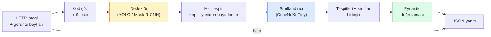

# Eksiksiz Bir Görüntü İşleme Pipeline'ı İnşa Etmek — Capstone

> Bir üretim görüntü işleme sistemi, veri sözleşmeleriyle (data contracts) birbirine dikilmiş bir model ve kural zinciridir. Parçalar zaten bu fazda; capstone onları uçtan uca birbirine bağlar.

**Tür:** Build
**Diller:** Python
**Ön Koşullar:** Phase 4 Lessons 01-15
**Süre:** ~120 dakika

## Öğrenme Hedefleri

- Nesneleri tespit eden, sınıflandıran ve yapılandırılmış JSON çıktısı veren — her hata yolu (failure path) ele alınmış — bir üretim görüntü işleme pipeline'ı tasarlamak
- Bir dedektör (Mask R-CNN veya YOLO), bir sınıflandırıcı (ConvNeXt-Tiny) ve bir veri sözleşmesini (Pydantic) tek bir servise yerleştirmek
- Uçtan uca pipeline'ı kıyaslamak (benchmark) ve ilk darboğazı (genellikle ön işleme, ardından dedektör) belirlemek
- Görüntü yüklemesini kabul eden, pipeline'ı çalıştıran ve tespitleri sınıflandırmalarla döndüren minimal bir FastAPI servisi yayınlamak

## Problem

Tek başına görüntü modelleri kullanışlıdır; görüntü ürünleri ise bunların zincirleridir. Bir perakende raf denetimi, bir dedektör artı bir ürün sınıflandırıcı artı bir fiyat-OCR pipeline'ıdır. Otonom sürüş, bir 2B dedektör artı bir 3B dedektör artı bir bölütleyici (segmenter) artı bir izleyici (tracker) artı bir planlayıcıdır. Bir tıbbi ön tarama, bir bölütleyici artı bir bölge sınıflandırıcı artı bir klinisyen arayüzüdür.

Bu zincirleri birbirine bağlamak, bir ML prototipini üründen ayıran kısımdır. Modeller arasındaki her arayüz, hatalar için yeni bir yerdir. Her koordinat dönüşümü, her normalizasyon, her maske yeniden boyutlandırması sessiz bir hata adayıdır. Bir pipeline, en zayıf arayüzü kadar güçlüdür.

Bu capstone, minimum uygulanabilir pipeline'ı kurar: tespit + sınıflandırma + yapılandırılmış çıktı + bir sunum katmanı. Phase 4'teki her şey bu iskelete oturur: Mask R-CNN'i YOLOv8 ile değiştir, bir OCR başlığı ekle, bir bölütleme dalı ekle, bir izleyici ekle. Mimari sabittir; parçalar değiştirilebilir.

## Konsept

### Pipeline



Yedi aşama. İki model aşaması pahalıdır; diğer beş aşama hataların yaşadığı yerdir.

#### Açıklama
Pipeline şeması: HTTP isteği ve görüntü baytları alınır, kod çözülüp ön işlenir, dedektörden geçirilir, her tespit kırpılıp yeniden boyutlandırılır, sınıflandırıcıya sokulur, sonuçlar birleştirilir, Pydantic ile doğrulanır ve JSON yanıtı olarak döndürülür. Hata durumunda doğrudan hata yanıtı döner.

### Pydantic ile veri sözleşmeleri (Data contracts)

Her model sınırı, tipli bir nesne haline gelir. Bu, sessiz hataları gürültülü hatalara dönüştürür.

```
Detection(
    box: tuple[float, float, float, float],   # (x1, y1, x2, y2), mutlak piksel
    score: float,                              # [0, 1]
    class_id: int,                             # dedektörün etiket haritasından
    mask: Optional[list[list[int]]],           # varsa RLE kodlu
)

PipelineResult(
    image_id: str,
    detections: list[Detection],
    classifications: list[Classification],
    inference_ms: float,
)
```

#### Açıklama
Bir dedektör kutuları `(cx, cy, w, h)` yerine `(x1, y1, x2, y2)` olarak döndürdüğünde, Pydantic'in doğrulaması sınırda başarısız olur ve sorunu, sessizce boş bölgeler döndüren bir alt pipeline'da hata ayıklamak yerine hemen fark edersiniz.

### Gecikme nereye gider

Neredeyse her görüntü işleme pipeline'ında üç gerçek geçerlidir:

1. **Ön işleme (Preprocessing) genellikle en büyük tek bloktur.** JPEG kod çözme, renk uzayı dönüşümü, yeniden boyutlandırma — bunlar CPU bağlantılıdır ve unutulmaları kolaydır.
2. **Dedektör GPU zamanına hakimdir.** GPU zamanının %70-90'ı tespit ileri geçişindedir.
3. **Son işleme (Postprocessing / NMS, RLE kodlama/kod çözme) GPU'da ucuz, CPU'da pahalıdır.** Her zaman gerçek hedefle profil çıkarın.

Dağılımı bilmek, optimizasyonu önceliklendirilmiş bir listeye dönüştüren şeydir.

### Hata modları (Failure modes)

- **Boş tespitler** — boş liste döndür, çökme. Logla.
- **Sınır dışı kutular** — kırpmadan önce görüntü boyutuna kırp (clamp).
- **Küçük kırpıntılar** — sınıflandırıcının minimum girdisinden küçük kutular için sınıflandırmayı atla.
- **Bozuk yükleme** — 500 değil, belirli bir hata koduyla 400 yanıtı.
- **Model yükleme hatası** — ilk istekte değil, servis başlangıcında hata ver.

Bir üretim pipeline'ı, bunların her birini hatayı gizleyen genel `try/except` yazmadan ele alır. Her hata adlandırılmış bir kod ve bir yanıt alır.

### Toplu işleme (Batching)

Bir üretim servisi birden çok istemciye hizmet verir. Tespitleri ve sınıflandırmaları istekler arasında toplu olarak işlemek, iş hacmini (throughput) çarpar. Ödünleşim: bir batch'in dolmasını beklemekten kaynaklanan ek gecikme. Tipik kurulum: istekleri 20 ms'ye kadar topla, birlikte işle, yanıtları dağıt. `torchserve` ve `triton` bunu yerel olarak yapar; öngörülebilir yüke sahip küçük servisler kendi mikro toplayıcılarını (micro-batcher) yazar.

## Build It

### Adım 1: Veri sözleşmeleri

```python
from pydantic import BaseModel, Field
from typing import List, Optional, Tuple

class Detection(BaseModel):
    box: Tuple[float, float, float, float]
    score: float = Field(ge=0, le=1)
    class_id: int = Field(ge=0)
    mask_rle: Optional[str] = None


class Classification(BaseModel):
    detection_index: int
    class_id: int
    class_name: str
    score: float = Field(ge=0, le=1)


class PipelineResult(BaseModel):
    image_id: str
    detections: List[Detection]
    classifications: List[Classification]
    inference_ms: float
```

#### Açıklama
Beş saniyelik kod, ciddi bir pipeline'da saatlerce hata ayıklamayı önler.

### Adım 2: Minimal bir Pipeline sınıfı

```python
import time
import numpy as np
import torch
from PIL import Image

class VisionPipeline:
    def __init__(self, detector, classifier, class_names,
                 device="cpu", min_crop=32):
        self.detector = detector.to(device).eval()
        self.classifier = classifier.to(device).eval()
        self.class_names = class_names
        self.device = device
        self.min_crop = min_crop

    def preprocess(self, image):
        """
        image: PIL.Image veya np.ndarray (H, W, 3) uint8
        döndürür: cihazda CHW float tensor
        """
        if isinstance(image, Image.Image):
            image = np.asarray(image.convert("RGB"))
        tensor = torch.from_numpy(image).permute(2, 0, 1).float() / 255.0
        return tensor.to(self.device)

    @torch.no_grad()
    def detect(self, image_tensor):
        return self.detector([image_tensor])[0]

    @torch.no_grad()
    def classify(self, crops):
        if len(crops) == 0:
            return []
        batch = torch.stack(crops).to(self.device)
        logits = self.classifier(batch)
        probs = logits.softmax(-1)
        scores, cls = probs.max(-1)
        return list(zip(cls.tolist(), scores.tolist()))

    def run(self, image, image_id="anonymous"):
        t0 = time.perf_counter()
        tensor = self.preprocess(image)
        det = self.detect(tensor)

        crops = []
        detections = []
        valid_indices = []
        for i, (box, score, cls) in enumerate(zip(det["boxes"], det["scores"], det["labels"])):
            x1, y1, x2, y2 = [max(0, int(b)) for b in box.tolist()]
            x2 = min(x2, tensor.shape[-1])
            y2 = min(y2, tensor.shape[-2])
            detections.append(Detection(
                box=(x1, y1, x2, y2),
                score=float(score),
                class_id=int(cls),
            ))
            if (x2 - x1) < self.min_crop or (y2 - y1) < self.min_crop:
                continue
            crop = tensor[:, y1:y2, x1:x2]
            crop = torch.nn.functional.interpolate(
                crop.unsqueeze(0),
                size=(224, 224),
                mode="bilinear",
                align_corners=False,
            )[0]
            crops.append(crop)
            valid_indices.append(i)

        class_preds = self.classify(crops)

        classifications = []
        for valid_idx, (cls_id, cls_score) in zip(valid_indices, class_preds):
            classifications.append(Classification(
                detection_index=valid_idx,
                class_id=int(cls_id),
                class_name=self.class_names[cls_id],
                score=float(cls_score),
            ))

        return PipelineResult(
            image_id=image_id,
            detections=detections,
            classifications=classifications,
            inference_ms=(time.perf_counter() - t0) * 1000,
        )
```

#### Açıklama
Her arayüz tiplidir. Her hata yolunun belirli bir işleme kararı vardır.

### Adım 3: Bir dedektör ve bir sınıflandırıcı bağla

```python
from torchvision.models.detection import maskrcnn_resnet50_fpn_v2
from torchvision.models import convnext_tiny

# Gerçekçi bir pipeline için ImageNet ön eğitimli ağırlıklar kullan
detector = maskrcnn_resnet50_fpn_v2(weights="DEFAULT")
classifier = convnext_tiny(weights="DEFAULT")
class_names = [f"imagenet_class_{i}" for i in range(1000)]

pipe = VisionPipeline(detector, classifier, class_names)

# Sentetik bir görüntü ile duman testi
test_image = (np.random.rand(400, 600, 3) * 255).astype(np.uint8)
result = pipe.run(test_image, image_id="demo")
print(result.model_dump_json(indent=2)[:500])
```

#### Açıklama
Gerçekçi bir pipeline için ön eğitimli ağırlıklar kullanılır ve sentetik bir görüntü ile test edilir.

### Adım 4: FastAPI servisi

```python
from fastapi import FastAPI, UploadFile, HTTPException
from io import BytesIO

app = FastAPI()
pipe = None  # başlangıçta ilklendirilir

@app.on_event("startup")
def load():
    global pipe
    detector = maskrcnn_resnet50_fpn_v2(weights="DEFAULT").eval()
    classifier = convnext_tiny(weights="DEFAULT").eval()
    pipe = VisionPipeline(detector, classifier, class_names=[f"c{i}" for i in range(1000)])

@app.post("/detect")
async def detect_endpoint(file: UploadFile):
    if file.content_type not in {"image/jpeg", "image/png", "image/webp"}:
        raise HTTPException(status_code=400, detail="desteklenmeyen görüntü türü")
    data = await file.read()
    try:
        img = Image.open(BytesIO(data)).convert("RGB")
    except Exception:
        raise HTTPException(status_code=400, detail="görüntü çözülemiyor")
    result = pipe.run(img, image_id=file.filename or "upload")
    return result.model_dump()
```

#### Açıklama
`uvicorn main:app --host 0.0.0.0 --port 8000` ile çalıştırın. `curl -F 'file=@dog.jpg' http://localhost:8000/detect` ile test edin.

### Adım 5: Pipeline'ı kıyasla

```python
import time

def benchmark(pipe, num_runs=20, image_size=(400, 600)):
    img = (np.random.rand(*image_size, 3) * 255).astype(np.uint8)
    pipe.run(img)  # ısıt

    stages = {"preprocess": [], "detect": [], "classify": [], "total": []}
    for _ in range(num_runs):
        t0 = time.perf_counter()
        tensor = pipe.preprocess(img)
        t1 = time.perf_counter()
        det = pipe.detect(tensor)
        t2 = time.perf_counter()
        crops = []
        for box in det["boxes"]:
            x1, y1, x2, y2 = [max(0, int(b)) for b in box.tolist()]
            x2 = min(x2, tensor.shape[-1])
            y2 = min(y2, tensor.shape[-2])
            if (x2 - x1) >= pipe.min_crop and (y2 - y1) >= pipe.min_crop:
                crop = tensor[:, y1:y2, x1:x2]
                crop = torch.nn.functional.interpolate(
                    crop.unsqueeze(0), size=(224, 224), mode="bilinear", align_corners=False
                )[0]
                crops.append(crop)
        pipe.classify(crops)
        t3 = time.perf_counter()
        stages["preprocess"].append((t1 - t0) * 1000)
        stages["detect"].append((t2 - t1) * 1000)
        stages["classify"].append((t3 - t2) * 1000)
        stages["total"].append((t3 - t0) * 1000)

    for stage, times in stages.items():
        times.sort()
        print(f"{stage:12s}  p50={times[len(times)//2]:7.1f} ms  p95={times[int(len(times)*0.95)]:7.1f} ms")
```

#### Açıklama
CPU'da tipik çıktı: ön işleme ~3 ms, tespit 300-500 ms, sınıflandırma 20-40 ms, toplam 350-550 ms. GPU'da tespit 20-40 ms'dir ve ön işleme + sınıflandırma görece daha önemli hale gelir.

## Use It

Üretim şablonları aynı yapıya yakınsar, artı:

- **Model sürümleme (Model versioning)** — yanıtta her zaman model adını ve ağırlık hash'ini logla.
- **İstek başına izleme kimlikleri (Trace IDs)** — her istek için her aşama zamanlamasını logla, böylece yavaş yanıtları aşamalarla ilişkilendirebilirsin.
- **Geri dönüş yolu (Fallback path)** — sınıflandırıcı zaman aşımına uğrarsa, tüm isteği başarısız kılmak yerine sınıflandırmasız tespitleri döndür.
- **Güvenlik filtreleri** — NSFW / PII filtreleri sınıflandırmadan sonra, yanıt servisten çıkmadan önce çalışır.
- **Toplu işlem uç noktası (Batch endpoint)** — toplu işleme için bir URL listesi kabul eden `/detect_batch`.

Üretim sunumu için `torchserve`, `Triton Inference Server` ve `BentoML`, toplu işleme, sürümleme, metrikler ve sağlık kontrollerini kutudan çıkar çıkmaz halleder. `FastAPI`'yi doğrudan çalıştırmak prototipler ve küçük ölçekli ürünler için yeterlidir.

## Ship It

Bu ders şunları üretir:

- `outputs/prompt-vision-service-shape-reviewer.md` — bir görüntü servisinin kodunu sözleşme/yanıt şekli ihlalleri için inceleyen ve ilk kırılma hatasını adlandıran bir prompt.
- `outputs/skill-pipeline-budget-planner.md` — hedef gecikme ve iş hacmi verildiğinde her pipeline aşamasına bir zaman bütçesi atayan ve hangi aşamanın bütçesini ilk kaçıracağını işaretleyen bir skill.

## Alıştırmalar

1. **(Kolay)** Pipeline'ı herhangi bir açık veri kümesinden 10 görüntüde çalıştırın. Aşama başına ortalama süreyi ve görüntü başına tespit sayısının dağılımını raporlayın.
2. **(Orta)** `Detection`'a bir maske çıktı alanı ekleyin ve RLE olarak kodlayın. 10 nesneli bir görüntüde bile JSON'un 1 MB'ın altında kaldığını doğrulayın.
3. **(Zor)** Sınıflandırıcının önüne bir mikro toplayıcı (micro-batcher) ekleyin: kırpıntıları 10 ms'ye kadar topla, hepsini tek bir GPU çağrısında sınıflandır, sonuçları istek başına döndür. Saniyede 5 eşzamanlı istekte iş hacmi kazancını ve eklenen gecikmeyi ölçün.

## Anahtar Terimler

| Terim | Ne denir | Gerçek anlamı |
|-------|----------|---------------|
| Pipeline | "Sistem" | Her çift arasında tipli arayüz bulunan, sıralı ön işleme, çıkarım ve son işleme adımları zinciri |
| Data contract | "Şema" | Her aşama girdi ve çıktısının uyduğu Pydantic/dataclass tanımları; sınırdaki entegrasyon hatalarını yakalar |
| Preprocessing | "Modelden önce" | Kod çözme, renk dönüşümü, yeniden boyutlandırma, normalleştirme; genelde en büyük CPU zaman havuzu |
| Postprocessing | "Modelden sonra" | NMS, maske yeniden boyutlandırma, eşikleme, RLE kodlama; GPU'da ucuz, CPU'da pahalı |
| Microbatcher | "Topla sonra ilet" | Birden çok isteği sabit bir pencere boyunca bekleyen, tek bir toplu ileri geçiş çalıştıran toplayıcı |
| Trace ID | "İstek kimliği" | Her aşamada loglanan istek başına tanımlayıcı; yavaş isteklerin uçtan uca izlenmesini sağlar |
| Failure code | "Adlandırılmış hata" | Genel 500 yerine hata sınıfı başına belirli hata kodu; istemci yeniden deneme mantığını mümkün kılar |
| Health check | "Hazırlık yoklaması" | Servisin yanıt verip veremediğini bildiren ucuz uç nokta; yük dengeleyiciler buna güvenir |

## Daha Fazla Okuma

- [Full Stack Deep Learning — Deploying Models](https://fullstackdeeplearning.com/course/2022/lecture-5-deployment/) — üretim ML dağıtımının kanonik özeti
- [BentoML dökümantasyonu](https://docs.bentoml.com) — toplu işleme, sürümleme ve metriklerle sunum çerçevesi
- [torchserve dökümantasyonu](https://pytorch.org/serve/) — PyTorch'un resmi sunum kütüphanesi
- [NVIDIA Triton Inference Server](https://developer.nvidia.com/triton-inference-server) — toplu işleme ve çoklu model desteği ile yüksek iş hacimli sunum
