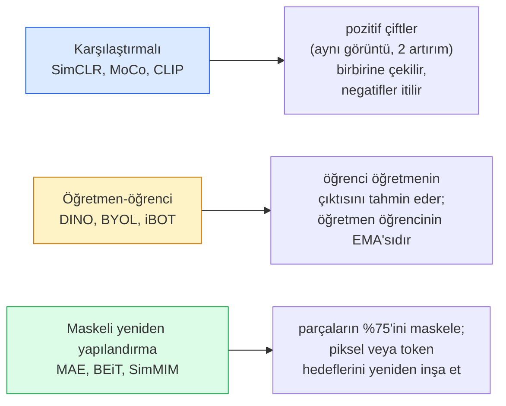

# Kendinden Denetimli Görüntü İşleme — SimCLR, DINO, MAE (Self-Supervised Vision)

> Etiketler, denetimli görüntü işlemenin darboğazıdır. Kendinden denetimli ön eğitim (self-supervised pretraining) onları ortadan kaldırır: 100M etiketsiz görüntüden görsel öznitelikler öğren, 10k etiketli görüntüde ince ayar yap.

**Tür:** Learn + Build
**Diller:** Python
**Ön Koşullar:** Phase 4 Lesson 04 (Image Classification), Phase 4 Lesson 14 (ViT)
**Süre:** ~75 dakika

## Öğrenme Hedefleri

- Üç ana kendinden denetimli aileyi — karşılaştırmalı (contrastive / SimCLR), öğretmen-öğrenci (teacher-student / DINO), maskeli yeniden yapılandırma (masked reconstruction / MAE) — izlemek ve her birinin neyi optimize ettiğini belirtmek
- Sıfırdan bir InfoNCE kaybı (loss) uygulamak ve 512'lik bir batch'in çalışıp 32'lik bir batch'in neden başarısız olduğunu açıklamak
- MAE'nin %75 maskeleme oranının neden keyfi olmadığını ve BERT'in metin için %15'inden nasıl farklılaştığını açıklamak
- DINOv2 veya MAE ImageNet kontrol noktalarını (checkpoints) doğrusal yoklama (linear probing) ve sıfır atışlı erişim (zero-shot retrieval) için kullanmak

## Problem

Denetimli ImageNet, tahmini 10 milyon dolara mal olmuş 1.3M etiketli görüntüye sahiptir. Tıbbi ve endüstriyel veri kümeleri daha küçüktür ve etiketlemeleri daha da pahalıdır. Her görüntü işleme ekibi şunu sorar: ucuz etiketsiz veriyle — YouTube kareleri, web taramaları, güvenlik kamerası görüntüleri, uydu taramaları — ön eğitim yapıp küçük bir etiketli kümede ince ayar yapabilir miyiz?

Kendinden denetimli öğrenme (self-supervised learning / SSL) cevaptır. LAION veya JFT üzerinde eğitilmiş modern bir kendinden denetimli ViT, ince ayar yapıldığında denetimli ImageNet doğruluğuna ulaşır veya onu geçer. Ayrıca aşağı akış görevlerine (detection, segmentation, depth) denetimli ön eğitimden daha iyi aktarım yapar. DINOv2 (Meta, 2023) ve MAE (Meta, 2022), aktarılabilir görüntü öznitelikleri için mevcut üretim varsayılanlarıdır.

Kavramsal değişim şudur: modelin eğitildiği bahane görevi (pretext task), aşağı akış görevi olmak zorunda değildir. Önemli olan, modeli yararlı öznitelikler öğrenmeye zorlamasıdır. Gri tonlamalı görüntülerin rengini tahmin et, görüntüleri döndür ve modelden dönüşü sınıflandırmasını iste, parçaları maskele ve yeniden inşa et — hepsi işe yaramıştır. Ölçeklenen üç yaklaşım, karşılaştırmalı öğrenme (contrastive learning), öğretmen-öğrenci damıtması (teacher-student distillation) ve maskeli yeniden yapılandırmadır (masked reconstruction).

## Konsept

### Üç aile



### Karşılaştırmalı öğrenme (Contrastive learning / SimCLR)

Bir görüntü al, iki rastgele artırım (augmentation) uygula, iki görüntü elde et. İkisini de aynı kodlayıcı (encoder) artı bir yansıtma başlığından (projection head) geçir. "Bu iki gömme (embedding) birbirine yakın olmalı" ve "bu gömme, batch'teki diğer her görüntünün gömme'sinden uzak olmalı" diyen bir kaybı minimize et.

```
Batch'teki 2N görüntü için pozitif çift (z_i, z_j) kaybı:

   L_ij = -log( exp(sim(z_i, z_j) / tau) / sum_k in batch \ {i} exp(sim(z_i, z_k) / tau) )

sim = kosinüs benzerliği (cosine similarity)
tau = sıcaklık (temperature / 0.1 standart)
```

#### Açıklama
Bu InfoNCE kaybıdır (loss). Pozitif başına çok sayıda negatif gerektirir, bu nedenle batch boyutu önemlidir — SimCLR 512-8192 arasına ihtiyaç duyar. MoCo, negatif sayısını batch boyutundan ayırmak için geçmiş batch'lerin momentum kuyruğunu (momentum queue) tanıttı.

### Öğretmen-öğrenci (Teacher-student / DINO)

Aynı mimariye sahip iki ağ: öğrenci (student) ve öğretmen (teacher). Öğretmen, öğrencinin ağırlıklarının üstel hareketli ortalamasıdır (exponential moving average / EMA). İkisi de görüntünün artırılmış görünümlerini (augmented views) görür. Öğrencinin çıktısı, öğretmenin çıktısıyla eşleşecek şekilde eğitilir — açık negatif yoktur.

```
loss = CE( student_output(view_1),  teacher_output(view_2) )
     + CE( student_output(view_2),  teacher_output(view_1) )

teacher_weights = m * teacher_weights + (1 - m) * student_weights   (m ≈ 0.996)
```

#### Açıklama
Neden "sabit bir değer tahmin et" durumuna çökmez: öğretmenin çıktısı ortalanır (centered — boyut başına ortalama çıkarılır) ve keskinleştirilir (sharpened — küçük bir sıcaklığa bölünür). Ortalama (centering) bir boyutun baskın olmasını engeller; keskinleştirme (sharpening) çıktının tekdüze (uniform) olmasını engeller.

DINO, DINOv2'nin 142M küratörlü görüntü üzerinde ölçeklediği şeydir. Ortaya çıkan öznitelikler, sıfır atışlı görsel erişim (zero-shot visual retrieval) ve yoğun tahmin (dense prediction) için mevcut SOTA'dır.

### Maskeli yeniden yapılandırma (Masked reconstruction / MAE)

Bir ViT girdisinin parçalarının %75'ini maskele. Kodlayıcıdan sadece görünen %25'i geçir. Küçük bir kod çözücü (decoder), kodlayıcının çıktısını artı maskelenmiş konumlardaki maske token'larını alır ve maskelenmiş parçaların piksellerini yeniden inşa edecek şekilde eğitilir.

```
Kodlayıcı:  parçaların görünen %25'i -> öznitelikler
Kod çözücü:  öznitelikler + maskelenmiş konumlarda maske token'ları -> yeniden inşa edilmiş pikseller
Kayıp:      Sadece maskelenmiş parçalarda yeniden inşa edilen ve orijinal pikseller arasında MSE
```

#### Açıklama
MAE'yi çalıştıran temel tasarım seçimleri:

- **%75 maske oranı** — yüksek. Kodlayıcıyı anlamsal öznitelikler öğrenmeye zorlar; %25'i yeniden inşa etmek neredeyse önemsiz olurdu (komşu pikseller o kadar ilişkilidir ki bir CNN bunu kolayca yapardı).
- **Asimetrik kodlayıcı/kod çözücü** — büyük ViT kodlayıcı sadece görünen parçaları görür; küçük bir kod çözücü (8 katmanlı, 512-boyutlu) yeniden yapılandırmayı halleder. Saf BEiT'ten 3 kat daha hızlı ön eğitim.
- **Piksel-uzayı yeniden yapılandırma hedefi** — BEiT'in tokenleştirilmiş hedefinden daha basit ve ViT'te daha iyi çalışır.

Ön eğitimden sonra kod çözücüyü at. Kodlayıcı, öznitelik çıkarıcıdır (feature extractor).

### Neden %75 ve %15 değil

BERT token'ların %15'ini maskeler. MAE parçaların %75'ini maskeler. Fark, bilgi yoğunluğundan kaynaklanır.

- Doğal dil, token başına yüksek entropiye sahiptir. Token'ların %15'ini tahmin etmek hâlâ zordur çünkü maskelenmiş her konumun birçok olası tamamlaması vardır.
- Görüntü parçaları düşük entropiye sahiptir — maskelenmemiş bir komşuluk, maskelenmiş parçanın piksellerini neredeyse tamamen belirleyebilir. Tahminin anlamsal anlayış gerektirmesi için agresif maskeleme yapmalısınız.

%75, basit uzamsal enterpolasyonun görevi çözemeyeceği kadar yüksektir; kodlayıcı görüntü içeriğini temsil etmelidir.

### Doğrusal yoklama değerlendirmesi (Linear-probe evaluation)

Kendinden denetimli ön eğitimden sonra standart değerlendirme bir **doğrusal yoklama (linear probe)**'dır: kodlayıcıyı dondur (freeze), üzerine ImageNet etiketlerinde tek bir doğrusal sınıflandırıcı eğit. Top-1 doğruluğu raporla.

- SimCLR ResNet-50: ~%71 (2020)
- DINO ViT-S/16: ~%77 (2021)
- MAE ViT-L/16: ~%76 (2022)
- DINOv2 ViT-g/14: ~%86 (2023)

Doğrusal yoklama, öznitelik kalitesinin saf bir ölçüsüdür; ince ayar (fine-tuning) tipik olarak 2-5 puan ekler ancak başlık yeniden eğitiminin etkisini de karıştırır.

## Build It

### Adım 1: İki görünümlü artırım pipeline'ı

```python
import torch
import torchvision.transforms as T

two_view_train = lambda: T.Compose([
    T.RandomResizedCrop(96, scale=(0.2, 1.0)),
    T.RandomHorizontalFlip(),
    T.ColorJitter(0.4, 0.4, 0.4, 0.1),
    T.RandomGrayscale(p=0.2),
    T.ToTensor(),
])


class TwoViewDataset(torch.utils.data.Dataset):
    def __init__(self, base):
        self.base = base
        self.aug = two_view_train()

    def __len__(self):
        return len(self.base)

    def __getitem__(self, i):
        img, _ = self.base[i]
        v1 = self.aug(img)
        v2 = self.aug(img)
        return v1, v2
```

#### Açıklama
Her `__getitem__` aynı görüntünün iki artırılmış görünümünü döndürür; etiketlere ihtiyaç yoktur.

### Adım 2: InfoNCE kaybı

```python
import torch.nn.functional as F

def info_nce(z1, z2, tau=0.1):
    """
    z1, z2: (N, D) L2-normalize edilmiş eşleştirilmiş görünüm gömme'leri
    """
    N, D = z1.shape
    z = torch.cat([z1, z2], dim=0)  # (2N, D)
    sim = z @ z.T / tau              # (2N, 2N)

    mask = torch.eye(2 * N, dtype=torch.bool, device=z.device)
    sim = sim.masked_fill(mask, float("-inf"))

    targets = torch.cat([torch.arange(N, 2 * N), torch.arange(0, N)]).to(z.device)
    return F.cross_entropy(sim, targets)
```

#### Açıklama
Çağırmadan önce gömme'leri L2-normalize edin. `tau=0.1` SimCLR varsayılanıdır; daha düşük değerler kaybı keskinleştirir ve daha fazla negatif gerektirir.

### Adım 3: InfoNCE sağlık kontrolü

```python
z1 = F.normalize(torch.randn(16, 32), dim=-1)
z2 = z1.clone()
loss_same = info_nce(z1, z2, tau=0.1).item()
z2_random = F.normalize(torch.randn(16, 32), dim=-1)
loss_random = info_nce(z1, z2_random, tau=0.1).item()
print(f"InfoNCE with identical pairs:  {loss_same:.3f}")
print(f"InfoNCE with random pairs:     {loss_random:.3f}")
```

#### Açıklama
Özdeş çiftler düşük kayıp vermelidir (büyük batch ve soğuk sıcaklık için 0'a yakın). Rastgele çiftler, 16 çiftlik bir batch ile log(2N-1) = ~log(31) = ~3.4 vermelidir.

### Adım 4: MAE tarzı maskeleme

```python
def random_mask_indices(num_patches, mask_ratio=0.75, seed=0):
    g = torch.Generator().manual_seed(seed)
    n_keep = int(num_patches * (1 - mask_ratio))
    perm = torch.randperm(num_patches, generator=g)
    visible = perm[:n_keep]
    masked = perm[n_keep:]
    return visible.sort().values, masked.sort().values


num_patches = 196
visible, masked = random_mask_indices(num_patches, mask_ratio=0.75)
print(f"visible: {len(visible)} / {num_patches}")
print(f"masked:  {len(masked)} / {num_patches}")
```

#### Açıklama
Basit, hızlı ve belirli bir tohum (seed) için deterministik. Gerçek MAE uygulamaları bunu toplu olarak yapar ve örnek başına maske tutar.

## Use It

DINOv2, 2026'da üretim standardıdır:

```python
import torch
from transformers import AutoImageProcessor, AutoModel

processor = AutoImageProcessor.from_pretrained("facebook/dinov2-base")
model = AutoModel.from_pretrained("facebook/dinov2-base")
model.eval()

# Sıfır atışlı erişim için görüntü başına gömme'ler
with torch.no_grad():
    inputs = processor(images=[pil_image], return_tensors="pt")
    outputs = model(**inputs)
    embedding = outputs.last_hidden_state[:, 0]  # CLS token
```

#### Açıklama
Ortaya çıkan 768-boyutlu gömme (embedding), modern görüntü erişimi (image retrieval), yoğun karşılık (dense correspondence) ve sıfır atışlı aktarım (zero-shot transfer) pipeline'larının omurgasıdır. Aşağı akış görevinde ince ayar nadiren doğrusal bir başlıktan (linear head) fazlasını gerektirir.

Görüntü-metin gömme'leri için SigLIP veya OpenCLIP eşdeğerdir; MAE tarzı ince ayar için `timm` reposu her MAE kontrol noktasını sunar.

## Ship It

Bu ders şunları üretir:

- `outputs/prompt-ssl-pretraining-picker.md` — veri kümesi boyutu, hesaplama ve aşağı akış görevi verildiğinde SimCLR / MAE / DINOv2 arasında seçim yapan bir prompt.
- `outputs/skill-linear-probe-runner.md` — herhangi bir dondurulmuş kodlayıcı + etiketli veri kümesi için doğrusal yoklama değerlendirmesini yazan bir skill.

## Alıştırmalar

1. **(Kolay)** InfoNCE kaybının, iyi hizalanmış gömme'ler için sıcaklığı düşürdüğünüzde düştüğünü ve rastgele gömme'ler için sıcaklığı düşürdüğünüzde yükseldiğini doğrulayın. `tau in [0.05, 0.1, 0.2, 0.5]` vs kayıp grafiği üretin.
2. **(Orta)** Bir DINO tarzı merkez tamponu (centre buffer) uygulayın. Merkezleme (centring) olmadan öğrencinin birkaç epoch içinde sabit bir vektöre çöktüğünü gösterin.
3. **(Zor)** Ders 10'daki TinyUNet'i omurga olarak kullanarak CIFAR-100'de MAE eğitin. 10, 50 ve 200 epoch'ta doğrusal yoklama doğruluğunu raporlayın. MAE ön eğitimli bir doğrusal yoklamanın, aynı 1.000 görüntülü alt kümede sıfırdan eğitilmiş denetimli bir doğrusal yoklamayı geçtiğini gösterin.

## Anahtar Terimler

| Terim | Ne denir | Gerçek anlamı |
|-------|----------|---------------|
| Self-supervised | "Etiketsiz" | Etiketsiz veriden yararlı temsiller üreten bir bahane görevi (pretext task) |
| Pretext task | "Sahte görev" | SSL sırasında kullanılan hedef (parçaları yeniden inşa et, görünümleri eşleştir); ön eğitimden sonra atılır |
| Linear probe | "Donuk kodlayıcı + doğrusal başlık" | Standart SSL değerlendirmesi: donuk öznitelikler üzerinde sadece doğrusal bir sınıflandırıcı eğit |
| InfoNCE | "Karşılaştırmalı kayıp" | Kosinüs benzerlikleri üzerinde softmax; pozitif çift hedef sınıftır, diğer her şey negatiftir |
| EMA teacher | "Hareketli ortalama öğretmen" | Ağırlıkları öğrencinin üstel hareketli ortalaması olan öğretmen; BYOL, MoCo, DINO tarafından kullanılır |
| Mask ratio | "% gizli parça" | MAE sırasında maskelenen parçaların oranı; görüntü için %75, metin için %15 |
| Representation collapse | "Sabit çıktı" | Kodlayıcının tüm girdiler için sabit bir vektör çıkardığı SSL hatası; centring, sharpening veya negatiflerle önlenir |
| DINOv2 | "Üretim SSL omurgası" | Meta'nın 2023 kendinden denetimli ViT'si; 2026'da en güçlü genel amaçlı görüntü öznitelikleri |

## Daha Fazla Okuma

- [SimCLR (Chen ve ark., 2020)](https://arxiv.org/abs/2002.05709) — karşılaştırmalı öğrenme referansı
- [DINO (Caron ve ark., 2021)](https://arxiv.org/abs/2104.14294) — momentum, centring, sharpening ile öğretmen-öğrenci
- [MAE (He ve ark., 2022)](https://arxiv.org/abs/2111.06377) — ViT için maskeli otomatik kodlayıcı ön eğitimi
- [DINOv2 (Oquab ve ark., 2023)](https://arxiv.org/abs/2304.07193) — kendinden denetimli ViT'yi üretim özniteliklerine ölçekleme
